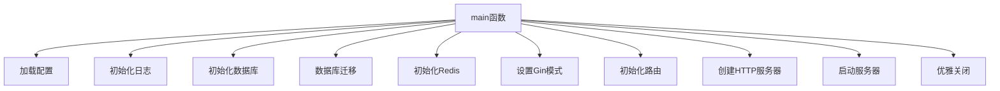
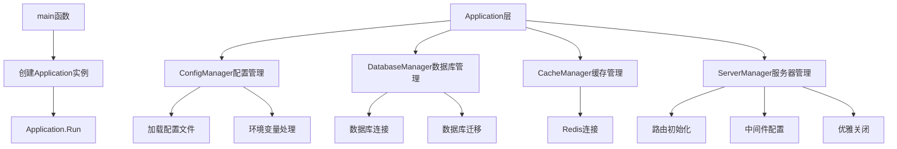
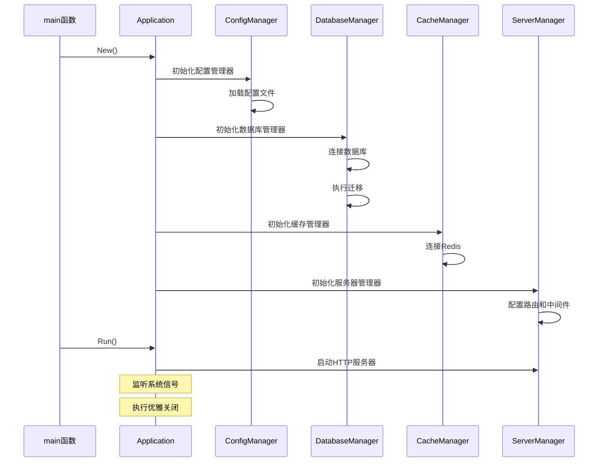

# 后端Main函数重构设计文档

## 1. 项目概述

本设计文档旨在重构devops运维平台后端的main函数，解决当前存在的问题：
- main函数代码行数过多（85行），违反单一职责原则
- 初始化逻辑散布在main函数中，可维护性差
- 模块名称"devops-platform"需要简化为"devops"
- 缺乏统一的应用生命周期管理

### 重构目标
- 将main函数精简到20行以内
- 提取应用初始化逻辑到专门的应用层
- 统一修改模块名称为"devops"
- 增强代码的可测试性和可维护性

## 2. 架构设计

### 2.1 重构前架构分析



**问题分析：**
- 单一函数承担过多职责
- 初始化顺序硬编码在main函数中
- 错误处理分散，难以统一管理
- 缺乏依赖注入机制

### 2.2 重构后架构设计



### 2.3 分层职责

| 层级 | 职责 | 组件 |
|------|------|------|
| 入口层 | 程序启动入口 | main函数 |
| 应用层 | 应用生命周期管理 | Application |
| 管理层 | 各组件初始化管理 | ConfigManager, DatabaseManager等 |
| 业务层 | 业务逻辑处理 | Service层 |
| 数据层 | 数据访问 | Model层 |

## 3. 详细设计

### 3.1 目录结构调整

```
backend/
├── cmd/
│   └── main.go                 # 精简后的入口文件
├── internal/
│   ├── app/                    # 新增应用层
│   │   ├── app.go             # 应用主体
│   │   ├── config_manager.go   # 配置管理器
│   │   ├── database_manager.go # 数据库管理器
│   │   ├── cache_manager.go    # 缓存管理器
│   │   └── server_manager.go   # 服务器管理器
│   ├── api/
│   ├── service/
│   └── model/
└── pkg/
```

### 3.2 核心组件设计

#### 3.2.1 Application应用主体

```
type Application struct {
    config     *config.Config
    db         *gorm.DB
    rdb        *redis.Client
    server     *http.Server
    logger     *zap.Logger
    
    configMgr    *ConfigManager
    databaseMgr  *DatabaseManager
    cacheMgr     *CacheManager
    serverMgr    *ServerManager
}

方法:
- New() *Application              # 创建应用实例
- Run() error                     # 运行应用
- Shutdown(ctx context.Context)   # 优雅关闭
```

#### 3.2.2 ConfigManager配置管理器

```
type ConfigManager struct {
    config *config.Config
}

方法:
- NewConfigManager() *ConfigManager
- Load() (*config.Config, error)
- Validate() error
```

#### 3.2.3 DatabaseManager数据库管理器

```
type DatabaseManager struct {
    db     *gorm.DB
    config config.Database
}

方法:
- NewDatabaseManager(cfg config.Database) *DatabaseManager
- Initialize() (*gorm.DB, error)
- Migrate() error
- Close() error
```

#### 3.2.4 CacheManager缓存管理器

```
type CacheManager struct {
    rdb    *redis.Client
    config config.Redis
}

方法:
- NewCacheManager(cfg config.Redis) *CacheManager
- Initialize() (*redis.Client, error)
- Close() error
```

#### 3.2.5 ServerManager服务器管理器

```
type ServerManager struct {
    server *http.Server
    router *gin.Engine
    config config.Server
}

方法:
- NewServerManager(cfg config.Server) *ServerManager
- Initialize(db *gorm.DB, rdb *redis.Client, config *config.Config) error
- Start() error
- Shutdown(ctx context.Context) error
```

### 3.3 初始化流程设计



### 3.4 错误处理策略

| 错误类型 | 处理策略 | 示例 |
|----------|----------|------|
| 配置加载错误 | 立即退出，记录错误日志 | 配置文件不存在 |
| 数据库连接错误 | 重试3次，失败则退出 | 数据库连接超时 |
| Redis连接错误 | 记录警告，继续运行 | Redis服务不可用 |
| 服务器启动错误 | 立即退出，记录错误日志 | 端口被占用 |

## 4. 模块名称重构

### 4.1 文件修改范围

需要修改以下文件中的import路径：

| 文件路径 | 修改类型 |
|----------|----------|
| `go.mod` | 模块名称定义 |
| `cmd/main.go` | import路径 |
| `internal/api/*.go` | import路径 |
| `internal/service/*.go` | import路径 |
| `internal/middleware/*.go` | import路径 |
| `internal/monitor/*.go` | import路径 |
| `pkg/*/*.go` | import路径 |

### 4.2 批量替换规则

```
查找: devops-platform
替换: devops
```

### 4.3 验证方式

```bash
# 检查所有Go文件中的模块引用
grep -r "devops-platform" --include="*.go" .

# 编译验证
go build ./cmd/main.go

# 运行测试
go test ./...
```

## 5. 实现计划

### 5.1 第一阶段：创建新的应用层结构

1. 创建 `internal/app` 目录及相关文件
2. 实现各个Manager组件
3. 编写单元测试

### 5.2 第二阶段：重构main函数

1. 将现有main.go逻辑迁移到Application层
2. 精简main函数
3. 验证功能完整性

### 5.3 第三阶段：模块名称重构

1. 批量替换所有文件中的模块名称
2. 更新go.mod文件
3. 执行编译和测试验证

### 5.4 第四阶段：测试和优化

1. 编写集成测试
2. 性能测试
3. 代码优化

## 6. 测试策略

### 6.1 单元测试

每个Manager组件都需要编写对应的单元测试：

```
internal/app/
├── app_test.go
├── config_manager_test.go
├── database_manager_test.go
├── cache_manager_test.go
└── server_manager_test.go
```

### 6.2 集成测试

创建集成测试验证整个应用启动流程：

```
tests/
└── integration/
    ├── app_startup_test.go
    └── graceful_shutdown_test.go
```

### 6.3 测试覆盖率目标

- 单元测试覆盖率：≥ 80%
- 集成测试覆盖核心启动流程
- 错误场景测试覆盖率：≥ 70%