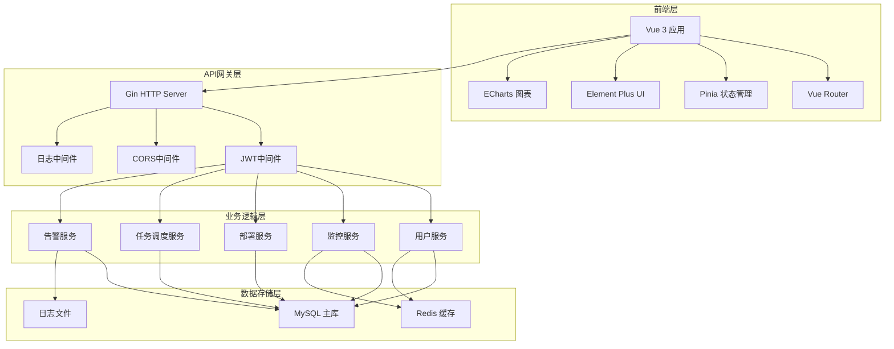
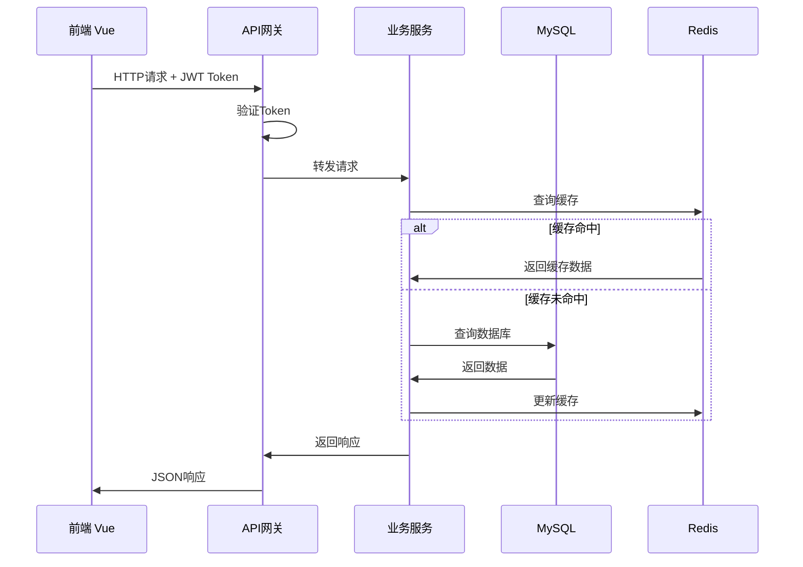
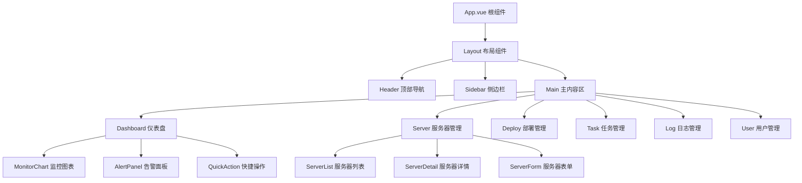
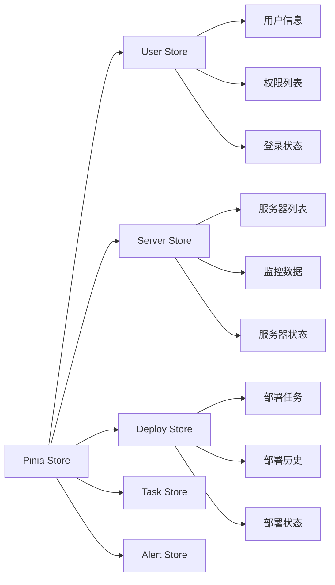
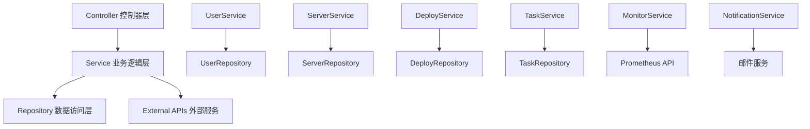
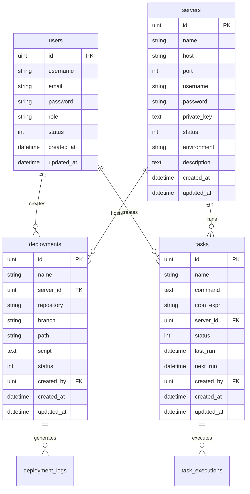
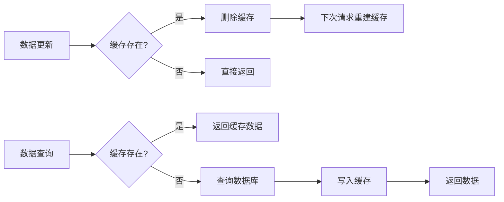
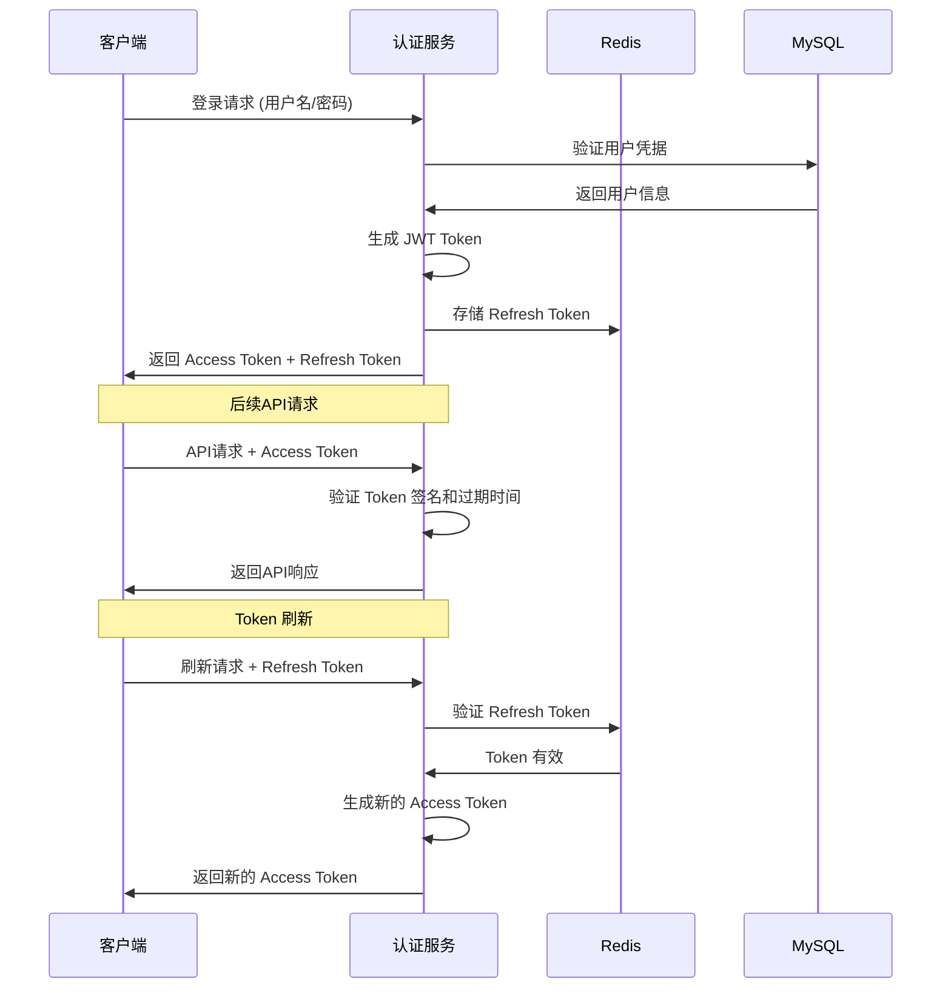
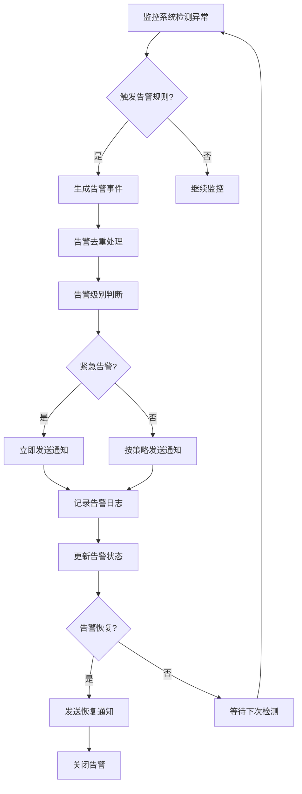
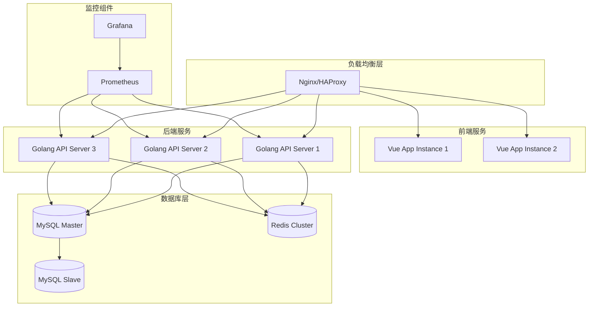

# 自动化运维平台设计文档

## 1. 项目概述

### 1.1 项目简介
自动化运维平台是一个集服务器监控、应用部署、任务调度、日志管理于一体的综合性运维管理系统。该平台旨在提高运维效率，降低人工操作成本，提供可视化的运维管理界面。

### 1.2 技术栈
**前端技术栈：**
- Vue 3 - 前端框架
- Vue Router - 路由管理
- Pinia - 状态管理
- Element Plus - UI组件库
- Axios - HTTP客户端
- ECharts - 数据可视化

**后端技术栈：**
- Golang - 后端开发语言
- Gin - Web框架
- GORM - ORM框架
- JWT - 身份验证
- Viper - 配置管理
- Zap - 日志框架
- MySQL - 主数据库
- Redis - 缓存数据库

### 1.3 核心功能
- 用户认证与权限管理
- 服务器资源监控
- 应用部署管理
- 定时任务调度
- 日志查看与分析
- 告警通知系统

## 2. 系统架构

### 2.1 整体架构



### 2.2 数据流架构



## 3. 前端架构

### 3.1 组件架构



### 3.2 路由结构

| 路径 | 组件 | 权限要求 | 描述 |
|------|------|----------|------|
| `/login` | Login | 无 | 登录页面 |
| `/` | Dashboard | user | 仪表盘 |
| `/servers` | ServerList | user | 服务器列表 |
| `/servers/:id` | ServerDetail | user | 服务器详情 |
| `/deploy` | DeployList | user | 部署管理 |
| `/deploy/create` | DeployForm | admin | 创建部署 |
| `/tasks` | TaskList | user | 任务列表 |
| `/tasks/create` | TaskForm | admin | 创建任务 |
| `/logs` | LogList | user | 日志查看 |
| `/users` | UserList | admin | 用户管理 |

### 3.3 状态管理



### 3.4 API集成层

```typescript
// API 服务架构示例
interface ApiService {
  // 用户相关
  login(credentials: LoginForm): Promise<AuthResponse>
  getUserInfo(): Promise<UserInfo>
  
  // 服务器相关
  getServers(): Promise<Server[]>
  getServerDetail(id: string): Promise<ServerDetail>
  getServerMetrics(id: string): Promise<Metrics>
  
  // 部署相关
  createDeploy(config: DeployConfig): Promise<Deploy>
  getDeployStatus(id: string): Promise<DeployStatus>
  
  // 任务相关
  createTask(task: TaskConfig): Promise<Task>
  executeTask(id: string): Promise<TaskResult>
}
```

## 4. 后端架构

### 4.1 API端点设计

#### 4.1.1 认证相关API
| 方法 | 端点 | 描述 | 权限 |
|------|------|------|------|
| POST | `/api/auth/login` | 用户登录 | 无 |
| POST | `/api/auth/refresh` | 刷新Token | 无 |
| POST | `/api/auth/logout` | 用户退出 | user |
| GET | `/api/auth/profile` | 获取用户信息 | user |

#### 4.1.2 服务器管理API
| 方法 | 端点 | 描述 | 权限 |
|------|------|------|------|
| GET | `/api/servers` | 获取服务器列表 | user |
| POST | `/api/servers` | 添加服务器 | admin |
| GET | `/api/servers/:id` | 获取服务器详情 | user |
| PUT | `/api/servers/:id` | 更新服务器信息 | admin |
| DELETE | `/api/servers/:id` | 删除服务器 | admin |
| GET | `/api/servers/:id/metrics` | 获取服务器监控数据 | user |

#### 4.1.3 部署管理API
| 方法 | 端点 | 描述 | 权限 |
|------|------|------|------|
| GET | `/api/deployments` | 获取部署列表 | user |
| POST | `/api/deployments` | 创建部署任务 | admin |
| GET | `/api/deployments/:id` | 获取部署详情 | user |
| POST | `/api/deployments/:id/execute` | 执行部署 | admin |
| GET | `/api/deployments/:id/logs` | 获取部署日志 | user |

#### 4.1.4 任务调度API
| 方法 | 端点 | 描述 | 权限 |
|------|------|------|------|
| GET | `/api/tasks` | 获取任务列表 | user |
| POST | `/api/tasks` | 创建定时任务 | admin |
| PUT | `/api/tasks/:id` | 更新任务 | admin |
| DELETE | `/api/tasks/:id` | 删除任务 | admin |
| POST | `/api/tasks/:id/execute` | 手动执行任务 | admin |

### 4.2 数据模型设计

#### 4.2.1 用户模型
```go
type User struct {
    ID        uint      `gorm:"primaryKey" json:"id"`
    Username  string    `gorm:"uniqueIndex;size:50" json:"username"`
    Email     string    `gorm:"uniqueIndex;size:100" json:"email"`
    Password  string    `gorm:"size:100" json:"-"`
    Role      string    `gorm:"size:20;default:user" json:"role"`
    Status    int       `gorm:"default:1" json:"status"`
    CreatedAt time.Time `json:"created_at"`
    UpdatedAt time.Time `json:"updated_at"`
}
```

#### 4.2.2 服务器模型
```go
type Server struct {
    ID          uint      `gorm:"primaryKey" json:"id"`
    Name        string    `gorm:"size:100" json:"name"`
    Host        string    `gorm:"size:100" json:"host"`
    Port        int       `gorm:"default:22" json:"port"`
    Username    string    `gorm:"size:50" json:"username"`
    Password    string    `gorm:"size:100" json:"-"`
    PrivateKey  string    `gorm:"type:text" json:"-"`
    Status      int       `gorm:"default:1" json:"status"`
    Environment string    `gorm:"size:20" json:"environment"`
    Description string    `gorm:"type:text" json:"description"`
    CreatedAt   time.Time `json:"created_at"`
    UpdatedAt   time.Time `json:"updated_at"`
}
```

#### 4.2.3 部署模型
```go
type Deployment struct {
    ID          uint      `gorm:"primaryKey" json:"id"`
    Name        string    `gorm:"size:100" json:"name"`
    ServerID    uint      `gorm:"index" json:"server_id"`
    Server      Server    `gorm:"foreignKey:ServerID" json:"server"`
    Repository  string    `gorm:"size:200" json:"repository"`
    Branch      string    `gorm:"size:50" json:"branch"`
    Path        string    `gorm:"size:200" json:"path"`
    Script      string    `gorm:"type:text" json:"script"`
    Status      int       `gorm:"default:0" json:"status"`
    CreatedBy   uint      `gorm:"index" json:"created_by"`
    User        User      `gorm:"foreignKey:CreatedBy" json:"user"`
    CreatedAt   time.Time `json:"created_at"`
    UpdatedAt   time.Time `json:"updated_at"`
}
```

#### 4.2.4 任务模型
```go
type Task struct {
    ID          uint      `gorm:"primaryKey" json:"id"`
    Name        string    `gorm:"size:100" json:"name"`
    Command     string    `gorm:"type:text" json:"command"`
    CronExpr    string    `gorm:"size:50" json:"cron_expr"`
    ServerID    uint      `gorm:"index" json:"server_id"`
    Server      Server    `gorm:"foreignKey:ServerID" json:"server"`
    Status      int       `gorm:"default:1" json:"status"`
    LastRun     *time.Time `json:"last_run"`
    NextRun     *time.Time `json:"next_run"`
    CreatedBy   uint      `gorm:"index" json:"created_by"`
    User        User      `gorm:"foreignKey:CreatedBy" json:"user"`
    CreatedAt   time.Time `json:"created_at"`
    UpdatedAt   time.Time `json:"updated_at"`
}
```

### 4.3 业务逻辑层架构

#### 4.3.1 服务层组织


#### 4.3.2 用户服务架构
```go
type UserService interface {
    Login(username, password string) (*AuthResponse, error)
    RefreshToken(refreshToken string) (*AuthResponse, error)
    GetUserInfo(userID uint) (*User, error)
    CreateUser(user *User) error
    UpdateUser(userID uint, updates map[string]interface{}) error
    DeleteUser(userID uint) error
    ListUsers(pagination *Pagination) ([]*User, error)
}
```

#### 4.3.3 服务器服务架构
```go
type ServerService interface {
    ListServers(userID uint) ([]*Server, error)
    GetServer(serverID uint) (*Server, error)
    CreateServer(server *Server) error
    UpdateServer(serverID uint, updates map[string]interface{}) error
    DeleteServer(serverID uint) error
    TestConnection(serverID uint) error
    GetMetrics(serverID uint) (*ServerMetrics, error)
}
```

### 4.4 中间件设计

#### 4.4.1 认证中间件
```go
func JWTAuthMiddleware() gin.HandlerFunc {
    return func(c *gin.Context) {
        token := extractToken(c)
        if token == "" {
            c.JSON(401, gin.H{"error": "未授权访问"})
            c.Abort()
            return
        }
        
        claims, err := validateToken(token)
        if err != nil {
            c.JSON(401, gin.H{"error": "Token无效"})
            c.Abort()
            return
        }
        
        c.Set("user_id", claims.UserID)
        c.Set("user_role", claims.Role)
        c.Next()
    }
}
```

#### 4.4.2 权限中间件
```go
func RequireRole(roles ...string) gin.HandlerFunc {
    return func(c *gin.Context) {
        userRole := c.GetString("user_role")
        
        for _, role := range roles {
            if userRole == role {
                c.Next()
                return
            }
        }
        
        c.JSON(403, gin.H{"error": "权限不足"})
        c.Abort()
    }
}
```

#### 4.4.3 日志中间件
```go
func LoggerMiddleware() gin.HandlerFunc {
    return func(c *gin.Context) {
        start := time.Now()
        
        c.Next()
        
        duration := time.Since(start)
        zap.L().Info("API请求",
            zap.String("method", c.Request.Method),
            zap.String("path", c.Request.URL.Path),
            zap.Int("status", c.Writer.Status()),
            zap.Duration("duration", duration),
            zap.String("user_id", c.GetString("user_id")),
        )
    }
}
```

## 5. 数据库设计

### 5.1 MySQL表结构

#### 5.1.1 表关系图


### 5.2 Redis缓存设计

#### 5.2.1 缓存策略
| 缓存键 | 数据类型 | TTL | 描述 |
|--------|----------|-----|------|
| `user:info:{id}` | String | 1小时 | 用户信息缓存 |
| `server:metrics:{id}` | String | 5分钟 | 服务器监控数据 |
| `server:list:{user_id}` | String | 10分钟 | 用户可访问服务器列表 |
| `task:next_run` | ZSet | 永久 | 任务执行队列 |
| `deploy:status:{id}` | String | 30分钟 | 部署状态缓存 |

#### 5.2.2 缓存更新策略


## 6. 安全设计

### 6.1 认证授权流程



### 6.2 权限控制矩阵

| 功能模块 | 普通用户 | 管理员 | 超级管理员 |
|----------|----------|--------|------------|
| 查看服务器列表 | ✓ | ✓ | ✓ |
| 添加服务器 | ✗ | ✓ | ✓ |
| 删除服务器 | ✗ | ✗ | ✓ |
| 查看部署历史 | ✓ | ✓ | ✓ |
| 创建部署任务 | ✗ | ✓ | ✓ |
| 执行部署 | ✗ | ✓ | ✓ |
| 查看任务列表 | ✓ | ✓ | ✓ |
| 创建定时任务 | ✗ | ✓ | ✓ |
| 用户管理 | ✗ | ✗ | ✓ |

### 6.3 数据加密策略

- **密码加密**: 使用 bcrypt 算法对用户密码进行哈希
- **传输加密**: 使用 HTTPS 协议确保数据传输安全
- **敏感数据**: 服务器密码和私钥使用 AES 加密存储
- **API签名**: 关键操作使用请求签名验证

## 7. 监控与告警

### 7.1 监控指标体系

#### 7.1.1 系统级监控
- CPU使用率、内存使用率、磁盘使用率
- 网络IO、磁盘IO
- 系统负载、进程数量

#### 7.1.2 应用级监控
- API响应时间、请求成功率
- 数据库连接池状态
- 缓存命中率
- 任务执行成功率

#### 7.1.3 业务级监控
- 活跃用户数、部署成功率
- 服务器在线状态、告警数量

### 7.2 告警规则设计

| 告警类型 | 触发条件 | 告警级别 | 通知方式 |
|----------|----------|----------|----------|
| 服务器离线 | 连续3次心跳检测失败 | 紧急 | 邮件+短信 |
| CPU使用率过高 | CPU > 90% 持续5分钟 | 警告 | 邮件 |
| 内存使用率过高 | 内存 > 85% 持续5分钟 | 警告 | 邮件 |
| 磁盘空间不足 | 磁盘使用率 > 95% | 严重 | 邮件+短信 |
| 部署失败 | 部署任务执行失败 | 警告 | 邮件 |
| 任务执行失败 | 定时任务连续失败3次 | 警告 | 邮件 |

### 7.3 告警流程



## 8. 部署架构

### 8.1 服务部署拓扑



### 8.2 环境配置

#### 8.2.1 开发环境
- 单机部署，使用Docker Compose
- MySQL 单实例，Redis 单实例
- 热重载开发模式

#### 8.2.2 测试环境
- 模拟生产环境架构
- 完整的CI/CD流程测试
- 自动化测试执行

#### 8.2.3 生产环境
- 多实例高可用部署
- 数据库主从复制
- Redis 集群模式
- 完整监控告警体系

## 9. 测试策略

### 9.1 前端测试

#### 9.1.1 单元测试
- Vue组件测试 (Vue Test Utils + Jest)
- 工具函数测试
- Store状态管理测试

#### 9.1.2 集成测试
- API接口调用测试
- 路由跳转测试
- 组件交互测试

#### 9.1.3 E2E测试
- 关键业务流程测试
- 跨浏览器兼容性测试
- 性能测试

### 9.2 后端测试

#### 9.2.1 单元测试
```go
func TestUserService_Login(t *testing.T) {
    // 测试用户登录逻辑
    userService := NewUserService(mockRepo)
    
    tests := []struct {
        name     string
        username string
        password string
        want     *AuthResponse
        wantErr  bool
    }{
        {
            name:     "valid credentials",
            username: "testuser",
            password: "password123",
            want:     &AuthResponse{Token: "mock-token"},
            wantErr:  false,
        },
        {
            name:     "invalid credentials",
            username: "testuser",
            password: "wrongpassword",
            want:     nil,
            wantErr:  true,
        },
    }
    
    for _, tt := range tests {
        t.Run(tt.name, func(t *testing.T) {
            got, err := userService.Login(tt.username, tt.password)
            if (err != nil) != tt.wantErr {
                t.Errorf("Login() error = %v, wantErr %v", err, tt.wantErr)
                return
            }
            assert.Equal(t, tt.want, got)
        })
    }
}
```

#### 9.2.2 集成测试
- API端点测试
- 数据库操作测试
- 外部服务集成测试

#### 9.2.3 性能测试
- 接口响应时间测试
- 并发压力测试
- 内存泄漏检测

### 9.3 测试覆盖率要求

| 测试类型 | 覆盖率要求 | 备注 |
|----------|------------|------|
| 单元测试 | ≥ 80% | 关键业务逻辑必须100%覆盖 |
| 集成测试 | ≥ 70% | 主要API端点全覆盖 |
| E2E测试 | ≥ 50% | 核心业务流程全覆盖 |