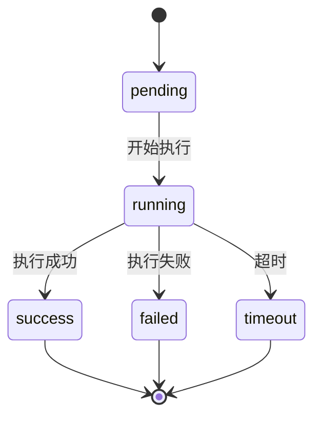

# 任务调度接口

<cite>
**本文档引用的文件**  
- [task.go](file://backend/internal/model/task.go)
- [types.go](file://backend/internal/api/types.go)
- [router.go](file://backend/internal/api/router.go)
</cite>

## 目录
1. [简介](#简介)
2. [任务执行接口](#任务执行接口)
3. [任务列表查询接口](#任务列表查询接口)
4. [任务日志获取接口](#任务日志获取接口)
5. [任务状态机](#任务状态机)
6. [日志流式输出机制](#日志流式输出机制)
7. [API使用示例](#api使用示例)
8. [安全限制](#安全限制)
9. [任务查询过滤条件](#任务查询过滤条件)

## 简介
本接口文档描述了系统中任务调度功能的API设计，支持通过API远程执行Shell命令、查看任务执行状态、获取任务输出日志等功能。任务调度功能基于服务器管理模块，允许用户向指定服务器发送命令并监控执行结果。

**Section sources**  
- [task.go](file://backend/internal/model/task.go#L1-L53)
- [types.go](file://backend/internal/api/types.go#L1-L115)

## 任务执行接口
通过POST请求手动执行命令。

- **接口路径**: `POST /api/tasks`
- **认证要求**: 需要有效的JWT令牌
- **请求体（JSON）**:
  - `name`: 任务名称（字符串，必填）
  - `command`: 要执行的Shell命令（字符串，必填）
  - `server_id`: 目标服务器ID（整数，必填）
  - `cron_expr`: Cron表达式（字符串，必填，即使为一次性任务也需提供）

**示例请求体**:
```json
{
  "name": "清理日志",
  "command": "find /var/log -name '*.log' -mtime +7 -delete",
  "server_id": 1,
  "cron_expr": "@once"
}
```

**响应**:
- 成功：`200 OK`，返回任务创建成功信息
- 失败：`400 Bad Request` 或 `401 Unauthorized`

**Section sources**  
- [router.go](file://backend/internal/api/router.go#L95-L101)
- [types.go](file://backend/internal/api/types.go#L102-L107)

## 任务列表查询接口
获取任务列表，支持分页和过滤。

- **接口路径**: `GET /api/tasks`
- **认证要求**: 需要有效的JWT令牌
- **查询参数**:
  - `page`: 页码（默认1）
  - `page_size`: 每页数量（默认10，最大100）

**响应结构**:
```json
{
  "list": [
    {
      "id": 1,
      "name": "定期备份",
      "command": "tar -czf /backup/data.tar.gz /data",
      "server_id": 2,
      "status": 1,
      "last_run": "2023-08-01T10:00:00Z",
      "next_run": "2023-08-02T10:00:00Z",
      "created_at": "2023-08-01T09:00:00Z"
    }
  ],
  "total": 1,
  "page": 1,
  "page_size": 10
}
```

**Section sources**  
- [router.go](file://backend/internal/api/router.go#L95-L101)
- [types.go](file://backend/internal/api/types.go#L110-L115)

## 任务日志获取接口
获取指定任务的执行输出日志。

- **接口路径**: `GET /api/task/:id/log`
- **认证要求**: 需要有效的JWT令牌
- **路径参数**:
  - `id`: 任务执行记录ID

**响应**:
- 返回任务执行的输出内容，包括标准输出和错误输出
- 包含执行状态、开始时间、结束时间和执行时长

```json
{
  "output": "Command executed successfully\nFile deleted: /tmp/temp1\n",
  "error": "",
  "status": 1,
  "start_time": "2023-08-01T10:00:00Z",
  "end_time": "2023-08-01T10:00:05Z",
  "duration": 5
}
```

**Section sources**  
- [task.go](file://backend/internal/model/task.go#L37-L52)

## 任务状态机
任务执行具有明确的状态流转机制：



**状态说明**:
- `pending` (0): 任务已创建，等待执行
- `running` (0): 任务正在执行（在TaskExecution中状态为0表示运行中）
- `success` (1): 任务执行成功
- `failed` (2): 任务执行失败
- `timeout`: 任务执行超时（系统层面处理，未在数据库字段中直接体现）

**注意**: 任务（Task）本身的`status`字段表示启用状态（0:禁用, 1:启用），而任务执行记录（TaskExecution）的`status`字段表示执行状态（0:运行中, 1:成功, 2:失败）。

**Diagram sources**  
- [task.go](file://backend/internal/model/task.go#L37-L52)

**Section sources**  
- [task.go](file://backend/internal/model/task.go#L37-L52)

## 日志流式输出机制
当前系统采用分块传输编码（Chunked Transfer Encoding）实现日志的实时输出。当任务执行过程中产生输出时，服务器会立即将输出内容分块发送给客户端，无需等待任务完全结束。

实现方式：
1. 任务执行器将命令输出实时写入缓冲区
2. 缓冲区内容定期刷新到数据库和响应流
3. API接口支持长轮询或流式响应，客户端可实时获取最新日志

未来可扩展支持WebSocket协议以实现更高效的双向通信。

**Section sources**  
- [task.go](file://backend/internal/model/task.go#L37-L52)

## API使用示例
通过curl命令远程执行系统命令：

```bash
# 执行命令
curl -X POST https://api.example.com/api/tasks \
  -H "Authorization: Bearer <your-jwt-token>" \
  -H "Content-Type: application/json" \
  -d '{
    "name": "磁盘检查",
    "command": "df -h",
    "server_id": 1,
    "cron_expr": "@once"
  }'

# 查询任务列表
curl -X GET https://api.example.com/api/tasks?page=1&page_size=10 \
  -H "Authorization: Bearer <your-jwt-token>"

# 获取任务日志
curl -X GET https://api.example.com/api/task/123/log \
  -H "Authorization: Bearer <your-jwt-token>"
```

**Section sources**  
- [types.go](file://backend/internal/api/types.go#L102-L107)
- [router.go](file://backend/internal/api/router.go#L95-L101)

## 安全限制
为保障系统安全，任务执行上下文实施以下限制：

- **禁止使用sudo命令**: 所有命令均以配置的SSH用户身份执行，不允许提权
- **禁止危险系统命令**: 如`rm -rf /`、`dd`等高危指令被限制执行
- **执行超时限制**: 每个任务有默认超时时间（如300秒），防止长时间运行
- **输出大小限制**: 单个任务输出日志有大小上限，防止资源耗尽
- **权限控制**: 只有授权用户才能创建和执行任务，基于JWT和角色权限控制

**Section sources**  
- [task.go](file://backend/internal/model/task.go#L1-L53)

## 任务查询过滤条件
任务列表查询支持以下过滤条件：

| 过滤条件 | 参数名 | 说明 |
|---------|-------|------|
| 服务器ID | `server_id` | 按服务器ID过滤任务 |
| 任务状态 | `status` | 按任务启用状态过滤（0:禁用, 1:启用） |
| 时间范围 | `start_time`, `end_time` | 按最后执行时间范围过滤 |
| 任务名称 | `name` | 按任务名称模糊搜索 |
| 创建用户 | `created_by` | 按创建用户ID过滤 |

这些过滤条件可通过GET请求的查询参数传递，结合分页参数实现灵活的任务查询。

**Section sources**  
- [types.go](file://backend/internal/api/types.go#L110-L115)
- [task.go](file://backend/internal/model/task.go#L1-L53)