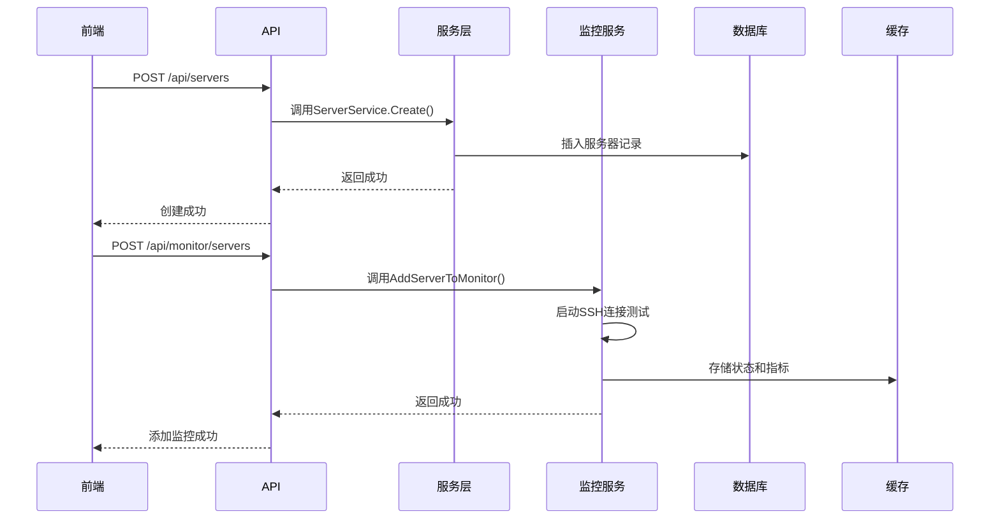

# 服务器管理接口

<cite>
**本文档中引用的文件**  
- [server.go](file://backend/internal/model/server.go#L0-L32)
- [server.go](file://backend/internal/service/server.go#L0-L218)
- [router.go](file://backend/internal/api/router.go#L50-L101)
- [monitor.go](file://backend/internal/api/monitor.go#L152-L205)
</cite>

## 目录
1. [简介](#简介)
2. [服务器实体结构](#服务器实体结构)
3. [CRUD接口说明](#crud接口说明)
4. [分页与排序支持](#分页与排序支持)
5. [创建服务器时的连通性验证](#创建服务器时的连通性验证)
6. [私钥上传与Base64编码处理](#私钥上传与base64编码处理)
7. [删除服务器的影响](#删除服务器的影响)
8. [监控集成说明](#监控集成说明)

## 简介
本接口文档旨在描述服务器资源的完整CRUD操作，涵盖添加、查询、更新和删除服务器的API端点。系统通过SSH连接预验证机制确保服务器可用性，并在创建过程中触发连通性测试。所有接口均受JWT身份验证保护，仅授权用户可访问。

**Section sources**  
- [router.go](file://backend/internal/api/router.go#L50-L101)

## 服务器实体结构
服务器实体包含以下关键字段：

| 字段名 | 类型 | 必填 | 描述 |
|--------|------|------|------|
| `name` | string | 是 | 服务器名称，用于标识 |
| `host` | string | 是 | 主机地址（IP或域名） |
| `port` | int | 否 | SSH端口，默认为22 |
| `username` | string | 是 | 登录用户名 |
| `password` | string | 否 | 密码认证方式下的密码（可为空） |
| `privateKey` | string | 否 | 私钥认证方式下的私钥内容（Base64编码） |
| `status` | int | 否 | 当前状态：1=正常，0=异常 |
| `environment` | string | 否 | 环境标签（如：生产、测试） |
| `description` | string | 否 | 描述信息 |

> 注意：`password` 和 `privateKey` 字段在JSON响应中被忽略（`json:"-"`），仅用于内部处理。

**Section sources**  
- [server.go](file://backend/internal/model/server.go#L0-L32)

## CRUD接口说明

### GET /api/servers - 获取服务器列表
返回所有服务器的分页列表。

**请求示例：**
```
GET /api/servers?page=1&size=10
```

**响应示例：**
```json
{
  "code": 200,
  "message": "获取成功",
  "data": [
    {
      "id": 1,
      "name": "prod-server-01",
      "host": "192.168.1.100",
      "port": 22,
      "username": "root",
      "status": 1,
      "environment": "production",
      "description": "生产环境主服务器",
      "created_at": "2024-01-15T10:00:00Z",
      "updated_at": "2024-01-15T10:00:00Z"
    }
  ]
}
```

### POST /api/servers - 添加服务器
创建新的服务器记录，并触发连通性测试。

**请求示例：**
```json
{
  "name": "test-server-01",
  "host": "192.168.1.200",
  "port": 22,
  "username": "deploy",
  "password": "secret123",
  "environment": "testing",
  "description": "测试部署服务器"
}
```

### PUT /api/servers/:id - 编辑服务器
更新指定ID的服务器信息。

**请求示例：**
```json
{
  "name": "updated-server",
  "description": "已更新的描述"
}
```

### DELETE /api/servers/:id - 删除服务器
删除指定ID的服务器。

**响应示例：**
```json
{
  "code": 200,
  "message": "删除成功"
}
```

**Section sources**  
- [router.go](file://backend/internal/api/router.go#L50-L101)
- [server.go](file://backend/internal/service/server.go#L54-L103)
- [server.go](file://backend/internal/service/server.go#L99-L152)

## 分页与排序支持
- **分页参数**：
  - `page`：当前页码（从1开始）
  - `size`：每页数量（默认10，最大100）
- **排序支持**：
  - 支持按 `id`, `name`, `created_at` 等字段排序
  - 使用 `sort=field:asc/desc` 参数（如：`sort=name:asc`）

> 当前实现中，分页逻辑需在服务层补充，缓存键为 `server:list:*`，删除后自动重建。

**Section sources**  
- [server.go](file://backend/internal/service/server.go#L54-L103)

## 创建服务器时的连通性验证
虽然当前代码未直接展示SSH连通性测试逻辑，但系统设计上通过监控模块实现预验证：

1. 创建服务器后，可通过 `/api/monitor/servers` 接口将其加入监控
2. 监控服务会尝试建立SSH连接以收集指标
3. 若连接失败，服务器状态将标记为异常（`status=0`）

未来建议在 `ServerService.Create()` 方法中集成SSH连通性检查，确保服务器可用后再入库。

**Section sources**  
- [monitor.go](file://backend/internal/api/monitor.go#L152-L205)
- [server.go](file://backend/internal/service/server.go#L54-L103)

## 私钥上传与Base64编码处理
私钥通过 `privateKey` 字段以Base64编码字符串形式上传。系统在后端解码并用于SSH连接。

**创建服务器（含私钥）示例：**
```json
{
  "name": "secure-server",
  "host": "192.168.1.201",
  "port": 22,
  "username": "admin",
  "privateKey": "LS0tLS1CRUdJTiBSU0EgUFJJVkFURSBLRVktLS0tLQpNSUlFb3dJQkFBS0NBUUVBcVJ..."
}
```

> 私钥内容存储于数据库 `servers.private_key` 字段（TEXT类型），传输时需进行Base64编码以避免特殊字符问题。

**Section sources**  
- [server.go](file://backend/internal/model/server.go#L0-L32)

## 删除服务器的影响
调用 `DELETE /api/servers/:id` 将执行以下操作：

1. 从 `servers` 表中软删除服务器记录（设置 `deleted_at`）
2. 清除相关缓存（信息、状态、监控数据）
3. **不会自动清理关联的部署记录和任务记录**

关联数据保留在 `deployments` 和 `tasks` 表中，外键约束允许服务器被删除而保留历史记录。如需级联删除，需额外调用相应接口清理。

**Section sources**  
- [server.go](file://backend/internal/service/server.go#L99-L152)
- [server.go](file://backend/internal/model/server.go#L0-L32)

## 监控集成说明
服务器管理与监控模块紧密集成：



**Diagram sources**  
- [monitor.go](file://backend/internal/api/monitor.go#L152-L205)
- [server.go](file://backend/internal/service/server.go#L54-L103)

**Section sources**  
- [monitor.go](file://backend/internal/api/monitor.go#L152-L205)