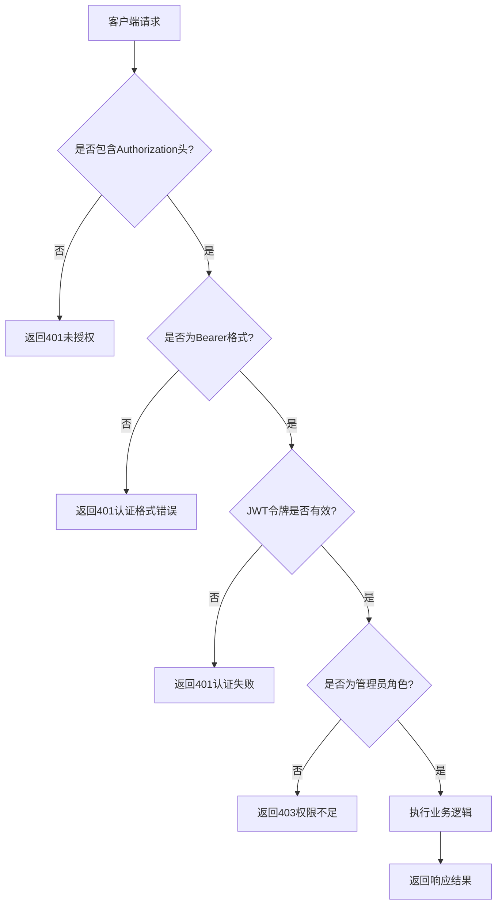
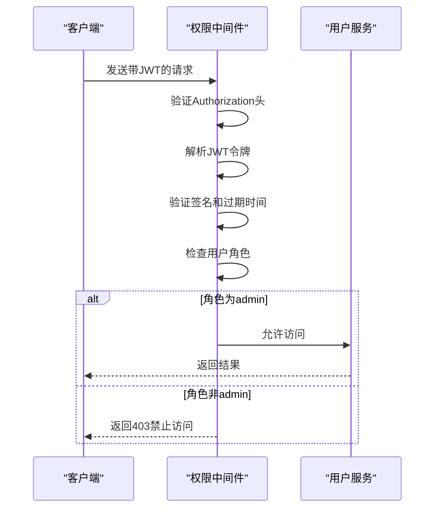
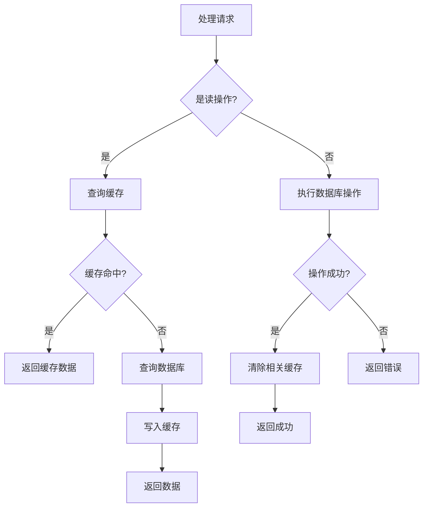
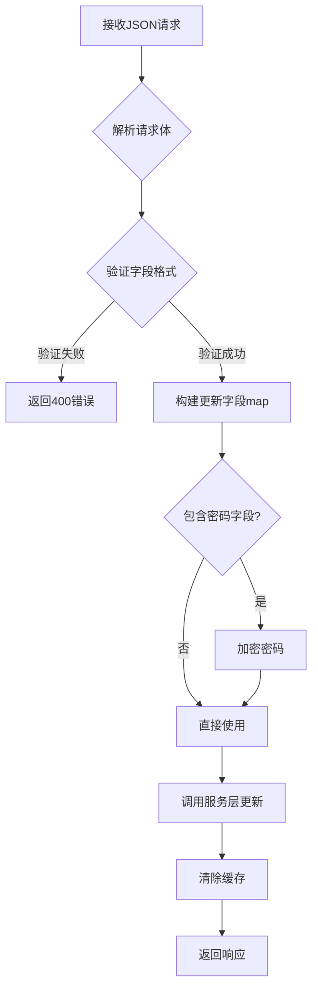
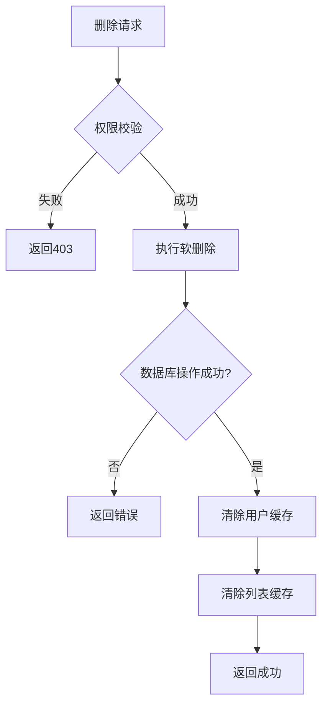

# 用户管理接口

<cite>
**本文档引用文件**   
- [user.go](file://backend/internal/api/user.go)
- [user.go](file://backend/internal/service/user.go)
- [user_cached.go](file://backend/internal/service/user_cached.go)
- [keys.go](file://backend/pkg/cache/keys.go)
- [model.go](file://backend/internal/model/user.go)
- [types.go](file://backend/internal/api/types.go)
- [middleware.go](file://backend/internal/middleware/middleware.go)
- [router.go](file://backend/internal/api/router.go)
</cite>

## 目录
1. [用户管理接口](#用户管理接口)
2. [RESTful接口说明](#restful接口说明)
3. [权限校验机制](#权限校验机制)
4. [响应数据结构](#响应数据结构)
5. [缓存机制实现](#缓存机制实现)
6. [请求示例与验证规则](#请求示例与验证规则)
7. [删除机制说明](#删除机制说明)

## RESTful接口说明

本系统提供以下用户管理相关的RESTful接口：

- `GET /api/users`：分页查询用户列表
- `GET /api/users/:id`：获取用户详情
- `PUT /api/users/:id`：更新用户信息
- `DELETE /api/users/:id`：删除用户

所有接口均需在请求头中包含有效的JWT令牌，格式为 `Authorization: Bearer <token>`。



**Diagram sources**
- [middleware.go](file://backend/internal/middleware/middleware.go#L45-L80)
- [router.go](file://backend/internal/api/router.go#L50-L60)

**Section sources**
- [router.go](file://backend/internal/api/router.go#L50-L101)
- [user.go](file://backend/internal/api/user.go#L0-L213)

## 权限校验机制

系统通过中间件实现多层权限校验：

1. **JWT认证中间件** (`JWTAuth`)：验证请求头中的Authorization JWT令牌有效性
2. **角色权限中间件** (`RequireRole`)：确保只有管理员角色可执行修改操作

管理员权限的路由组配置如下：
```go
adminUsers := users.Group("")
adminUsers.Use(middleware.RequireRole("admin"))
{
    adminUsers.POST("", userHandler.Create)
    adminUsers.PUT("/:id", userHandler.Update)
    adminUsers.DELETE("/:id", userHandler.Delete)
}
```

当用户尝试访问受保护的资源时，系统会依次验证：
- 请求头中是否存在Authorization字段
- 是否以"Bearer "开头
- JWT令牌是否有效（签名、过期时间）
- 用户角色是否为"admin"



**Diagram sources**
- [middleware.go](file://backend/internal/middleware/middleware.go#L45-L116)
- [router.go](file://backend/internal/api/router.go#L90-L95)

**Section sources**
- [middleware.go](file://backend/internal/middleware/middleware.go#L45-L116)
- [router.go](file://backend/internal/api/router.go#L90-L95)

## 响应数据结构

系统使用统一的响应结构体 `Response`，其字段定义如下：

| 字段 | 类型 | 说明 |
|------|------|------|
| Code | int | 状态码 |
| Message | string | 响应消息 |
| Data | interface{} | 响应数据（可选） |

用户信息响应体（UserDTO）字段映射规则：

| 模型字段 | 响应字段 | 映射说明 |
|---------|---------|---------|
| ID | ID | 直接映射 |
| Username | Username | 直接映射 |
| Email | Email | 直接映射 |
| Role | Role | 直接映射 |
| Status | Status | 直接映射 |
| Password | - | 敏感信息，使用`json:"-"`隐藏 |
| DeletedAt | - | 软删除标记，不暴露 |

```mermaid
classDiagram
class Response {
+int Code
+string Message
+interface{} Data
}
class User {
+uint ID
+string Username
+string Email
+string Role
+int Status
}
class UserDTO {
<<DTO>>
+uint ID
+string Username
+string Email
+string Role
+int Status
}
Response --> UserDTO : "包含"
User --> UserDTO : "转换"
```

**Diagram sources**
- [types.go](file://backend/internal/api/types.go#L3-L46)
- [model.go](file://backend/internal/model/user.go#L0-L28)

**Section sources**
- [types.go](file://backend/internal/api/types.go#L3-L46)
- [model.go](file://backend/internal/model/user.go#L0-L28)

## 缓存机制实现

用户服务通过 `user_cached.go` 实现Redis缓存读写，主要包含以下功能：

### 缓存键生成策略
缓存键生成遵循统一的命名规范，由 `pkg/cache/keys.go` 中的 `CacheKeys` 结构体提供：

- 用户信息缓存键：`user:info:{userID}`
- 用户列表缓存键：`user:list:{page}:{pageSize}`

```go
func (k *CacheKeys) UserInfo(userID uint) string {
    return fmt.Sprintf("%s:info:%d", PrefixUser, userID)
}
```

### 缓存操作流程


### 缓存生命周期
- 用户信息缓存：1小时（TTLUserInfo）
- 用户列表缓存：10分钟（TTLUserList）
- 缓存更新策略：写操作后立即清除相关缓存

**Diagram sources**
- [user_cached.go](file://backend/internal/service/user_cached.go#L0-L239)
- [keys.go](file://backend/pkg/cache/keys.go#L0-L120)

**Section sources**
- [user_cached.go](file://backend/internal/service/user_cached.go#L0-L239)
- [keys.go](file://backend/pkg/cache/keys.go#L0-L120)

## 请求示例与验证规则

### 更新用户信息JSON请求示例
```json
{
    "username": "newusername",
    "email": "newemail@example.com",
    "role": "admin",
    "status": 1
}
```

### 字段验证规则
| 字段 | 验证规则 | 说明 |
|------|---------|------|
| username | 非空 | 必填字段 |
| email | 非空且为有效邮箱格式 | 使用`binding:"omitempty,email"` |
| role | 可选值为"user"或"admin" | 使用`binding:"omitempty,oneof=user admin"` |
| status | 可选值为0或1 | 使用`binding:"omitempty,oneof=0 1"` |
| password | 最小长度6位 | 仅在创建时强制要求 |

更新操作采用部分更新模式，仅更新提供的字段，未提供的字段保持原值不变。



**Diagram sources**
- [types.go](file://backend/internal/api/types.go#L47-L60)
- [user.go](file://backend/internal/api/user.go#L118-L175)

**Section sources**
- [types.go](file://backend/internal/api/types.go#L47-L60)
- [user.go](file://backend/internal/api/user.go#L118-L175)

## 删除机制说明

系统采用软删除机制处理用户删除操作：

### 软删除实现
- 使用GORM的`DeletedAt`字段实现软删除
- 删除操作实际是将`deleted_at`字段设置为当前时间戳
- 查询时自动过滤已删除的记录

```go
// Delete 删除用户（软删除）
func (s *UserService) Delete(id uint) error {
    result := s.db.Delete(&model.User{}, id)
    // ...
}
```

### 级联处理
- **缓存清理**：删除用户后立即清除其缓存信息
- **关联数据**：通过外键约束管理关联数据（如部署、任务等）
- **权限检查**：仅管理员可执行删除操作

删除操作的执行流程：
1. 验证用户身份和权限
2. 执行数据库软删除操作
3. 清除Redis中的用户缓存
4. 返回删除成功响应



**Diagram sources**
- [user.go](file://backend/internal/service/user.go#L135-L154)
- [user_cached.go](file://backend/internal/service/user_cached.go#L185-L204)

**Section sources**
- [user.go](file://backend/internal/service/user.go#L135-L154)
- [user_cached.go](file://backend/internal/service/user_cached.go#L185-L204)