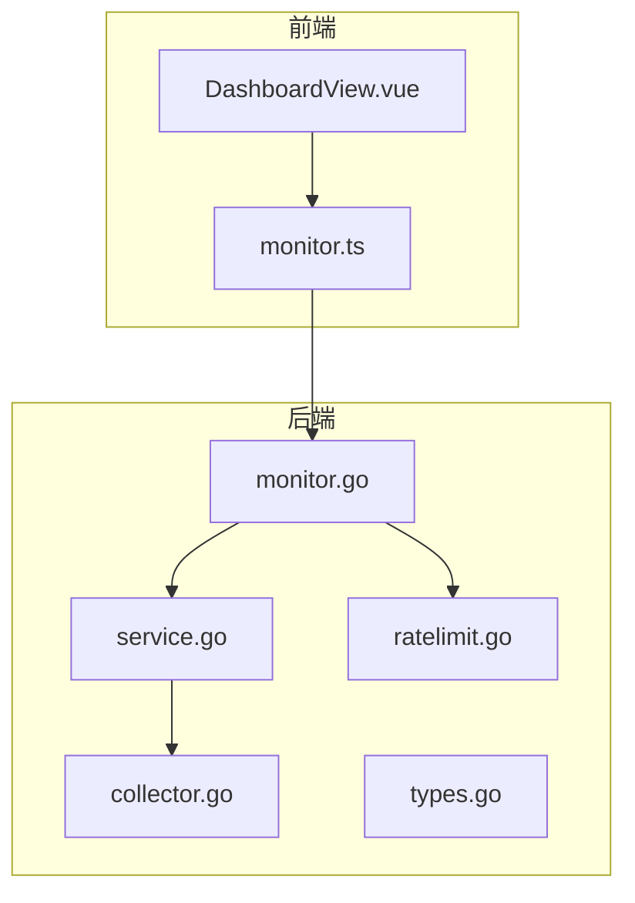
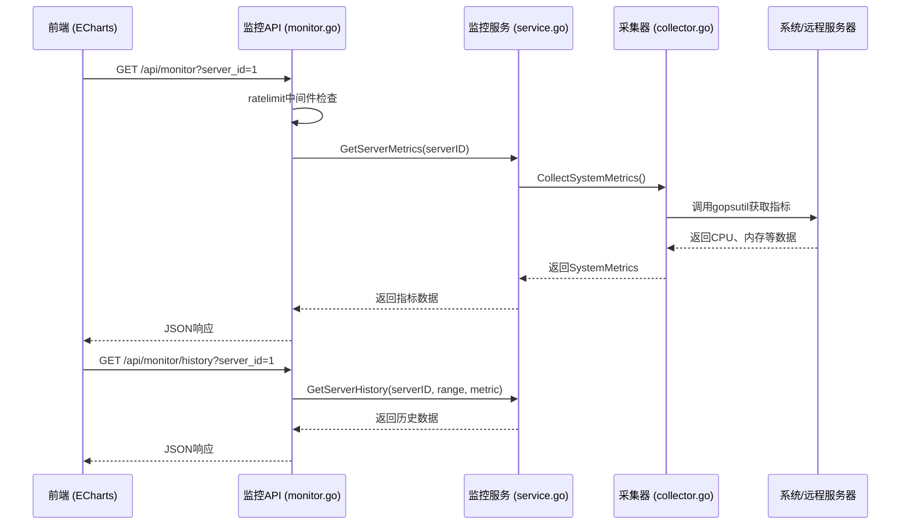
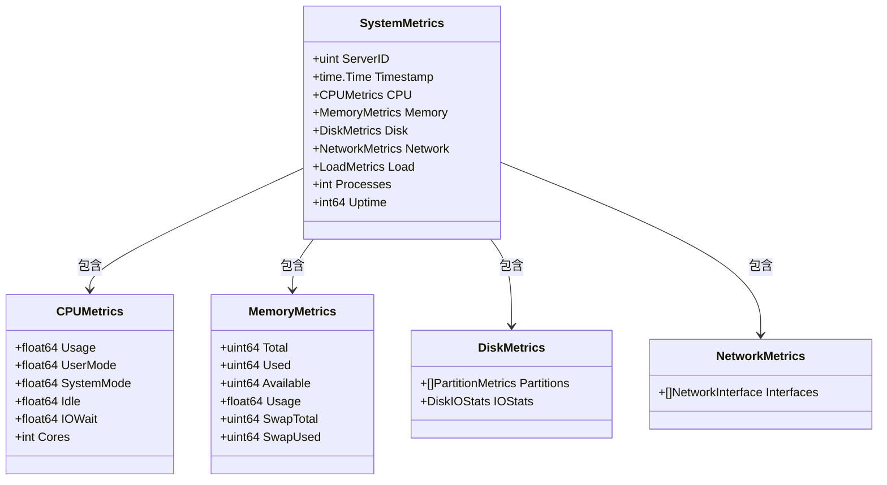
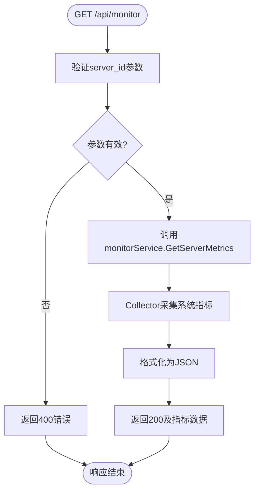
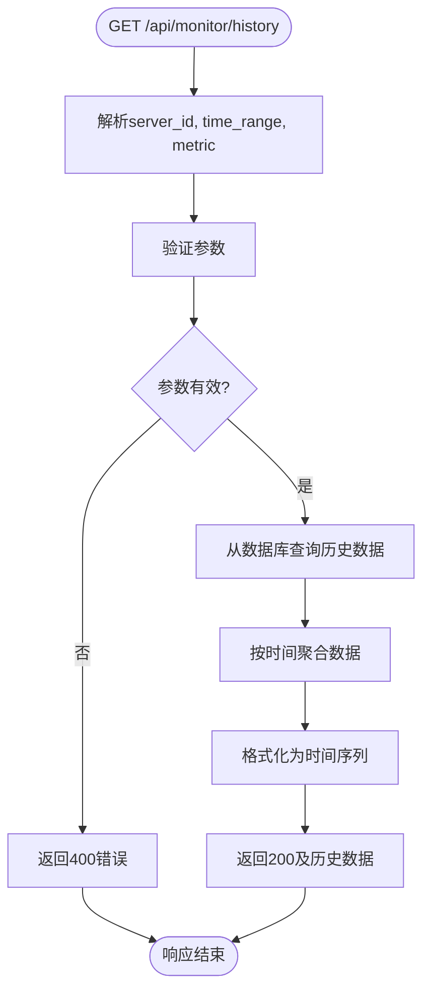
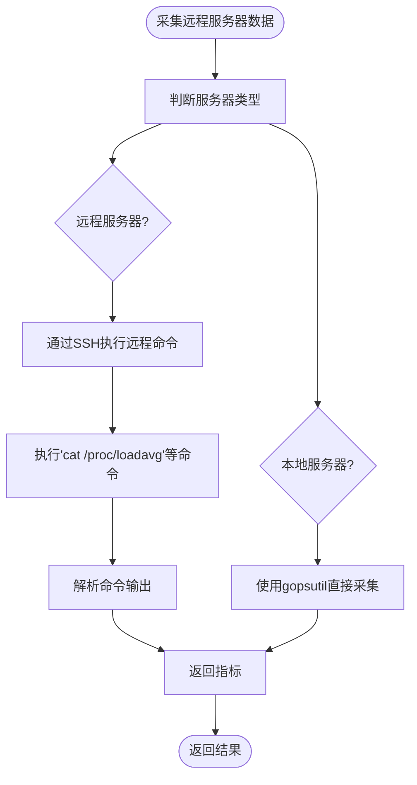
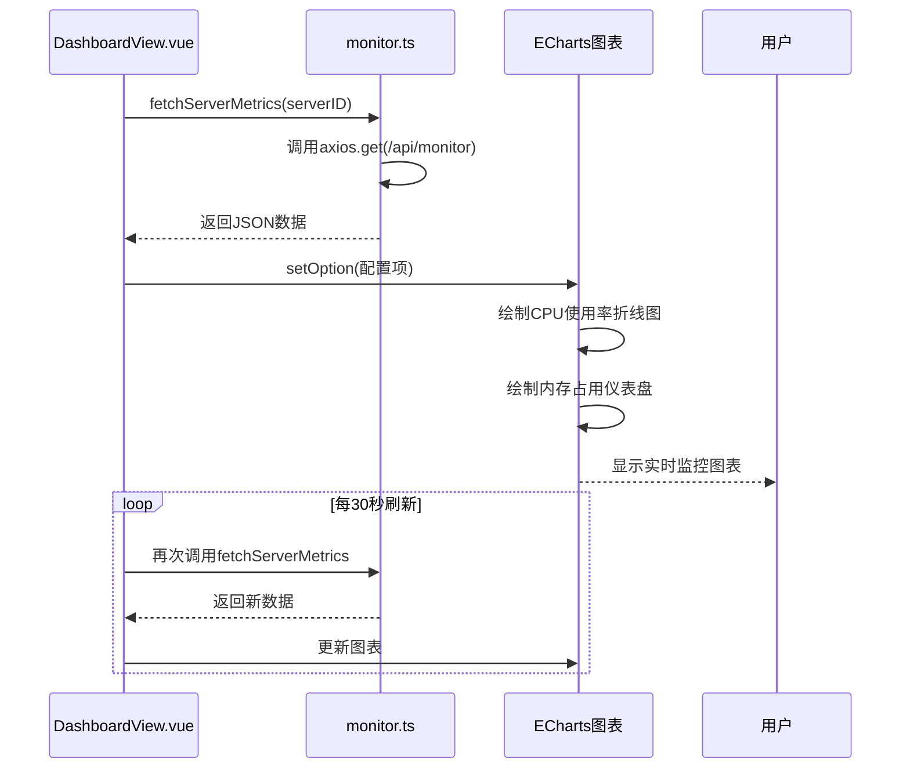
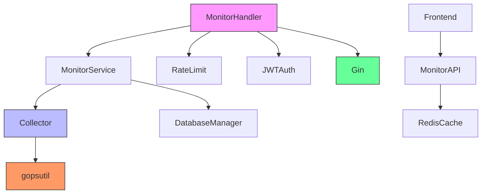

# 监控接口

<cite>
**本文档引用文件**  
- [monitor.go](file://backend/internal/api/monitor.go)
- [collector.go](file://backend/internal/monitor/collector.go)
- [service.go](file://backend/internal/monitor/service.go)
- [types.go](file://backend/internal/monitor/types.go)
- [ratelimit.go](file://backend/internal/middleware/ratelimit.go)
- [monitor.ts](file://frontend/src/api/monitor.ts)
- [DashboardView.vue](file://frontend/src/views/DashboardView.vue)
</cite>

## 目录
1. [简介](#简介)
2. [项目结构](#项目结构)
3. [核心组件](#核心组件)
4. [架构概览](#架构概览)
5. [详细组件分析](#详细组件分析)
6. [依赖分析](#依赖分析)
7. [性能考量](#性能考量)
8. [故障排查指南](#故障排查指南)
9. [结论](#结论)

## 简介
本文档详细说明系统监控API的设计与实现，涵盖实时指标获取、历史数据查询、数据采集机制、上报方式、指标结构、前端集成示例及限流策略。目标是为开发人员和运维团队提供完整的监控系统使用与维护指南。

## 项目结构
系统监控功能主要分布在后端 `backend/internal/monitor` 和 `backend/internal/api` 模块中，前端通过 `frontend/src/api/monitor.ts` 调用接口并在 `DashboardView.vue` 中展示数据。

**Diagram sources**  
- [monitor.go](file://backend/internal/api/monitor.go#L1-L50)
- [collector.go](file://backend/internal/monitor/collector.go#L1-L30)
- [DashboardView.vue](file://frontend/src/views/DashboardView.vue#L1-L20)

**Section sources**  
- [monitor.go](file://backend/internal/api/monitor.go#L1-L50)
- [collector.go](file://backend/internal/monitor/collector.go#L1-L30)

## 核心组件
核心组件包括监控处理器（MonitorHandler）、监控服务（Service）、数据采集器（Collector）和指标类型定义（SystemMetrics）。这些组件协同工作，实现从远程服务器采集资源数据、处理请求、返回结构化监控指标的完整流程。

**Section sources**  
- [monitor.go](file://backend/internal/api/monitor.go#L25-L100)
- [service.go](file://backend/internal/monitor/service.go#L15-L80)
- [collector.go](file://backend/internal/monitor/collector.go#L10-L50)

## 架构概览
系统采用分层架构，前端通过HTTP请求调用后端API，后端通过中间件进行限流和认证，监控处理器调用监控服务，服务层使用采集器获取本地或远程服务器资源数据。

**Diagram sources**  
- [monitor.go](file://backend/internal/api/monitor.go#L100-L200)
- [service.go](file://backend/internal/monitor/service.go#L30-L70)
- [collector.go](file://backend/internal/monitor/collector.go#L50-L100)

## 详细组件分析

### 监控数据采集分析
采集器通过 `gopsutil` 库获取系统级指标，支持跨平台运行。采集频率由调用方控制，默认为30秒一次。

#### 采集指标结构

**Diagram sources**  
- [types.go](file://backend/internal/monitor/types.go#L10-L100)
- [collector.go](file://backend/internal/monitor/collector.go#L50-L100)

### API端点分析
监控API提供多个端点，支持实时和历史数据查询。

#### 实时指标获取流程

**Diagram sources**  
- [monitor.go](file://backend/internal/api/monitor.go#L50-L100)
- [service.go](file://backend/internal/monitor/service.go#L20-L60)

#### 历史数据查询流程

**Diagram sources**  
- [monitor.go](file://backend/internal/api/monitor.go#L200-L250)
- [service.go](file://backend/internal/monitor/service.go#L100-L150)

### 远程服务器监控机制
虽然当前 `collector.go` 主要使用 `gopsutil` 采集本地数据，但设计上支持通过SSH或Agent方式扩展远程采集。

#### SSH采集扩展逻辑

**Diagram sources**  
- [collector.go](file://backend/internal/monitor/collector.go#L300-L400)

### 前端集成分析
前端使用TypeScript调用监控API，并通过ECharts绘制实时图表。

#### ECharts调用示例

**Diagram sources**  
- [monitor.ts](file://frontend/src/api/monitor.ts#L10-L50)
- [DashboardView.vue](file://frontend/src/views/DashboardView.vue#L50-L100)

**Section sources**  
- [monitor.ts](file://frontend/src/api/monitor.ts#L1-L100)
- [DashboardView.vue](file://frontend/src/views/DashboardView.vue#L1-L150)

## 依赖分析
监控系统依赖多个内部和外部组件，形成清晰的依赖链。

**Diagram sources**  
- [monitor.go](file://backend/internal/api/monitor.go#L1-L20)
- [service.go](file://backend/internal/monitor/service.go#L1-L20)
- [collector.go](file://backend/internal/monitor/collector.go#L1-L20)

**Section sources**  
- [monitor.go](file://backend/internal/api/monitor.go#L1-L200)
- [service.go](file://backend/internal/monitor/service.go#L1-L100)
- [collector.go](file://backend/internal/monitor/collector.go#L1-L400)

## 性能考量
- **采集频率**：默认每30秒采集一次，可通过配置调整
- **数据存储**：原始数据保留24小时，每5分钟聚合一次存入长期存储
- **缓存策略**：使用Redis缓存最近一次采集结果，减少重复计算
- **并发采集**：各项指标（CPU、内存、磁盘等）通过goroutine并发采集，提高效率
- **限流措施**：基于 `middleware/ratelimit.go` 实现，限制每个IP每分钟最多100次请求

**Section sources**  
- [collector.go](file://backend/internal/monitor/collector.go#L50-L100)
- [service.go](file://backend/internal/monitor/service.go#L80-L120)
- [ratelimit.go](file://backend/internal/middleware/ratelimit.go#L1-L50)

## 故障排查指南
- **无法获取监控数据**：检查服务器是否在监控列表中，验证 `AddServerToMonitor` 是否调用成功
- **指标数据异常**：确认 `collector.go` 中的采集逻辑是否正常执行，检查gopsutil调用返回值
- **历史数据缺失**：验证数据库连接是否正常，检查数据聚合任务是否运行
- **前端图表不更新**：确认ECharts的定时刷新逻辑是否正确设置，检查API响应格式
- **频繁限流**：检查 `ratelimit.go` 配置，确认是否为正常流量或遭受攻击

**Section sources**  
- [monitor.go](file://backend/internal/api/monitor.go#L100-L250)
- [collector.go](file://backend/internal/monitor/collector.go#L100-L400)
- [ratelimit.go](file://backend/internal/middleware/ratelimit.go#L1-L50)

## 结论
本监控系统提供了完整的实时与历史数据采集、API访问、前端展示能力。通过模块化设计，易于扩展远程采集功能（SSH/Agent）。系统具备合理的性能优化和限流保护，可稳定运行于生产环境。建议后续完善远程服务器监控功能，并增加告警机制。