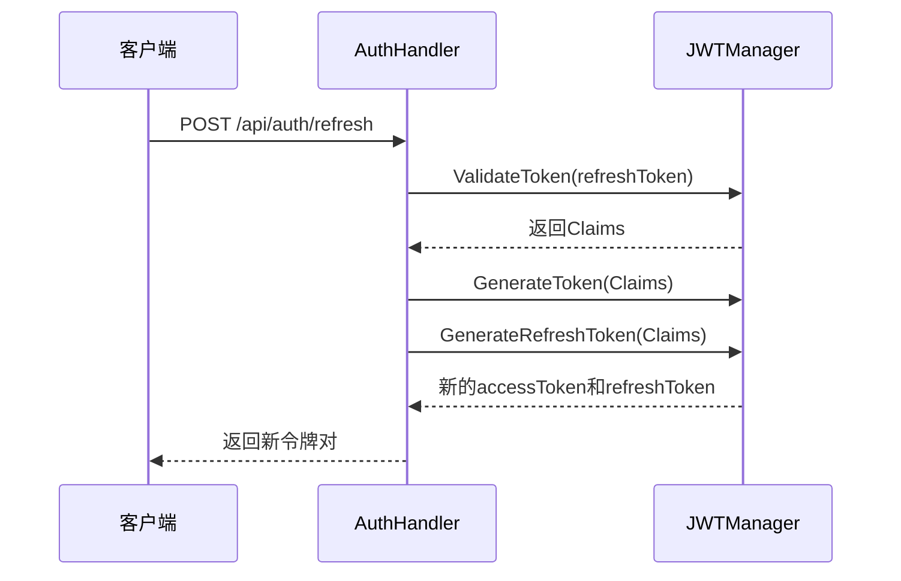
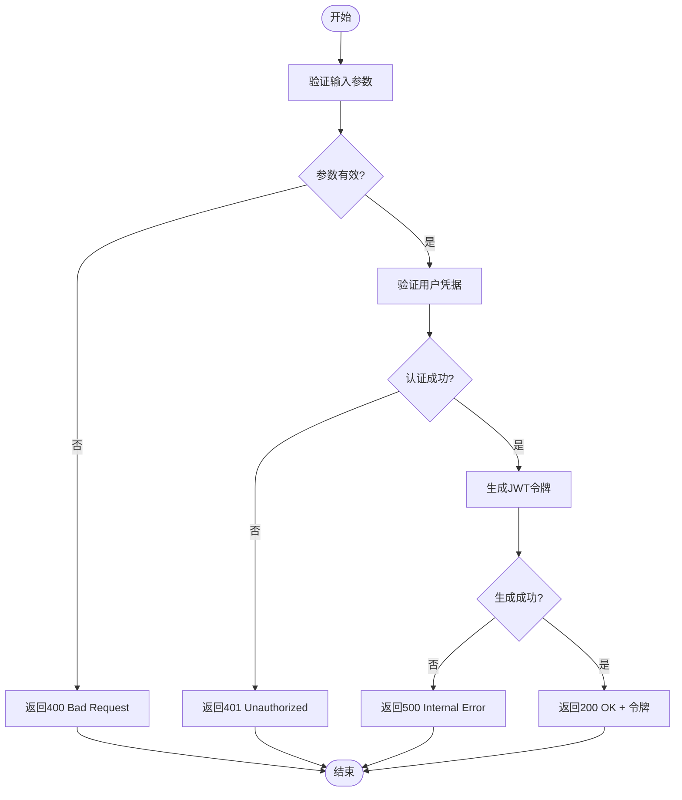

# 认证接口

<cite>
**本文档引用的文件**
- [auth.go](file://backend/internal/api/auth.go)
- [jwt.go](file://backend/internal/auth/jwt.go)
- [password.go](file://backend/internal/auth/password.go)
- [config.yaml](file://backend/configs/config.yaml)
- [config.go](file://backend/internal/config/config.go)
</cite>

## 目录
1. [简介](#简介)
2. [核心端点说明](#核心端点说明)
3. [JWT令牌机制](#jwt令牌机制)
4. [密码哈希流程](#密码哈希流程)
5. [请求示例](#请求示例)
6. [注册接口校验规则](#注册接口校验规则)
7. [错误响应码](#错误响应码)

## 简介
本接口文档详细说明了qoder系统的用户认证机制，涵盖登录、注册、令牌刷新等核心功能。系统采用JWT进行身份验证，结合bcrypt实现安全密码存储，并通过配置文件灵活管理令牌过期时间等参数。

## 核心端点说明

### 登录接口（POST /api/auth/login）
用于用户身份验证并获取访问令牌。

**请求体格式**
```json
{
  "username": "string",
  "password": "string"
}
```

**成功响应体结构**
```json
{
  "code": 200,
  "message": "登录成功",
  "data": {
    "access_token": "string",
    "refresh_token": "string",
    "user": {
      "id": 1,
      "username": "string",
      "email": "string",
      "role": "string",
      "status": "string"
    }
  }
}
```

### 注册接口（POST /api/auth/register）
创建新用户账户，需满足密码强度和用户名唯一性要求。

### 令牌刷新接口（POST /api/auth/refresh）
使用刷新令牌获取新的访问令牌和刷新令牌。

**请求体格式**
```json
{
  "refresh_token": "string"
}
```

**Section sources**
- [auth.go](file://backend/internal/api/auth.go#L30-L159)

## JWT令牌机制

### 令牌生成
系统使用 `github.com/golang-jwt/jwt/v5` 库生成JWT令牌，签名算法为HS256。

### 声明结构（Claims）
```json
{
  "user_id": 1,
  "username": "john_doe",
  "role": "admin",
  "exp": 1735689600,
  "iat": 1735686000,
  "nbf": 1735686000
}
```

### 过期时间配置
从 `config.yaml` 文件中读取：
- **访问令牌过期时间**：3600秒（1小时）
- **刷新令牌过期时间**：604800秒（7天）

### 刷新策略
刷新令牌成功后，系统将返回新的访问令牌和刷新令牌，实现无缝续期。



**Diagram sources**
- [jwt.go](file://backend/internal/auth/jwt.go#L45-L108)
- [auth.go](file://backend/internal/api/auth.go#L100-L120)

**Section sources**
- [jwt.go](file://backend/internal/auth/jwt.go#L1-L108)
- [config.yaml](file://backend/configs/config.yaml#L34-L36)

## 密码哈希流程

### 实现方式
密码哈希在 `password.go` 文件中通过 `golang.org/x/crypto/bcrypt` 库实现。

### 核心函数
- `HashPassword(password)`: 使用默认成本因子（DefaultCost）对密码进行哈希
- `CheckPassword(password, hash)`: 验证明文密码与哈希值是否匹配

### 安全特性
- 自动加盐（Salt）
- 抗彩虹表攻击
- 可配置计算成本

**Section sources**
- [password.go](file://backend/internal/auth/password.go#L1-L18)

## 请求示例

### 登录请求
```bash
curl -X POST http://localhost:8080/api/auth/login \
  -H "Content-Type: application/json" \
  -d '{
    "username": "admin",
    "password": "password123"
  }'
```

### 使用访问令牌
```bash
curl -X GET http://localhost:8080/api/user/profile \
  -H "Authorization: Bearer <access_token>"
```

## 注册接口校验规则

### 字段校验
- **用户名**：
  - 长度：3-20个字符
  - 字符：字母、数字、下划线
  - 唯一性：数据库中必须唯一
- **密码**：
  - 长度：至少8位
  - 复杂度：包含大小写字母、数字、特殊字符
  - 安全性：不存储明文，使用bcrypt哈希
- **邮箱**：
  - 格式：符合标准邮箱格式
  - 唯一性：数据库中必须唯一

**Section sources**
- [auth.go](file://backend/internal/api/auth.go#L30-L50)

## 错误响应码

### HTTP状态码及响应结构

| 状态码 | 场景 | 响应体示例 |
|--------|------|------------|
| 400 | 请求参数错误 | ```{"code": 400, "message": "请求参数错误: ..."}``` |
| 401 | 认证失败/令牌无效 | ```{"code": 401, "message": "用户名或密码错误"}``` |
| 409 | 资源冲突（如用户名已存在） | ```{"code": 409, "message": "用户名已存在"}``` |
| 500 | 服务器内部错误 | ```{"code": 500, "message": "生成令牌失败"}``` |

### 错误处理流程


**Diagram sources**
- [auth.go](file://backend/internal/api/auth.go#L30-L60)
- [jwt.go](file://backend/internal/auth/jwt.go#L45-L60)

**Section sources**
- [auth.go](file://backend/internal/api/auth.go#L30-L159)