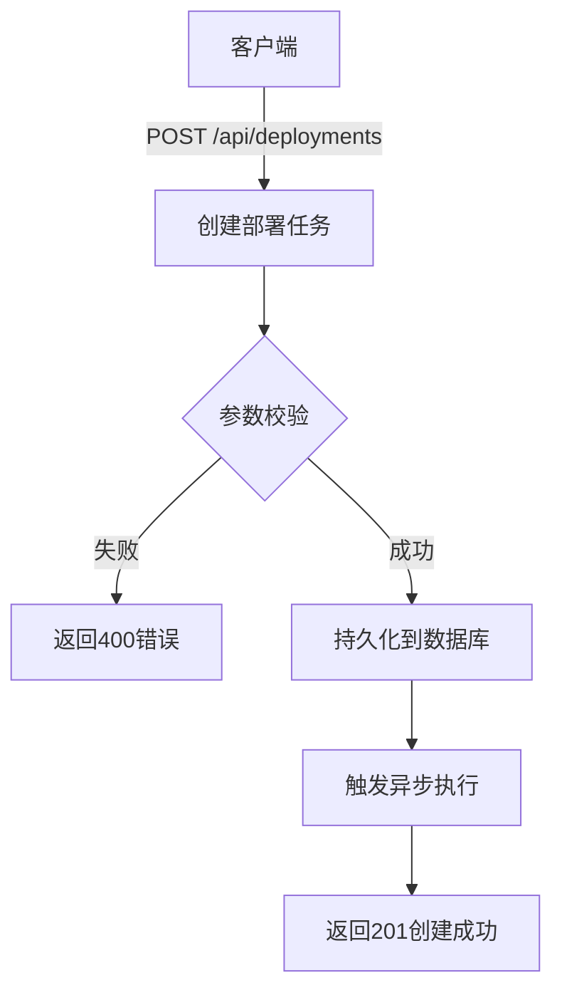
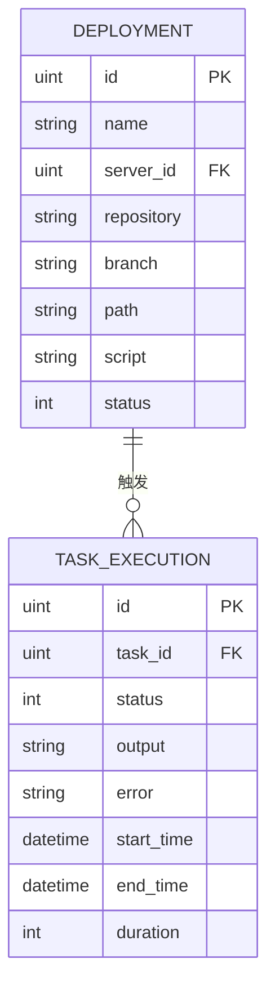
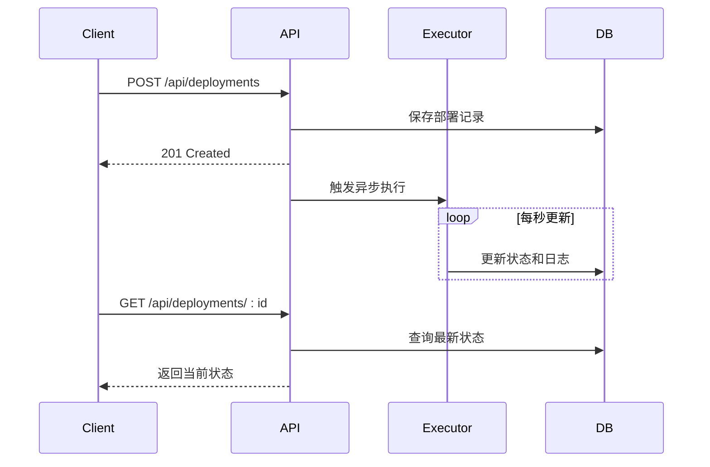

# 部署管理接口

<cite>
**本文档中引用的文件**  
- [deployment.go](file://backend/internal/model/deployment.go)
- [task.go](file://backend/internal/model/task.go)
- [types.go](file://backend/internal/api/types.go)
- [router.go](file://backend/internal/api/router.go)
- [config.yaml](file://backend/configs/config.yaml)
</cite>

## 目录
1. [部署管理接口概述](#部署管理接口概述)
2. [核心接口说明](#核心接口说明)
3. [部署与任务的关联关系](#部署与任务的关联关系)
4. [部署配置请求体结构](#部署配置请求体结构)
5. [异步执行机制与状态获取](#异步执行机制与状态获取)
6. [环境变量注入示例](#环境变量注入示例)
7. [部署历史保留策略与日志存储](#部署历史保留策略与日志存储)

## 部署管理接口概述

部署管理接口提供对应用部署流程的全生命周期管理，包括创建部署任务、查询部署列表、获取部署详情等核心功能。系统通过将一次部署触发多个执行任务的方式实现灵活的部署策略。所有接口均需通过JWT认证访问，确保操作安全性。

**Section sources**
- [router.go](file://backend/internal/api/router.go#L50-L101)
- [types.go](file://backend/internal/api/types.go#L71-L83)

## 核心接口说明

### 创建部署任务（POST /api/deployments）

用于创建新的部署任务，接收JSON格式的请求体，包含部署名称、目标服务器、代码仓库、分支、部署路径及执行脚本等必要信息。

### 查询部署列表（GET /api/deployments）

返回分页的部署任务列表，支持按状态、创建时间等条件筛选，便于用户监控和管理历史及当前部署任务。

### 获取部署详情（GET /api/deployments/:id）

根据部署ID获取单个部署任务的详细信息，包括关联的服务器信息、创建用户、执行状态、日志记录等。



**Diagram sources**
- [router.go](file://backend/internal/api/router.go#L50-L101)
- [types.go](file://backend/internal/api/types.go#L71-L83)

**Section sources**
- [router.go](file://backend/internal/api/router.go#L50-L101)
- [types.go](file://backend/internal/api/types.go#L71-L83)

## 部署与任务的关联关系

在系统中，一次部署（Deployment）会触发一个或多个任务（Task）的执行。`Deployment` 模型与 `Task` 模型通过逻辑关联形成一对多关系。虽然当前模型中未直接体现外键关联，但业务逻辑上，每次部署会在目标服务器上生成相应的执行任务实例（TaskExecution），实现部署流程的原子化操作。



**Diagram sources**
- [deployment.go](file://backend/internal/model/deployment.go#L1-L36)
- [task.go](file://backend/internal/model/task.go#L1-L53)

**Section sources**
- [deployment.go](file://backend/internal/model/deployment.go#L1-L36)
- [task.go](file://backend/internal/model/task.go#L1-L53)

## 部署配置请求体结构

创建部署任务时，请求体需包含以下字段：

| 字段名 | 类型 | 必填 | 说明 |
|--------|------|------|------|
| name | string | 是 | 部署任务名称 |
| server_id | uint | 是 | 目标服务器ID |
| repository | string | 是 | Git仓库地址 |
| branch | string | 否 | 分支名，默认main |
| path | string | 是 | 服务器上部署路径 |
| script | string | 是 | 部署执行脚本内容 |

此外，系统支持扩展配置，如并行/串行执行模式、超时设置等，可通过配置文件或后续接口扩展实现。

**Section sources**
- [types.go](file://backend/internal/api/types.go#L71-L83)

## 异步执行机制与状态获取

部署任务采用异步执行机制。当创建部署请求后，服务端将任务信息持久化并立即返回响应，同时在后台启动执行协程。客户端可通过以下方式获取执行状态：

1. **轮询机制**：定期调用 `GET /api/deployments/:id` 接口查询部署状态（`status` 字段：0-待部署，1-部署中，2-部署成功，3-部署失败）。
2. **WebSocket通知**（未来扩展）：系统可集成WebSocket实现实时状态推送，提升用户体验。

执行过程中，系统会持续记录日志并更新状态，确保可追溯性。



**Diagram sources**
- [router.go](file://backend/internal/api/router.go#L50-L101)
- [deployment.go](file://backend/internal/model/deployment.go#L1-L36)

**Section sources**
- [router.go](file://backend/internal/api/router.go#L50-L101)
- [deployment.go](file://backend/internal/model/deployment.go#L1-L36)

## 环境变量注入示例

在部署脚本中，可通过预定义的环境变量动态注入上下文信息。例如：

```bash
#!/bin/bash
export DEPLOY_ID=${DEPLOYMENT_ID}
export GIT_REPO=${repository}
export GIT_BRANCH=${branch}
export DEPLOY_PATH=${path}
export BUILD_TIME=$(date +%Y%m%d-%H%M%S)

echo "开始部署 $name 到 $DEPLOY_PATH"
cd $DEPLOY_PATH
git clone -b $GIT_BRANCH $GIT_REPO .
source /opt/env/production.sh
chmod +x deploy.sh
./deploy.sh
```

这些变量由系统在执行前自动注入，确保脚本具备足够的上下文信息完成部署。

**Section sources**
- [types.go](file://backend/internal/api/types.go#L71-L83)
- [deployment.go](file://backend/internal/model/deployment.go#L1-L36)

## 部署历史保留策略与日志存储

系统默认保留所有部署历史记录，支持审计与回溯。部署日志存储在 `deployment_logs` 表中，包含日志级别（info、warn、error）、消息内容和时间戳。

根据配置文件 `config.yaml` 中的数据库设置，数据持久化于MySQL数据库 `devops_platform` 中。日志保留策略可通过外部清理脚本或后台任务定期归档旧数据，避免存储膨胀。

部署日志与部署记录通过 `deployment_id` 外键关联，确保查询效率和数据一致性。

**Section sources**
- [deployment.go](file://backend/internal/model/deployment.go#L32-L48)
- [config.yaml](file://backend/configs/config.yaml#L1-L40)