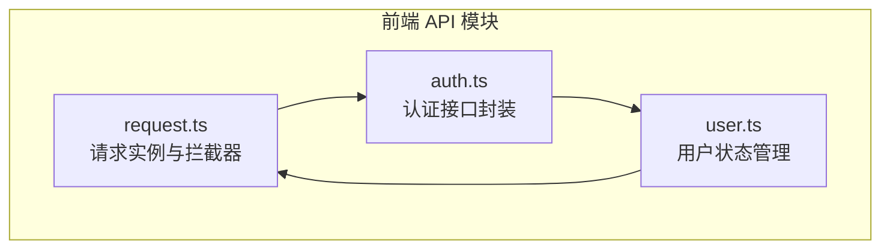
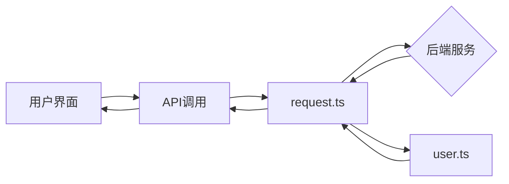
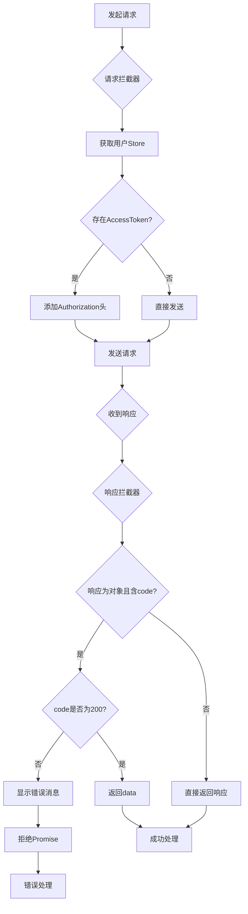
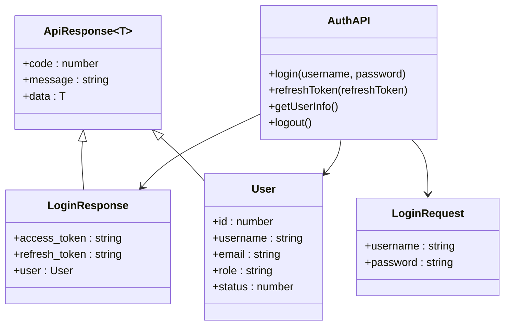
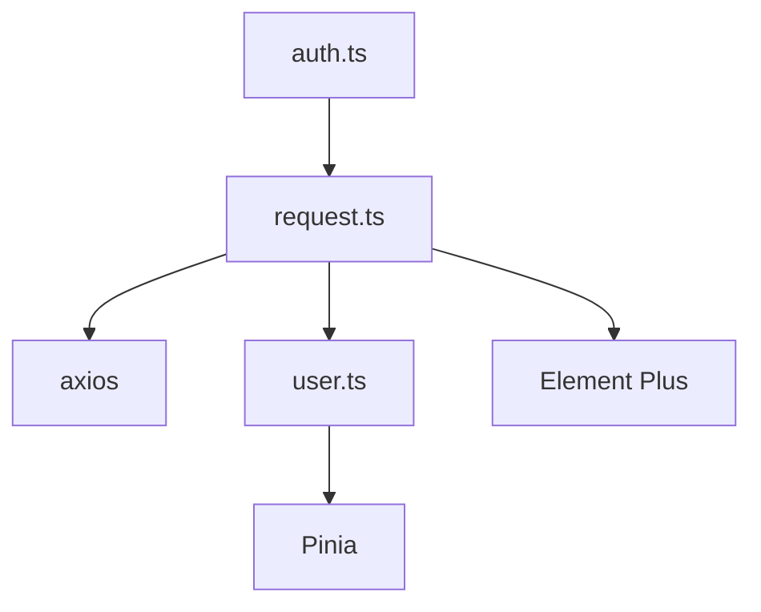

# API请求封装

<cite>
**本文档引用文件**  
- [request.ts](file://frontend/src/api/request.ts)
- [auth.ts](file://frontend/src/api/auth.ts)
- [user.ts](file://frontend/src/store/user.ts)
</cite>

## 目录
1. [引言](#引言)
2. [项目结构](#项目结构)
3. [核心组件](#核心组件)
4. [架构概览](#架构概览)
5. [详细组件分析](#详细组件分析)
6. [依赖分析](#依赖分析)
7. [性能考量](#性能考量)
8. [故障排查指南](#故障排查指南)
9. [结论](#结论)

## 引言
本文档旨在深度解析前端API层的设计与实现，重点分析基于Axios的请求封装机制。涵盖`request.ts`中的实例化配置、请求/响应拦截器逻辑，包括统一错误处理、JWT自动注入与刷新机制。同时解析`auth.ts`中具体API方法的封装方式，展示类型安全与模块化组织的优势，并提供超时、重试与并发控制的最佳实践建议。

## 项目结构
前端API相关代码集中于`frontend/src/api/`目录下，采用模块化设计，分离请求核心逻辑与业务接口定义。`request.ts`提供基础请求实例，`auth.ts`封装认证相关接口，通过TypeScript接口定义保障类型安全。

**图示来源**  
- [request.ts](file://frontend/src/api/request.ts#L1-L68)
- [auth.ts](file://frontend/src/api/auth.ts#L1-L52)
- [user.ts](file://frontend/src/store/user.ts#L1-L114)

**本节来源**  
- [frontend/src/api/request.ts](file://frontend/src/api/request.ts#L1-L68)
- [frontend/src/api/auth.ts](file://frontend/src/api/auth.ts#L1-L52)

## 核心组件
`request.ts`是整个前端API请求的核心，通过Axios创建具备统一配置与拦截逻辑的实例。`auth.ts`基于该实例封装具体业务API，实现类型安全的请求调用。`user.ts`中的Pinia store管理用户状态，为请求拦截器提供认证信息。

**本节来源**  
- [request.ts](file://frontend/src/api/request.ts#L1-L68)
- [auth.ts](file://frontend/src/api/auth.ts#L1-L52)
- [user.ts](file://frontend/src/store/user.ts#L1-L114)

## 架构概览
系统采用分层架构，前端通过Axios与后端API通信。API层封装了请求配置、认证、错误处理等横切关注点，业务组件通过调用封装好的API函数实现功能，解耦了网络逻辑与UI逻辑。

**图示来源**  
- [request.ts](file://frontend/src/api/request.ts#L1-L68)
- [user.ts](file://frontend/src/store/user.ts#L1-L114)

## 详细组件分析

### 请求实例化与拦截器分析
`request.ts`通过`axios.create`创建实例，配置了基础URL和10秒超时。请求拦截器自动注入JWT令牌，响应拦截器统一处理业务错误与认证过期。

#### 请求/响应拦截器逻辑

**图示来源**  
- [request.ts](file://frontend/src/api/request.ts#L15-L65)

**本节来源**  
- [request.ts](file://frontend/src/api/request.ts#L1-L68)

### 认证API封装分析
`auth.ts`文件定义了登录、刷新令牌、获取用户信息等接口，使用TypeScript接口明确请求参数与响应数据结构，保障类型安全。

#### API方法与类型定义

**图示来源**  
- [auth.ts](file://frontend/src/api/auth.ts#L5-L45)

**本节来源**  
- [auth.ts](file://frontend/src/api/auth.ts#L1-L52)

### 认证状态管理分析
`user.ts`使用Pinia管理用户状态，包含令牌、用户信息，并提供登录、登出、刷新令牌等方法。支持从localStorage恢复状态，实现页面刷新后保持登录。

**本节来源**  
- [user.ts](file://frontend/src/store/user.ts#L1-L114)

## 依赖分析
API层依赖Axios进行HTTP通信，依赖Pinia进行状态管理，依赖Element Plus进行消息提示。各API模块相互独立，通过`request.ts`统一出口，降低耦合度。

**图示来源**  
- [request.ts](file://frontend/src/api/request.ts#L1-L68)
- [auth.ts](file://frontend/src/api/auth.ts#L1-L52)
- [user.ts](file://frontend/src/store/user.ts#L1-L114)

**本节来源**  
- [request.ts](file://frontend/src/api/request.ts#L1-L68)
- [auth.ts](file://frontend/src/api/auth.ts#L1-L52)
- [user.ts](file://frontend/src/store/user.ts#L1-L114)

## 性能考量
- **超时设置**：10秒超时防止请求无限等待
- **缓存机制**：用户信息存储于localStorage，减少重复请求
- **错误处理**：统一拦截错误，避免重复代码
- **自动刷新**：401错误时自动尝试刷新令牌，提升用户体验

## 故障排查指南
- **请求401错误**：检查`accessToken`是否正确注入，确认`refreshToken`是否有效
- **类型错误**：确认API响应结构与TypeScript接口定义一致
- **跨域问题**：确认Nginx配置正确代理API请求
- **状态丢失**：检查localStorage是否被清除或浏览器隐私模式

**本节来源**  
- [request.ts](file://frontend/src/api/request.ts#L50-L65)
- [user.ts](file://frontend/src/store/user.ts#L30-L45)

## 结论
本文档详细解析了前端API层的封装设计，展示了如何通过Axios拦截器、TypeScript类型系统和Pinia状态管理构建健壮、可维护的请求层。该设计实现了关注点分离、类型安全和良好的用户体验，为后续功能扩展提供了坚实基础。