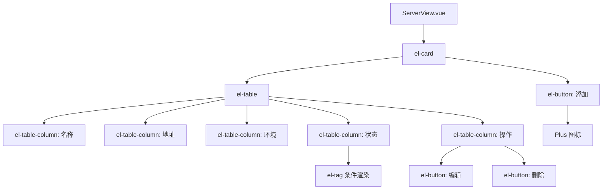

# UI组件库集成

<cite>
**本文档引用文件**  
- [main.ts](file://frontend/src/main.ts)
- [package.json](file://frontend/package.json)
- [vite.config.ts](file://frontend/vite.config.ts)
- [ServerView.vue](file://frontend/src/views/ServerView.vue)
</cite>

## 目录
1. [简介](#简介)
2. [项目结构](#项目结构)
3. [核心组件](#核心组件)
4. [架构概览](#架构概览)
5. [详细组件分析](#详细组件分析)
6. [依赖分析](#依赖分析)
7. [性能考虑](#性能考虑)
8. [故障排除指南](#故障排除指南)
9. [结论](#结论)

## 简介
本文档详细说明Element Plus UI组件库在前端项目中的集成与使用方式。涵盖全局注册、按需引入、实际用例展示、主题定制、国际化支持及无障碍访问策略，确保用户界面的一致性与良好的用户体验。

## 项目结构
前端项目位于`frontend`目录下，采用Vue 3 + TypeScript + Vite技术栈。核心源码位于`src`目录，包含视图组件、路由配置、状态管理及入口文件。UI组件库Element Plus通过`main.ts`全局引入，并在`package.json`中声明依赖。

**Section sources**
- [main.ts](file://frontend/src/main.ts#L1-L15)
- [package.json](file://frontend/package.json#L1-L30)

## 核心组件

Element Plus作为主要UI框架，提供丰富的组件如表格、表单、对话框、标签、按钮等，用于构建现代化的管理后台界面。其与Vue 3的组合式API无缝集成，支持TypeScript并具备良好的可访问性。

**Section sources**
- [main.ts](file://frontend/src/main.ts#L3-L6)
- [ServerView.vue](file://frontend/src/views/ServerView.vue#L1-L70)

## 架构概览

```mermaid
graph TB
subgraph "前端"
A[main.ts] --> B[App.vue]
B --> C[Router]
B --> D[Pinia]
A --> E[Element Plus]
F[ServerView.vue] --> E
G[LoginView.vue] --> E
H[DashboardView.vue] --> E
end
subgraph "构建工具"
I[vite.config.ts] --> J[Vite]
J --> K[Element Plus 按需引入]
end
E --> |样式| L[CSS Variables]
E --> |图标| M[@element-plus/icons-vue]
```

**Diagram sources**
- [main.ts](file://frontend/src/main.ts#L1-L15)
- [vite.config.ts](file://frontend/vite.config.ts#L1-L22)
- [package.json](file://frontend/package.json#L1-L30)

## 详细组件分析

### Element Plus 全局注册分析

在`main.ts`中，Element Plus通过`app.use(ElementPlus)`进行全局注册，使得所有组件无需局部导入即可在模板中使用。同时引入默认CSS样式与深色主题变量，实现开箱即用的视觉效果。

```ts
import ElementPlus from 'element-plus'
import 'element-plus/dist/index.css'
import 'element-plus/theme-chalk/dark/css-vars.css'
```

该方式简化了组件使用流程，但可能增加打包体积。适用于组件使用频率高、项目规模较大的场景。

**Section sources**
- [main.ts](file://frontend/src/main.ts#L3-L6)

### 依赖版本与按需引入配置

`package.json`中声明了Element Plus版本为`^2.4.4`，实际安装版本为`2.11.2`（由`package-lock.json`确定），确保功能完整性与安全性更新。同时依赖`@element-plus/icons-vue`用于图标组件。

当前`vite.config.ts`未配置按需引入插件（如`unplugin-vue-components`），所有组件通过全局引入方式加载。若需优化性能，可引入按需加载插件，仅打包实际使用的组件，减少bundle体积。

**Section sources**
- [package.json](file://frontend/package.json#L10-L15)
- [vite.config.ts](file://frontend/vite.config.ts#L1-L22)

### ServerView.vue 实际用例分析

`ServerView.vue`展示了Element Plus组件在真实业务场景中的使用方式：

- **el-table**：展示服务器列表，通过`:data`绑定响应式数据，使用`el-table-column`定义列。
- **作用域插槽**：在“状态”列中使用`#default="scope"`实现自定义渲染，结合`el-tag`展示状态标签。
- **操作列**：包含编辑与删除按钮，通过`@click`绑定事件处理函数。
- **el-card**：用于内容区域容器，提升视觉层次。
- **el-button**与**el-icon**：实现“添加服务器”按钮，图标使用`Plus`组件。

该组件展示了Element Plus在数据展示、交互操作、样式定制方面的灵活性。



**Diagram sources**
- [ServerView.vue](file://frontend/src/views/ServerView.vue#L1-L70)

**Section sources**
- [ServerView.vue](file://frontend/src/views/ServerView.vue#L1-L70)

## 依赖分析

```mermaid
graph LR
A[Vue 3] --> B[Element Plus]
B --> C[@element-plus/icons-vue]
B --> D[@ctrl/tinycolor]
B --> E[async-validator]
B --> F[dayjs]
B --> G[lodash]
H[Vite] --> I[unplugin-vue-components] -.-> B
```

Element Plus依赖多个工具库实现颜色处理、表单验证、日期格式化等功能。当前项目未使用按需引入插件，存在优化空间。

**Diagram sources**
- [package.json](file://frontend/package.json#L10-L15)
- [package-lock.json](file://frontend/package-lock.json#L1823-L1861)

**Section sources**
- [package.json](file://frontend/package.json#L1-L30)

## 性能考虑

- **全局引入**：当前采用全局引入方式，可能导致未使用组件被打包，增加初始加载时间。
- **优化建议**：引入`unplugin-vue-components`与`unplugin-auto-import`实现按需引入与自动导入，减少打包体积。
- **Tree-shaking**：确保构建工具正确配置以支持Tree-shaking，移除未使用代码。
- **懒加载**：对非首屏组件使用动态导入，提升首屏加载速度。

## 故障排除指南

- **组件未注册**：检查`main.ts`中是否正确调用`app.use(ElementPlus)`。
- **样式丢失**：确认是否引入`element-plus/dist/index.css`。
- **图标不显示**：确保安装`@element-plus/icons-vue`并在组件中正确导入图标。
- **TypeScript类型错误**：检查`env.d.ts`是否包含Element Plus类型声明。
- **深色主题失效**：确认引入了`dark/css-vars.css`且未被其他样式覆盖。

**Section sources**
- [main.ts](file://frontend/src/main.ts#L1-L15)
- [ServerView.vue](file://frontend/src/views/ServerView.vue#L1-L70)

## 结论

Element Plus在本项目中通过全局注册方式集成，提供了丰富的UI组件支持。`ServerView.vue`展示了其在表格展示、状态渲染、操作交互方面的实际应用。建议未来引入按需引入机制以优化性能，并统一主题与国际化配置，提升整体用户体验与可维护性。