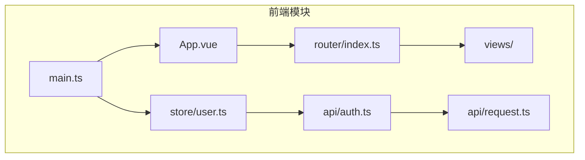
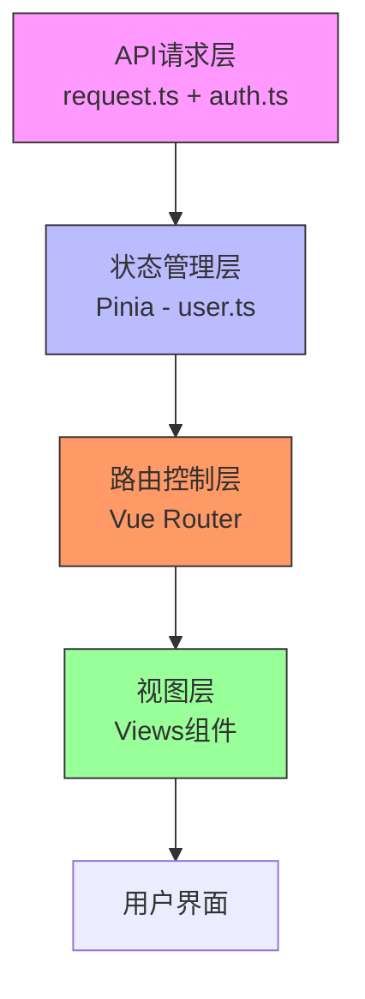
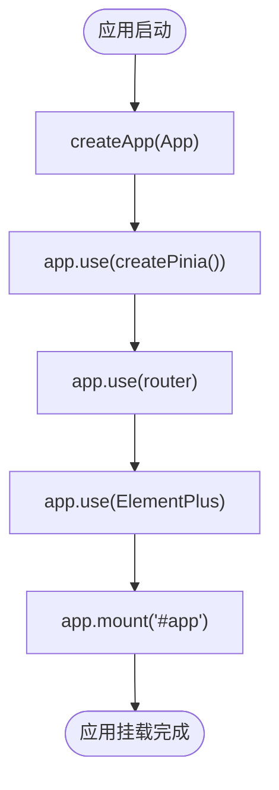
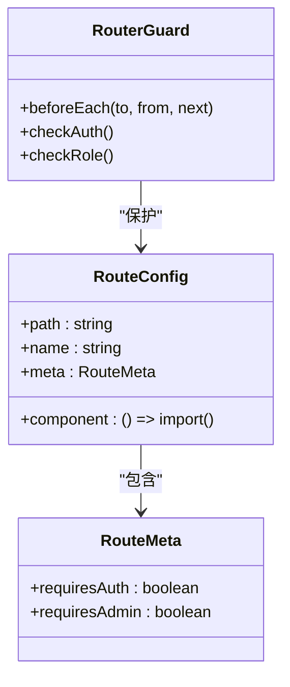
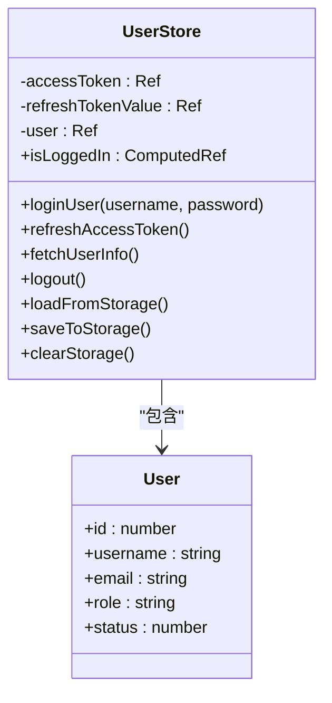
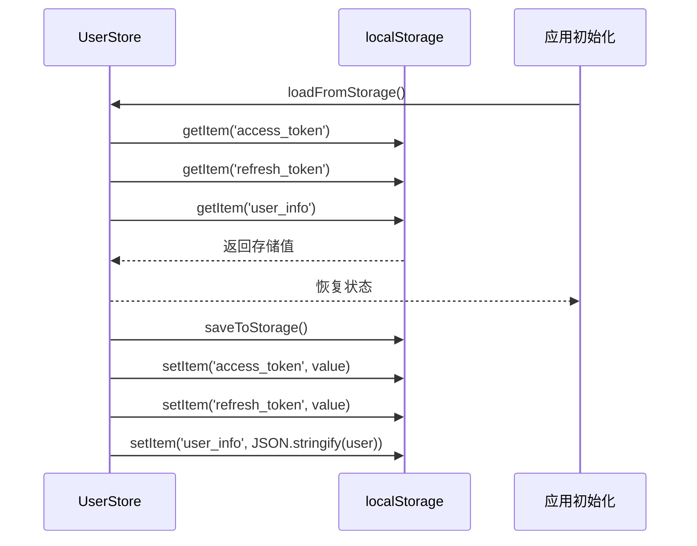
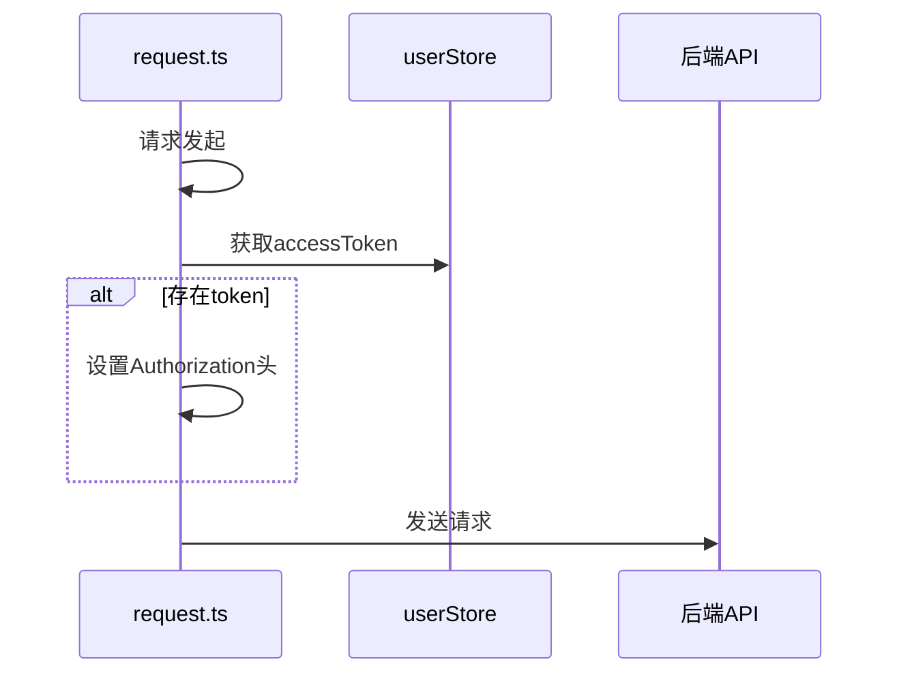
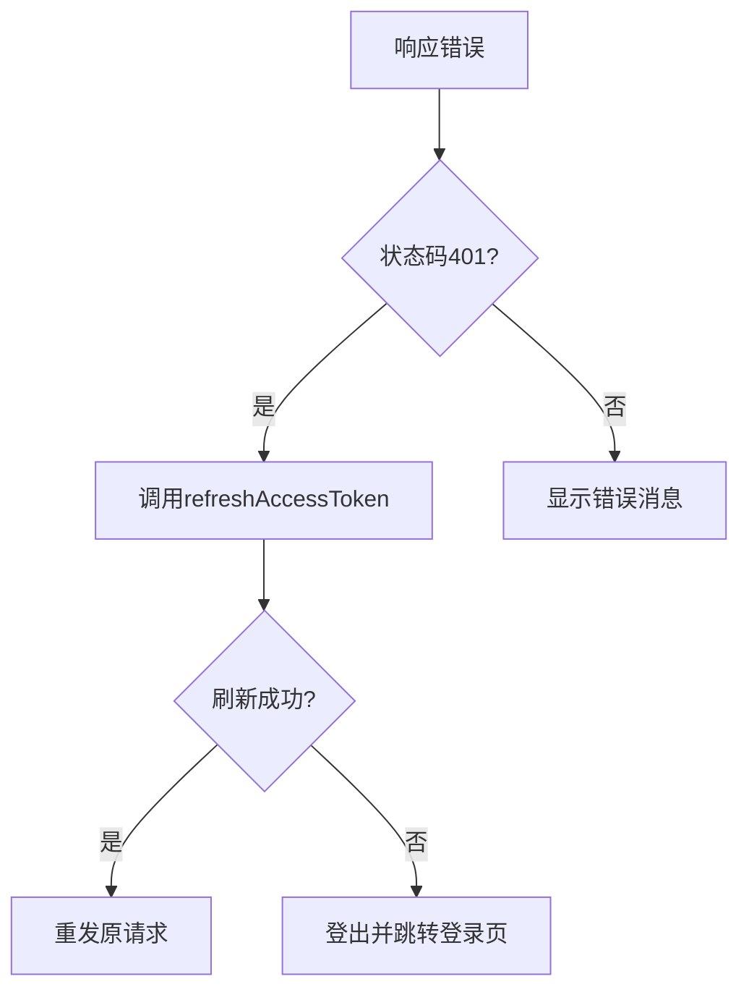
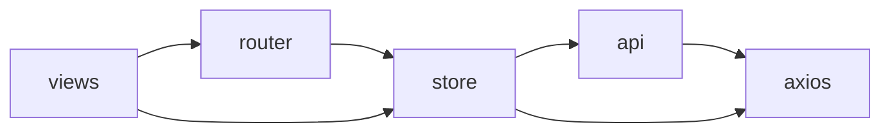

# 前端架构设计

<cite>
**本文档引用的文件**  
- [main.ts](file://frontend/src/main.ts)
- [App.vue](file://frontend/src/App.vue)
- [router/index.ts](file://frontend/src/router/index.ts)
- [store/user.ts](file://frontend/src/store/user.ts)
- [api/auth.ts](file://frontend/src/api/auth.ts)
- [api/request.ts](file://frontend/src/api/request.ts)
</cite>

## 目录
1. [简介](#简介)
2. [项目结构](#项目结构)
3. [核心组件](#核心组件)
4. [架构概览](#架构概览)
5. [详细组件分析](#详细组件分析)
6. [依赖分析](#依赖分析)
7. [性能考虑](#性能考虑)
8. [故障排除指南](#故障排除指南)
9. [结论](#结论)

## 简介
本文档深入解析qoder项目的前端架构，重点阐述基于Vue3、Composition API与TypeScript的技术实现机制。涵盖应用初始化流程、路由配置策略、状态管理方案、API请求封装以及组件通信模式等关键设计，旨在为开发者提供全面的技术参考与最佳实践指导。

## 项目结构
qoder前端项目采用模块化组织方式，核心代码位于`frontend/src`目录下，主要分为以下几个模块：
- `api`：封装与后端交互的请求逻辑
- `router`：定义应用的路由规则与导航守卫
- `store`：使用Pinia进行全局状态管理
- `views`：存放页面级组件
- 根目录包含`main.ts`（入口文件）和`App.vue`（根组件）

该结构清晰分离关注点，便于维护和扩展。

**图示来源**  
- [main.ts](file://frontend/src/main.ts#L1-L15)
- [App.vue](file://frontend/src/App.vue#L1-L18)
- [router/index.ts](file://frontend/src/router/index.ts#L1-L64)

**本节来源**  
- [main.ts](file://frontend/src/main.ts#L1-L15)
- [App.vue](file://frontend/src/App.vue#L1-L18)

## 核心组件
前端核心由Vue3驱动，采用Composition API与TypeScript构建类型安全的应用。`main.ts`完成应用实例化并集成Pinia状态管理与Vue Router；`App.vue`作为唯一根组件，通过`<router-view />`实现动态页面渲染；`router/index.ts`定义了基于角色权限的路由访问控制策略。

**本节来源**  
- [main.ts](file://frontend/src/main.ts#L1-L15)
- [App.vue](file://frontend/src/App.vue#L1-L18)
- [router/index.ts](file://frontend/src/router/index.ts#L1-L64)

## 架构概览
整体前端架构采用分层设计，自底向上分别为：API请求层、状态管理层、路由控制层、视图展示层。

**图示来源**  
- [api/request.ts](file://frontend/src/api/request.ts#L1-L68)
- [store/user.ts](file://frontend/src/store/user.ts#L1-L114)
- [router/index.ts](file://frontend/src/router/index.ts#L1-L64)

## 详细组件分析

### 应用初始化流程分析
`main.ts`是应用的入口点，负责创建Vue实例并挂载核心插件。

**图示来源**  
- [main.ts](file://frontend/src/main.ts#L1-L15)

**本节来源**  
- [main.ts](file://frontend/src/main.ts#L1-L15)

### 根组件结构分析
`App.vue`采用`<script setup>`语法糖，结构简洁，仅包含一个`
`容器包裹`<router-view />`，实现单页应用的视图切换。

**本节来源**  
- [App.vue](file://frontend/src/App.vue#L1-L18)

### 路由配置策略分析
路由系统基于Vue Router 4，采用动态导入实现懒加载，并通过`meta`字段实现权限控制。

**图示来源**  
- [router/index.ts](file://frontend/src/router/index.ts#L1-L64)

**本节来源**  
- [router/index.ts](file://frontend/src/router/index.ts#L1-L64)

### Pinia状态管理分析
`user.ts`中定义的`useUserStore`使用Pinia实现用户状态管理，包含登录状态、用户信息及令牌持久化。

#### 状态定义与动作封装

**图示来源**  
- [store/user.ts](file://frontend/src/store/user.ts#L1-L114)

#### 持久化处理流程

**图示来源**  
- [store/user.ts](file://frontend/src/store/user.ts#L1-L114)

**本节来源**  
- [store/user.ts](file://frontend/src/store/user.ts#L1-L114)

### API请求封装分析
`api`目录下通过`request.ts`和`auth.ts`实现统一的HTTP请求处理。

#### 请求拦截与JWT注入

**图示来源**  
- [api/request.ts](file://frontend/src/api/request.ts#L1-L68)

#### 错误处理与自动刷新

**图示来源**  
- [api/request.ts](file://frontend/src/api/request.ts#L1-L68)

#### 接口定义与类型安全
`auth.ts`文件导出多个类型接口（如`LoginRequest`、`LoginResponse`），并通过泛型约束Axios请求返回类型，确保全程类型安全。

**本节来源**  
- [api/auth.ts](file://frontend/src/api/auth.ts#L1-L52)
- [api/request.ts](file://frontend/src/api/request.ts#L1-L68)

## 依赖分析
前端模块间存在明确的依赖关系，形成自上而下的调用链。

**图示来源**  
- [router/index.ts](file://frontend/src/router/index.ts#L1-L64)
- [store/user.ts](file://frontend/src/store/user.ts#L1-L114)
- [api/auth.ts](file://frontend/src/api/auth.ts#L1-L52)

**本节来源**  
- [router/index.ts](file://frontend/src/router/index.ts#L1-L64)
- [store/user.ts](file://frontend/src/store/user.ts#L1-L114)
- [api/auth.ts](file://frontend/src/api/auth.ts#L1-L52)

## 性能考虑
- 路由懒加载减少初始包体积
- Pinia状态持久化避免重复请求用户信息
- 请求超时设置防止长时间等待
- 响应拦截统一处理错误，提升用户体验

## 故障排除指南
- **页面空白**：检查`main.ts`中`app.mount('#app')`是否正确执行
- **路由不生效**：确认`App.vue`中存在`<router-view />`
- **状态丢失**：验证`localStorage`读写逻辑是否正常
- **请求401循环**：检查`refreshToken`接口是否返回新令牌
- **类型错误**：确保TS接口定义与后端返回数据结构一致

**本节来源**  
- [main.ts](file://frontend/src/main.ts#L1-L15)
- [App.vue](file://frontend/src/App.vue#L1-L18)
- [store/user.ts](file://frontend/src/store/user.ts#L1-L114)
- [api/request.ts](file://frontend/src/api/request.ts#L1-L68)

## 结论
qoder前端架构设计合理，技术选型先进，具备良好的可维护性与扩展性。通过Vue3 + TypeScript + Pinia + Vue Router的组合，实现了类型安全、状态可控、路由灵活的现代化前端应用。建议持续优化错误处理机制，并增加单元测试覆盖率以保障代码质量。