# 前端组件结构

<cite>
**本文档中引用的文件**  
- [App.vue](file://frontend/src/App.vue)
- [main.ts](file://frontend/src/main.ts)
- [user.ts](file://frontend/src/store/user.ts)
- [LoginView.vue](file://frontend/src/views/LoginView.vue)
- [DashboardView.vue](file://frontend/src/views/DashboardView.vue)
- [router/index.ts](file://frontend/src/router/index.ts)
</cite>

## 目录
1. [项目结构](#项目结构)
2. [根组件与全局状态管理](#根组件与全局状态管理)
3. [视图组件分析](#视图组件分析)
4. [组件通信机制](#组件通信机制)
5. [生命周期与数据加载](#生命周期与数据加载)
6. [组件复用实践](#组件复用实践)

## 项目结构

qoder前端项目采用标准的Vue3 + TypeScript + Vite架构，主要目录结构如下：

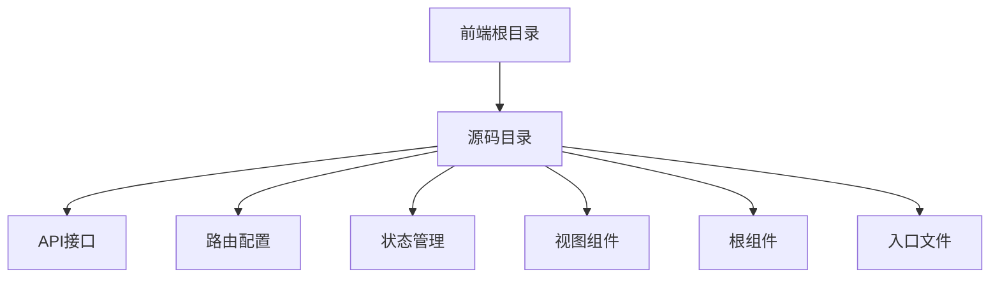

**Diagram sources**  
- [App.vue](file://frontend/src/App.vue#L1-L18)
- [main.ts](file://frontend/src/main.ts#L1-L15)

**Section sources**  
- [App.vue](file://frontend/src/App.vue#L1-L18)
- [main.ts](file://frontend/src/main.ts#L1-L15)

## 根组件与全局状态管理

### App.vue布局结构

`App.vue`作为应用的根组件，采用简洁的布局设计，仅包含一个`router-view`占位符，用于渲染当前路由对应的视图组件。

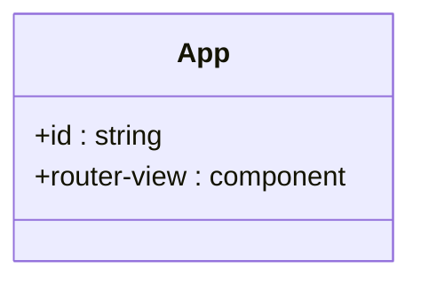

**Diagram sources**  
- [App.vue](file://frontend/src/App.vue#L1-L18)

**Section sources**  
- [App.vue](file://frontend/src/App.vue#L1-L18)

### 全局状态监听机制

通过Pinia实现全局状态管理，`main.ts`中初始化Pinia实例并挂载到Vue应用，实现跨组件状态共享。

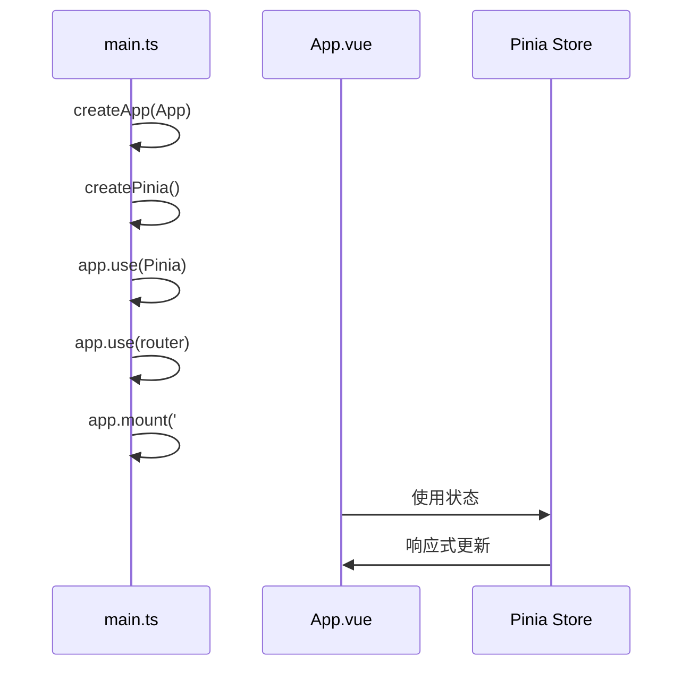

**Diagram sources**  
- [main.ts](file://frontend/src/main.ts#L1-L15)
- [App.vue](file://frontend/src/App.vue#L1-L18)

**Section sources**  
- [main.ts](file://frontend/src/main.ts#L1-L15)

## 视图组件分析

### LoginView组件

登录视图组件采用Element Plus表单组件，实现用户登录功能，包含表单验证、状态管理和路由跳转。

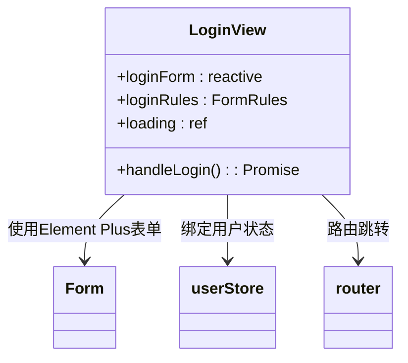

**Diagram sources**  
- [LoginView.vue](file://frontend/src/views/LoginView.vue#L1-L139)
- [user.ts](file://frontend/src/store/user.ts#L1-L114)

**Section sources**  
- [LoginView.vue](file://frontend/src/views/LoginView.vue#L1-L139)

### DashboardView组件

仪表盘视图组件展示系统监控数据，包含统计卡片、时间线和菜单导航，实现数据自动刷新和用户交互。

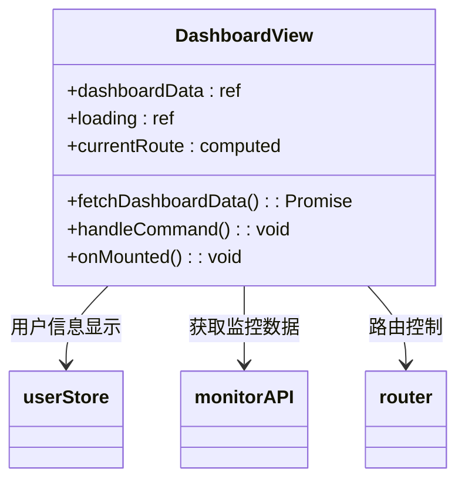

**Diagram sources**  
- [DashboardView.vue](file://frontend/src/views/DashboardView.vue#L1-L358)
- [user.ts](file://frontend/src/store/user.ts#L1-L114)

**Section sources**  
- [DashboardView.vue](file://frontend/src/views/DashboardView.vue#L1-L358)

## 组件通信机制

### Props传递与Emit事件

组件间通过props向下传递数据，通过emit向上发送事件，实现父子组件通信。

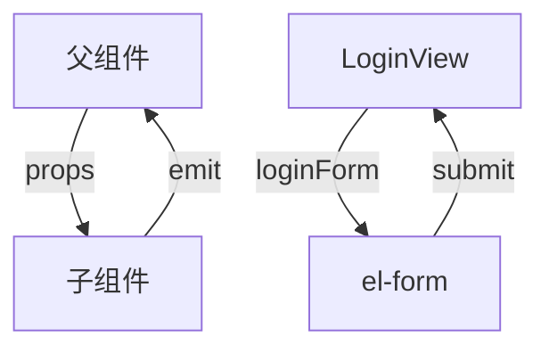

**Section sources**  
- [LoginView.vue](file://frontend/src/views/LoginView.vue#L1-L139)

### Provide/Inject跨层级通信

通过provide/inject实现跨层级组件通信，避免props逐层传递。

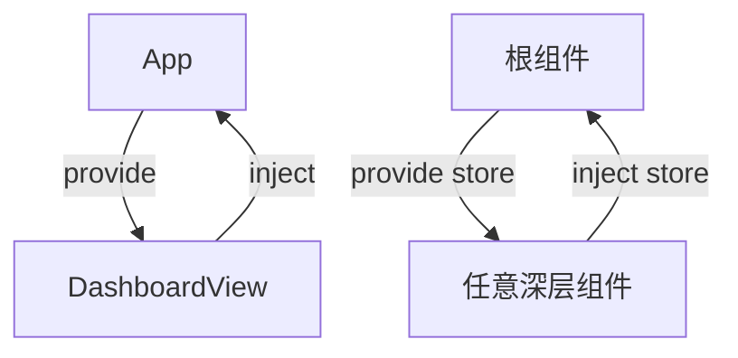

**Section sources**  
- [main.ts](file://frontend/src/main.ts#L1-L15)
- [DashboardView.vue](file://frontend/src/views/DashboardView.vue#L1-L358)

## 生命周期与数据加载

### 生命周期管理

组件使用Composition API的生命周期钩子，如`onMounted`进行数据初始化。

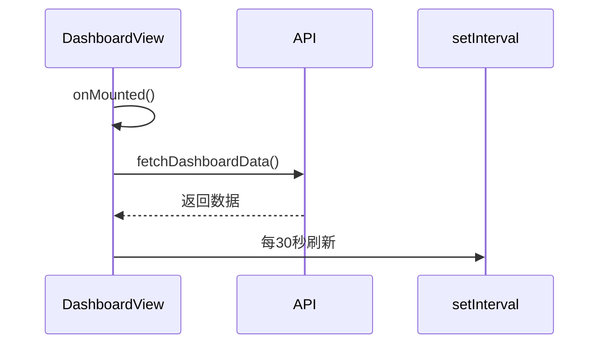

**Section sources**  
- [DashboardView.vue](file://frontend/src/views/DashboardView.vue#L179-L260)

### 异步数据加载策略

采用异步函数处理API请求，结合loading状态提供用户体验反馈。

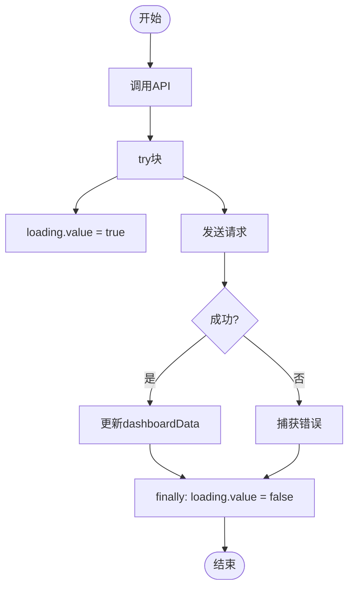

**Section sources**  
- [DashboardView.vue](file://frontend/src/views/DashboardView.vue#L129-L184)

### 错误边界处理

通过try-catch捕获异步操作异常，使用Element Plus消息组件提供用户反馈。

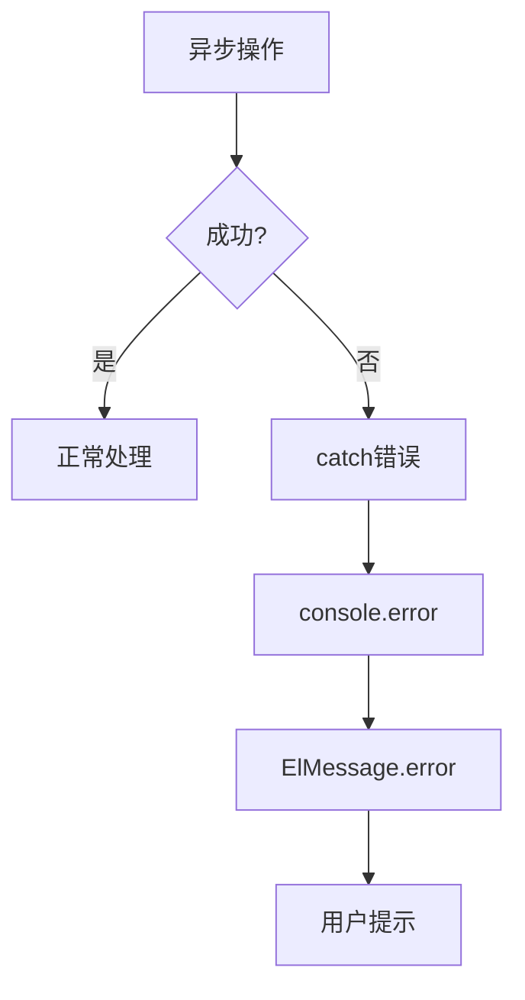

**Section sources**  
- [LoginView.vue](file://frontend/src/views/LoginView.vue#L58-L139)
- [DashboardView.vue](file://frontend/src/views/DashboardView.vue#L129-L184)

## 组件复用实践

### 表单组件封装

LoginView中的表单组件展示了Element Plus表单的封装实践，包含验证规则和状态管理。

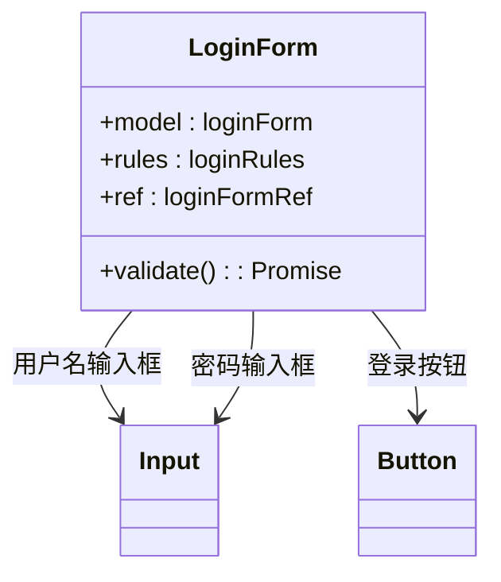

**Section sources**  
- [LoginView.vue](file://frontend/src/views/LoginView.vue#L1-L139)

### 表格组件封装

ServerView中的表格组件展示了数据展示和操作的封装模式，包含增删改查操作。

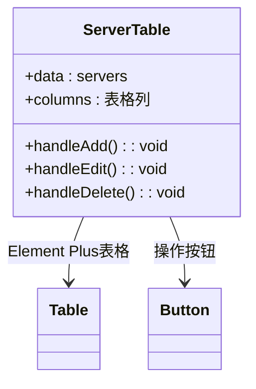

**Section sources**  
- [ServerView.vue](file://frontend/src/views/ServerView.vue#L35-L69)