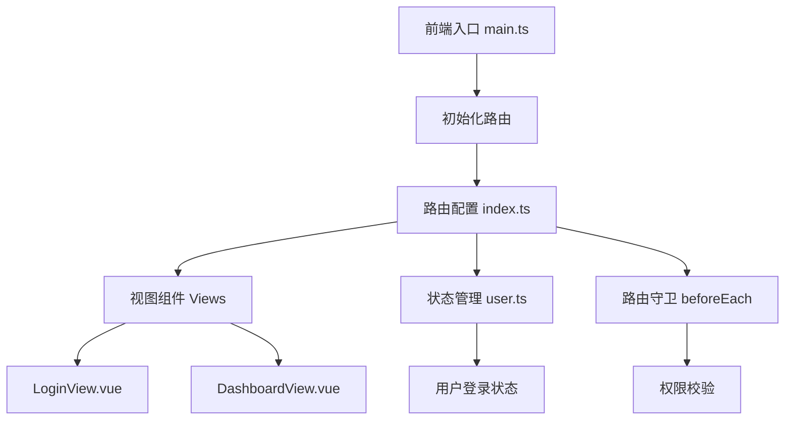
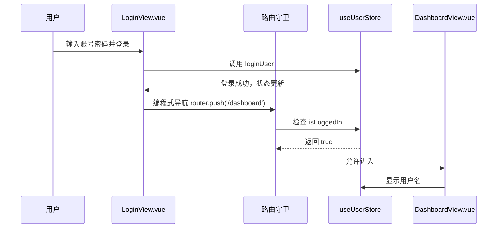
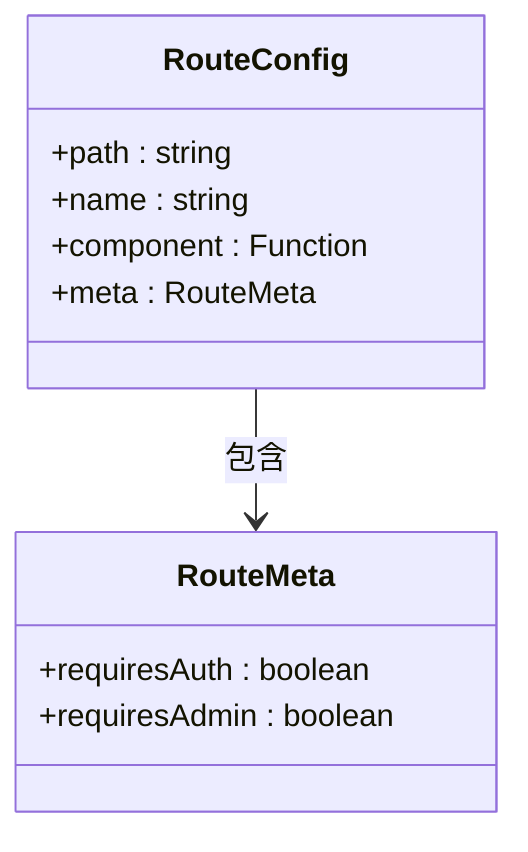
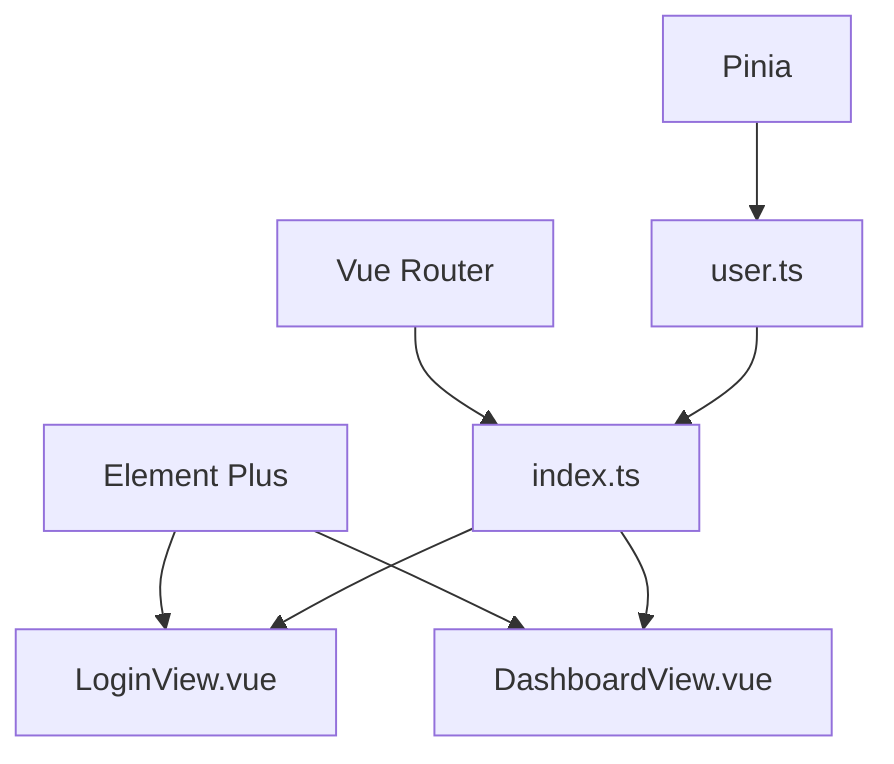

# 前端路由配置

<cite>
**本文档引用的文件**  
- [index.ts](file://frontend/src/router/index.ts)
- [user.ts](file://frontend/src/store/user.ts)
- [LoginView.vue](file://frontend/src/views/LoginView.vue)
- [DashboardView.vue](file://frontend/src/views/DashboardView.vue)
</cite>

## 目录
1. [项目结构](#项目结构)
2. [核心组件](#核心组件)
3. [架构概述](#架构概述)
4. [详细组件分析](#详细组件分析)
5. [依赖分析](#依赖分析)
6. [性能考虑](#性能考虑)
7. [故障排除指南](#故障排除指南)
8. [结论](#结论)

## 项目结构

前端路由系统位于 `frontend/src/router/index.ts`，是整个前端导航的核心。路由配置与视图组件（位于 `frontend/src/views/`）和状态管理（Pinia store）紧密协作，实现权限控制、懒加载和动态导航。



**图示来源**  
- [index.ts](file://frontend/src/router/index.ts#L1-L64)
- [main.ts](file://frontend/src/main.ts#L1-L15)

**本节来源**  
- [index.ts](file://frontend/src/router/index.ts#L1-L64)
- [main.ts](file://frontend/src/main.ts#L1-L15)

## 核心组件

前端路由系统基于 Vue Router 实现，通过 `createRouter` 和 `createWebHistory` 创建路由实例。路由表声明在 `routes` 数组中，采用动态导入（`() => import()`）实现路由懒加载，提升应用初始加载性能。

路由守卫 `beforeEach` 用于实现权限控制逻辑，结合 Pinia 的 `useUserStore` 进行用户状态判断，决定是否允许导航。`meta` 字段用于携带路由元信息，如 `requiresAuth` 和 `requiresAdmin`，作为权限校验的依据。

**本节来源**  
- [index.ts](file://frontend/src/router/index.ts#L1-L64)
- [user.ts](file://frontend/src/store/user.ts#L1-L114)

## 架构概述

系统采用模块化设计，路由、视图、状态三者分离又紧密协作。用户通过视图触发操作，路由负责页面跳转，状态管理存储用户登录信息，路由守卫根据状态决定跳转权限。



**图示来源**  
- [index.ts](file://frontend/src/router/index.ts#L50-L64)
- [LoginView.vue](file://frontend/src/views/LoginView.vue#L58-L139)
- [DashboardView.vue](file://frontend/src/views/DashboardView.vue#L179-L260)
- [user.ts](file://frontend/src/store/user.ts#L50-L80)

## 详细组件分析

### 路由表声明与动态配置

路由表通过 `routes` 数组声明，每个路由对象包含 `path`、`name`、`component` 和 `meta` 字段。`component` 使用动态导入语法，实现按需加载，减少初始包体积。

`meta` 字段是实现权限控制和页面配置的关键。例如，`/users` 路由设置了 `requiresAdmin: true`，表示仅管理员可访问。`/login` 路由设置 `requiresAuth: false`，表示无需登录即可访问。

#### 路由表结构


**图示来源**  
- [index.ts](file://frontend/src/router/index.ts#L10-L64)

**本节来源**  
- [index.ts](file://frontend/src/router/index.ts#L1-L64)

### 路由守卫与权限控制

`beforeEach` 守卫是权限控制的核心。它在每次路由跳转前执行，根据 `to.meta` 和 `userStore` 的状态决定跳转逻辑：

1. 若目标页需要认证但用户未登录，则重定向到 `/login`
2. 若目标页需要管理员权限但用户非管理员，则重定向到 `/dashboard`
3. 若用户已登录但访问 `/login`，则重定向到 `/dashboard`
4. 其他情况允许通行

该机制确保了未授权访问被有效拦截，同时避免已登录用户重复登录。

**本节来源**  
- [index.ts](file://frontend/src/router/index.ts#L50-L64)
- [user.ts](file://frontend/src/store/user.ts#L15-L25)

### 登录与仪表盘跳转流程

`LoginView` 中用户提交表单后，调用 `userStore.loginUser` 进行登录。登录成功后，通过 `router.push('/dashboard')` 进行编程式导航。

`DashboardView` 作为主页面，其侧边栏菜单通过 `el-menu` 的 `router` 属性实现与路由的联动。菜单项的 `index` 属性对应路由路径，点击即触发导航。

#### 登录跳转流程
```mermaid
flowchart TD
A[用户访问任意页面] --> B{是否需要认证?}
B --> |否| C[直接进入]
B --> |是| D{是否已登录?}
D --> |否| E[重定向到 /login]
D --> |是| F[进入目标页面]
E --> G[用户输入凭证]
G --> H[调用 loginUser]
H --> I{登录成功?}
I --> |是| J[更新 userStore 状态]
J --> K[router.push('/dashboard')]
K --> L[进入 DashboardView]
I --> |否| M[显示错误信息]
```

**图示来源**  
- [LoginView.vue](file://frontend/src/views/LoginView.vue#L58-L139)
- [index.ts](file://frontend/src/router/index.ts#L50-L64)

**本节来源**  
- [LoginView.vue](file://frontend/src/views/LoginView.vue#L1-L139)
- [DashboardView.vue](file://frontend/src/views/DashboardView.vue#L1-L358)

### 路由与 Pinia 状态联动

路由守卫与 Pinia 的 `useUserStore` 紧密联动。`userStore` 通过 `isLoggedIn` 计算属性暴露登录状态，并在登录、登出时同步更新 `localStorage`。

路由守卫通过 `useUserStore()` 获取当前用户状态，实现动态权限判断。这种设计将状态管理与路由控制分离，提高了代码的可维护性和可测试性。

**本节来源**  
- [user.ts](file://frontend/src/store/user.ts#L1-L114)
- [index.ts](file://frontend/src/router/index.ts#L50-L64)

## 依赖分析

前端路由系统依赖于 Vue Router、Pinia 和 Element Plus 等核心库。路由配置依赖于视图组件的存在，权限控制依赖于用户状态 store。



**图示来源**  
- [index.ts](file://frontend/src/router/index.ts#L1-L64)
- [user.ts](file://frontend/src/store/user.ts#L1-L114)
- [LoginView.vue](file://frontend/src/views/LoginView.vue#L1-L139)
- [DashboardView.vue](file://frontend/src/views/DashboardView.vue#L1-L358)

**本节来源**  
- [index.ts](file://frontend/src/router/index.ts#L1-L64)
- [user.ts](file://frontend/src/store/user.ts#L1-L114)

## 性能考虑

- **路由懒加载**：所有视图组件均采用动态导入，实现代码分割，优化首屏加载时间。
- **状态持久化**：用户登录状态通过 `localStorage` 持久化，避免页面刷新后重新登录。
- **定时刷新**：`DashboardView` 每 30 秒自动刷新数据，保持信息实时性，但需注意对服务器的压力。

## 故障排除指南

- **无法跳转到目标页面**：检查 `meta` 权限设置与用户角色是否匹配。
- **登录后仍被重定向到登录页**：检查 `userStore.isLoggedIn` 计算属性是否正确响应状态变化。
- **菜单无法高亮**：确保 `el-menu` 的 `default-active` 绑定到当前路由路径。
- **状态未持久化**：检查 `localStorage` 的读写逻辑，确保 `loadFromStorage` 在 store 初始化时调用。

**本节来源**  
- [index.ts](file://frontend/src/router/index.ts#L50-L64)
- [user.ts](file://frontend/src/store/user.ts#L27-L48)
- [DashboardView.vue](file://frontend/src/views/DashboardView.vue#L129-L184)

## 结论

本系统通过 Vue Router 实现了完整的前端路由功能，结合 Pinia 状态管理实现了精细化的权限控制。路由懒加载优化了性能，编程式导航和嵌套路由支持了复杂的用户交互。整体设计清晰、可维护性强，为自动化运维平台提供了可靠的导航基础。