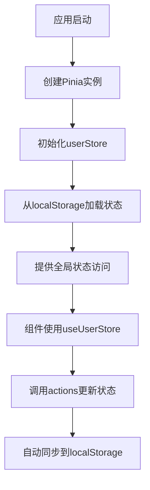
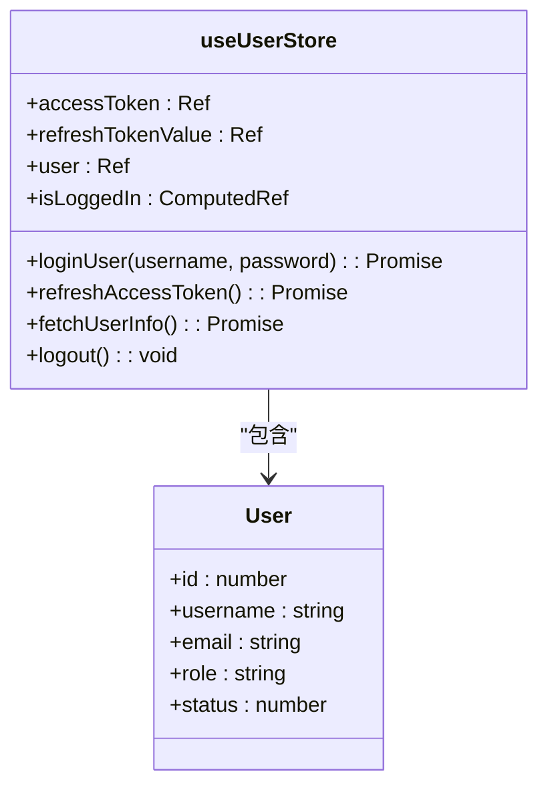
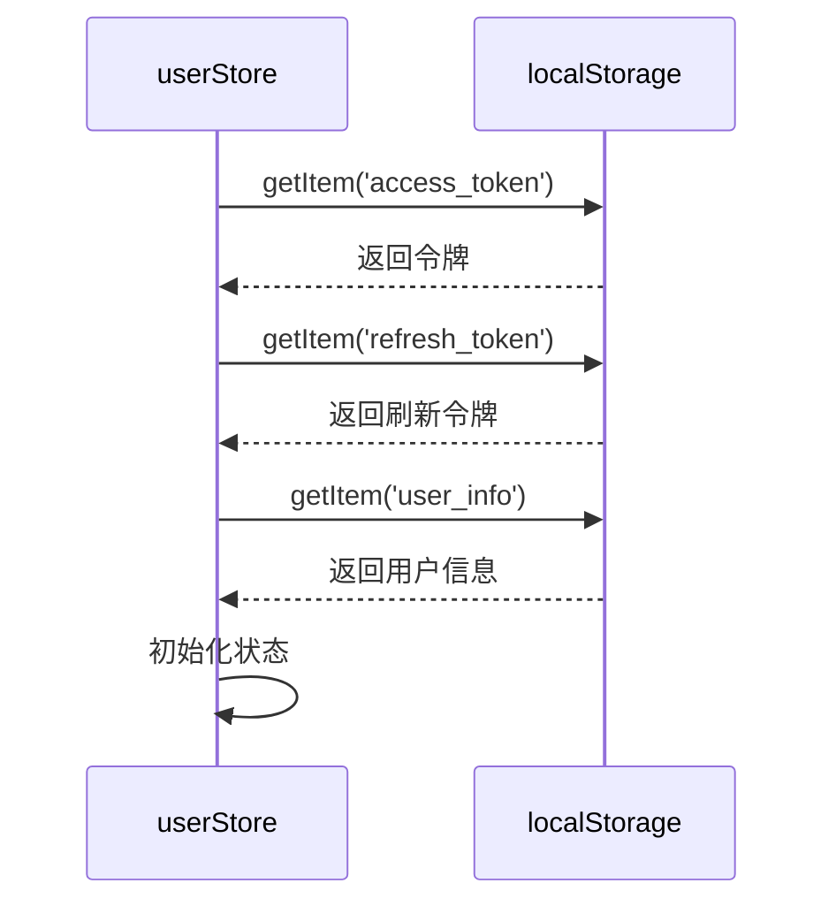
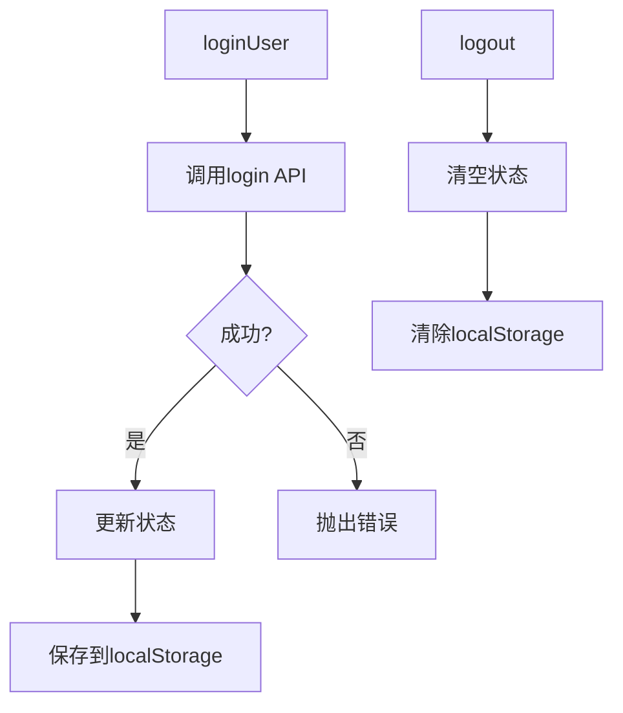
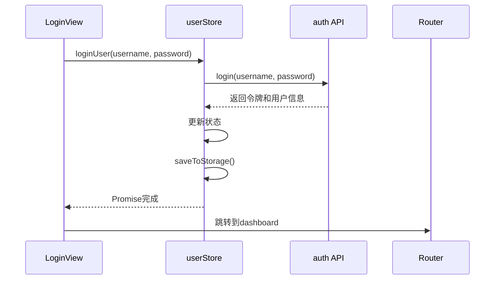
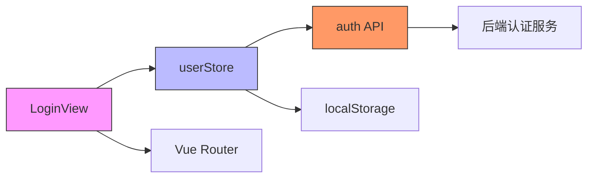

# 状态管理（Pinia）

<cite>
**本文档引用的文件**
- [user.ts](file://frontend/src/store/user.ts)
- [LoginView.vue](file://frontend/src/views/LoginView.vue)
- [auth.ts](file://frontend/src/api/auth.ts)
- [main.ts](file://frontend/src/main.ts)
</cite>

## 目录
1. [简介](#简介)
2. [项目结构](#项目结构)
3. [核心组件](#核心组件)
4. [架构概览](#架构概览)
5. [详细组件分析](#详细组件分析)
6. [依赖分析](#依赖分析)
7. [性能考虑](#性能考虑)
8. [故障排除指南](#故障排除指南)
9. [结论](#结论)

## 简介
本文档全面解析Pinia在qoder项目中的状态管理应用，重点分析用户登录状态的管理机制。涵盖`user.ts`中定义的store结构、`LoginView.vue`中的使用方式、持久化策略以及API调用的最佳实践。

## 项目结构
qoder项目采用前后端分离架构，前端使用Vue 3 + Pinia构建，状态管理集中于`frontend/src/store`目录。用户状态管理模块位于`user.ts`，通过Pinia实现响应式状态管理与持久化。

```mermaid
graph TB
subgraph "前端"
Store[store/user.ts]
View[views/LoginView.vue]
API[api/auth.ts]
end
subgraph "后端"
AuthAPI[/auth/login]
ProfileAPI[/auth/profile]
end
View --> Store
Store --> API
API --> AuthAPI
API --> ProfileAPI
```

**图示来源**
- [user.ts](file://frontend/src/store/user.ts#L1-L114)
- [LoginView.vue](file://frontend/src/views/LoginView.vue#L1-L140)
- [auth.ts](file://frontend/src/api/auth.ts#L1-L53)

**本节来源**
- [user.ts](file://frontend/src/store/user.ts#L1-L114)
- [LoginView.vue](file://frontend/src/views/LoginView.vue#L1-L140)

## 核心组件
`user.ts`中定义的`useUserStore`是用户状态管理的核心，包含登录状态、用户信息、令牌管理等关键字段，并通过actions实现登录、登出、信息更新等操作。

**本节来源**
- [user.ts](file://frontend/src/store/user.ts#L1-L114)

## 架构概览
系统采用Pinia作为状态管理库，在应用启动时通过`createPinia()`初始化。用户状态存储在store中，并通过localStorage实现持久化，确保页面刷新后状态不丢失。



**图示来源**
- [main.ts](file://frontend/src/main.ts#L1-L15)
- [user.ts](file://frontend/src/store/user.ts#L1-L114)

## 详细组件分析

### 用户Store分析
`useUserStore`使用Pinia的setup语法定义，包含state、getters和actions三部分。

#### 状态与计算属性
store中定义了三个响应式状态：`accessToken`、`refreshTokenValue`和`user`对象。通过`isLoggedIn`计算属性判断用户是否已登录。



**图示来源**
- [user.ts](file://frontend/src/store/user.ts#L10-L25)

#### 持久化机制
通过`loadFromStorage`和`saveToStorage`方法实现状态与localStorage的双向同步，在store初始化时自动加载持久化数据。



**图示来源**
- [user.ts](file://frontend/src/store/user.ts#L19-L48)

#### Actions方法分析
actions封装了用户相关的异步操作，包括登录、刷新令牌、获取用户信息和登出。



**图示来源**
- [user.ts](file://frontend/src/store/user.ts#L50-L110)
- [auth.ts](file://frontend/src/api/auth.ts#L1-L53)

### LoginView组件分析
`LoginView.vue`使用setup语法通过`useUserStore()`获取store实例，并在登录表单提交时调用`loginUser` action。



**图示来源**
- [LoginView.vue](file://frontend/src/views/LoginView.vue#L56-L139)
- [user.ts](file://frontend/src/store/user.ts#L70-L85)

**本节来源**
- [user.ts](file://frontend/src/store/user.ts#L1-L114)
- [LoginView.vue](file://frontend/src/views/LoginView.vue#L1-L140)

## 依赖分析
用户状态管理模块依赖多个关键文件，形成完整的认证流程。



**图示来源**
- [user.ts](file://frontend/src/store/user.ts#L3-L4)
- [LoginView.vue](file://frontend/src/views/LoginView.vue#L56)
- [auth.ts](file://frontend/src/api/auth.ts#L1-L53)

**本节来源**
- [user.ts](file://frontend/src/store/user.ts#L1-L114)
- [LoginView.vue](file://frontend/src/views/LoginView.vue#L1-L140)
- [auth.ts](file://frontend/src/api/auth.ts#L1-L53)

## 性能考虑
- 状态持久化减少了页面刷新后的重复登录
- 使用ref和computed确保响应式更新的高效性
- 错误处理避免了应用崩溃
- API调用封装提高了代码复用性

## 故障排除指南
- **登录状态丢失**：检查localStorage中`access_token`等键值是否存在
- **自动登录失败**：确认`loadFromStorage`在store初始化时被调用
- **API调用错误**：检查网络请求和后端服务状态
- **状态不更新**：确认使用了ref包装响应式数据

**本节来源**
- [user.ts](file://frontend/src/store/user.ts#L19-L48)
- [LoginView.vue](file://frontend/src/views/LoginView.vue#L120-L135)

## 结论
qoder项目通过Pinia实现了高效、可靠的用户状态管理。采用setup语法使store定义更加直观，结合localStorage持久化确保了用户体验的连续性。API调用封装在actions中，提供了统一的错误处理机制，是Vue 3应用状态管理的良好实践。