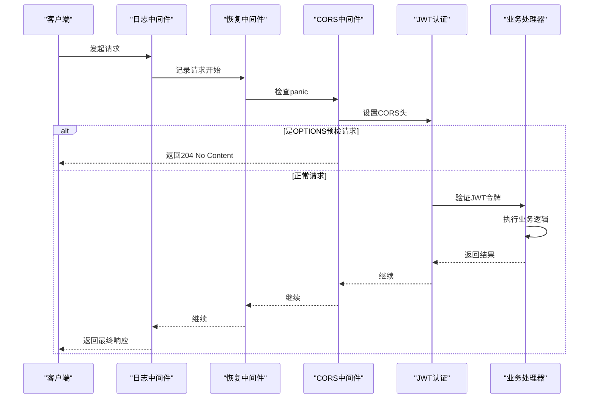
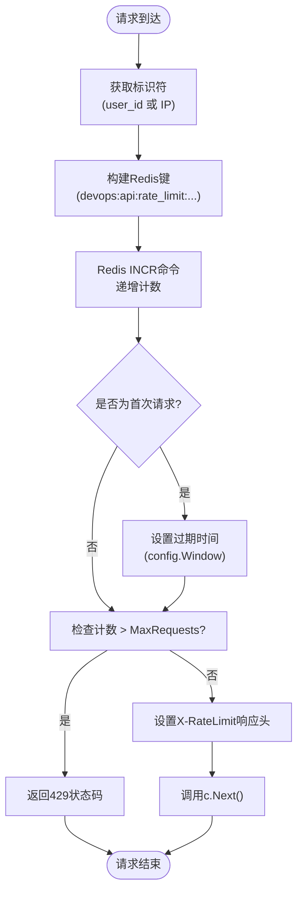

# 中间件机制

<cite>
**本文档引用的文件**  
- [middleware.go](file://backend/internal/middleware/middleware.go)
- [ratelimit.go](file://backend/internal/middleware/ratelimit.go)
- [router.go](file://backend/internal/api/router.go)
- [app.go](file://backend/internal/app/app.go)
- [server_manager.go](file://backend/internal/app/server_manager.go)
- [config.go](file://backend/internal/config/config.go)
- [cache.go](file://backend/pkg/cache/cache.go)
- [jwt.go](file://backend/internal/auth/jwt.go)
</cite>

## 目录
1. [引言](#引言)
2. [中间件注册顺序与执行流程](#中间件注册顺序与执行流程)
3. [基于Redis的分布式限流实现](#基于redis的分布式限流实现)
4. [路由组中间件绑定机制](#路由组中间件绑定机制)
5. [自定义中间件开发指南](#自定义中间件开发指南)
6. [限流失效原因与调优策略](#限流失效原因与调优策略)
7. [结论](#结论)

## 引言
qoder系统采用Gin框架构建，其核心功能之一是灵活的中间件机制。该机制不仅保障了系统的安全性、可观测性和稳定性，还通过模块化设计实现了功能解耦。本文档深入解析系统中的中间件体系，重点分析通用中间件的执行顺序、基于Redis的分布式限流算法实现、路由级中间件绑定方式，并提供自定义中间件开发的最佳实践。

## 中间件注册顺序与执行流程

在qoder系统中，中间件的注册顺序直接影响其执行流程和系统行为。全局中间件在`router.go`中通过`router.Use()`方法注册，其执行顺序遵循“先进先出”原则，即先注册的中间件先执行。

系统注册了三个核心全局中间件：
1. **日志记录（gin.Logger）**：作为第一个执行的中间件，负责记录所有HTTP请求的详细信息，包括请求方法、路径、状态码和耗时，为系统监控和问题排查提供基础数据。
2. **错误恢复（gin.Recovery）**：紧随日志中间件之后，用于捕获并处理在后续中间件或处理器中发生的任何panic，防止程序崩溃，并返回500错误响应，保证服务的稳定性。
3. **CORS处理（middleware.CORS）**：负责处理跨域资源共享请求。它设置了一系列响应头，允许指定的源、方法和头部进行跨域访问，并对预检请求（OPTIONS）直接返回204状态码，避免其进入后续处理流程。



**图示来源**
- [router.go](file://backend/internal/api/router.go#L15-L18)
- [middleware.go](file://backend/internal/middleware/middleware.go#L6-L33)

**本节来源**
- [router.go](file://backend/internal/api/router.go#L15-L18)
- [middleware.go](file://backend/internal/middleware/middleware.go#L6-L33)

## 基于Redis的分布式限流实现

qoder系统通过`ratelimit.go`文件实现了基于Redis的分布式限流功能，确保系统在高并发场景下的稳定性。

### 限流算法与实现
系统采用**滑动窗口计数器算法**的简化实现。其核心思想是为每个用户或IP地址在Redis中维护一个计数器。每次请求时，计数器递增，并检查是否超过预设的阈值。该算法通过`RateLimit`函数实现：
- **标识符（identifier）**：优先使用JWT认证后的`user_id`（`user:123`），未登录用户则使用客户端IP（`ip:192.168.1.1`），实现更精准的限流。
- **键名（key）**：由`CacheKeys.APIRateLimit`生成，格式为`devops:api:rate_limit:<identifier>:<method>:<path>`，确保不同API端点的请求独立计数。
- **窗口与计数**：使用Redis的`INCR`命令原子性地递增计数。首次请求时，通过`SetExpire`设置时间窗口（默认1分钟）的过期时间。
- **限流判断**：若当前计数超过`MaxRequests`（默认100次/分钟），则返回429状态码。

此外，系统还实现了专门的`LoginRateLimit`中间件，针对登录接口进行保护，限制同一IP在15分钟内最多尝试5次登录，有效防止暴力破解。

### 限流规则配置
限流规则通过`RateLimitConfig`结构体进行配置，主要参数包括：
- **MaxRequests**：时间窗口内的最大请求数。
- **Window**：时间窗口的持续时间。
- **Message**：触发限流时返回的提示消息。

这些配置在`DefaultRateLimitConfig`中定义了默认值，并可在创建中间件时传入自定义配置。



**图示来源**
- [ratelimit.go](file://backend/internal/middleware/ratelimit.go#L20-L75)
- [cache.go](file://backend/pkg/cache/cache.go#L100-L105)

**本节来源**
- [ratelimit.go](file://backend/internal/middleware/ratelimit.go#L10-L75)
- [cache.go](file://backend/pkg/cache/cache.go#L100-L105)

## 路由组中间件绑定机制

qoder系统利用Gin框架的路由组（Group）功能，实现了细粒度的中间件绑定，满足不同API接口的差异化安全需求。

在`router.go`中，通过以下方式实现：
1. **全局中间件**：通过`router.Use()`绑定到根路由器，应用于所有路由。
2. **分组中间件**：创建路由组（如`api`、`protected`），并通过`group.Use()`为特定分组绑定中间件。
3. **嵌套分组**：支持路由组的嵌套，例如在`protected`组下创建`users`组，再在`users`组下创建仅管理员可访问的`adminUsers`组。

具体示例：
- `/api/auth/login` 路由属于`auth`组，该组未绑定`JWTAuth`中间件，允许匿名访问。
- `/api/users` 下的大部分路由属于`protected`组，必须通过`JWTAuth`中间件的认证。
- `/api/users` 下的`POST`、`PUT`、`DELETE`等管理操作属于`adminUsers`子组，除了`JWTAuth`认证外，还需通过`RequireRole("admin")`中间件的角色校验。

这种分层绑定机制清晰地划分了权限边界，代码结构清晰，易于维护。

```mermaid
graph TB
subgraph "根路由器"
router["router.Use(Logger, Recovery, CORS)"]
subgraph "/api"
api["api.Group(\"/api\")"]
subgraph "auth"
auth["auth.Group(\"/auth\")"]
authLogin["auth.POST(\"/login\")"]
authRefresh["auth.POST(\"/refresh\")"]
end
subgraph "protected"
protected["protected.Group(\"\")<br/>Use(JWTAuth)"]
subgraph "users"
users["users.Group(\"/users\")"]
usersGet["users.GET(\"\")"]
usersGetById["users.GET(\":id\")"]
subgraph "adminUsers"
adminUsers["adminUsers.Group(\"\")<br/>Use(RequireRole)"]
adminUsersPost["adminUsers.POST(\"\")"]
adminUsersPut["adminUsers.PUT(\":id\")"]
adminUsersDelete["adminUsers.DELETE(\":id\")"]
end
end
end
end
end
router --> api
api --> auth
api --> protected
protected --> users
users --> adminUsers
```

**图示来源**
- [router.go](file://backend/internal/api/router.go#L20-L100)

**本节来源**
- [router.go](file://backend/internal/api/router.go#L20-L100)

## 自定义中间件开发指南

开发自定义中间件时，应遵循以下规范和最佳实践：

### 上下文传递
使用`gin.Context`的`Set`和`Get`方法在中间件和处理器之间安全地传递数据。例如，`JWTAuth`中间件将解析出的`user_id`、`username`和`user_role`存入上下文，后续处理器可通过`c.Get("user_id")`获取。

### 性能开销评估
- **避免阻塞操作**：中间件中的逻辑应尽可能轻量。如需调用数据库或外部API，需评估其对整体请求延迟的影响。
- **缓存利用**：对于频繁访问的数据（如用户信息），可结合`pkg/cache`包使用Redis缓存，减少重复计算和数据库查询。
- **基准测试**：使用Go的`testing`包编写基准测试（benchmark），量化中间件引入的性能开销。

### 异常处理规范
- **统一错误响应**：遵循系统定义的`Response`结构体（`types.go`）返回JSON格式的错误信息，包含`code`、`message`和可选的`data`。
- **及时中断**：当发生错误时，调用`c.Abort()`或`c.AbortWithStatus()`立即终止后续中间件和处理器的执行，并返回响应。
- **日志记录**：在发生错误时，应记录足够的上下文信息（如请求路径、用户标识、错误详情）以便排查。

## 限流失效原因及调优策略

### 常见失效原因
1. **Redis连接失败**：在`RateLimit`函数中，如果`cacheService.Increment`返回错误，中间件会`c.Next()`放行请求。这可能导致在Redis服务不可用时，限流功能完全失效。
2. **客户端IP识别不准确**：在Nginx等反向代理后，`c.ClientIP()`可能返回代理服务器的IP（如127.0.0.1）。应配置代理传递`X-Real-IP`或`X-Forwarded-For`头部，并在中间件中优先读取。
3. **键名冲突或过期时间设置错误**：`buildKey`逻辑或`SetExpire`调用错误可能导致计数器无法正确累积或过期。
4. **高并发下的竞争条件**：虽然`INCR`是原子操作，但在极端高并发下，多个实例的时钟不同步可能导致窗口边界出现微小误差。

### 调优策略
1. **增强Redis容错性**：在Redis故障时，不应简单放行。可采用降级策略，如切换到本地内存限流（使用`sync.Map`），或返回503服务不可用，避免后端被压垮。
2. **优化IP识别**：修改`RateLimit`函数，优先检查`X-Real-IP`和`X-Forwarded-For`头部来获取真实客户端IP。
3. **精细化配置**：根据API的重要性和负载能力，为不同路由组配置差异化的限流规则，而非全局统一。
4. **监控与告警**：监控Redis的性能指标（如延迟、连接数）和限流触发的频率，设置告警以便及时发现异常流量。
5. **算法升级**：考虑实现更精确的**令牌桶算法**或**漏桶算法**，以支持更平滑的流量控制和突发流量处理。

## 结论
qoder系统的中间件机制设计精良，通过合理的注册顺序、强大的分布式限流能力和灵活的路由绑定，构建了一个安全、稳定且可扩展的后端服务。开发者在遵循上下文传递、性能评估和异常处理规范的前提下，可以高效地开发自定义中间件。同时，应关注限流在Redis故障时的失效风险，并通过增强容错、优化配置和加强监控等策略进行调优，以确保系统在各种极端情况下的健壮性。