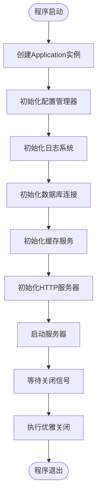
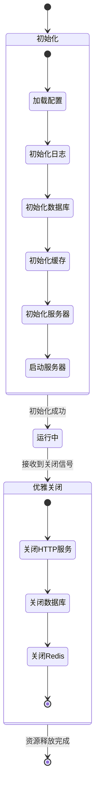
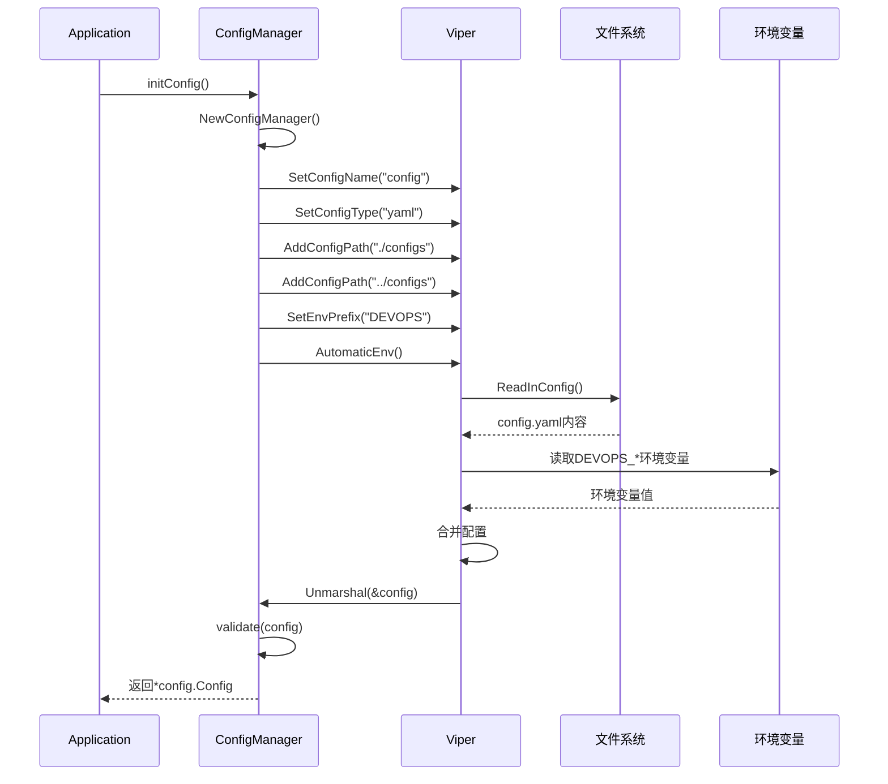
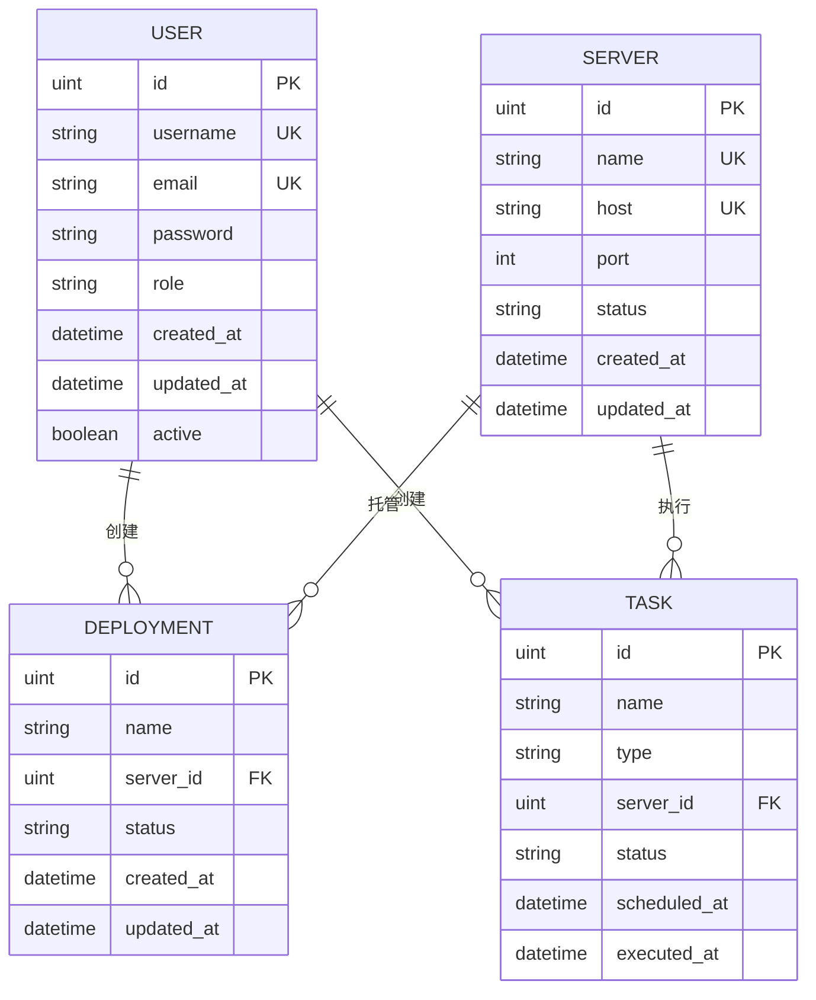
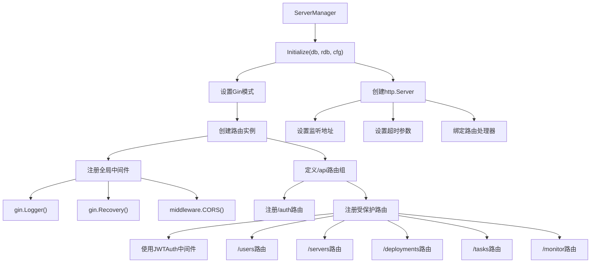
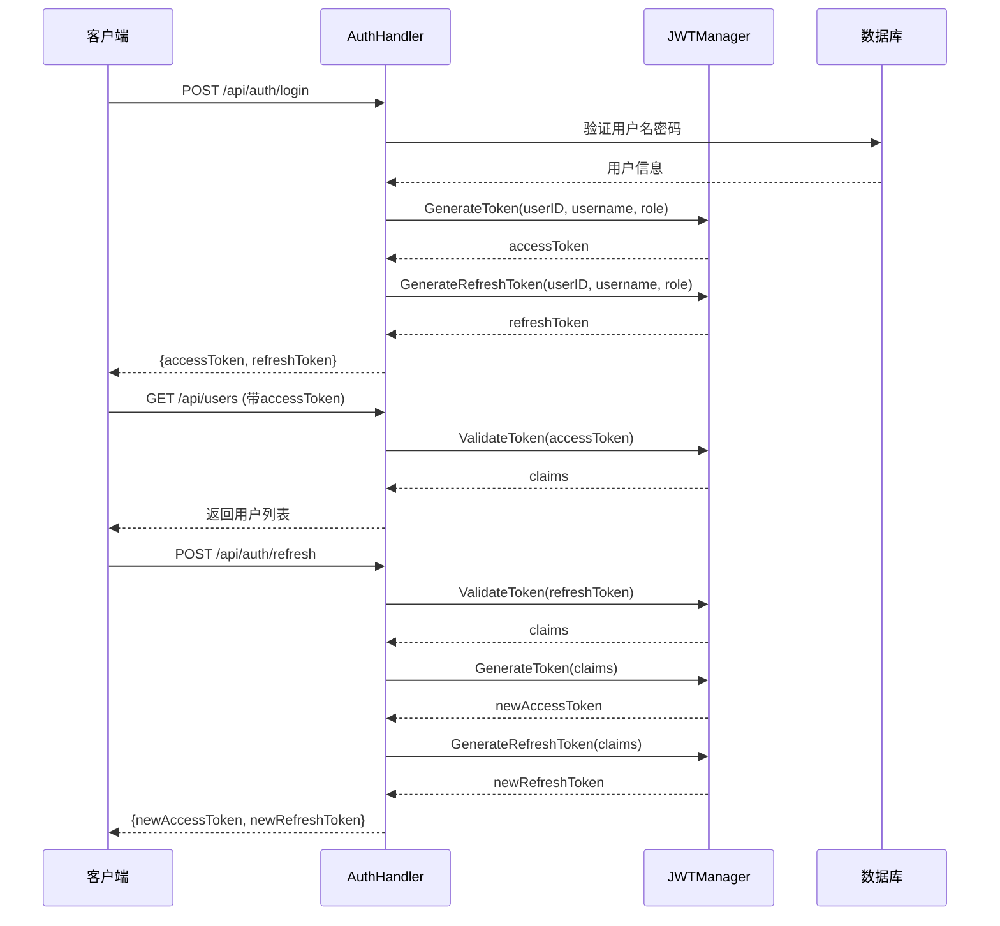
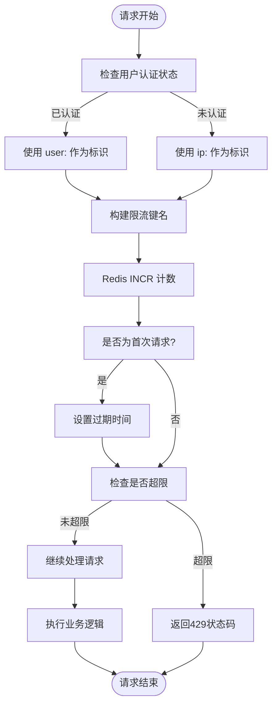

# 后端架构设计

<cite>
**本文档引用文件**  
- [main.go](file://backend/cmd/main.go)
- [app.go](file://backend/internal/app/app.go)
- [config_manager.go](file://backend/internal/app/config_manager.go)
- [database_manager.go](file://backend/internal/app/database_manager.go)
- [server_manager.go](file://backend/internal/app/server_manager.go)
- [config.go](file://backend/internal/config/config.go)
- [router.go](file://backend/internal/api/router.go)
- [middleware.go](file://backend/internal/middleware/middleware.go)
- [jwt.go](file://backend/internal/auth/jwt.go)
- [ratelimit.go](file://backend/internal/middleware/ratelimit.go)
</cite>

## 目录
1. [启动流程概览](#启动流程概览)
2. [Application单例生命周期管理](#application单例生命周期管理)
3. [依赖注入机制详解](#依赖注入机制详解)
4. [配置管理器实现原理](#配置管理器实现原理)
5. [数据库管理器与GORM集成](#数据库管理器与gorm集成)
6. [服务器管理器与Gin路由注册](#服务器管理器与gin路由注册)
7. [JWT认证流程分析](#jwt认证流程分析)
8. [限流中间件实现原理](#限流中间件实现原理)

## 启动流程概览

qoder后端系统从 `main.go` 的 `main()` 函数作为唯一入口，通过调用 `app.New()` 创建应用单例并启动服务。整个启动过程遵循严格的初始化顺序，确保各组件按依赖关系正确加载。



**图示来源**  
- [main.go](file://backend/cmd/main.go#L1-L17)
- [app.go](file://backend/internal/app/app.go#L1-L210)

**本节来源**  
- [main.go](file://backend/cmd/main.go#L1-L17)
- [app.go](file://backend/internal/app/app.go#L1-L50)

## Application单例生命周期管理

`Application` 结构体作为整个系统的运行时容器，采用单例模式进行实例化。其生命周期由 `Run()` 方法统一管理，包含初始化、运行和优雅关闭三个阶段。

在初始化阶段，系统按顺序执行配置、日志、数据库、缓存和服务器的初始化操作。若任一环节失败，将立即终止启动流程并返回错误。运行阶段通过 `startServer()` 在独立 goroutine 中启动 HTTP 服务，同时主线程阻塞于 `waitForShutdown()`，监听系统中断信号（SIGINT/SIGTERM）或内部关闭信号。

当接收到关闭信号时，系统进入优雅关闭阶段，通过 `gracefulShutdown()` 方法依次关闭 HTTP 服务、数据库连接和 Redis 客户端，确保正在进行的请求能够完成处理。



**图示来源**  
- [app.go](file://backend/internal/app/app.go#L1-L210)

**本节来源**  
- [app.go](file://backend/internal/app/app.go#L1-L210)

## 依赖注入机制详解

`Application` 通过构造函数注入的方式整合各个管理器组件，形成统一的运行时实例。该机制在 `app.go` 中实现，核心在于 `New()` 函数创建空实例后，通过一系列 `initXxx()` 方法逐步构建依赖链。

具体而言：
- `initConfig()` 创建 `ConfigManager` 实例并加载配置
- `initDatabase()` 使用配置中的数据库参数创建 `DatabaseManager`
- `initCache()` 基于 Redis 配置创建 `CacheManager`
- `initServer()` 将数据库、缓存和配置注入 `ServerManager`

这种设计实现了组件间的松耦合，每个管理器仅依赖必要的配置参数，而 `Application` 作为协调者负责组装完整的服务栈。

```mermaid
classDiagram
class Application {
-config *Config
-db *gorm.DB
-rdb *redis.Client
-logger *zap.Logger
-configMgr *ConfigManager
-databaseMgr *DatabaseManager
-cacheMgr *CacheManager
-serverMgr *ServerManager
-shutdownCh chan struct{}
+Run() error
+GetConfig() *Config
+GetDB() *gorm.DB
+GetRedis() *redis.Client
}
class ConfigManager {
-config *Config
+Load() (*Config, error)
+InitLogger() error
+ValidateEnvironment() error
+IsProduction() bool
}
class DatabaseManager {
-db *gorm.DB
-config Database
+Initialize() (*gorm.DB, error)
+Migrate() error
+Close() error
}
class CacheManager {
-rdb *redis.Client
-config Redis
+Initialize() (*redis.Client, error)
+Close() error
}
class ServerManager {
-server *http.Server
-router *gin.Engine
-config Server
+Initialize(db *gorm.DB, rdb *redis.Client, cfg *Config) error
+Start() error
+Shutdown(ctx context.Context) error
}
Application --> ConfigManager : 创建并持有
Application --> DatabaseManager : 创建并持有
Application --> CacheManager : 创建并持有
Application --> ServerManager : 创建并持有
ConfigManager --> Config : 加载配置数据
DatabaseManager --> Database : 使用数据库配置
CacheManager --> Redis : 使用Redis配置
ServerManager --> Server : 使用服务器配置
```

**图示来源**  
- [app.go](file://backend/internal/app/app.go#L1-L210)

**本节来源**  
- [app.go](file://backend/internal/app/app.go#L1-L210)

## 配置管理器实现原理

`ConfigManager` 基于 Viper 库实现 YAML 配置文件的加载与环境变量覆盖功能。系统优先从 `./configs` 或 `../configs` 目录加载 `config.yaml` 文件，并自动映射到 `config.Config` 结构体。

Viper 的关键特性包括：
- 支持多格式配置（YAML、JSON、TOML 等）
- 自动绑定环境变量（前缀为 DEVOPS）
- 动态重载配置（通过 `Reload()` 方法）

配置验证机制确保关键参数的有效性，如端口号范围、数据库 DSN 非空等。生产环境还强制要求设置 `JWT_SECRET` 环境变量，防止敏感信息硬编码。



**图示来源**  
- [config_manager.go](file://backend/internal/app/config_manager.go#L1-L124)
- [config.go](file://backend/internal/config/config.go#L1-L96)

**本节来源**  
- [config_manager.go](file://backend/internal/app/config_manager.go#L1-L124)
- [config.go](file://backend/internal/config/config.go#L1-L96)

## 数据库管理器与GORM集成

`DatabaseManager` 封装了 GORM 的初始化与迁移逻辑。通过 `Initialize()` 方法建立数据库连接，并自动配置连接池参数以优化性能。

连接池配置如下：
- 最大打开连接数：25
- 最大空闲连接数：10
- 连接最大生存时间：5分钟

`Migrate()` 方法调用 `model.AutoMigrate()` 执行自动模式迁移，确保数据库表结构与 Go 模型保持同步。此过程在应用启动时自动执行，支持增量更新。



**图示来源**  
- [database_manager.go](file://backend/internal/app/database_manager.go#L1-L98)
- [model/user.go](file://backend/internal/model/user.go)
- [model/server.go](file://backend/internal/model/server.go)
- [model/deployment.go](file://backend/internal/model/deployment.go)
- [model/task.go](file://backend/internal/model/task.go)

**本节来源**  
- [database_manager.go](file://backend/internal/app/database_manager.go#L1-L98)

## 服务器管理器与Gin路由注册

`ServerManager` 负责初始化 Gin HTTP 服务器并注册路由。通过 `Initialize()` 方法设置服务器参数（端口、超时时间等），并调用 `api.NewRouter()` 构建路由树。

路由注册采用分组策略：
- `/api/auth`：公开认证接口（登录、刷新令牌）
- 受保护路由：使用 `JWTAuth` 中间件验证身份
  - `/api/users`：用户管理（管理员权限）
  - `/api/servers`：服务器管理
  - `/api/deployments`：部署管理
  - `/api/tasks`：任务管理
  - `/api/monitor`：监控数据接口



**图示来源**  
- [server_manager.go](file://backend/internal/app/server_manager.go#L1-L100)
- [router.go](file://backend/internal/api/router.go#L1-L115)

**本节来源**  
- [server_manager.go](file://backend/internal/app/server_manager.go#L1-L100)
- [router.go](file://backend/internal/api/router.go#L1-L115)

## JWT认证流程分析

JWT 认证流程由 `middleware.JWTAuth()` 中间件驱动，结合 `auth.JWTManager` 实现完整的令牌签发、验证与刷新机制。

认证流程如下：
1. 客户端在 `Authorization` 头部发送 `Bearer <token>`
2. 中间件提取并验证令牌签名
3. 解析用户声明（ID、用户名、角色）
4. 将用户信息存入 Gin 上下文供后续处理使用

`JWTManager` 支持双令牌机制：
- 访问令牌（Access Token）：短期有效（默认1小时）
- 刷新令牌（Refresh Token）：长期有效（默认7天）

刷新流程通过 `/auth/refresh` 接口实现，使用有效刷新令牌换取新的访问令牌。



**图示来源**  
- [jwt.go](file://backend/internal/auth/jwt.go#L1-L108)
- [middleware.go](file://backend/internal/middleware/middleware.go#L1-L116)
- [router.go](file://backend/internal/api/router.go#L1-L115)

**本节来源**  
- [jwt.go](file://backend/internal/auth/jwt.go#L1-L108)
- [middleware.go](file://backend/internal/middleware/middleware.go#L1-L116)

## 限流中间件实现原理

系统实现了基于 Redis 的分布式限流机制，包含通用限流和登录专用限流两种策略。

### 通用限流 (`RateLimit`)
- 基于用户ID（已登录）或IP地址（未登录）进行区分
- 时间窗口：1分钟内最多100次请求
- 动态键名：`devops:api:rate_limit:<identifier>:<method>:<path>`
- 响应头包含 `X-RateLimit-Limit` 和 `X-RateLimit-Remaining`

### 登录限流 (`LoginRateLimit`)
- 仅基于IP地址限制
- 15分钟内最多5次登录尝试
- 登录成功后自动清除计数

限流逻辑利用 Redis 的原子操作 `INCR` 实现计数递增，并通过 `EXPIRE` 设置过期时间，确保计数自动清理。



**图示来源**  
- [ratelimit.go](file://backend/internal/middleware/ratelimit.go#L1-L115)
- [cache.go](file://backend/pkg/cache/cache.go)

**本节来源**  
- [ratelimit.go](file://backend/internal/middleware/ratelimit.go#L1-L115)