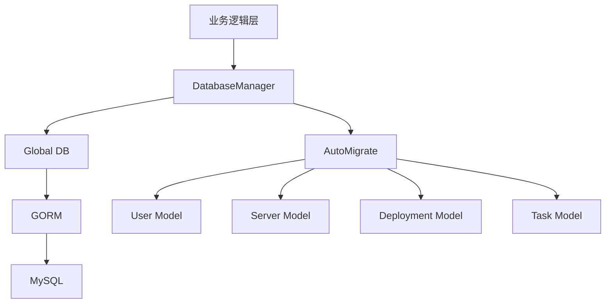
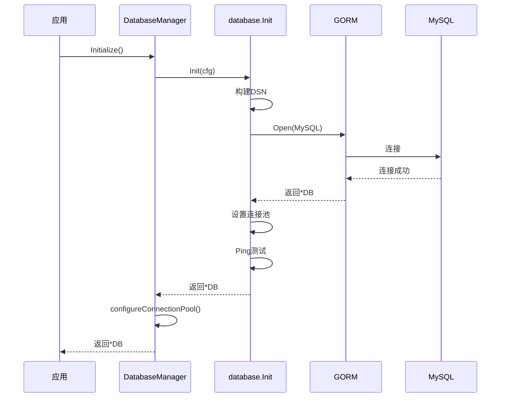
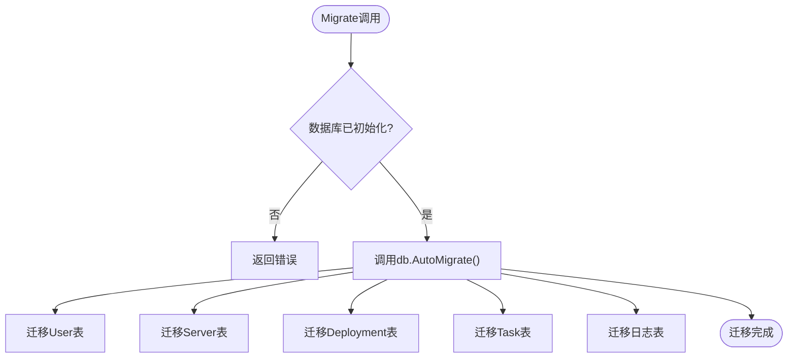
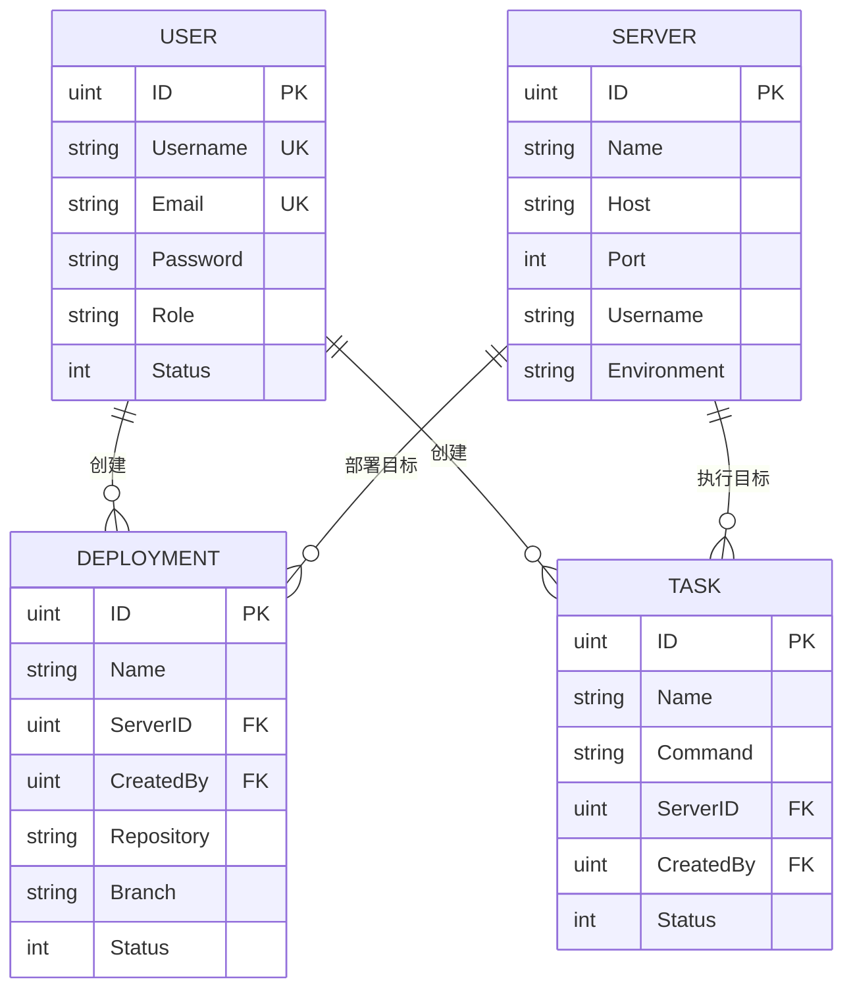
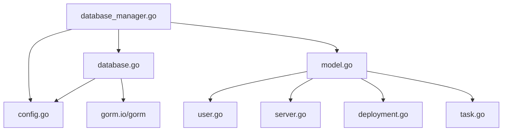

# 数据库管理

<cite>
**本文档引用文件**  
- [database_manager.go](file://backend/internal/app/database_manager.go)
- [database.go](file://backend/pkg/database/database.go)
- [config.go](file://backend/internal/config/config.go)
- [model.go](file://backend/internal/model/model.go)
- [user.go](file://backend/internal/model/user.go)
- [server.go](file://backend/internal/model/server.go)
- [deployment.go](file://backend/internal/model/deployment.go)
- [task.go](file://backend/internal/model/task.go)
</cite>

## 目录
1. [引言](#引言)
2. [项目结构概述](#项目结构概述)
3. [核心组件分析](#核心组件分析)
4. [架构概览](#架构概览)
5. [详细组件分析](#详细组件分析)
6. [依赖关系分析](#依赖关系分析)
7. [性能优化建议](#性能优化建议)
8. [故障排查指南](#故障排查指南)
9. [结论](#结论)

## 引言
本文档旨在全面解析 qoder 项目的数据库管理模块，重点阐述基于 GORM 的数据库初始化流程、连接池配置、自动迁移机制、全局 DB 对象的封装方式及其线程安全性。同时，结合实体模型定义，展示 ORM 映射关系，并提供性能优化与常见问题解决方案。

## 项目结构概述
qoder 项目的数据库相关代码主要分布在以下目录：
- `pkg/database/`：数据库连接初始化与全局 DB 封装
- `internal/app/`：数据库管理器实现
- `internal/model/`：GORM 模型定义
- `internal/config/`：数据库配置结构

```mermaid
graph TB
subgraph "数据库模块"
DBManager[database_manager.go]
DBPackage[database.go]
Models[model/]
Config[config.go]
end
DBManager --> DBPackage : 初始化
DBManager --> Models : 执行迁移
DBManager --> Config : 读取配置
DBPackage --> Config : 使用配置
```

**Diagram sources**
- [database_manager.go](file://backend/internal/app/database_manager.go#L1-L98)
- [database.go](file://backend/pkg/database/database.go#L1-L50)
- [config.go](file://backend/internal/config/config.go#L28-L41)

**Section sources**
- [database_manager.go](file://backend/internal/app/database_manager.go#L1-L98)
- [database.go](file://backend/pkg/database/database.go#L1-L50)
- [config.go](file://backend/internal/config/config.go#L1-L98)

## 核心组件分析
数据库管理模块由 `DatabaseManager` 统一协调，通过 `pkg/database` 提供的 `Init` 函数建立连接，并利用 `model` 包中的模型定义执行自动迁移。全局配置由 `config` 包加载，确保数据库连接参数的集中管理。

**Section sources**
- [database_manager.go](file://backend/internal/app/database_manager.go#L1-L98)
- [database.go](file://backend/pkg/database/database.go#L1-L50)

## 架构概览
系统采用分层架构，数据库访问层通过 GORM 抽象底层 MySQL 操作，上层业务逻辑通过 `DatabaseManager` 获取安全的数据库实例。



**Diagram sources**
- [database_manager.go](file://backend/internal/app/database_manager.go#L1-L98)
- [database.go](file://backend/pkg/database/database.go#L1-L50)
- [model.go](file://backend/internal/model/model.go#L1-L17)

## 详细组件分析

### 数据库初始化流程分析
`DatabaseManager.Initialize()` 方法负责初始化数据库连接，其核心流程如下：



**Diagram sources**
- [database_manager.go](file://backend/internal/app/database_manager.go#L25-L45)
- [database.go](file://backend/pkg/database/database.go#L10-L50)

#### MySQL连接字符串构建
连接字符串（DSN）由 `pkg/database/database.go` 中的 `Init` 函数通过 `fmt.Sprintf` 构建，格式如下：
```
用户名:密码@tcp(主机:端口)/数据库名?charset=字符集&parseTime=true&loc=时区
```
该字符串从 `config.Database` 结构中提取相应字段，确保配置驱动的灵活性。

**Section sources**
- [database.go](file://backend/pkg/database/database.go#L10-L20)
- [config.go](file://backend/internal/config/config.go#L28-L41)

#### 连接池配置
连接池在 `database.Init` 和 `DatabaseManager.configureConnectionPool` 中分别设置：
- **最大空闲连接数**：由配置 `MaxIdleConns` 设置（默认10）
- **最大打开连接数**：由配置 `MaxOpenConns` 设置（默认25）
- **连接最大生存时间**：固定为1小时（`SetConnMaxLifetime(time.Hour)`）

此配置平衡了资源占用与连接复用效率。

**Section sources**
- [database.go](file://backend/pkg/database/database.go#L35-L40)
- [database_manager.go](file://backend/internal/app/database_manager.go#L55-L65)

### 自动迁移机制分析
自动迁移由 `model.AutoMigrate` 函数触发，其调用时机为 `DatabaseManager.Migrate()`。



**Diagram sources**
- [database_manager.go](file://backend/internal/app/database_manager.go#L75-L85)
- [model.go](file://backend/internal/model/model.go#L10-L17)

#### 触发条件与安全控制
- **触发条件**：仅当 `dm.db` 非空时才执行迁移
- **安全控制**：迁移操作未在生产环境强制启用，依赖外部调用控制，建议结合配置开关或命令行参数管理

**Section sources**
- [database_manager.go](file://backend/internal/app/database_manager.go#L75-L85)

### 全局DB对象封装与线程安全性
`pkg/database/database.go` 中的 `Init` 函数返回 `*gorm.DB`，该对象由 `DatabaseManager` 持有并提供 `GetDB()` 方法访问。

- **封装方式**：`DatabaseManager` 结构体私有持有 `*gorm.DB`，通过 `GetDB()` 方法提供只读访问
- **线程安全性**：GORM 的 `*gorm.DB` 实例本身是线程安全的，底层依赖 `database/sql` 的连接池机制，允许多个 goroutine 并发使用

**Section sources**
- [database_manager.go](file://backend/internal/app/database_manager.go#L90-L95)
- [database.go](file://backend/pkg/database/database.go#L10-L50)

### GORM模型与数据库表映射关系
实体模型定义于 `internal/model/` 目录，通过 GORM 标签实现 ORM 映射。

#### 主键、索引与外键约束
| 模型 | 主键 | 唯一索引 | 普通索引 | 外键约束 |
|------|------|----------|----------|----------|
| User | ID | Username, Email | - | Deployments.CreatedBy, Tasks.CreatedBy |
| Server | ID | - | - | Deployments.ServerID, Tasks.ServerID |
| Deployment | ID | - | ServerID, CreatedBy | ServerID → Server.ID, CreatedBy → User.ID |
| Task | ID | - | ServerID, CreatedBy | ServerID → Server.ID, CreatedBy → User.ID |



**Diagram sources**
- [user.go](file://backend/internal/model/user.go#L10-L30)
- [server.go](file://backend/internal/model/server.go#L10-L33)
- [deployment.go](file://backend/internal/model/deployment.go#L10-L50)
- [task.go](file://backend/internal/model/task.go#L10-L54)

**Section sources**
- [user.go](file://backend/internal/model/user.go#L1-L30)
- [server.go](file://backend/internal/model/server.go#L1-L33)
- [deployment.go](file://backend/internal/model/deployment.go#L1-L50)
- [task.go](file://backend/internal/model/task.go#L1-L54)

## 依赖关系分析
数据库模块依赖配置模块加载参数，依赖 GORM 进行数据库操作，模型间通过外键建立关联。



**Diagram sources**
- [database_manager.go](file://backend/internal/app/database_manager.go#L1-L98)
- [database.go](file://backend/pkg/database/database.go#L1-L50)
- [model.go](file://backend/internal/model/model.go#L1-L17)

**Section sources**
- [database_manager.go](file://backend/internal/app/database_manager.go#L1-L98)
- [database.go](file://backend/pkg/database/database.go#L1-L50)
- [config.go](file://backend/internal/config/config.go#L1-L98)

## 性能优化建议
1. **预加载关联数据**：使用 `Preload` 加载关联模型，避免 N+1 查询
   ```go
   db.Preload("Server").Preload("User").Find(&deployments)
   ```
2. **批量操作处理**：使用 `CreateInBatches` 进行批量插入
   ```go
   db.CreateInBatches(tasks, 100)
   ```
3. **合理设置连接池**：根据实际并发量调整 `MaxOpenConns` 和 `MaxIdleConns`
4. **使用索引优化查询**：确保频繁查询的字段已建立索引

**Section sources**
- [deployment.go](file://backend/internal/model/deployment.go#L10-L50)
- [task.go](file://backend/internal/model/task.go#L10-L54)

## 故障排查指南
### 常见数据库连接失败解决方案
1. **连接超时**：
   - 检查数据库服务是否运行
   - 验证主机、端口、网络连通性
2. **认证失败**：
   - 核对用户名、密码
   - 检查数据库用户权限
3. **DNS解析失败**：
   - 确认主机名正确或使用IP
   - 检查DNS配置
4. **连接池耗尽**：
   - 增加 `MaxOpenConns`
   - 检查连接泄漏（未关闭事务或连接）
5. **迁移失败**：
   - 检查表结构冲突
   - 确认数据库用户有 DDL 权限

**Section sources**
- [database.go](file://backend/pkg/database/database.go#L45-L50)
- [database_manager.go](file://backend/internal/app/database_manager.go#L50-L65)

## 结论
qoder 的数据库管理模块设计清晰，通过 `DatabaseManager` 统一管理连接生命周期，GORM 提供强大的 ORM 能力。建议在生产环境中增加迁移操作的确认机制，并根据负载调整连接池参数以优化性能。