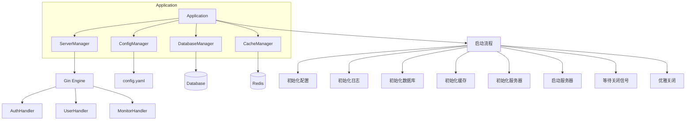
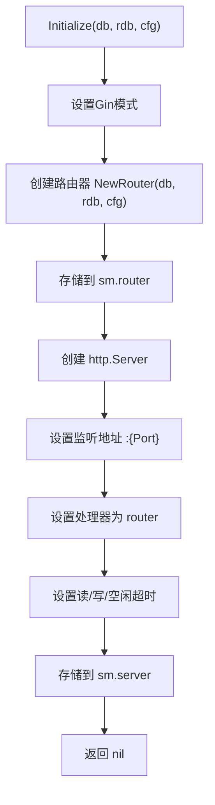
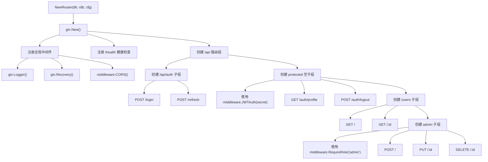
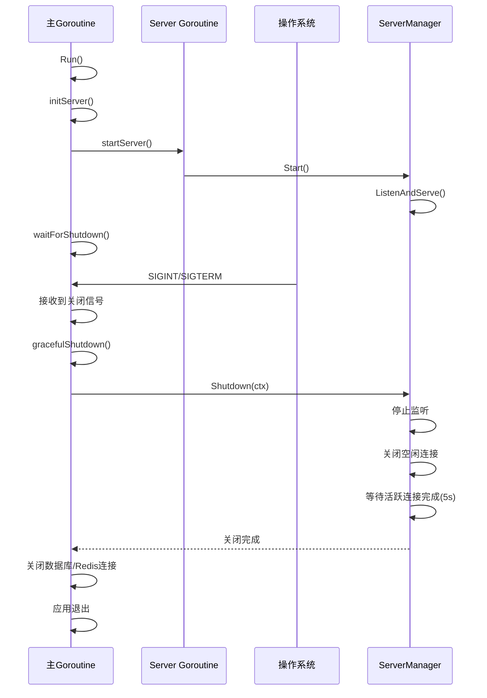
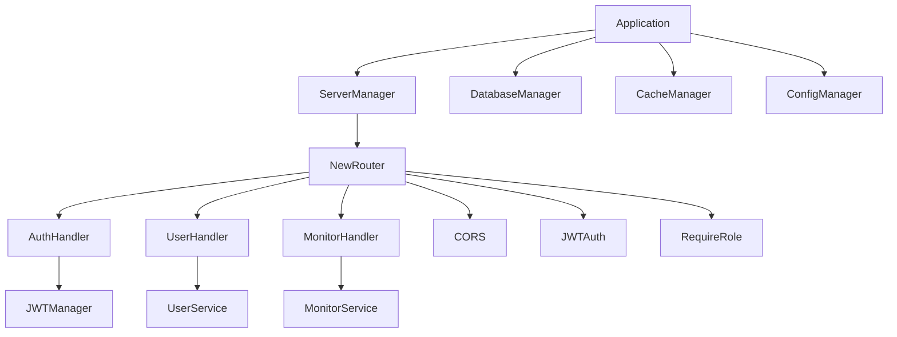

# 服务管理

<cite>
**本文档中引用的文件**  
- [server_manager.go](file://backend/internal/app/server_manager.go)
- [router.go](file://backend/internal/api/router.go)
- [app.go](file://backend/internal/app/app.go)
- [middleware.go](file://backend/internal/middleware/middleware.go)
- [config.go](file://backend/internal/config/config.go)
</cite>

## 目录
1. [简介](#简介)
2. [项目结构](#项目结构)
3. [核心组件](#核心组件)
4. [架构概览](#架构概览)
5. [详细组件分析](#详细组件分析)
6. [依赖分析](#依赖分析)
7. [性能考虑](#性能考虑)
8. [故障排除指南](#故障排除指南)
9. [结论](#结论)

## 简介
本文档深入解析 qoder 服务管理组件的实现机制，重点分析基于 Gin 框架的 HTTP 服务初始化、路由注册、中间件链装配、依赖注入及优雅关闭等核心功能。通过分析 `server_manager.go`、`router.go` 和 `app.go` 等关键文件，全面阐述服务的启动流程与架构设计。

## 项目结构
qoder 项目采用分层架构，后端代码位于 `backend` 目录下，主要分为 `cmd`（入口）、`internal`（内部逻辑）和 `pkg`（通用包）三个部分。服务管理相关的核心代码位于 `backend/internal/app` 和 `backend/internal/api` 目录中。

**Section sources**
- [server_manager.go](file://backend/internal/app/server_manager.go#L1-L101)
- [app.go](file://backend/internal/app/app.go#L1-L212)

## 核心组件
核心组件包括 `ServerManager`（服务管理器）、`Application`（应用主体）、`NewRouter`（路由器创建）和各类中间件。`ServerManager` 负责 Gin 引擎的初始化与 HTTP 服务器的生命周期管理；`Application` 作为应用的协调者，负责整合配置、数据库、缓存和服务器等管理器；`NewRouter` 函数负责定义和注册所有 API 路由。

**Section sources**
- [server_manager.go](file://backend/internal/app/server_manager.go#L1-L101)
- [app.go](file://backend/internal/app/app.go#L1-L212)
- [router.go](file://backend/internal/api/router.go#L1-L116)

## 架构概览
系统采用典型的分层 MVC 架构，`Application` 作为顶层协调者，依次初始化配置、日志、数据库、缓存和服务器。服务器管理器 `ServerManager` 创建 Gin 路由器，通过 `NewRouter` 函数注册所有 API 路由，并将数据库、Redis 等依赖注入到各个处理器中。最终，HTTP 服务器启动并监听指定端口。

**Diagram sources**
- [app.go](file://backend/internal/app/app.go#L50-L210)
- [server_manager.go](file://backend/internal/app/server_manager.go#L30-L80)

## 详细组件分析

### ServerManager 分析
`ServerManager` 结构体封装了 HTTP 服务器和 Gin 路由器的实例，负责服务的初始化、启动和关闭。

#### 初始化流程
`Initialize` 方法是服务初始化的核心。它首先根据配置设置 Gin 的运行模式（如 `debug` 或 `release`），然后调用 `api.NewRouter` 创建并配置路由器，最后创建 `http.Server` 实例，将路由器作为处理器，并设置读写超时等参数。

**Diagram sources**
- [server_manager.go](file://backend/internal/app/server_manager.go#L30-L55)

**Section sources**
- [server_manager.go](file://backend/internal/app/server_manager.go#L30-L55)

### 路由与中间件分析
API 路由的定义和注册在 `router.go` 文件中完成。

#### 路由注册机制
`NewRouter` 函数创建一个新的 Gin 引擎，并通过路由组（Group）的方式组织 API。它首先注册全局中间件（日志、恢复、CORS），然后创建 `/api` 前缀的路由组。在 `/api` 组下，进一步划分为 `/auth`（无需认证）和 `protected`（需 JWT 认证）两个子组。`protected` 组通过 `middleware.JWTAuth` 中间件保护，确保所有子路由都需要有效的 JWT Token。

**Diagram sources**
- [router.go](file://backend/internal/api/router.go#L1-L116)

#### 中间件链装配
中间件的执行顺序至关重要。全局中间件（Logger, Recovery, CORS）最先执行。在 `protected` 路由组中，`JWTAuth` 中间件在业务逻辑之前执行，负责验证 Token 并将用户信息存入上下文。在管理员操作路由中，`RequireRole` 中间件在 `JWTAuth` 之后执行，检查用户角色权限。

**Section sources**
- [router.go](file://backend/internal/api/router.go#L1-L116)
- [middleware.go](file://backend/internal/middleware/middleware.go#L1-L117)

### 依赖注入分析
`Application` 实例在 `initServer` 方法中，将自身持有的数据库 (`*gorm.DB`) 和 Redis (`*redis.Client`) 实例，以及完整的配置 (`*config.Config`)，作为参数传递给 `serverMgr.Initialize` 方法。这些依赖最终被传递给 `NewRouter`，并在创建各个 Handler（如 `NewAuthHandler`, `NewUserHandler`）时注入，实现了依赖的集中管理和解耦。

**Section sources**
- [app.go](file://backend/internal/app/app.go#L115-L130)

### 服务器启动与优雅关闭分析
`Application.Run` 方法通过 `startServer` 在一个 goroutine 中启动 HTTP 服务器，避免阻塞主线程。主 goroutine 则调用 `waitForShutdown`，监听 `SIGINT`（Ctrl+C）和 `SIGTERM`（终止信号）信号。当接收到信号时，触发 `gracefulShutdown` 流程。

#### 优雅关闭流程
`gracefulShutdown` 方法创建一个 5 秒的上下文超时，调用 `ServerManager.Shutdown` 方法。该方法会停止接收新连接，但允许已建立的连接完成处理，从而实现服务的平滑下线。

**Diagram sources**
- [app.go](file://backend/internal/app/app.go#L145-L173)
- [server_manager.go](file://backend/internal/app/server_manager.go#L60-L85)

**Section sources**
- [app.go](file://backend/internal/app/app.go#L145-L173)
- [server_manager.go](file://backend/internal/app/server_manager.go#L60-L85)

## 依赖分析
组件间依赖关系清晰。`Application` 依赖于 `ConfigManager`、`DatabaseManager`、`CacheManager` 和 `ServerManager`。`ServerManager` 依赖于 `api.NewRouter`，而 `NewRouter` 又依赖于具体的 `Handler` 和 `middleware`。这种依赖注入模式使得各组件职责分明，易于测试和维护。

**Diagram sources**
- [app.go](file://backend/internal/app/app.go#L1-L212)
- [server_manager.go](file://backend/internal/app/server_manager.go#L1-L101)
- [router.go](file://backend/internal/api/router.go#L1-L116)

**Section sources**
- [app.go](file://backend/internal/app/app.go#L1-L212)

## 性能考虑
- **连接超时**：`http.Server` 配置了 `ReadTimeout`、`WriteTimeout` 和 `IdleTimeout`，防止慢速连接耗尽资源。
- **中间件效率**：核心中间件（如 JWT 验证）逻辑简洁，避免在请求链中引入不必要的延迟。
- **并发处理**：Gin 框架基于 Go 的并发模型，能够高效处理大量并发请求。

## 故障排除指南
- **服务器无法启动**：检查端口是否被占用，或配置文件中的端口设置是否正确。
- **API 返回 401**：确认请求头 `Authorization` 是否包含 `Bearer ` 前缀及有效的 Token。
- **数据库连接失败**：检查 `config.yaml` 中的数据库 DSN 配置是否正确。
- **Redis 连接失败**：检查 `config.yaml` 中的 Redis 地址和密码配置。
- **优雅关闭失败**：检查是否有长时间运行的请求阻塞了关闭流程，可适当调整 `gracefulShutdown` 的超时时间。

**Section sources**
- [server_manager.go](file://backend/internal/app/server_manager.go#L60-L85)
- [app.go](file://backend/internal/app/app.go#L170-L173)

## 结论
qoder 的服务管理组件设计良好，通过 `Application` 统一协调，`ServerManager` 专注服务生命周期，`NewRouter` 清晰地组织路由和中间件，实现了高内聚、低耦合的架构。其依赖注入机制和优雅关闭流程保证了服务的稳定性和可维护性，为系统的持续发展奠定了坚实的基础。