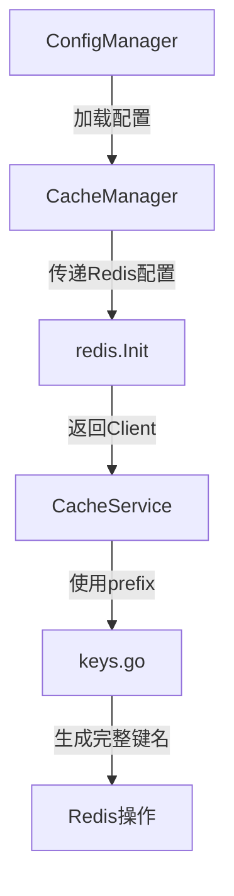
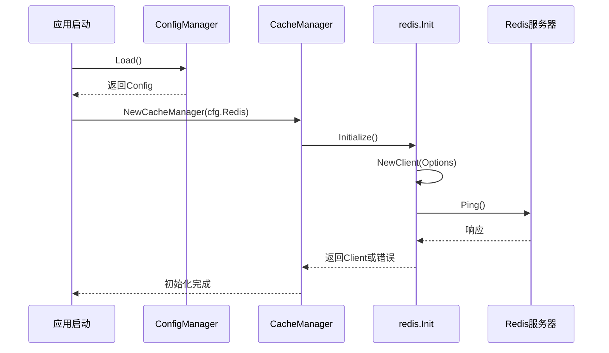
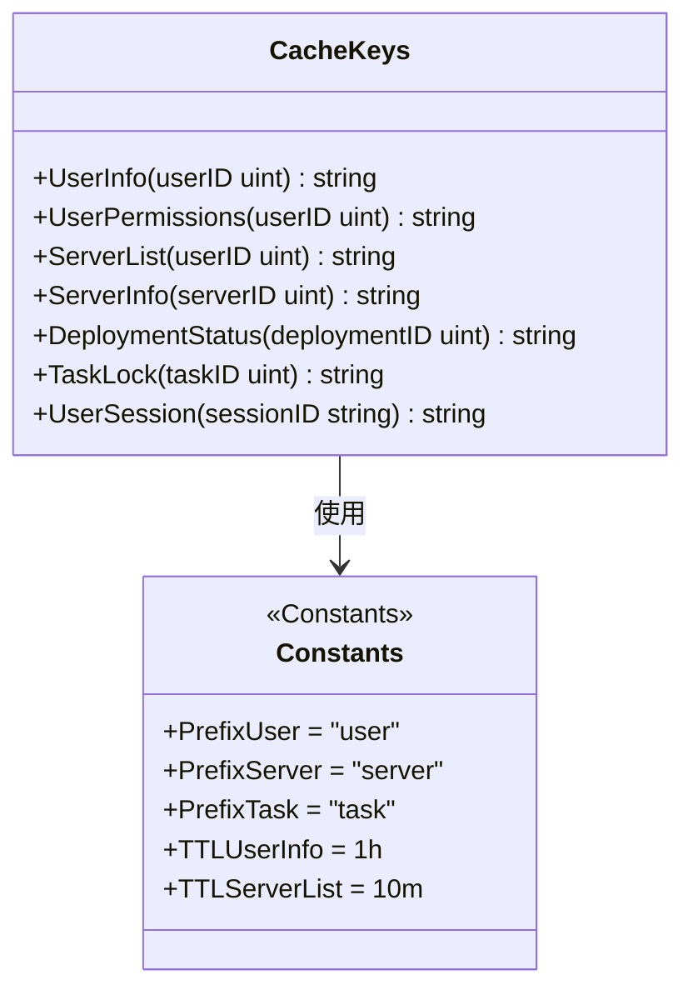
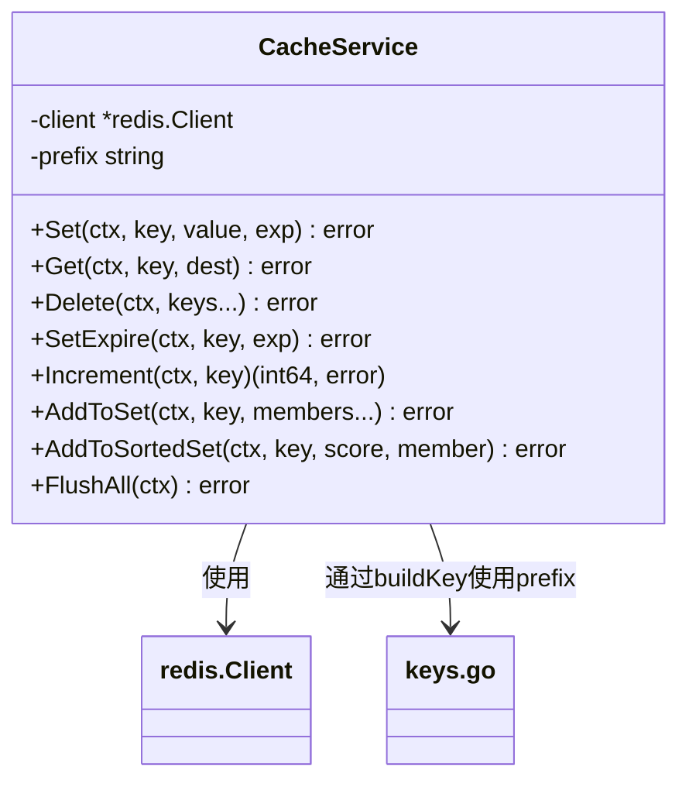
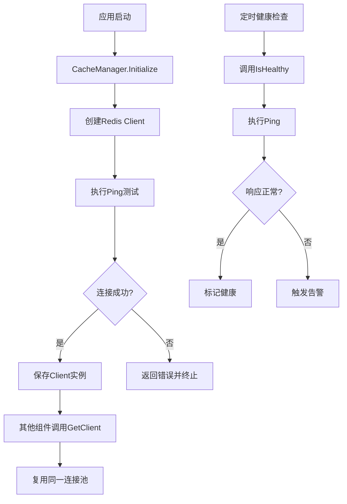
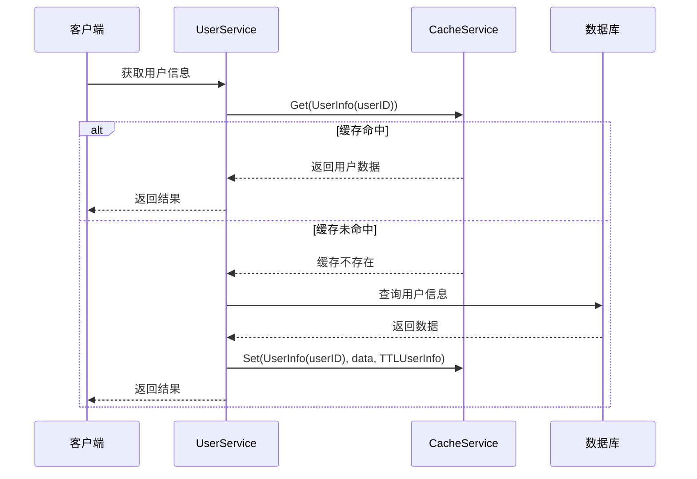

# 缓存管理

<cite>
**本文档引用文件**  
- [cache_manager.go](file://backend/internal/app/cache_manager.go)
- [cache.go](file://backend/pkg/cache/cache.go)
- [keys.go](file://backend/pkg/cache/keys.go)
- [redis.go](file://backend/pkg/redis/redis.go)
- [config.go](file://backend/internal/config/config.go)
- [config_manager.go](file://backend/internal/app/config_manager.go)
</cite>

## 目录
1. [引言](#引言)
2. [缓存系统架构概览](#缓存系统架构概览)
3. [Redis客户端初始化流程](#redis客户端初始化流程)
4. [缓存键名生成策略与防冲突设计](#缓存键名生成策略与防冲突设计)
5. [高级缓存操作封装机制](#高级缓存操作封装机制)
6. [连接复用与健康检查机制](#连接复用与健康检查机制)
7. [缓存异常场景应对策略](#缓存异常场景应对策略)
8. [实际应用场景示例](#实际应用场景示例)
9. [总结](#总结)

## 引言
本文档深入解析qoder项目中的缓存管理机制，涵盖从Redis客户端初始化、缓存键命名规范、高级操作封装到连接管理与容错策略的完整技术体系。通过分析核心代码文件，揭示系统如何高效、安全地利用Redis提升性能并保障数据一致性。

## 缓存系统架构概览
qoder的缓存架构采用分层设计，由配置加载、客户端初始化、键名管理、操作封装四部分构成。整体流程为：`ConfigManager`加载配置 → `CacheManager`调用`redis.Init`创建客户端 → `CacheService`封装操作 → `CacheKeys`生成标准化键名。

**图示来源**  
- [config_manager.go](file://backend/internal/app/config_manager.go#L1-L125)
- [cache_manager.go](file://backend/internal/app/cache_manager.go#L1-L74)
- [redis.go](file://backend/pkg/redis/redis.go#L1-L29)
- [cache.go](file://backend/pkg/cache/cache.go#L1-L153)
- [keys.go](file://backend/pkg/cache/keys.go#L1-L121)

## Redis客户端初始化流程
Redis客户端的初始化始于`CacheManager`接收来自`ConfigManager`的`config.Redis`结构体。该结构体包含主机地址、端口、密码、数据库编号及连接池大小等关键参数。

初始化过程通过`redis.Init`函数完成，该函数使用`github.com/redis/go-redis/v9`库的`NewClient`方法创建客户端实例，并立即执行`Ping`操作验证连接可用性。若连接失败，将返回明确错误信息。

**图示来源**  
- [config.go](file://backend/internal/config/config.go#L50-L99)
- [cache_manager.go](file://backend/internal/app/cache_manager.go#L15-L45)
- [redis.go](file://backend/pkg/redis/redis.go#L10-L28)

**本节来源**  
- [cache_manager.go](file://backend/internal/app/cache_manager.go#L1-L74)
- [redis.go](file://backend/pkg/redis/redis.go#L1-L29)
- [config.go](file://backend/internal/config/config.go#L50-L99)

## 缓存键名生成策略与防冲突设计
缓存键名由`pkg/cache/keys.go`中的`CacheKeys`类型统一管理，采用“命名空间+实体类型+ID”的三级结构，确保键名唯一性与可读性。

### 命名空间定义
系统预定义了多个命名空间常量，如`PrefixUser`、`PrefixServer`等，用于区分不同业务模块的数据。

### 键名生成方法
每个实体类型提供专用方法生成键名，例如：
- `UserInfo(userID)` → `user:info:123`
- `ServerList(userID)` → `server:list:456`
- `TaskLock(taskID)` → `task:lock:789`

### 防冲突设计
通过以下机制避免键名冲突：
1. **命名空间隔离**：不同业务模块使用独立前缀
2. **语义化路径**：`类型:子类型:ID`结构清晰，避免歧义
3. **全局唯一键**：如`OnlineUsers()`使用静态键名，避免动态生成冲突

**图示来源**  
- [keys.go](file://backend/pkg/cache/keys.go#L1-L121)

**本节来源**  
- [keys.go](file://backend/pkg/cache/keys.go#L1-L121)

## 高级缓存操作封装机制
`pkg/cache/cache.go`中的`CacheService`对Redis操作进行了高级封装，提供类型安全、自动序列化、前缀管理等功能。

### 核心特性
- **自动JSON序列化**：`Set`方法自动将Go结构体序列化为JSON存储
- **前缀统一管理**：所有操作自动添加配置的`prefix`前缀
- **多数据类型支持**：支持String、Hash、Set、Sorted Set等Redis数据结构
- **错误统一处理**：包装底层错误，提供更清晰的上下文信息

### 主要方法说明
| 方法 | 功能 | 示例 |
|------|------|------|
| `Set` | 设置带过期时间的键值 | Set(ctx, "user:1", user, TTLUserInfo) |
| `Get` | 获取并反序列化值 | Get(ctx, "user:1", &user) |
| `Delete` | 删除一个或多个键 | Delete(ctx, "user:1", "user:2") |
| `SetHash` | 设置哈希字段 | SetHash(ctx, "profile:1", map[string]interface{}) |
| `Increment` | 原子递增 | Increment(ctx, "counter") |

**图示来源**  
- [cache.go](file://backend/pkg/cache/cache.go#L1-L153)

**本节来源**  
- [cache.go](file://backend/pkg/cache/cache.go#L1-L153)

## 连接复用与健康检查机制
系统通过单例客户端和健康检查机制确保连接高效且可靠。

### 连接复用
- `CacheManager`在`Initialize()`时创建单个`*redis.Client`实例
- 通过`GetClient()`方法供其他组件复用，避免频繁创建连接
- 使用连接池（由`PoolSize`配置）管理并发连接

### 健康检查
- `IsHealthy()`方法定期调用`Ping`检测连接状态
- 超时设置为3秒，防止健康检查阻塞主流程
- 应用监控可集成此方法实现服务探活

**图示来源**  
- [cache_manager.go](file://backend/internal/app/cache_manager.go#L47-L73)
- [redis.go](file://backend/pkg/redis/redis.go#L1-L29)

**本节来源**  
- [cache_manager.go](file://backend/internal/app/cache_manager.go#L47-L73)

## 缓存异常场景应对策略
系统针对常见缓存问题设计了相应对策。

### 缓存穿透
- **问题**：查询不存在的数据，导致请求直达数据库
- **对策**：对确定不存在的数据设置空值缓存（短TTL），如`LoginAttempts`对频繁失败IP进行记录

### 缓存雪崩
- **问题**：大量缓存同时失效，导致数据库压力骤增
- **对策**：
  - 不同数据设置差异化过期时间（如`TTLUserInfo=1h`, `TTLServerList=10m`）
  - 关键数据采用随机化过期时间

### 缓存击穿
- **问题**：热点数据过期瞬间大量请求涌入
- **对策**：
  - 使用`TaskLock`等分布式锁机制，确保同一时间只有一个请求重建缓存
  - 结合`Get`和`Set`的原子操作（如`SETNX`）实现逻辑锁

## 实际应用场景示例
以用户服务为例，展示缓存使用模式：

**图示来源**  
- [keys.go](file://backend/pkg/cache/keys.go#L30-L35)
- [cache.go](file://backend/pkg/cache/cache.go#L25-L45)
- [user_cached.go](file://backend/internal/service/user_cached.go)

## 总结
qoder的缓存管理系统通过分层架构实现了高可用、易维护的缓存能力。其核心优势在于：
1. **配置驱动**：通过`ConfigManager`统一管理Redis连接参数
2. **安全封装**：`CacheService`提供类型安全的操作接口
3. **规范命名**：`CacheKeys`确保键名一致性与可维护性
4. **健壮连接**：连接复用与健康检查保障服务稳定性
5. **风险防控**：针对穿透、雪崩、击穿有明确应对策略

该机制为系统性能优化提供了坚实基础，同时降低了缓存使用复杂度。