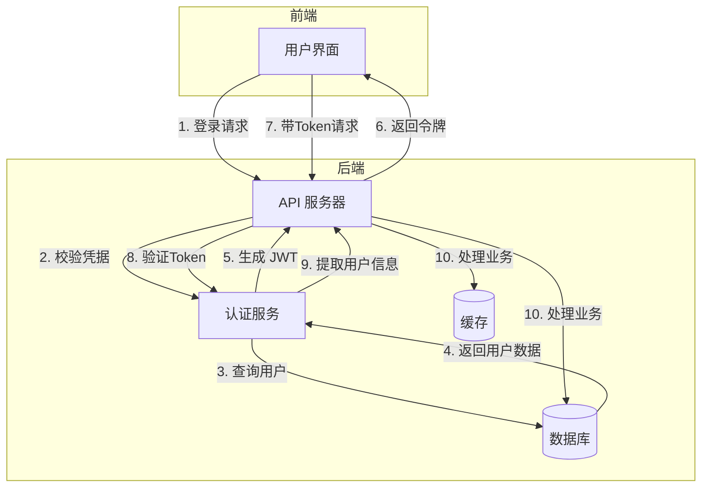
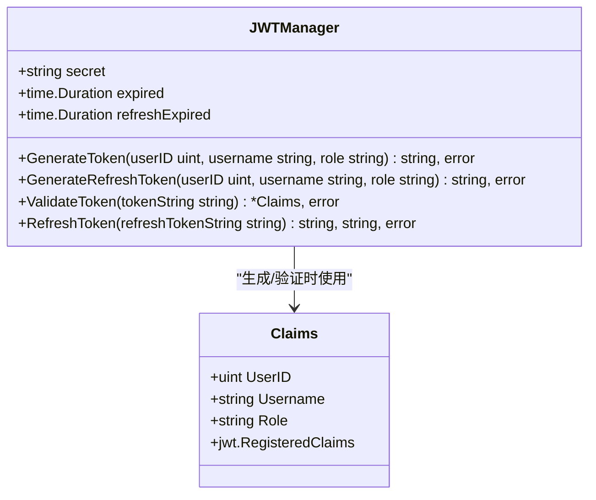
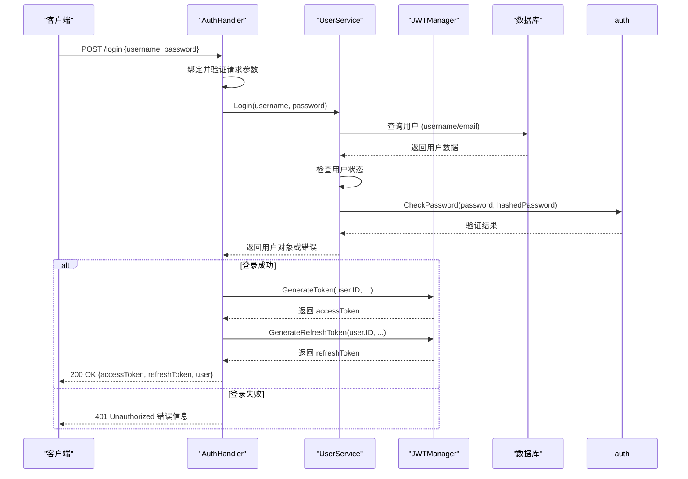
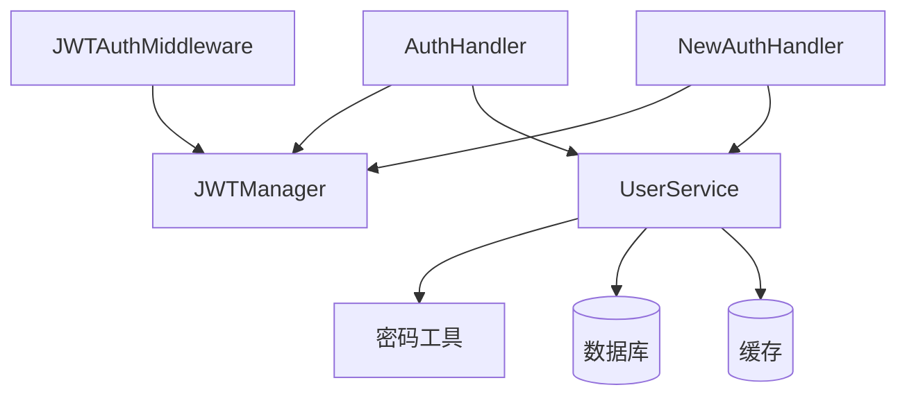

# 认证机制

<cite>
**本文档引用文件**  
- [jwt.go](file://backend/internal/auth/jwt.go)
- [auth.go](file://backend/internal/api/auth.go)
- [middleware.go](file://backend/internal/middleware/middleware.go)
- [config.yaml](file://backend/configs/config.yaml)
- [types.go](file://backend/internal/api/types.go)
- [user.go](file://backend/internal/service/user.go)
- [user.go](file://backend/internal/model/user.go)
</cite>

## 目录
1. [简介](#简介)
2. [项目结构](#项目结构)
3. [核心组件](#核心组件)
4. [架构概览](#架构概览)
5. [详细组件分析](#详细组件分析)
6. [依赖分析](#依赖分析)
7. [性能考量](#性能考量)
8. [故障排除指南](#故障排除指南)
9. [结论](#结论)

## 简介
本文档全面解析 qoder 项目的认证机制，重点分析基于 JWT 的身份验证流程。涵盖 JWT 令牌的生成与验证、自定义声明结构、过期时间配置、密钥安全管理、登录接口实现以及中间件的用户上下文绑定机制。结合用户登录工作流，提供完整的认证时序图，并对 Token 刷新与注销机制提出扩展建议。

## 项目结构
qoder 项目的认证相关代码主要分布在 `backend/internal` 目录下，采用分层架构设计：
- `auth/`：包含 JWT 和密码处理的核心认证逻辑。
- `api/`：定义认证相关的 HTTP 接口和数据传输对象。
- `middleware/`：实现 JWT 认证和权限检查的 Gin 框架中间件。
- `service/`：封装用户登录、查询等业务逻辑。
- `model/`：定义用户数据模型。
- `configs/`：存放包含 JWT 配置的 YAML 文件。

**Section sources**
- [jwt.go](file://backend/internal/auth/jwt.go#L1-L108)
- [auth.go](file://backend/internal/api/auth.go#L1-L159)
- [middleware.go](file://backend/internal/middleware/middleware.go#L1-L116)

## 核心组件
核心认证组件包括：
- **JWTManager**：负责 JWT 令牌的生成、验证和刷新。
- **AuthHandler**：处理 `/login` 等认证 API 请求。
- **JWTAuth 中间件**：在请求处理链中验证 JWT 令牌并注入用户上下文。
- **UserService**：执行用户凭据校验等业务逻辑。

**Section sources**
- [jwt.go](file://backend/internal/auth/jwt.go#L1-L108)
- [auth.go](file://backend/internal/api/auth.go#L1-L159)
- [middleware.go](file://backend/internal/middleware/middleware.go#L1-L116)

## 架构概览
系统采用基于 JWT 的无状态认证架构。用户登录后，服务端签发包含用户信息的 JWT 令牌。后续请求通过 Authorization 头携带该令牌，由中间件进行验证并提取用户信息，供业务逻辑使用。



**Diagram sources**
- [auth.go](file://backend/internal/api/auth.go#L1-L159)
- [jwt.go](file://backend/internal/auth/jwt.go#L1-L108)
- [middleware.go](file://backend/internal/middleware/middleware.go#L1-L116)

## 详细组件分析

### JWT 令牌管理分析
`JWTManager` 结构体是 JWT 功能的核心，封装了令牌的全生命周期管理。

#### 类图


**Diagram sources**
- [jwt.go](file://backend/internal/auth/jwt.go#L1-L108)

#### 实现原理
- **HS256 算法**：`GenerateToken` 和 `GenerateRefreshToken` 方法使用 `jwt.SigningMethodHS256` 算法对令牌进行签名，确保令牌的完整性和防篡改性。
- **自定义声明 (Claims)**：`Claims` 结构体继承了 `jwt.RegisteredClaims`，并扩展了 `UserID`、`Username` 和 `Role` 字段，用于存储用户的核心身份信息。
- **过期时间配置**：过期时间通过 `config.yaml` 中的 `jwt.expired` 和 `jwt.refresh_expired` 配置项加载，`NewJWTManager` 函数将其转换为 `time.Duration` 类型，用于设置 `ExpiresAt` 声明。
- **密钥安全管理**：密钥 `secret` 作为 `JWTManager` 的私有字段，在 `NewJWTManager` 创建实例时从配置中注入，不对外暴露，确保了密钥的安全。

**Section sources**
- [jwt.go](file://backend/internal/auth/jwt.go#L1-L108)
- [config.yaml](file://backend/configs/config.yaml#L30-L33)

### 认证接口分析
`AuthHandler` 负责处理 `/login` 接口，协调用户服务和 JWT 管理器完成认证流程。

#### 时序图


**Diagram sources**
- [auth.go](file://backend/internal/api/auth.go#L1-L159)
- [user.go](file://backend/internal/service/user.go#L1-L171)
- [jwt.go](file://backend/internal/auth/jwt.go#L1-L108)

#### 实现原理
`Login` 方法首先通过 `ShouldBindJSON` 解析并校验登录请求。随后调用 `UserService.Login` 方法进行凭据校验。校验通过后，调用 `JWTManager` 的 `GenerateToken` 和 `GenerateRefreshToken` 方法生成访问令牌和刷新令牌，并将结果封装在响应中返回给客户端。

**Section sources**
- [auth.go](file://backend/internal/api/auth.go#L1-L159)
- [types.go](file://backend/internal/api/types.go#L1-L115)
- [user.go](file://backend/internal/service/user.go#L1-L171)

### 认证中间件分析
`JWTAuth` 中间件是保护受保护路由的关键，负责在每个请求中验证 JWT 令牌。

#### 时序图
```mermaid
sequenceDiagram
participant Client as "客户端"
participant Middleware as "JWTAuth 中间件"
participant JWTManager as "JWTManager"
Client->>Middleware : 带有 Authorization : Bearer <token> 的请求
Middleware->>Middleware : 获取 Authorization 头
alt 头部为空
Middleware-->>Client : 401 Unauthorized 未提供认证信息
return
end
Middleware->>Middleware : 检查是否以 "Bearer " 开头
alt 格式错误
Middleware-->>Client : 401 Unauthorized 认证格式错误
return
end
Middleware->>Middleware : 提取 token 字符串
Middleware->>JWTManager : ValidateToken(token)
alt 验证成功
JWTManager-->>Middleware : 返回 Claims
Middleware->>Middleware : 将 userID, username, role 存入 Gin Context
Middleware->>Middleware : c.Next()
else 验证失败
Middleware-->>Client : 401 Unauthorized 认证失败
return
end
```

**Diagram sources**
- [middleware.go](file://backend/internal/middleware/middleware.go#L1-L116)
- [jwt.go](file://backend/internal/auth/jwt.go#L1-L108)

#### 实现原理
`JWTAuth` 函数接收一个密钥字符串，创建一个 `JWTManager` 实例。返回的中间件函数首先检查请求头中的 `Authorization` 字段，确保其存在且以 `Bearer ` 开头。然后提取出 token 字符串，调用 `JWTManager.ValidateToken` 进行验证。验证成功后，将从 `Claims` 中提取的用户信息（`user_id`, `username`, `user_role`）通过 `c.Set` 方法存入 Gin 的上下文（Context），供后续的处理器函数通过 `c.Get` 获取。

**Section sources**
- [middleware.go](file://backend/internal/middleware/middleware.go#L1-L116)

## 依赖分析
认证模块的依赖关系清晰，遵循了依赖倒置原则。



**Diagram sources**
- [go.mod](file://go.mod#L1-L20)
- [auth.go](file://backend/internal/api/auth.go#L1-L159)
- [middleware.go](file://backend/internal/middleware/middleware.go#L1-L116)

## 性能考量
- **无状态性**：JWT 的无状态特性减轻了服务端的会话存储压力，提升了横向扩展能力。
- **缓存利用**：`UserService.GetByID` 方法优先从 Redis 缓存中获取用户信息，减少了数据库查询次数，提高了性能。
- **算法选择**：HS256 算法计算开销相对较小，适合高并发场景下的签名和验证。

## 故障排除指南
- **401 Unauthorized (认证失败)**：检查 `Authorization` 头格式是否正确（`Bearer <token>`），确认 JWT 令牌是否过期或被篡改，核对 `config.yaml` 中的 `jwt.secret` 是否与签发时一致。
- **401 Unauthorized (未提供认证信息)**：确保客户端在请求受保护的 API 时携带了 `Authorization` 头。
- **500 Internal Server Error (生成令牌失败)**：检查 `JWTManager` 是否正确初始化，密钥 `secret` 是否为空。
- **用户信息不一致**：若用户信息更新后，旧的 JWT 令牌中信息未同步，这是 JWT 无状态特性的固有局限，需通过缩短过期时间或实现黑名单机制缓解。

**Section sources**
- [middleware.go](file://backend/internal/middleware/middleware.go#L1-L116)
- [jwt.go](file://backend/internal/auth/jwt.go#L1-L108)
- [config.yaml](file://backend/configs/config.yaml#L30-L33)

## 结论
qoder 项目实现了一套完整且安全的 JWT 认证机制。通过 `JWTManager` 统一管理令牌的生命周期，`AuthHandler` 处理登录逻辑，`JWTAuth` 中间件保护 API 路由，各组件职责分明，代码结构清晰。系统已具备 Token 刷新功能，为长期会话提供了支持。

### 扩展建议
- **Token 注销（黑名单）**：当前 `Logout` 接口仅作示意。建议利用 Redis 实现一个 JWT 黑名单（Token Blacklist）。用户登出时，将当前 Access Token 的 `jti`（JWT ID）或其哈希值连同剩余过期时间存入 Redis。在 `JWTAuth` 中间件验证成功后，增加一步检查该 Token 是否在黑名单中，若存在则拒绝请求。
- **Token 刷新优化**：可考虑实现刷新令牌的“一次一换”（Refresh Token Rotation）策略，即每次使用刷新令牌获取新令牌时，同时签发一个新的刷新令牌并使其旧的失效，以增强安全性。