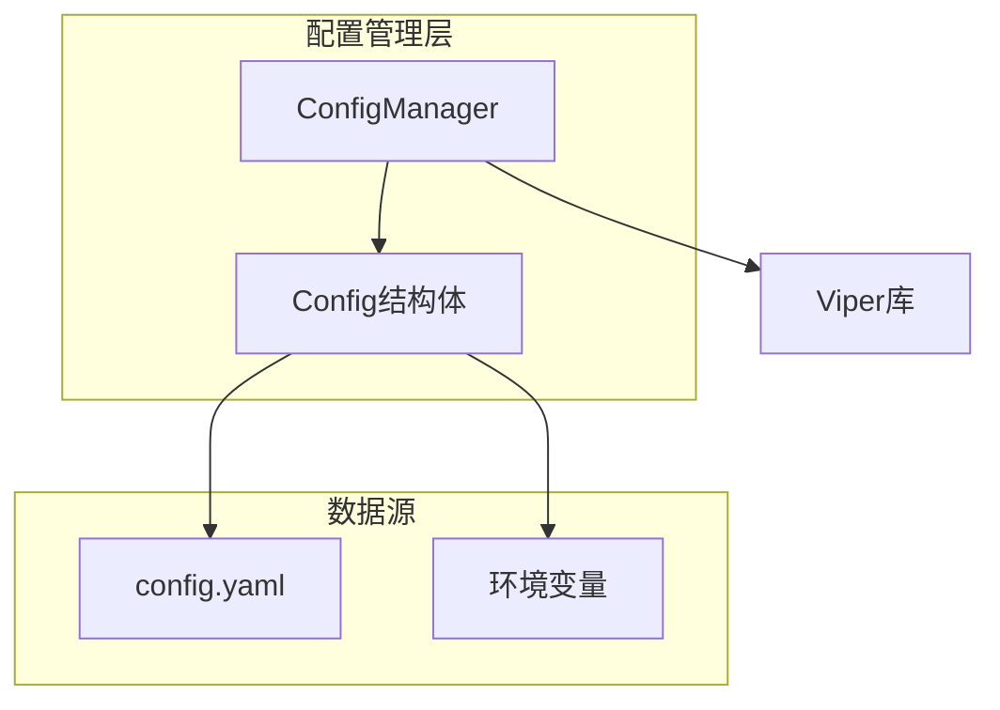
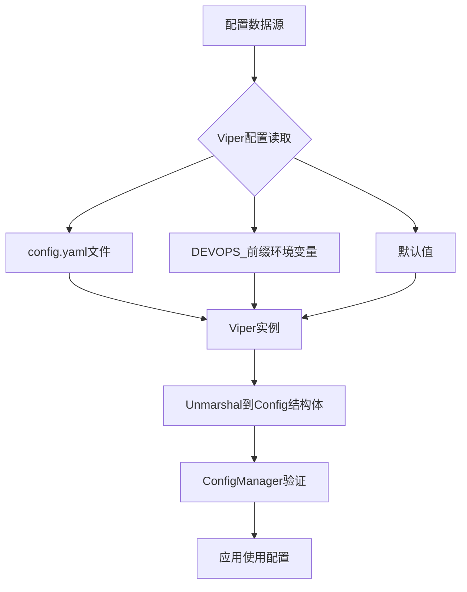
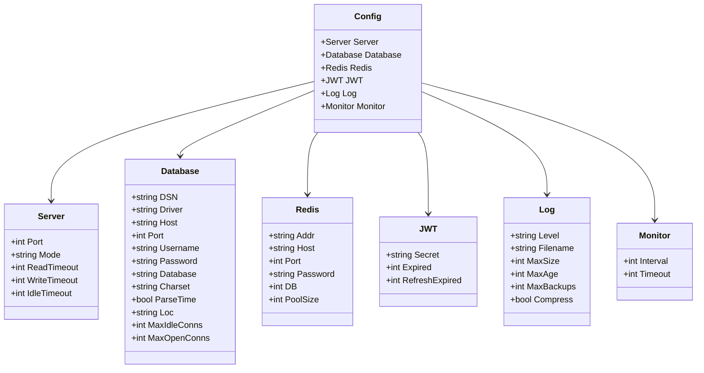
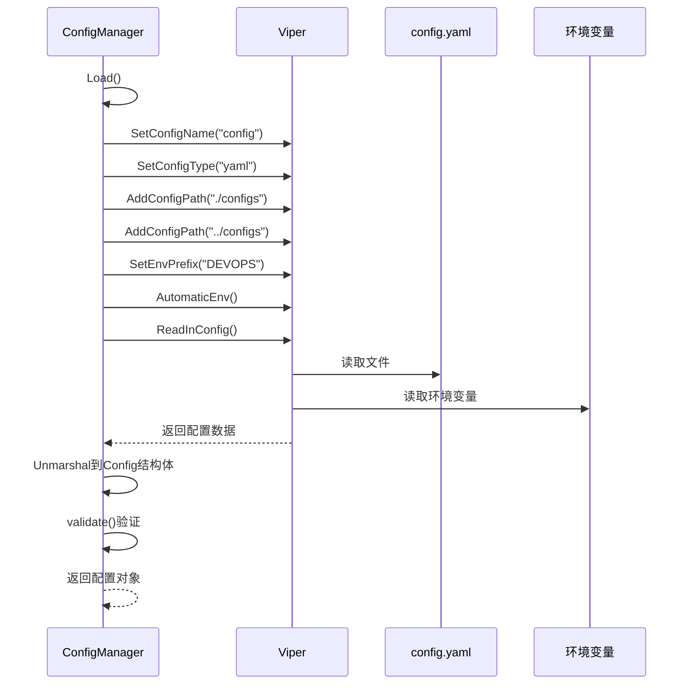
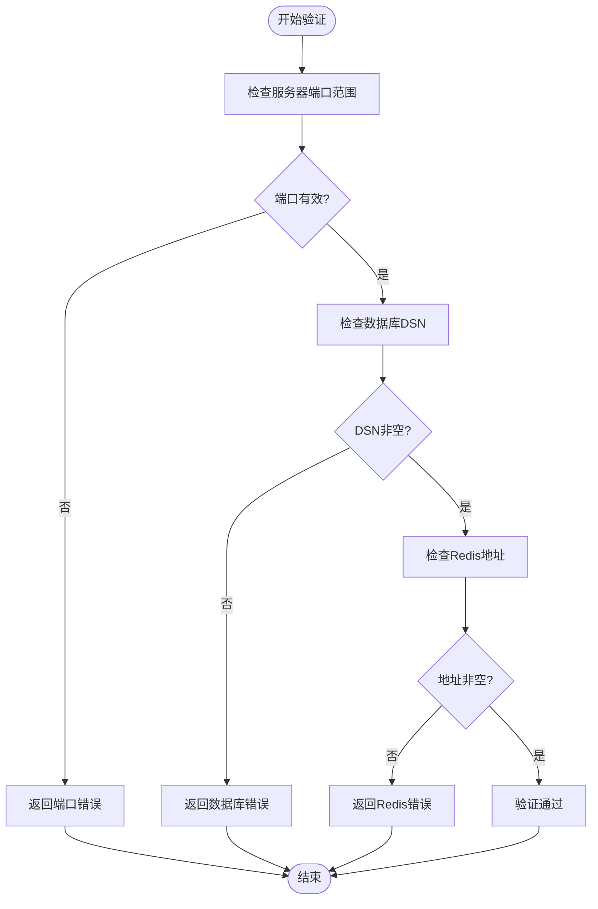
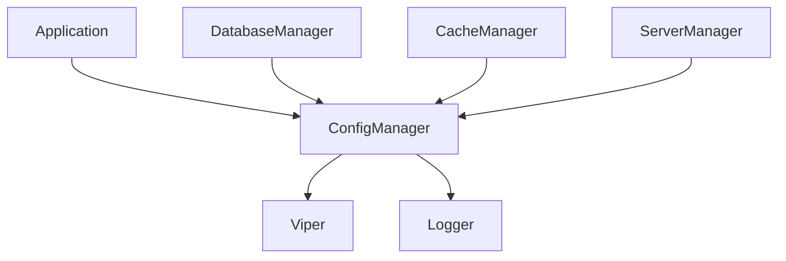

# 配置管理

<cite>
**本文档引用的文件**
- [config_manager.go](file://backend/internal/app/config_manager.go)
- [config.go](file://backend/internal/config/config.go)
- [config.yaml](file://backend/configs/config.yaml)
- [app.go](file://backend/internal/app/app.go)
</cite>

## 目录
1. [简介](#简介)
2. [项目结构](#项目结构)
3. [核心组件](#核心组件)
4. [架构概述](#架构概述)
5. [详细组件分析](#详细组件分析)
6. [依赖分析](#依赖分析)
7. [性能考虑](#性能考虑)
8. [故障排除指南](#故障排除指南)
9. [结论](#结论)

## 简介
本文档详细解析qoder配置管理系统的实现机制，重点分析基于Viper库的配置加载、验证与热重载功能。系统通过`ConfigManager`结构体统一管理应用配置，支持从YAML文件和环境变量中加载配置，并提供生产环境安全校验机制。文档将深入探讨配置优先级策略、字段映射关系以及在应用程序初始化过程中的调用流程。

## 项目结构
qoder项目的配置管理系统位于`backend/internal/app`和`backend/internal/config`目录下，采用分层设计模式。配置定义与加载逻辑分离，确保高内聚低耦合。

**图示来源**
- [config_manager.go](file://backend/internal/app/config_manager.go#L1-L125)
- [config.go](file://backend/internal/config/config.go#L1-L99)

**本节来源**
- [config_manager.go](file://backend/internal/app/config_manager.go#L1-L125)
- [config.go](file://backend/internal/config/config.go#L1-L99)

## 核心组件
`ConfigManager`是配置系统的核心组件，负责配置的加载、验证、获取和重载。它通过组合`config.Config`结构体实现类型安全的配置访问，并提供生产环境校验、日志初始化等辅助功能。

**本节来源**
- [config_manager.go](file://backend/internal/app/config_manager.go#L1-L125)
- [config.go](file://backend/internal/config/config.go#L1-L99)

## 架构概述
配置管理系统采用典型的三层架构：数据源层（YAML文件和环境变量）、解析层（Viper库）和管理层（ConfigManager）。Viper负责统一读取不同来源的配置，ConfigManager负责业务逻辑层面的验证和管理。

**图示来源**
- [config.go](file://backend/internal/config/config.go#L78-L92)
- [config_manager.go](file://backend/internal/app/config_manager.go#L15-L30)

## 详细组件分析

### 配置结构体分析
`Config`结构体定义了应用的所有配置项，采用嵌套结构组织不同模块的配置参数。

**图示来源**
- [config.go](file://backend/internal/config/config.go#L10-L75)

**本节来源**
- [config.go](file://backend/internal/config/config.go#L10-L75)

### 配置加载流程分析
配置加载流程展示了从调用`Load()`方法到返回验证后配置的完整过程。

**图示来源**
- [config.go](file://backend/internal/config/config.go#L78-L92)
- [config_manager.go](file://backend/internal/app/config_manager.go#L15-L30)

### 配置验证流程分析
配置验证流程确保加载的配置符合业务规则和系统要求。

**图示来源**
- [config_manager.go](file://backend/internal/app/config_manager.go#L32-L50)

**本节来源**
- [config_manager.go](file://backend/internal/app/config_manager.go#L32-L50)

## 依赖分析
配置管理系统依赖Viper库进行配置读取和解析，同时与其他应用组件存在明确的依赖关系。

**图示来源**
- [config_manager.go](file://backend/internal/app/config_manager.go#L1-L125)
- [app.go](file://backend/internal/app/app.go#L60-L120)

**本节来源**
- [config_manager.go](file://backend/internal/app/config_manager.go#L1-L125)
- [app.go](file://backend/internal/app/app.go#L60-L120)

## 性能考虑
配置管理系统在启动时一次性加载配置，避免运行时频繁读取文件。热重载功能允许在不重启服务的情况下更新配置，但需注意重载时的验证开销。

## 故障排除指南
常见配置问题及解决方法：

1. **配置文件找不到**：确保`configs`目录存在于正确路径（./configs或../configs）
2. **环境变量未生效**：检查环境变量是否以`DEVOPS_`为前缀
3. **生产环境启动失败**：确认设置了`JWT_SECRET`环境变量
4. **端口配置无效**：检查端口值是否在1-65535范围内
5. **数据库连接失败**：验证DSN配置是否正确且数据库服务可访问

**本节来源**
- [config_manager.go](file://backend/internal/app/config_manager.go#L32-L50)
- [config_manager.go](file://backend/internal/app/config_manager.go#L105-L115)

## 结论
qoder的配置管理系统通过Viper库实现了灵活、安全的配置管理机制。系统支持多源配置加载、严格的验证规则和热重载功能，确保了应用在不同环境下的稳定运行。生产环境的安全校验机制有效防止了关键配置的遗漏，提高了系统的安全性。