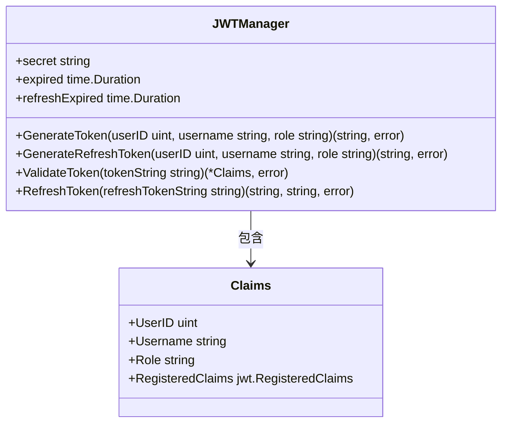
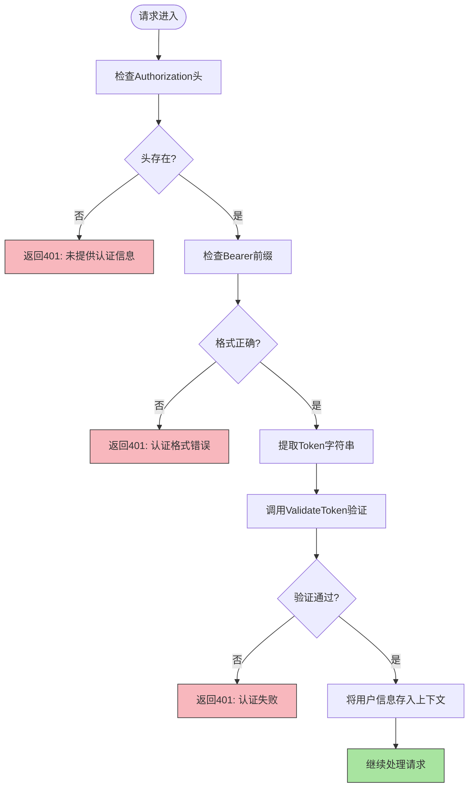
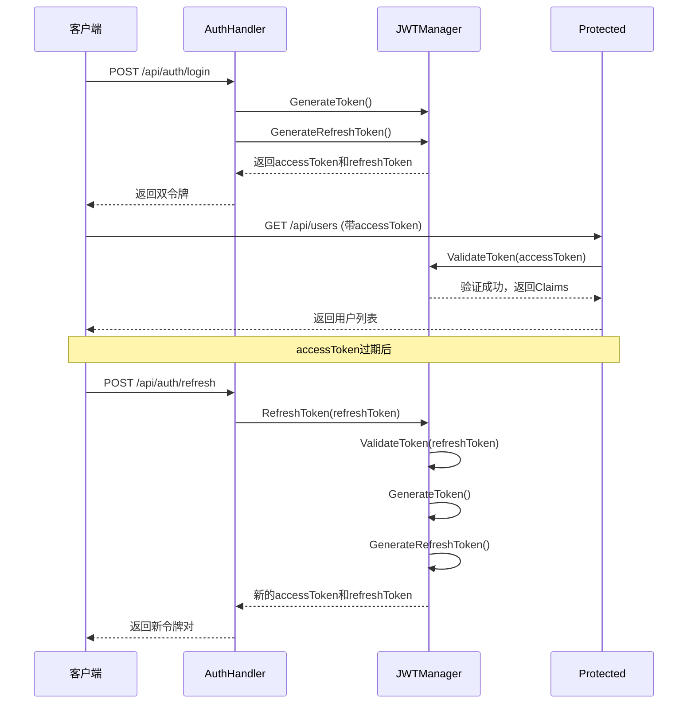

# JWT实现机制

<cite>
**本文档引用文件**  
- [jwt.go](file://backend/internal/auth/jwt.go)
- [middleware.go](file://backend/internal/middleware/middleware.go)
- [config.yaml](file://backend/configs/config.yaml)
- [config.go](file://backend/internal/config/config.go)
- [auth.go](file://backend/internal/api/auth.go)
- [router.go](file://backend/internal/api/router.go)
</cite>

## 目录
1. [简介](#简介)
2. [JWT令牌生成机制](#jwt令牌生成机制)
3. [自定义声明与过期时间设置](#自定义声明与过期时间设置)
4. [密钥安全管理](#密钥安全管理)
5. [认证中间件流程分析](#认证中间件流程分析)
6. [双令牌机制工作流程](#双令牌机制工作流程)
7. [错误处理策略](#错误处理策略)
8. [核心函数调用示例](#核心函数调用示例)
9. [总结](#总结)

## 简介
本文深入解析qoder项目中JWT令牌的完整实现流程。基于`jwt.go`和`middleware.go`两个核心文件，详细说明HS256算法下访问令牌（AccessToken）与刷新令牌（RefreshToken）的生成、验证及安全控制机制。结合配置文件中的参数设置，阐述双令牌机制如何在保障系统安全性的同时提升用户体验。

**Section sources**
- [jwt.go](file://backend/internal/auth/jwt.go#L1-L108)
- [middleware.go](file://backend/internal/middleware/middleware.go#L1-L117)

## JWT令牌生成机制

### HS256签名算法实现
qoder项目采用HS256（HMAC SHA-256）对称加密算法进行JWT签名。该算法使用共享密钥对令牌内容进行签名和验证，确保令牌的完整性和防篡改性。

在`jwt.go`中，通过`jwt.NewWithClaims`方法创建带有自定义声明的JWT对象，并指定`jwt.SigningMethodHS256`作为签名算法：
```go
token := jwt.NewWithClaims(jwt.SigningMethodHS256, claims)
return token.SignedString([]byte(j.secret))
```

签名过程将头部（Header）、载荷（Payload）和签名（Signature）三部分组合成标准JWT格式（xxx.yyy.zzz），其中签名部分由`HMACSHA256(base64UrlEncode(header) + "." + base64UrlEncode(payload), secret)`生成。

**Section sources**
- [jwt.go](file://backend/internal/auth/jwt.go#L50-L51)
- [jwt.go](file://backend/internal/auth/jwt.go#L74-L75)

### 访问令牌与刷新令牌生成逻辑
系统通过`JWTManager`结构体提供两个独立的生成函数：

- `GenerateToken`：生成短期有效的访问令牌，用于常规API请求认证
- `GenerateRefreshToken`：生成长期有效的刷新令牌，仅用于获取新的访问令牌

两者均基于相同的声明结构，但过期时间不同，体现了职责分离的安全设计原则。



**Diagram sources**
- [jwt.go](file://backend/internal/auth/jwt.go#L11-L16)
- [jwt.go](file://backend/internal/auth/jwt.go#L24-L38)

## 自定义声明与过期时间设置

### 自定义声明结构定义
`Claims`结构体继承了`jwt.RegisteredClaims`，并扩展了业务所需的用户信息字段：

```go
type Claims struct {
	UserID   uint   `json:"user_id"`
	Username string `json:"username"`
	Role     string `json:"role"`
	jwt.RegisteredClaims
}
```

包含以下核心字段：
- `user_id`：用户唯一标识
- `username`：用户名
- `role`：用户角色（如admin、user）
- 标准声明：`ExpiresAt`、`IssuedAt`、`NotBefore`

**Section sources**
- [jwt.go](file://backend/internal/auth/jwt.go#L11-L16)

### 过期时间配置策略
系统采用差异化过期策略实现安全与体验的平衡：

| 令牌类型 | 配置参数 | 默认值 | 说明 |
|--------|--------|-------|------|
| 访问令牌 | expired | 3600秒（1小时） | 短期有效，降低泄露风险 |
| 刷新令牌 | refresh_expired | 604800秒（7天） | 长期有效，减少频繁登录 |

这些值从`config.yaml`文件中读取，支持灵活调整：

```yaml
jwt:
  secret: "your-secret-key-here"
  expired: 3600
  refresh_expired: 604800
```

**Section sources**
- [config.yaml](file://backend/configs/config.yaml#L34-L39)
- [config.go](file://backend/internal/config/config.go#L54-L58)

## 密钥安全管理

### 密钥注入与配置管理
JWT密钥通过配置系统注入，避免硬编码：

1. 在`config.yaml`中定义`jwt.secret`
2. 由`config.Load()`解析为`Config.JWT.Secret`
3. 传递给`NewAuthHandler`和`JWTAuth`中间件

生产环境中强制要求通过环境变量`JWT_SECRET`设置密钥，防止配置文件泄露导致安全风险：

```go
if cm.config.Server.Mode == "production" {
	if os.Getenv("JWT_SECRET") == "" {
		return fmt.Errorf("JWT_SECRET environment variable is required in production mode")
	}
}
```

**Section sources**
- [config_manager.go](file://backend/internal/app/config_manager.go#L68-L124)
- [config.yaml](file://backend/configs/config.yaml#L34)

## 认证中间件流程分析

### HTTP请求头中的Token传递
客户端在每次请求时需在`Authorization`头中携带Bearer Token：

```
Authorization: Bearer <access_token>
```

中间件`JWTAuth`负责解析和验证此头部信息。

### Token解析与验证全过程
`middleware.go`中的`JWTAuth`函数实现完整的认证流程：



**Diagram sources**
- [middleware.go](file://backend/internal/middleware/middleware.go#L46-L115)

**Section sources**
- [middleware.go](file://backend/internal/middleware/middleware.go#L46-L115)

## 双令牌机制工作流程

### 双令牌交互时序
双令牌机制通过分离访问与刷新权限，实现安全与用户体验的平衡：



**Diagram sources**
- [auth.go](file://backend/internal/api/auth.go#L53-L110)
- [jwt.go](file://backend/internal/auth/jwt.go#L90-L107)

**Section sources**
- [auth.go](file://backend/internal/api/auth.go#L53-L110)
- [router.go](file://backend/internal/api/router.go#L30-L32)

### 安全性与用户体验优势
| 优势维度 | 说明 |
|--------|------|
| **安全性** | 访问令牌生命周期短，即使泄露影响有限；刷新令牌独立管理，可单独撤销 |
| **用户体验** | 用户无需频繁重新登录，保持长时间会话 |
| **灵活性** | 支持令牌刷新、强制登出（通过黑名单）等高级功能 |
| **可扩展性** | 易于集成单点登录、多设备管理等场景 |

## 错误处理策略

### 异常类型与响应码
系统对各类JWT相关异常进行了精细化处理：

| 异常情况 | HTTP状态码 | 响应码 | 错误消息示例 | 处理逻辑 |
|--------|----------|-------|------------|--------|
| 未提供认证信息 | 401 | 401 | "未提供认证信息" | 直接返回 |
| 认证格式错误 | 401 | 401 | "认证格式错误" | 检查Bearer前缀 |
| 签名无效 | 401 | 401 | "认证失败: signature is invalid" | 验证签名 |
| 令牌过期 | 401 | 401 | "认证失败: token is expired" | 需刷新或重新登录 |
| 令牌格式错误 | 401 | 401 | "认证失败: illegal base64 data" | 解析失败 |
| 非法签名方法 | 401 | 401 | "无效的签名方法" | 防止算法混淆攻击 |

### 错误处理代码实现
在`ValidateToken`中通过回调函数进行签名方法校验：

```go
func(token *jwt.Token) (interface{}, error) {
	if _, ok := token.Method.(*jwt.SigningMethodHMAC); !ok {
		return nil, fmt.Errorf("无效的签名方法: %v", token.Header["alg"])
	}
	return []byte(j.secret), nil
}
```

中间件统一返回结构化错误响应：

```go
c.JSON(http.StatusUnauthorized, gin.H{
	"code":    401,
	"message": "认证失败: " + err.Error(),
})
```

**Section sources**
- [jwt.go](file://backend/internal/auth/jwt.go#L80-L88)
- [middleware.go](file://backend/internal/middleware/middleware.go#L60-L70)

## 核心函数调用示例

### Token生成调用方式
```go
// 创建JWT管理器
jwtManager := auth.NewJWTManager("your-secret", 3600, 604800)

// 生成访问令牌
accessToken, err := jwtManager.GenerateToken(1, "alice", "admin")
if err != nil {
    log.Fatal("生成令牌失败:", err)
}

// 生成刷新令牌
refreshToken, err := jwtManager.GenerateRefreshToken(1, "alice", "admin")
if err != nil {
    log.Fatal("生成刷新令牌失败:", err)
}
```

### Token验证调用方式
```go
// 验证令牌
claims, err := jwtManager.ValidateToken(accessToken)
if err != nil {
    log.Println("令牌无效:", err)
    // 返回401响应
}

// 使用声明信息
fmt.Printf("用户ID: %d, 用户名: %s, 角色: %s\n", 
    claims.UserID, claims.Username, claims.Role)
```

### 刷新令牌调用方式
```go
// 刷新令牌
newAccessToken, newRefreshToken, err := jwtManager.RefreshToken(oldRefreshToken)
if err != nil {
    log.Println("刷新失败:", err)
    // 返回401响应
}

// 返回新令牌对
return LoginResponse{
    AccessToken:  newAccessToken,
    RefreshToken: newRefreshToken,
    User:         user,
}
```

**Section sources**
- [jwt.go](file://backend/internal/auth/jwt.go#L50-L107)
- [auth.go](file://backend/internal/api/auth.go#L53-L110)

## 总结
qoder项目的JWT实现采用了标准的双令牌机制，通过HS256算法保障令牌安全性，结合合理的过期策略平衡安全与体验。系统通过`JWTManager`封装核心逻辑，`middleware`实现统一认证，`config`支持灵活配置，形成了完整、安全、可维护的身份认证体系。错误处理机制完善，能够准确识别并响应各类异常情况，为前端提供了清晰的交互指引。

**Section sources**
- [jwt.go](file://backend/internal/auth/jwt.go#L1-L108)
- [middleware.go](file://backend/internal/middleware/middleware.go#L1-L117)
- [config.yaml](file://backend/configs/config.yaml#L34-L39)