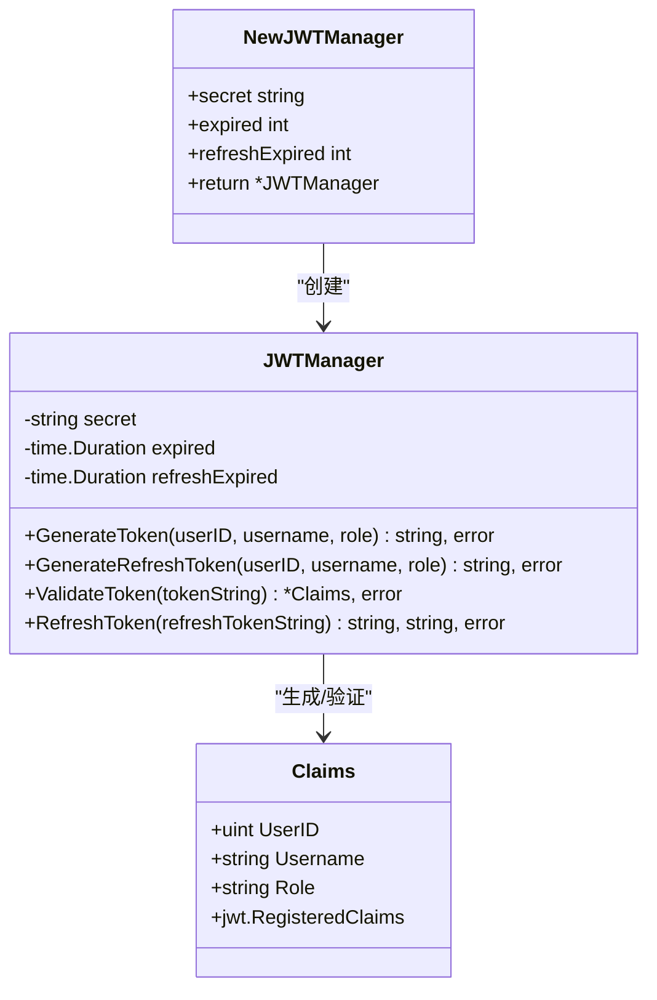
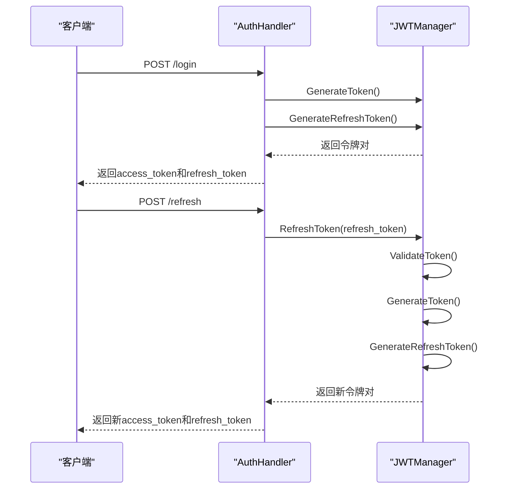
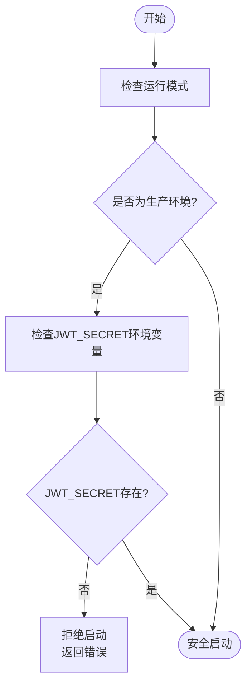
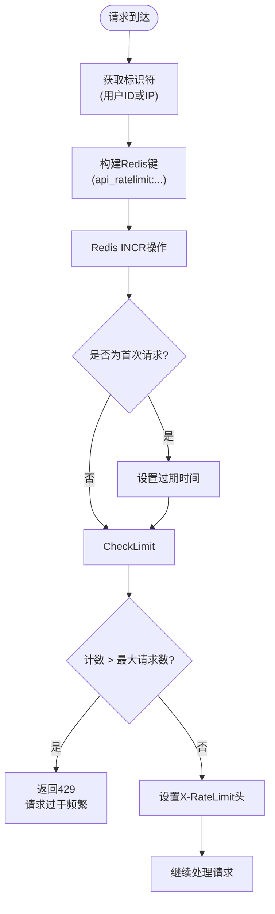

# 安全机制

<cite>
**本文档引用的文件**  
- [jwt.go](file://backend/internal/auth/jwt.go)
- [config_manager.go](file://backend/internal/app/config_manager.go)
- [middleware.go](file://backend/internal/middleware/middleware.go)
- [ratelimit.go](file://backend/internal/middleware/ratelimit.go)
- [config.go](file://backend/internal/config/config.go)
- [auth.go](file://backend/internal/api/auth.go)
</cite>

## 目录
1. [引言](#引言)
2. [JWT令牌安全机制](#jwt令牌安全机制)
3. [双令牌策略实现](#双令牌策略实现)
4. [生产环境密钥强制校验](#生产环境密钥强制校验)
5. [认证中间件工作流程](#认证中间件工作流程)
6. [基于Redis的请求频率限制](#基于redis的请求频率限制)
7. [安全配置最佳实践](#安全配置最佳实践)
8. [总结](#总结)

## 引言
qoder系统构建了一套完整的安全防护体系，涵盖身份认证、权限控制、请求限流和配置安全等多个层面。本文档深入解析其核心安全组件，包括JWT令牌管理、双令牌刷新机制、生产环境密钥校验、认证中间件及基于Redis的限流策略，旨在为系统维护和安全审计提供详实的技术依据。

## JWT令牌安全机制

qoder使用`github.com/golang-jwt/jwt/v5`库实现JWT令牌的安全生成与验证。系统定义了自定义的`Claims`结构体，包含用户ID、用户名、角色等关键信息，并集成标准的注册声明（如过期时间、签发时间）。

令牌采用HS256（HMAC-SHA256）算法进行签名，确保数据完整性与防篡改。签名密钥由环境变量或配置文件提供，且在生产环境中强制校验，防止因密钥缺失导致的安全漏洞。



**图示来源**  
- [jwt.go](file://backend/internal/auth/jwt.go#L10-L108)

**本节来源**  
- [jwt.go](file://backend/internal/auth/jwt.go#L1-L108)

## 双令牌策略实现

为平衡安全性与用户体验，qoder采用AccessToken与RefreshToken双令牌机制：

- **AccessToken**：短期有效（默认1小时），用于常规API请求的身份认证。
- **RefreshToken**：长期有效（默认7天），用于在AccessToken过期后获取新的令牌对，减少用户频繁登录。

当用户登录成功，系统调用`GenerateToken`和`GenerateRefreshToken`方法分别生成两个令牌。当AccessToken过期时，客户端可使用RefreshToken调用`RefreshToken`接口，服务端验证RefreshToken有效性后，返回新的AccessToken和RefreshToken，实现无感刷新。

该机制通过`JWTManager`的`RefreshToken`方法实现，内部调用`ValidateToken`验证刷新令牌，并重新调用生成方法创建新令牌。



**图示来源**  
- [jwt.go](file://backend/internal/auth/jwt.go#L60-L108)
- [auth.go](file://backend/internal/api/auth.go#L75-L105)

**本节来源**  
- [jwt.go](file://backend/internal/auth/jwt.go#L45-L108)
- [auth.go](file://backend/internal/api/auth.go#L75-L105)

## 生产环境密钥强制校验

为防止生产环境因JWT密钥配置缺失导致的安全风险，qoder在`ConfigManager`中实现了严格的环境校验机制。

`ValidateEnvironment`方法在系统启动时被调用，检查当前运行模式是否为生产环境（`production`或`release`）。若是，则强制校验`JWT_SECRET`环境变量是否存在。若该变量为空，系统将拒绝启动并返回明确错误，确保密钥不会以明文或默认值形式暴露。

此机制通过`os.Getenv("JWT_SECRET")`读取环境变量，并结合配置中的`Server.Mode`字段进行判断，体现了“安全默认”原则。



**图示来源**  
- [config_manager.go](file://backend/internal/app/config_manager.go#L75-L85)

**本节来源**  
- [config_manager.go](file://backend/internal/app/config_manager.go#L75-L85)
- [config.go](file://backend/internal/config/config.go#L35-L40)

## 认证中间件工作流程

qoder使用Gin框架的中间件机制实现统一的JWT认证。`JWTAuth`中间件负责拦截所有受保护的API请求，执行令牌验证流程。

工作流程如下：
1. 从请求头`Authorization`中提取Bearer令牌。
2. 检查令牌格式是否符合`Bearer <token>`规范。
3. 调用`JWTManager.ValidateToken`方法解析并验证令牌签名与有效期。
4. 若验证成功，将用户信息（ID、用户名、角色）注入Gin上下文，供后续处理器使用；否则返回401错误。

此外，`RequireRole`中间件可进一步检查用户角色权限，实现基于角色的访问控制（RBAC），确保用户只能访问其权限范围内的资源。

```mermaid
sequenceDiagram
participant Client as "客户端"
participant Middleware as "JWTAuth中间件"
participant JWTManager as "JWTManager"
Client->>Middleware : 发起API请求
Middleware->>Middleware : 获取Authorization头
alt 头部为空
Middleware-->>Client : 401 未提供认证信息
return
end
Middleware->>Middleware : 检查Bearer前缀
alt 格式错误
Middleware-->>Client : 401 认证格式错误
return
end
Middleware->>Middleware : 提取Token
Middleware->>JWTManager : ValidateToken(token)
alt 验证失败
JWTManager-->>Middleware : 返回错误
Middleware-->>Client : 401 认证失败
return
end
JWTManager-->>Middleware : 返回Claims
Middleware->>Middleware : 设置用户信息到上下文
Middleware->>Client : 继续处理请求
```

**图示来源**  
- [middleware.go](file://backend/internal/middleware/middleware.go#L20-L70)

**本节来源**  
- [middleware.go](file://backend/internal/middleware/middleware.go#L20-L70)
- [jwt.go](file://backend/internal/auth/jwt.go#L85-L108)

## 基于Redis的请求频率限制

为防止暴力破解和DDoS攻击，qoder实现了基于Redis的分布式请求频率限制。`RateLimit`中间件利用Redis的原子操作`INCR`和`EXPIRE`实现滑动窗口限流。

核心逻辑：
- **标识符**：已登录用户使用`user:<id>`，未登录用户使用`ip:<ip>`。
- **限流键**：`api_ratelimit:<identifier>:<method>:<path>`。
- **计数**：每次请求对键执行`INCR`，首次请求设置过期时间（时间窗口）。
- **判断**：若计数超过阈值（如100次/分钟），返回429状态码。

此外，`LoginRateLimit`专门针对登录接口，限制同一IP在15分钟内最多尝试5次，有效防御密码爆破。



**图示来源**  
- [ratelimit.go](file://backend/internal/middleware/ratelimit.go#L25-L75)

**本节来源**  
- [ratelimit.go](file://backend/internal/middleware/ratelimit.go#L1-L115)
- [cache.go](file://backend/pkg/cache/cache.go#L1-L50)

## 安全配置最佳实践

基于qoder的安全设计，提出以下配置最佳实践：

### 密钥管理
- **生产环境**：必须通过环境变量（如`JWT_SECRET`）注入密钥，禁止在代码或配置文件中硬编码。
- **轮换机制**：定期更换JWT密钥，并实现密钥版本化以支持平滑过渡。
- **存储安全**：使用密钥管理服务（如Vault）或云平台KMS存储敏感密钥。

### HTTPS强制启用
- 所有生产环境API端点必须通过HTTPS提供服务，防止令牌在传输过程中被窃取。
- 配置HSTS（HTTP Strict Transport Security）策略，强制浏览器使用安全连接。

### 敏感信息脱敏
- 日志记录中应屏蔽敏感字段（如密码、完整令牌）。
- API响应中避免返回数据库内部ID等敏感信息，可使用UUID替代。
- 错误信息应通用化，避免泄露系统内部结构（如数据库错误详情）。

### 其他建议
- **最小权限原则**：用户角色权限应精确到具体操作，避免过度授权。
- **会话管理**：考虑实现令牌黑名单机制，支持用户主动登出和令牌撤销。
- **安全头**：响应中添加`X-Content-Type-Options`, `X-Frame-Options`等安全头，防范常见Web攻击。

**本节来源**  
- [config_manager.go](file://backend/internal/app/config_manager.go#L75-L85)
- [middleware.go](file://backend/internal/middleware/middleware.go#L5-L116)
- [ratelimit.go](file://backend/internal/middleware/ratelimit.go#L1-L115)

## 总结
qoder通过JWT双令牌机制、生产环境密钥强制校验、认证中间件和Redis限流等多重措施，构建了纵深防御的安全体系。其设计充分考虑了安全性、可用性和可维护性，为系统的稳定运行提供了坚实保障。遵循本文档提出的安全最佳实践，可进一步提升系统的整体安全水位。