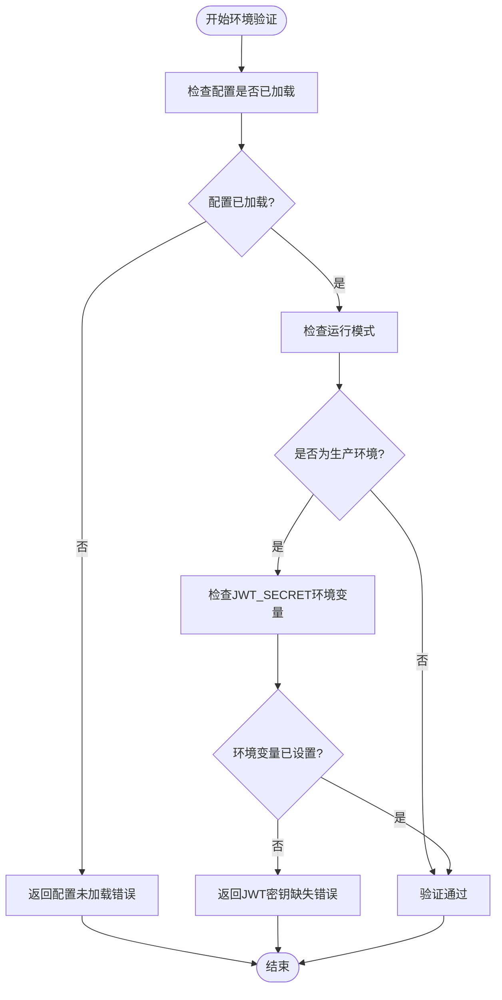
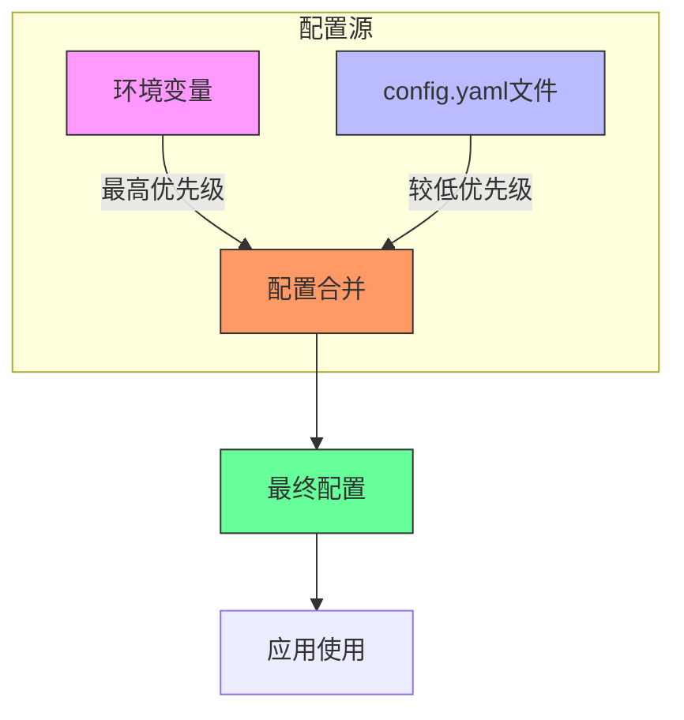

# 生产环境安全配置要求

<cite>
**本文档引用的文件**  
- [config_manager.go](file://backend/internal/app/config_manager.go)
- [config.go](file://backend/internal/config/config.go)
- [config.yaml](file://backend/configs/config.yaml)
- [app.go](file://backend/internal/app/app.go)
</cite>

## 目录
1. [引言](#引言)
2. [安全配置策略概述](#安全配置策略概述)
3. [JWT密钥强制校验机制](#jwt密钥强制校验机制)
4. [配置加载与优先级机制](#配置加载与优先级机制)
5. [安全相关配置项清单](#安全相关配置项清单)
6. [生产部署安全检查清单](#生产部署安全检查清单)
7. [结论与最佳实践建议](#结论与最佳实践建议)

## 引言
本文档详细说明qoder系统在生产环境中强制执行的安全配置策略，重点分析系统如何通过`config_manager.go`对关键安全参数进行校验，特别是对`DEVOPS_JWT_SECRET`环境变量的强制要求。文档同时阐述Viper配置库的加载机制，列出所有与安全相关的配置项，并提供生产部署时的安全检查清单和最佳实践。

## 安全配置策略概述
qoder系统通过`ConfigManager`组件在应用启动和运行时实施多层次的安全配置验证。系统在初始化阶段即执行配置校验，并在生产模式下强制要求提供强密钥，防止因使用默认值或空值导致的安全漏洞。安全策略的核心是环境感知的配置验证机制，确保不同运行模式下采取相应的安全措施。

**Section sources**
- [config_manager.go](file://backend/internal/app/config_manager.go#L84-L86)
- [app.go](file://backend/internal/app/app.go#L35-L38)

## JWT密钥强制校验机制
系统在生产模式下对JWT密钥实施严格的强制校验策略。`ConfigManager`的`ValidateEnvironment`方法负责执行此安全检查：

1. 当系统运行模式为"production"或"release"时，系统进入生产环境安全模式
2. 在此模式下，系统检查`JWT_SECRET`环境变量是否已设置
3. 如果环境变量为空，系统将返回错误并拒绝启动

该机制通过`IsProduction`方法识别生产环境，确保只有在生产模式下才强制执行密钥要求，而在开发模式下允许更灵活的配置以方便开发调试。

**Diagram sources**
- [config_manager.go](file://backend/internal/app/config_manager.go#L84-L86)
- [config_manager.go](file://backend/internal/app/config_manager.go#L104-L111)

**Section sources**
- [config_manager.go](file://backend/internal/app/config_manager.go#L84-L86)
- [config_manager.go](file://backend/internal/app/config_manager.go#L104-L111)

## 配置加载与优先级机制
系统使用Viper库实现灵活的配置管理，采用多源配置合并策略，确保环境变量优先于配置文件：

1. **配置源设置**：系统从`./configs`和`../configs`目录加载`config.yaml`文件
2. **环境变量前缀**：设置环境变量前缀为"DEVOPS"，所有配置项可通过`DEVOPS_`前缀访问
3. **自动环境变量绑定**：启用`AutomaticEnv()`功能，实现环境变量与配置结构的自动映射
4. **优先级规则**：环境变量的优先级高于配置文件，允许在部署时通过环境变量覆盖文件配置

例如，`jwt.secret`配置项可通过`DEVOPS_JWT_SECRET`环境变量进行覆盖，确保生产环境中可以安全地注入密钥而无需修改配置文件。

**Diagram sources**
- [config.go](file://backend/internal/config/config.go#L83-L86)
- [config.go](file://backend/internal/config/config.go#L75-L78)

**Section sources**
- [config.go](file://backend/internal/config/config.go#L83-L86)
- [config.go](file://backend/internal/config/config.go#L75-L78)

## 安全相关配置项清单
以下是系统中所有与安全相关的关键配置项及其安全推荐值：

<table>
  <tr>
    <th>配置项</th>
    <th>路径</th>
    <th>安全风险</th>
    <th>生产环境推荐值</th>
  </tr>
  <tr>
    <td>运行模式</td>
    <td>server.mode</td>
    <td>开发模式可能启用调试功能和不安全的默认设置</td>
    <td>"production" 或 "release"</td>
  </tr>
  <tr>
    <td>JWT密钥</td>
    <td>jwt.secret</td>
    <td>弱密钥或空密钥导致身份验证被绕过</td>
    <td>通过DEVOPS_JWT_SECRET环境变量设置，长度至少32字节的随机字符串</td>
  </tr>
  <tr>
    <td>HTTPS启用</td>
    <td>server.tls_enabled</td>
    <td>未加密的通信导致敏感数据泄露</td>
    <td>true（需配合证书配置）</td>
  </tr>
  <tr>
    <td>数据库密码</td>
    <td>database.password</td>
    <td>明文密码在配置文件中存储</td>
    <td>通过DEVOPS_DATABASE_PASSWORD环境变量设置</td>
  </tr>
  <tr>
    <td>Redis密码</td>
    <td>redis.password</td>
    <td>未授权访问缓存数据</td>
    <td>通过DEVOPS_REDIS_PASSWORD环境变量设置</td>
  </tr>
  <tr>
    <td>日志级别</td>
    <td>log.level</td>
    <td>过度详细的日志可能泄露敏感信息</td>
    <td>"info" 或 "warn"，避免使用"debug"</td>
  </tr>
</table>

**Section sources**
- [config.yaml](file://backend/configs/config.yaml#L2)
- [config.go](file://backend/internal/config/config.go#L20-L25)
- [config_manager.go](file://backend/internal/app/config_manager.go#L104-L111)

## 生产部署安全检查清单
为确保生产环境的安全性，部署时应执行以下检查：

### 密钥管理
- [ ] 使用`openssl rand -hex 32`生成32字节的JWT密钥：`openssl rand -hex 32`
- [ ] 使用`openssl rand -base64 32`生成Base64编码的密钥：`openssl rand -base64 32`
- [ ] 所有密钥必须通过环境变量注入，而非硬编码在配置文件中
- [ ] 确保`.env`文件或环境变量配置文件的权限设置为600（仅所有者可读写）

### 配置文件安全
- [ ] 生产环境配置文件权限设置为644，目录权限为755
- [ ] 敏感配置文件（如包含密钥的文件）应存储在安全的位置，如`/etc/qoder/`或专用的密钥管理系统
- [ ] 使用文件系统ACL或操作系统安全机制限制对配置文件的访问

### 环境变量保护
- [ ] 设置环境变量前缀为`DEVOPS_`，避免与其他应用冲突
- [ ] 在Docker环境中使用`--env-file`参数从安全文件加载环境变量
- [ ] Kubernetes部署时使用Secrets管理敏感配置
- [ ] 避免在启动脚本或日志中明文显示环境变量值

### 运行时安全
- [ ] 确认应用以非root用户身份运行
- [ ] 启用防火墙规则，仅开放必要的端口
- [ ] 配置WAF（Web应用防火墙）防护常见攻击
- [ ] 定期轮换密钥，建议每90天更换一次JWT密钥

### 监控与审计
- [ ] 启用详细的访问日志记录，包括认证尝试
- [ ] 配置异常登录尝试的告警机制
- [ ] 定期审计配置变更历史
- [ ] 监控配置加载过程中的安全验证错误

**Section sources**
- [config_manager.go](file://backend/internal/app/config_manager.go#L84-L86)
- [config.go](file://backend/internal/config/config.go#L83-L86)
- [config.yaml](file://backend/configs/config.yaml)

## 结论与最佳实践建议
qoder系统通过`ConfigManager`实现了严格的生产环境安全配置策略，特别是对JWT密钥的强制校验机制有效防止了因默认或空密钥导致的安全漏洞。系统采用Viper库的环境变量优先策略，确保生产环境中可以通过安全方式注入敏感配置。

**核心安全最佳实践**：
1. **环境分离**：严格区分开发、测试和生产环境的配置
2. **密钥管理**：始终使用强随机密钥并通过环境变量注入
3. **最小权限**：应用运行账户应具有最小必要权限
4. **配置审计**：定期审查和更新安全配置
5. **自动化验证**：在CI/CD流程中加入安全配置检查

通过遵循本文档的安全配置要求和检查清单，可以显著提升qoder系统在生产环境中的安全性，降低因配置不当导致的安全风险。