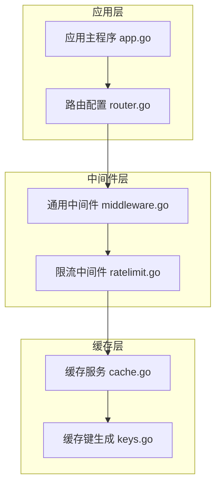
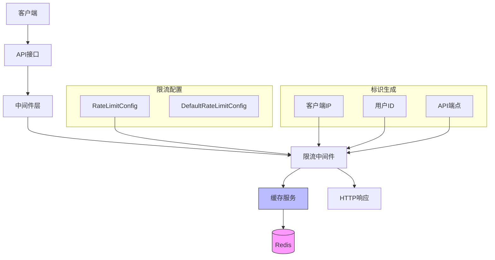
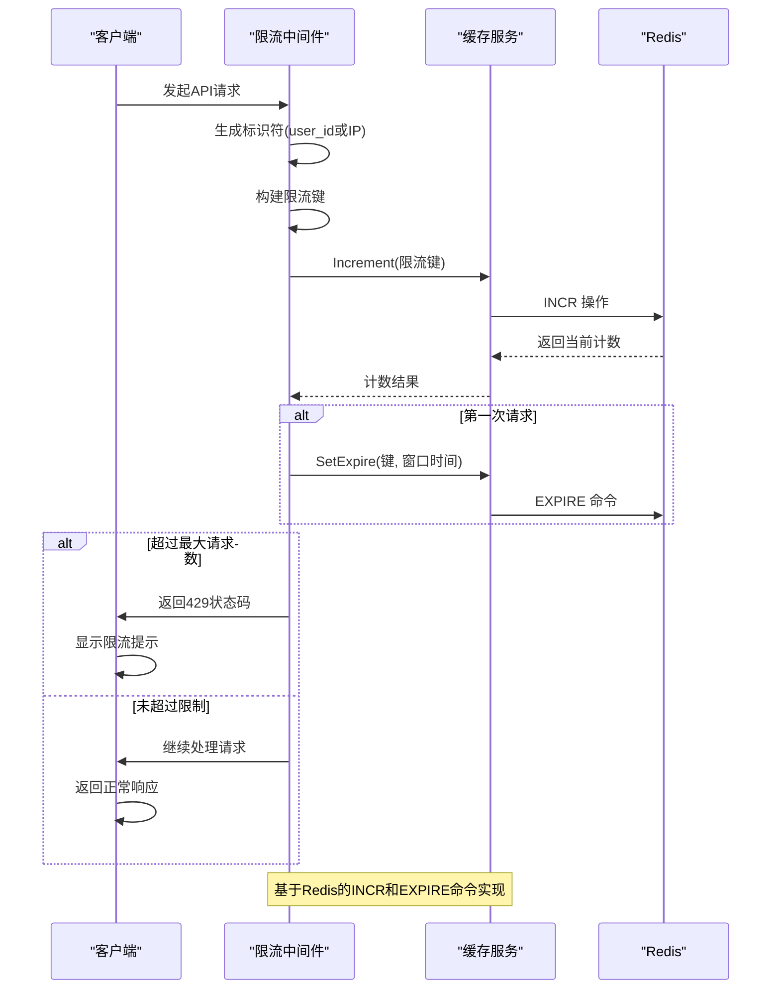
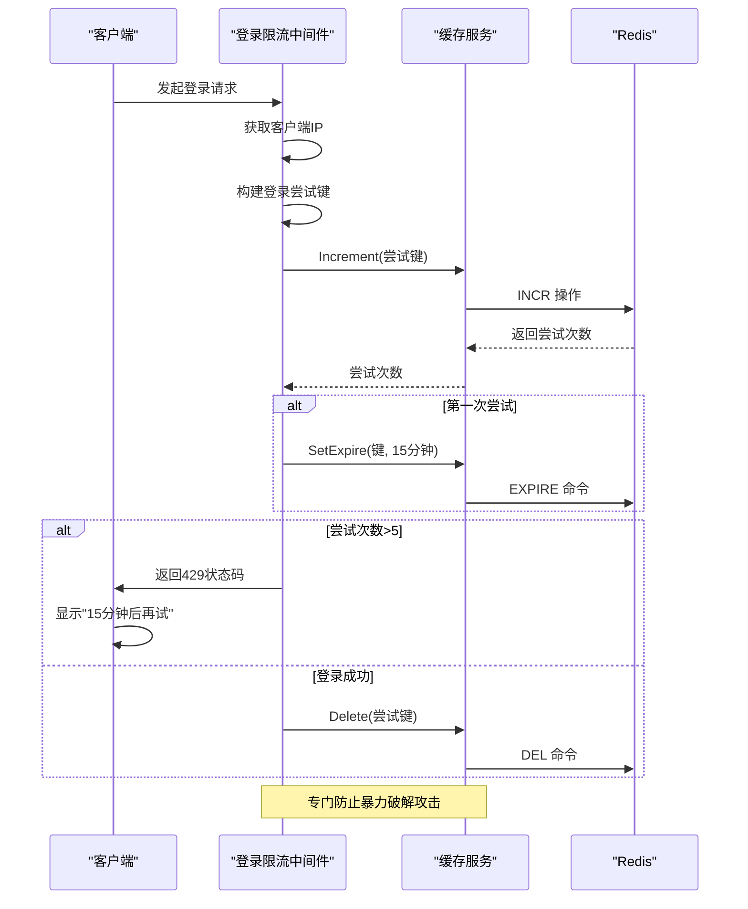
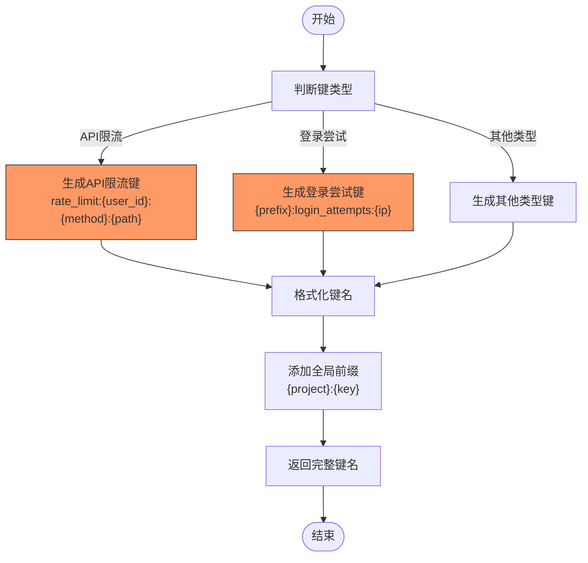
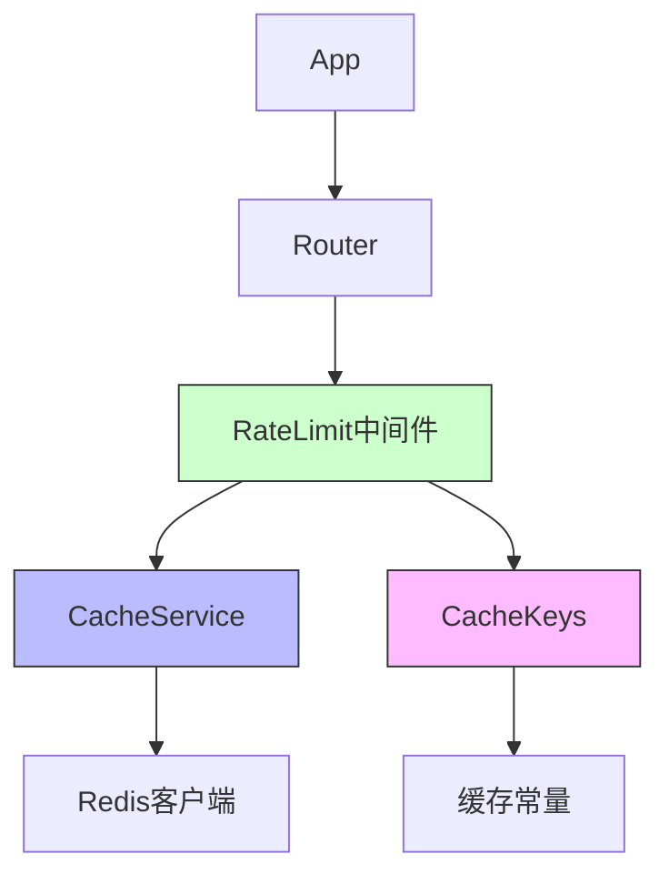

# 请求限流策略

<cite>
**本文档引用文件**   
- [ratelimit.go](file://backend/internal/middleware/ratelimit.go)
- [middleware.go](file://backend/internal/middleware/middleware.go)
- [cache.go](file://backend/pkg/cache/cache.go)
- [keys.go](file://backend/pkg/cache/keys.go)
- [router.go](file://backend/internal/api/router.go)
- [app.go](file://backend/internal/app/app.go)
</cite>

## 目录
1. [项目结构](#项目结构)
2. [核心组件](#核心组件)
3. [架构概述](#架构概述)
4. [详细组件分析](#详细组件分析)
5. [依赖分析](#依赖分析)
6. [性能考虑](#性能考虑)
7. [故障排除指南](#故障排除指南)
8. [结论](#结论)

## 项目结构

qoder项目的限流功能主要集中在`backend/internal/middleware`目录下，通过Redis实现分布式环境下的请求频率控制。系统利用Gin框架的中间件机制，将限流逻辑无缝集成到HTTP请求处理流程中。



**图示来源**
- [ratelimit.go](file://backend/internal/middleware/ratelimit.go#L1-L115)
- [middleware.go](file://backend/internal/middleware/middleware.go#L1-L116)
- [cache.go](file://backend/pkg/cache/cache.go#L1-L152)
- [keys.go](file://backend/pkg/cache/keys.go#L1-L120)

**本节来源**
- [backend/internal/middleware/ratelimit.go](file://backend/internal/middleware/ratelimit.go)
- [backend/pkg/cache/cache.go](file://backend/pkg/cache/cache.go)

## 核心组件

qoder的请求限流机制基于Redis实现，采用固定窗口计数算法，通过`INCR`和`EXPIRE`命令实现高效的分布式计数与过期控制。系统提供了通用API限流和登录限流两种策略，分别针对接口调用频率和登录尝试次数进行控制。

**本节来源**
- [ratelimit.go](file://backend/internal/middleware/ratelimit.go#L1-L115)
- [cache.go](file://backend/pkg/cache/cache.go#L1-L152)

## 架构概述

qoder的限流系统采用分层架构设计，各组件协同工作实现完整的限流功能：



**图示来源**
- [ratelimit.go](file://backend/internal/middleware/ratelimit.go#L1-L115)
- [cache.go](file://backend/pkg/cache/cache.go#L1-L152)

## 详细组件分析

### 限流配置分析

qoder提供了灵活的限流配置机制，允许为不同接口设置不同的限流规则。

```mermaid
classDiagram
class RateLimitConfig {
+MaxRequests int
+Window time.Duration
+Message string
}
class DefaultRateLimitConfig {
+MaxRequests : 100
+Window : 1分钟
+Message : "请求过于频繁，请稍后再试"
}
RateLimitConfig <|-- DefaultRateLimitConfig : 实例化
note right of RateLimitConfig
MaxRequests : 最大请求数
Window : 时间窗口
Message : 限流提示消息
end note
```

**图示来源**
- [ratelimit.go](file://backend/internal/middleware/ratelimit.go#L14-L25)

**本节来源**
- [ratelimit.go](file://backend/internal/middleware/ratelimit.go#L14-L25)

### 通用API限流分析

通用API限流中间件根据用户身份或客户端IP进行请求计数，实现细粒度的访问控制。



**图示来源**
- [ratelimit.go](file://backend/internal/middleware/ratelimit.go#L28-L75)
- [cache.go](file://backend/pkg/cache/cache.go#L115-L125)

**本节来源**
- [ratelimit.go](file://backend/internal/middleware/ratelimit.go#L28-L75)

### 登录限流分析

登录限流专门针对登录接口设计，防止暴力破解攻击。



**图示来源**
- [ratelimit.go](file://backend/internal/middleware/ratelimit.go#L76-L115)
- [keys.go](file://backend/pkg/cache/keys.go#L107-L110)

**本节来源**
- [ratelimit.go](file://backend/internal/middleware/ratelimit.go#L76-L115)

### 缓存键生成分析

系统使用统一的缓存键生成策略，确保键名的规范性和可维护性。



**图示来源**
- [keys.go](file://backend/pkg/cache/keys.go#L107-L110)
- [keys.go](file://backend/pkg/cache/keys.go#L111-L114)

**本节来源**
- [keys.go](file://backend/pkg/cache/keys.go#L107-L114)

## 依赖分析

限流系统各组件之间的依赖关系清晰，遵循单一职责原则：



**图示来源**
- [ratelimit.go](file://backend/internal/middleware/ratelimit.go#L28-L115)
- [cache.go](file://backend/pkg/cache/cache.go#L1-L152)
- [keys.go](file://backend/pkg/cache/keys.go#L1-L120)

**本节来源**
- [ratelimit.go](file://backend/internal/middleware/ratelimit.go#L28-L115)
- [cache.go](file://backend/pkg/cache/cache.go#L1-L152)

## 性能考虑

qoder的限流机制在性能方面做了充分考虑：

1. **原子操作**：使用Redis的`INCR`命令确保计数的原子性，避免并发问题
2. **过期自动清理**：通过`EXPIRE`命令设置自动过期，避免手动清理的开销
3. **错误降级**：当Redis出现故障时，限流中间件会自动降级，允许请求通过，保证系统可用性
4. **内存优化**：限流键具有明确的过期时间，不会无限占用Redis内存

**本节来源**
- [ratelimit.go](file://backend/internal/middleware/ratelimit.go#L50-L55)
- [ratelimit.go](file://backend/internal/middleware/ratelimit.go#L90-L95)

## 故障排除指南

### 常见问题及解决方案

| 问题现象 | 可能原因 | 解决方案 |
|---------|--------|--------|
| 限流不生效 | Redis连接失败 | 检查Redis配置和网络连接 |
| 所有用户都被限流 | 键冲突或前缀错误 | 检查CacheKeys生成逻辑 |
| 计数不准确 | 并发请求 | 确认使用INCR原子操作 |
| 内存占用过高 | 过期时间设置不当 | 检查EXPIRE设置 |

### 限流触发后的响应

当请求被限流时，系统会返回标准的HTTP 429响应：

```json
{
  "code": 429,
  "message": "请求过于频繁，请稍后再试"
}
```

同时设置响应头：
- `X-RateLimit-Limit`: 限制总数
- `X-RateLimit-Remaining`: 剩余请求数

**本节来源**
- [ratelimit.go](file://backend/internal/middleware/ratelimit.go#L65-L70)
- [ratelimit.go](file://backend/internal/middleware/ratelimit.go#L100-L105)

## 结论

qoder的请求限流机制设计合理，实现了以下目标：

1. **分布式支持**：基于Redis实现，适用于多实例部署环境
2. **灵活配置**：提供默认配置和自定义配置选项
3. **细粒度控制**：支持按用户、IP、接口路径进行差异化限流
4. **安全防护**：有效防止暴力破解等恶意攻击
5. **用户体验**：提供清晰的限流提示和重试建议

该机制可有效保护系统资源，防止滥用，同时保证了正常用户的访问体验。