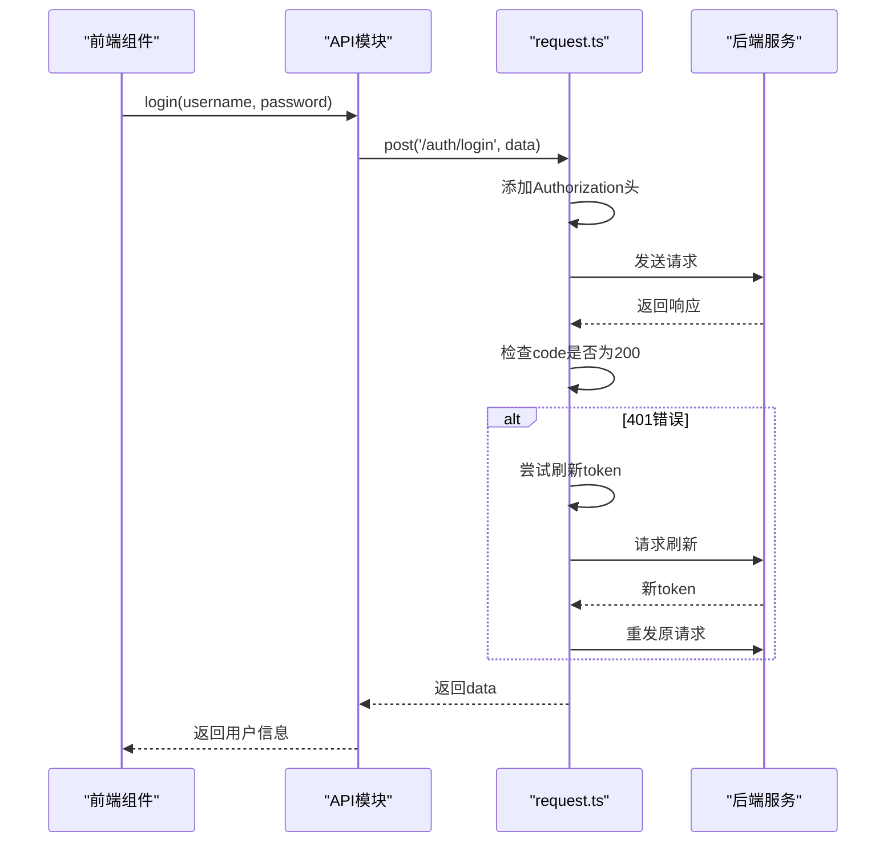
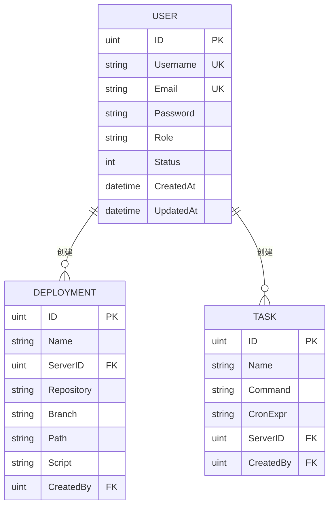
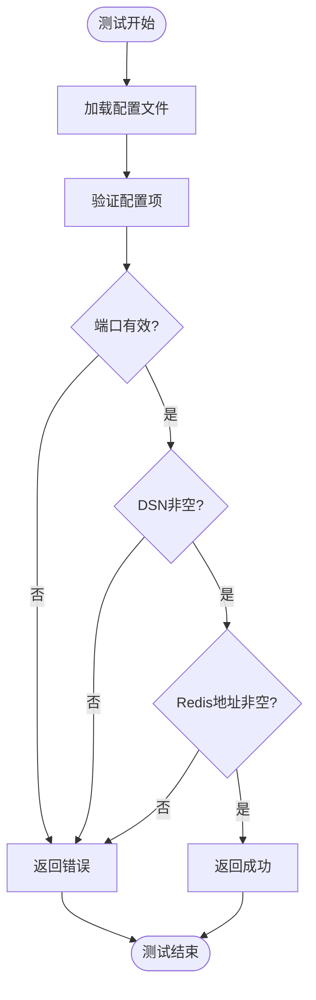

# 代码风格与规范

<cite>
**本文档引用文件**  
- [Makefile](file://Makefile#L1-L86)
- [app.go](file://backend/internal/app/app.go#L1-L211)
- [config_manager.go](file://backend/internal/app/config_manager.go#L1-L124)
- [user.go](file://backend/internal/service/user.go#L1-L171)
- [auth.ts](file://frontend/src/api/auth.ts#L1-L52)
- [request.ts](file://frontend/src/api/request.ts#L1-L68)
- [types.go](file://backend/internal/api/types.go#L1-L115)
- [user.go](file://backend/internal/model/user.go#L1-L29)
- [config_manager_test.go](file://backend/internal/app/config_manager_test.go#L1-L279)
</cite>

## 目录
1. [后端Go代码规范](#后端go代码规范)  
2. [前端TypeScript代码规范](#前端typescript代码规范)  
3. [接口与类型定义规范](#接口与类型定义规范)  
4. [自动化构建与检查](#自动化构建与检查)  
5. [测试规范](#测试规范)  

## 后端Go代码规范

项目后端采用Go语言开发，遵循统一的代码风格与结构规范，确保代码可读性与可维护性。

### 格式化与风格
所有Go代码必须使用 `gofmt` 进行格式化，确保代码风格统一。项目遵循 [Uber Go Style Guide](https://github.com/uber-go/guide/blob/master/style.md) 的最佳实践，包括但不限于：
- 使用驼峰命名法（CamelCase）进行变量与函数命名，如 `serverManager`、`configMgr`。
- 公共函数与方法必须包含注释，说明其用途、参数含义及返回值，如 `Login()`、`CreateUser()` 等函数均有清晰注释。
- 包名简洁且语义明确，如 `app`、`service`、`model` 等。

### 结构与组织
- 核心应用逻辑位于 `backend/internal/app/` 目录，如 `Application` 结构体定义在 `app.go` 中，负责初始化配置、数据库、缓存与服务器。
- 服务层位于 `backend/internal/service/`，每个服务（如 `UserService`）封装业务逻辑，依赖注入数据库与缓存实例。
- 配置管理由 `ConfigManager` 实现，支持配置验证、环境检查与日志初始化。

```mermaid
classDiagram
class Application {
+config *Config
+db *gorm.DB
+rdb *redis.Client
+configMgr *ConfigManager
+databaseMgr *DatabaseManager
+cacheMgr *CacheManager
+serverMgr *ServerManager
+Run() error
+initConfig() error
+initDatabase() error
+initCache() error
+waitForShutdown()
+gracefulShutdown()
}
class ConfigManager {
+config *Config
+Load() (*Config, error)
+validate(cfg *Config) error
+InitLogger() error
+Reload() error
+IsProduction() bool
+IsDevelopment() bool
}
class UserService {
+db *gorm.DB
+rdb *redis.Client
+cache *CacheService
+keys *CacheKeys
+Login(username, password) (*User, error)
+GetByID(id uint) (*User, error)
+Create(username, email, password, role) (*User, error)
+Update(id uint, updates map[string]interface{}) error
+Delete(id uint) error
+List(page, pageSize int) ([]User, int64, error)
}
Application --> ConfigManager : "使用"
Application --> UserService : "依赖"
UserService --> "gorm.DB" : "访问"
UserService --> "redis.Client" : "缓存"
```

**图示来源**  
- [app.go](file://backend/internal/app/app.go#L1-L211)
- [config_manager.go](file://backend/internal/app/config_manager.go#L1-L124)
- [user.go](file://backend/internal/service/user.go#L1-L171)

**本节来源**  
- [app.go](file://backend/internal/app/app.go#L1-L211)
- [config_manager.go](file://backend/internal/app/config_manager.go#L1-L124)

## 前端TypeScript代码规范

前端采用Vue 3 + TypeScript + Vite技术栈，遵循统一的编码与组织规范。

### 代码风格
- 使用 ESLint + Prettier 进行代码检查与格式化，确保语法一致性与代码整洁。
- 组件命名采用帕斯卡命名法（PascalCase），如 `DashboardView.vue`、`UserView.vue`，符合Vue组件命名惯例。
- 所有API调用统一封装在 `src/api/` 目录下，便于集中管理与维护。

### API封装规范
- 所有HTTP请求通过 `request.ts` 中封装的 `axios` 实例发送，包含请求与响应拦截器。
- 请求拦截器自动添加 `Authorization` 头部，响应拦截器处理401错误并尝试刷新令牌。
- 接口定义清晰，使用TypeScript接口描述请求与响应结构，如 `LoginRequest`、`LoginResponse`。



**图示来源**  
- [auth.ts](file://frontend/src/api/auth.ts#L1-L52)
- [request.ts](file://frontend/src/api/request.ts#L1-L68)

**本节来源**  
- [auth.ts](file://frontend/src/api/auth.ts#L1-L52)
- [request.ts](file://frontend/src/api/request.ts#L1-L68)

## 接口与类型定义规范

为确保前后端通信清晰、类型安全，接口与数据结构定义需遵循以下规范。

### 后端API类型定义
- 所有请求与响应结构定义在 `backend/internal/api/types.go` 中。
- 使用结构体标签（如 `json`、`binding`）明确字段序列化与校验规则。
- 通用响应结构 `Response` 包含 `code`、`message`、`data` 字段，确保统一返回格式。

例如：
- `LoginRequest` 包含 `username` 和 `password`，使用 `binding:"required"` 校验。
- `PageRequest` 支持分页参数，默认页码与大小，限制最大100条。

### 前端类型同步
- 前端在 `src/api/` 中定义对应接口，如 `LoginRequest`、`LoginResponse`，与后端保持一致。
- 使用泛型 `ApiResponse<T>` 封装响应，确保类型安全。



**图示来源**  
- [types.go](file://backend/internal/api/types.go#L1-L115)
- [user.go](file://backend/internal/model/user.go#L1-L29)

**本节来源**  
- [types.go](file://backend/internal/api/types.go#L1-L115)
- [user.go](file://backend/internal/model/user.go#L1-L29)

## 自动化构建与检查

项目通过 `Makefile` 提供统一的自动化命令，简化开发与部署流程。

### 支持的命令
| 命令 | 描述 |
|------|------|
| `make build` | 构建后端与前端 |
| `make test` | 运行所有测试 |
| `make dev` | 启动开发环境 |
| `make clean` | 清理构建文件 |
| `make lint` | 执行代码检查 |
| `make docker-up` | 启动Docker容器 |

### 代码检查目标
- `make lint` 执行 `go vet` 与 `gofmt -l .` 检查后端代码。
- 前端执行 `npm run lint`，集成ESLint检查。
- 推荐在CI/CD流程中集成 `lint` 与 `test` 目标，确保代码质量。

**本节来源**  
- [Makefile](file://Makefile#L1-L86)

## 测试规范

项目强调测试覆盖率与可维护性，鼓励编写单元测试与集成测试。

### 测试覆盖要求
- 单元测试覆盖率不低于80%，重点关注 `app` 层与 `service` 层。
- 测试文件命名遵循 `*_test.go` 规范，如 `app_test.go`、`config_manager_test.go`。
- 使用标准 `testing` 包，结合 `testify` 等断言库提升可读性。

### 示例：配置管理器测试
`config_manager_test.go` 中对 `ConfigManager` 进行全面测试，包括：
- 配置验证：测试端口、数据库DSN、Redis地址等边界条件。
- 环境检查：验证生产环境是否设置 `JWT_SECRET`。
- 方法行为：测试 `IsProduction()`、`IsDevelopment()` 等状态判断。



**图示来源**  
- [config_manager.go](file://backend/internal/app/config_manager.go#L1-L124)
- [config_manager_test.go](file://backend/internal/app/config_manager_test.go#L1-L279)

**本节来源**  
- [config_manager_test.go](file://backend/internal/app/config_manager_test.go#L1-L279)