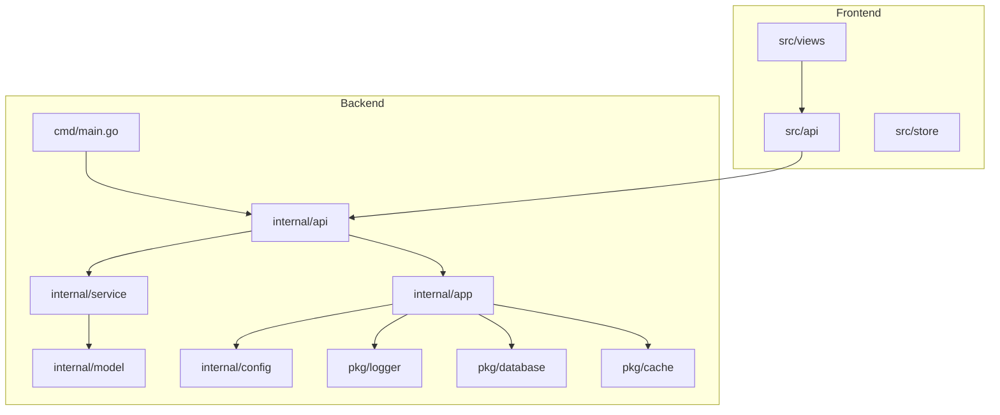
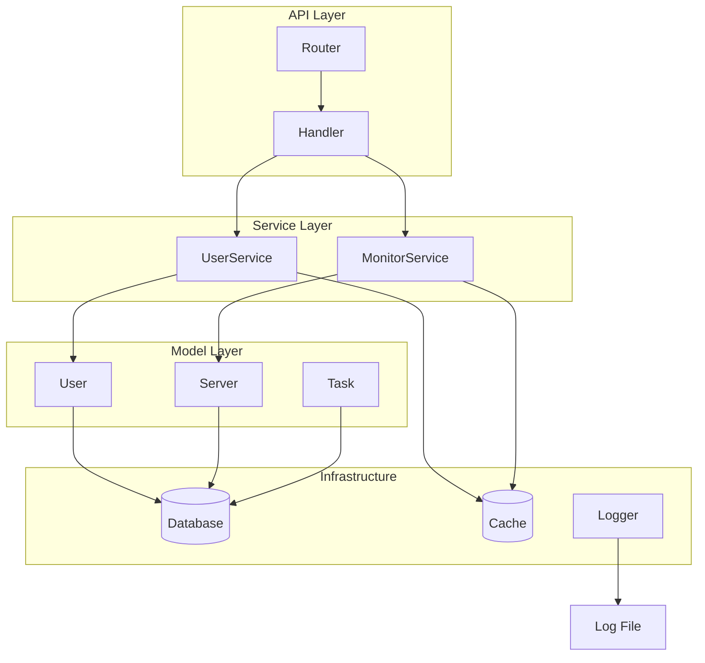
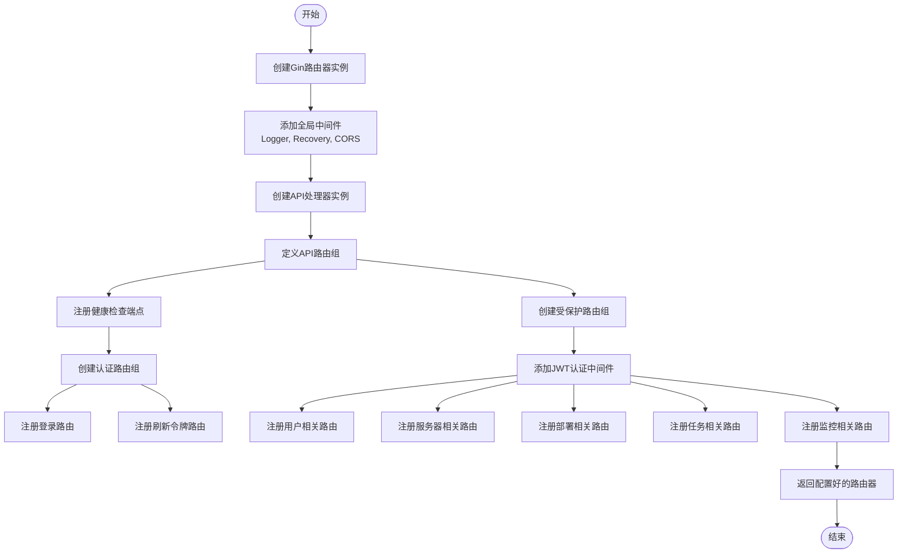
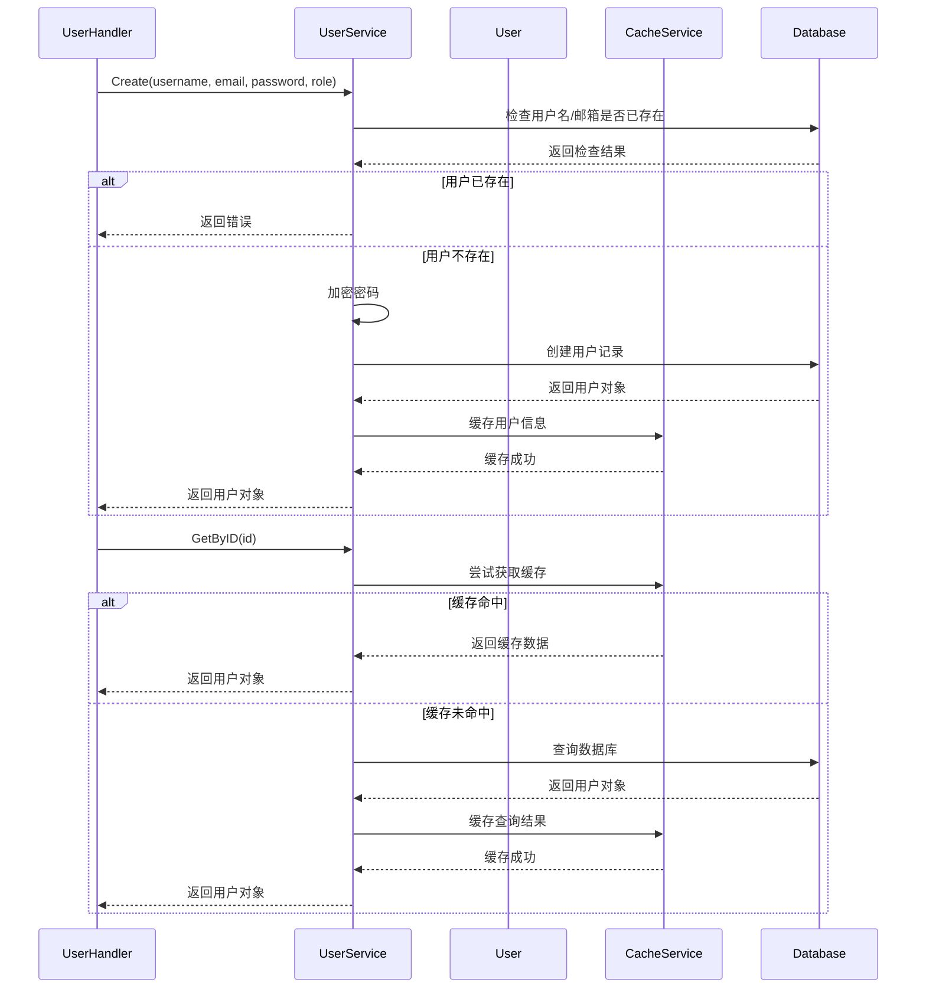
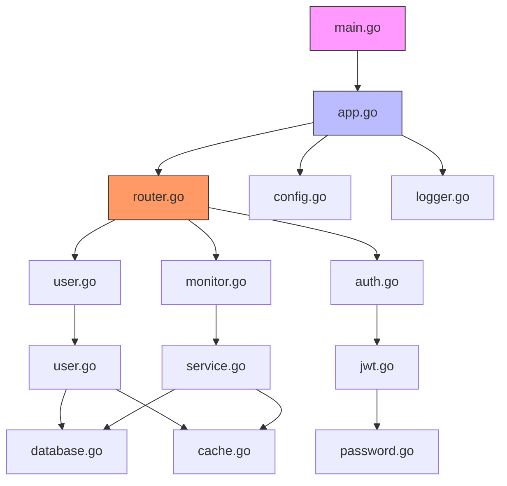
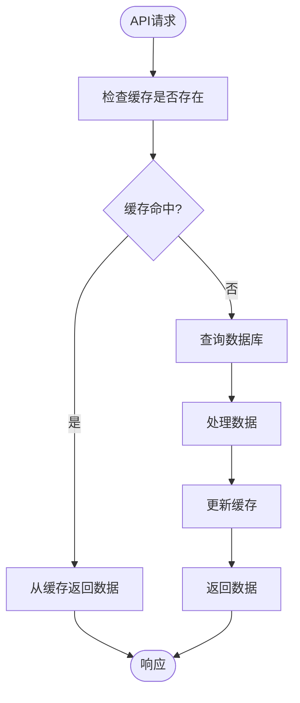
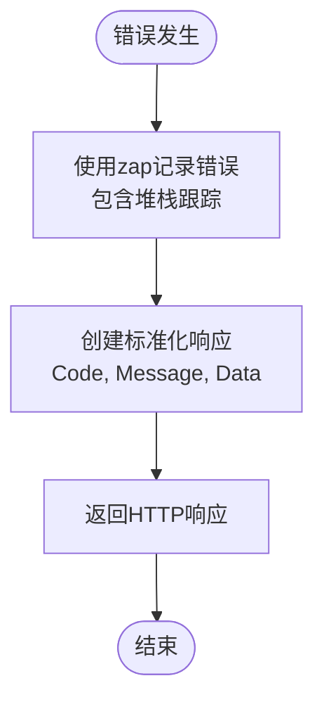

# 开发者指南

<cite>
**本文档引用的文件**   
- [router.go](file://backend/internal/api/router.go)
- [app.go](file://backend/internal/app/app.go)
- [user.go](file://backend/internal/api/user.go)
- [user.go](file://backend/internal/service/user.go)
- [user.go](file://backend/internal/model/user.go)
- [types.go](file://backend/internal/api/types.go)
- [main.go](file://backend/cmd/main.go)
- [logger.go](file://backend/pkg/logger/logger.go)
</cite>

## 目录
1. [简介](#简介)
2. [项目结构](#项目结构)
3. [核心组件](#核心组件)
4. [架构概述](#架构概述)
5. [详细组件分析](#详细组件分析)
6. [依赖分析](#依赖分析)
7. [性能考虑](#性能考虑)
8. [故障排除指南](#故障排除指南)
9. [结论](#结论)

## 简介
本指南旨在为qoder项目的贡献者提供全面的开发指导，涵盖从添加新API接口到代码贡献流程的各个方面。文档详细说明了如何在router.go中注册路由、编写API处理函数、关联service与model层的完整流程，以及如何扩展现有服务模块或新增功能组件。特别强调了依赖注入模式在app.go中的应用规范。此外，还提供了代码贡献流程、错误处理标准、API响应格式约定和代码风格规则等开发纪律。

## 项目结构
qoder项目采用分层架构，主要分为backend和frontend两大部分。backend部分采用Go语言开发，遵循清晰的包结构和依赖管理。frontend部分使用Vue.js框架构建用户界面。



**Diagram sources**
- [main.go](file://backend/cmd/main.go#L1-L18)
- [router.go](file://backend/internal/api/router.go#L1-L115)

**Section sources**
- [main.go](file://backend/cmd/main.go#L1-L18)
- [router.go](file://backend/internal/api/router.go#L1-L115)

## 核心组件
qoder的核心组件包括API处理器、服务层、数据模型和应用管理器。这些组件通过依赖注入模式紧密协作，实现了清晰的职责分离和松散耦合。

**Section sources**
- [app.go](file://backend/internal/app/app.go#L1-L211)
- [user.go](file://backend/internal/api/user.go#L1-L213)
- [user.go](file://backend/internal/service/user.go#L1-L171)

## 架构概述
qoder采用典型的分层架构，从上到下依次为API层、服务层、模型层和基础设施层。应用启动时通过app.go中的Application结构体进行组件初始化和依赖注入。



**Diagram sources**
- [app.go](file://backend/internal/app/app.go#L1-L211)
- [router.go](file://backend/internal/api/router.go#L1-L115)

## 详细组件分析

### API路由注册流程
添加新API接口需要在router.go中注册路由，这是API请求的入口点。



**Diagram sources**
- [router.go](file://backend/internal/api/router.go#L1-L115)

**Section sources**
- [router.go](file://backend/internal/api/router.go#L1-L115)

### API处理函数编写规范
API处理函数负责接收HTTP请求、调用服务层方法并返回响应，需要遵循统一的错误处理和响应格式。

```mermaid
classDiagram
class UserHandler {
+userService *UserService
+Create(c *gin.Context)
+List(c *gin.Context)
+GetByID(c *gin.Context)
+Update(c *gin.Context)
+Delete(c *gin.Context)
}
class Response {
+Code int
+Message string
+Data interface{}
}
class CreateUserRequest {
+Username string
+Email string
+Password string
+Role string
}
class UpdateUserRequest {
+Username string
+Email string
+Role string
+Status *int
}
class PageRequest {
+Page int
+PageSize int
}
class PageResponse {
+List interface{}
+Total int64
+Page int
+PageSize int
}
UserHandler --> UserService : "依赖"
UserHandler --> Response : "返回"
UserHandler --> CreateUserRequest : "绑定"
UserHandler --> UpdateUserRequest : "绑定"
UserHandler --> PageRequest : "绑定"
UserHandler --> PageResponse : "返回"
```

**Diagram sources**
- [user.go](file://backend/internal/api/user.go#L1-L213)
- [types.go](file://backend/internal/api/types.go#L1-L115)

**Section sources**
- [user.go](file://backend/internal/api/user.go#L1-L213)
- [types.go](file://backend/internal/api/types.go#L1-L115)

### 服务层与模型层关联
服务层作为业务逻辑的核心，负责协调模型层的数据操作和缓存层的性能优化。



**Diagram sources**
- [user.go](file://backend/internal/service/user.go#L1-L171)
- [user.go](file://backend/internal/model/user.go#L1-L29)

**Section sources**
- [user.go](file://backend/internal/service/user.go#L1-L171)
- [user.go](file://backend/internal/model/user.go#L1-L29)

### 依赖注入模式应用
app.go中的Application结构体实现了依赖注入模式，负责组件的初始化和生命周期管理。

```mermaid
classDiagram
class Application {
-config *Config
-db *gorm.DB
-rdb *redis.Client
-logger *zap.Logger
-configMgr *ConfigManager
-databaseMgr *DatabaseManager
-cacheMgr *CacheManager
-serverMgr *ServerManager
-shutdownCh chan struct{}
+Run() error
+GetConfig() *Config
+GetDB() *gorm.DB
+GetRedis() *redis.Client
}
class ConfigManager {
+Load() (*Config, error)
+InitLogger() error
}
class DatabaseManager {
+Initialize() (*gorm.DB, error)
+Migrate() error
+Close() error
}
class CacheManager {
+Initialize() (*redis.Client, error)
+Close() error
}
class ServerManager {
+Initialize(db *gorm.DB, rdb *redis.Client, config *Config) error
+Start() error
+Shutdown(ctx context.Context) error
}
Application --> ConfigManager : "包含"
Application --> DatabaseManager : "包含"
Application --> CacheManager : "包含"
Application --> ServerManager : "包含"
Application --> Config : "持有"
Application --> gorm.DB : "持有"
Application --> redis.Client : "持有"
Application --> zap.Logger : "持有"
```

**Diagram sources**
- [app.go](file://backend/internal/app/app.go#L1-L211)

**Section sources**
- [app.go](file://backend/internal/app/app.go#L1-L211)

## 依赖分析
qoder项目的依赖关系清晰，各组件之间通过接口和依赖注入实现松散耦合，便于测试和维护。



**Diagram sources**
- [main.go](file://backend/cmd/main.go#L1-L18)
- [app.go](file://backend/internal/app/app.go#L1-L211)
- [router.go](file://backend/internal/api/router.go#L1-L115)

**Section sources**
- [main.go](file://backend/cmd/main.go#L1-L18)
- [app.go](file://backend/internal/app/app.go#L1-L211)
- [router.go](file://backend/internal/api/router.go#L1-L115)

## 性能考虑
qoder在设计时充分考虑了性能因素，通过缓存机制、数据库连接池和异步处理等技术提升系统响应速度和吞吐量。

### 缓存策略


**Diagram sources**
- [user.go](file://backend/internal/service/user.go#L1-L171)
- [cache.go](file://backend/pkg/cache/cache.go#L1-L50)

## 故障排除指南
本节提供常见问题的诊断和解决方法，帮助开发者快速定位和修复问题。

**Section sources**
- [logger.go](file://backend/pkg/logger/logger.go#L1-L86)
- [user.go](file://backend/internal/api/user.go#L1-L213)

### 错误处理标准
qoder采用统一的错误处理标准，使用zap日志记录错误信息，并返回标准化的API响应。



**Diagram sources**
- [logger.go](file://backend/pkg/logger/logger.go#L1-L86)
- [types.go](file://backend/internal/api/types.go#L1-L115)

### API响应格式约定
所有API响应遵循统一的格式，便于前端处理和错误诊断。

```mermaid
classDiagram
class Response {
+Code int
+Message string
+Data interface{}
}
class SuccessResponse {
+Code 200
+Message "操作成功"
+Data 具体数据
}
class ErrorResponse {
+Code 400/500
+Message 错误描述
+Data null
}
Response <|-- SuccessResponse
Response <|-- ErrorResponse
```

**Diagram sources**
- [types.go](file://backend/internal/api/types.go#L1-L115)

## 结论
qoder项目通过清晰的架构设计、规范的代码结构和完善的开发指南，为贡献者提供了良好的开发体验。遵循本文档中的指导原则，可以确保代码质量和系统稳定性，促进项目的持续发展。