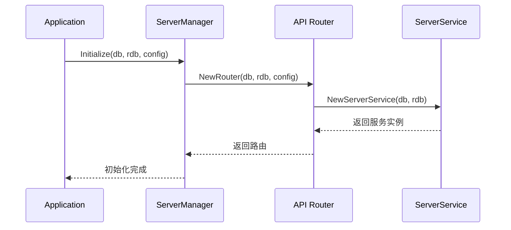
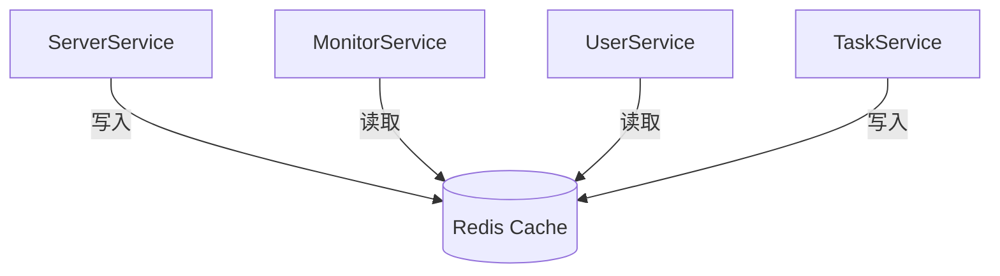
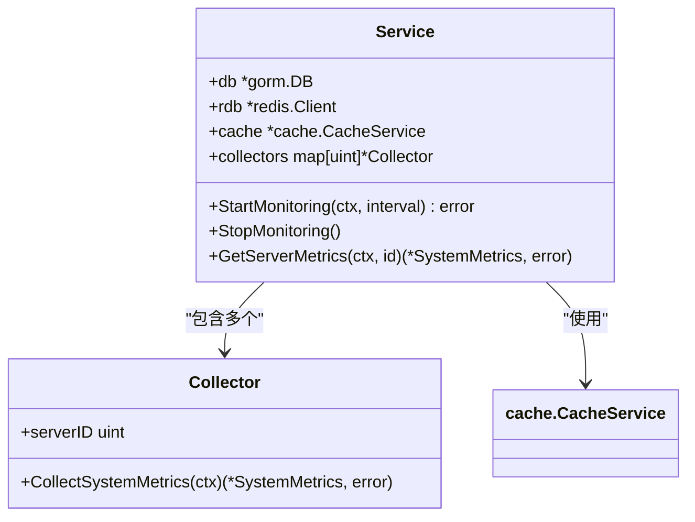

# 扩展现有服务模块

<cite>
**本文档中引用的文件**  
- [app.go](file://backend/internal/app/app.go)
- [server.go](file://backend/internal/service/server.go)
- [service.go](file://backend/internal/monitor/service.go)
- [server_manager.go](file://backend/internal/app/server_manager.go)
- [router.go](file://backend/internal/api/router.go)
- [monitor.go](file://backend/internal/api/monitor.go)
- [config_manager.go](file://backend/internal/app/config_manager.go)
- [database_manager.go](file://backend/internal/app/database_manager.go)
- [cache_manager.go](file://backend/internal/app/cache_manager.go)
- [config.go](file://backend/internal/config/config.go)
</cite>

## 目录
1. [引言](#引言)
2. [Application结构体核心作用](#application结构体核心作用)
3. [依赖注入机制详解](#依赖注入机制详解)
4. [服务层方法扩展实践](#服务层方法扩展实践)
5. [服务间调用与避免循环依赖](#服务间调用与避免循环依赖)
6. [注册新管理器到Application生命周期](#注册新管理器到application生命周期)
7. [扩展监控采集模块案例](#扩展监控采集模块案例)
8. [接口抽象与测试可维护性](#接口抽象与测试可维护性)
9. [总结](#总结)

## 引言
本文档旨在指导开发者如何在现有架构基础上扩展现有服务模块或新增功能组件。重点围绕`Application`结构体在`app.go`中的核心协调作用，详细说明如何通过依赖注入将数据库、缓存、配置等资源安全地传递给新模块。以`server`服务为例，展示如何在`service`层添加新方法并确保其可通过`App`实例访问。同时提供扩展监控采集模块的实际案例，强调接口抽象设计与单元测试的可维护性。

## Application结构体核心作用

`Application`结构体是整个应用的中枢控制器，负责协调各个管理器（Manager）的初始化、启动与优雅关闭流程。它通过封装配置、数据库、缓存、日志等核心资源，为上层服务提供统一的访问入口。

该结构体采用分阶段初始化策略，依次完成配置加载、日志初始化、数据库连接、缓存连接、服务器启动等关键步骤，并监听系统信号实现优雅关闭。

```mermaid
classDiagram
class Application {
+config *config.Config
+db *gorm.DB
+rdb *redis.Client
+logger *zap.Logger
+configMgr *ConfigManager
+databaseMgr *DatabaseManager
+cacheMgr *CacheManager
+serverMgr *ServerManager
+shutdownCh chan struct{}
+Run() error
+GetConfig() *config.Config
+GetDB() *gorm.DB
+GetRedis() *redis.Client
}
class ConfigManager {
+Load() (*config.Config, error)
+InitLogger() error
}
class DatabaseManager {
+Initialize() (*gorm.DB, error)
+Migrate() error
+Close() error
}
class CacheManager {
+Initialize() (*redis.Client, error)
+Close() error
}
class ServerManager {
+Initialize(db *gorm.DB, rdb *redis.Client, cfg *config.Config) error
+Start() error
+Shutdown(ctx context.Context) error
}
Application --> ConfigManager : "拥有"
Application --> DatabaseManager : "拥有"
Application --> CacheManager : "拥有"
Application --> ServerManager : "拥有"
```

**图示来源**  
- [app.go](file://backend/internal/app/app.go#L15-L211)

**本节来源**  
- [app.go](file://backend/internal/app/app.go#L15-L211)

## 依赖注入机制详解

本项目采用构造函数注入的方式实现依赖注入，确保各模块之间的松耦合。`Application`在初始化过程中，将已准备好的数据库连接、Redis客户端和配置实例作为参数传递给各服务。

例如，在`server_manager.go`中，`Initialize`方法接收`*gorm.DB`、`*redis.Client`和`*config.Config`作为参数，这些正是由`Application`在`initServer`阶段提供的：

```go
func (sm *ServerManager) Initialize(db *gorm.DB, rdb *redis.Client, cfg *config.Config) error
```

同样，`ServerService`的构造函数也遵循相同模式：

```go
func NewServerService(db *gorm.DB, rdb *redis.Client) *ServerService
```

这种设计使得服务不直接依赖具体实现，而是依赖于接口或指针类型，便于单元测试时进行模拟（mocking）。



**图示来源**  
- [app.go](file://backend/internal/app/app.go#L125-L145)
- [server_manager.go](file://backend/internal/app/server_manager.go#L35-L50)
- [router.go](file://backend/internal/api/router.go#L15-L25)

**本节来源**  
- [app.go](file://backend/internal/app/app.go#L125-L145)
- [server_manager.go](file://backend/internal/app/server_manager.go#L35-L50)
- [router.go](file://backend/internal/api/router.go#L15-L25)

## 服务层方法扩展实践

以`server`服务为例，若需扩展新的业务逻辑（如批量更新服务器状态），应遵循以下步骤：

1. 在`backend/internal/service/server.go`中为`ServerService`添加新方法；
2. 确保该方法通过`db`和`rdb`访问数据层；
3. 在对应的API处理器中调用此方法。

例如，添加`BatchUpdateStatus`方法：

```go
func (s *ServerService) BatchUpdateStatus(serverIDs []uint, status int) error {
    ctx := context.Background()
    
    // 批量更新数据库
    result := s.db.Model(&model.Server{}).Where("id IN ?", serverIDs).Update("status", status)
    if result.Error != nil {
        return fmt.Errorf("批量更新服务器状态失败: %w", result.Error)
    }

    // 清除相关缓存
    for _, id := range serverIDs {
        s.InvalidateServerCache(ctx, id)
    }

    return nil
}
```

该方法可通过`App.GetDB()`和`App.GetRedis()`获取所需资源，确保与整体架构一致。

**本节来源**  
- [server.go](file://backend/internal/service/server.go#L15-L218)

## 服务间调用与避免循环依赖

服务间调用应通过接口抽象或上层协调器（如API Handler）进行，避免直接相互引用导致循环依赖。

当前架构中，`MonitorHandler`持有`*monitor.Service`，而`ServerService`不直接调用监控服务，而是通过缓存共享数据（如`StoreMetrics`），实现了逻辑解耦。

若必须跨服务调用，建议：
- 定义清晰的接口契约；
- 使用事件驱动或消息队列模式；
- 由`Application`统一注入共享服务实例。

例如，`monitor/service.go`中的`collectServerMetrics`方法通过`cache.Set`将数据写入Redis，其他服务可通过`cache.Get`读取，而非直接调用`monitor.Service`。



**图示来源**  
- [server.go](file://backend/internal/service/server.go#L150-L180)
- [service.go](file://backend/internal/monitor/service.go#L150-L180)

**本节来源**  
- [server.go](file://backend/internal/service/server.go#L150-L180)
- [service.go](file://backend/internal/monitor/service.go#L150-L180)

## 注册新管理器到Application生命周期

要注册新的管理器（如`TaskManager`）到`Application`生命周期中，需执行以下步骤：

1. 创建新的管理器结构体（如`TaskManager`）；
2. 在`Application`结构体中添加字段；
3. 实现`Initialize`和`Shutdown`方法；
4. 在`Run`方法中调用初始化流程。

示例结构：

```go
type TaskManager struct {
    scheduler *Scheduler
}

func NewTaskManager(cfg config.Task) *TaskManager { ... }

func (tm *TaskManager) Initialize() error { ... }
func (tm *TaskManager) Shutdown(ctx context.Context) error { ... }
```

然后在`Application`中集成：

```go
type Application struct {
    // ... 其他字段
    taskMgr *TaskManager
}

func (app *Application) Run() error {
    // ... 其他初始化
    if err := app.initTask(); err != nil {
        return fmt.Errorf("任务管理器初始化失败: %w", err)
    }
    // ... 启动逻辑
}
```

确保在`gracefulShutdown`中调用`taskMgr.Shutdown`以实现优雅退出。

**本节来源**  
- [app.go](file://backend/internal/app/app.go#L15-L211)
- [server_manager.go](file://backend/internal/app/server_manager.go#L15-L100)

## 扩展监控采集模块案例

以扩展`monitor/service.go`为例，若需增加对自定义指标的采集能力，可按以下方式实现：

1. **扩展Collector结构**：支持插件式采集器；
2. **增强Service接口**：提供`RegisterCollector`方法；
3. **利用现有资源**：复用`db`、`rdb`、`cache`等由`Application`注入的实例。

当前`monitor.Service`已具备良好的扩展性，其`collectors map[uint]*Collector`设计允许动态增删监控目标。通过`AddServer`和`RemoveServer`方法可实现运行时配置变更。

此外，`checkAlerts`方法预留了告警规则扩展点，未来可从数据库加载动态规则，而非硬编码阈值。

该模块通过`NewService(db, rdb)`接收依赖，完全依赖外部注入，便于测试和替换实现。



**图示来源**  
- [service.go](file://backend/internal/monitor/service.go#L15-L258)

**本节来源**  
- [service.go](file://backend/internal/monitor/service.go#L15-L258)
- [monitor.go](file://backend/internal/api/monitor.go#L15-L257)

## 接口抽象与测试可维护性

为提升可测试性，建议对关键服务定义接口。例如，可为`ServerService`定义接口：

```go
type ServerServiceInterface interface {
    GetByID(id uint) (*model.Server, error)
    List(userID uint) ([]model.Server, error)
    Create(server *model.Server) error
    Update(id uint, updates map[string]interface{}) error
    Delete(id uint) error
}
```

这样在单元测试中可轻松替换为模拟实现，无需依赖真实数据库或Redis。

同时，所有管理器（`ConfigManager`、`DatabaseManager`等）均已通过字段暴露，支持在测试中替换具体实现，如使用内存数据库替代MySQL。

依赖注入模式天然支持依赖反转，使得各组件易于隔离测试，符合SOLID原则。

**本节来源**  
- [server.go](file://backend/internal/service/server.go#L15-L218)
- [service.go](file://backend/internal/monitor/service.go#L15-L258)
- [app.go](file://backend/internal/app/app.go#L15-L211)

## 总结
本文详细阐述了如何基于现有架构扩展现有服务模块。`Application`结构体作为核心协调者，通过依赖注入机制将数据库、缓存、配置等资源安全传递给各服务组件。通过遵循构造函数注入、接口抽象和分层解耦的设计原则，开发者可以高效地新增功能，同时保证系统的可维护性与可测试性。推荐在扩展时优先复用已有管理器模式，并严格避免循环依赖，确保系统长期健康发展。