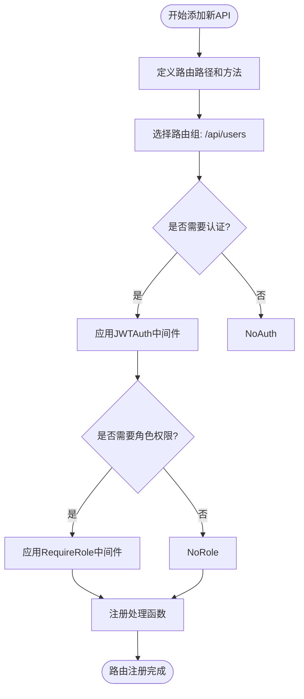
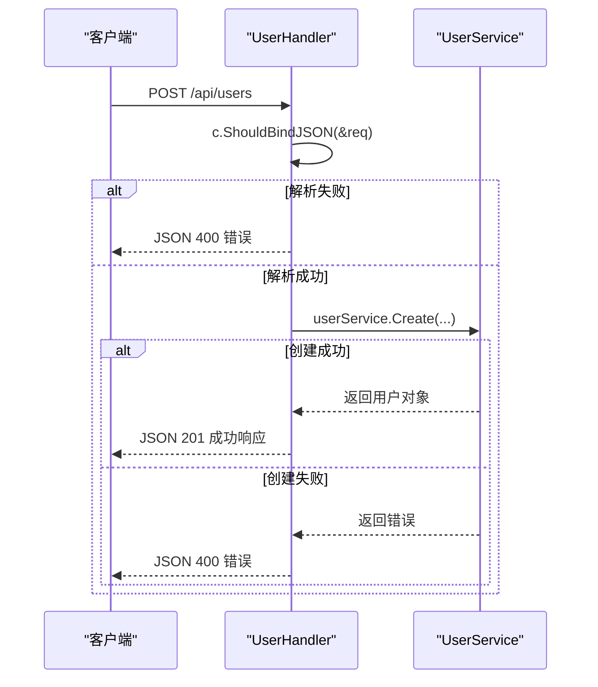
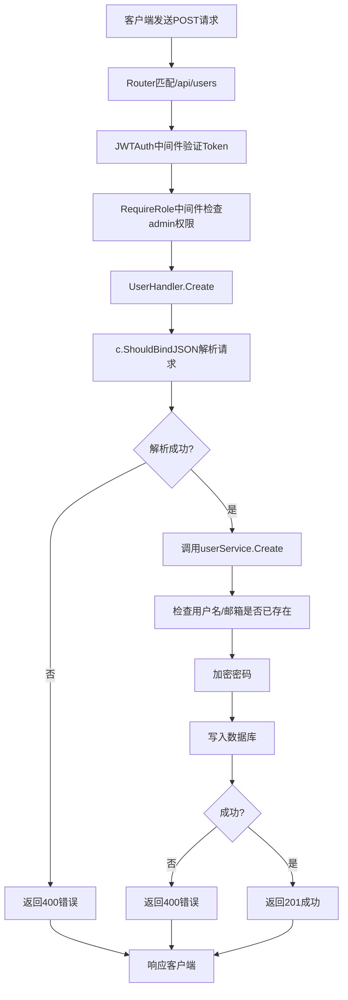

# 添加新API接口

<cite>
**本文档引用的文件**
- [router.go](file://backend/internal/api/router.go)
- [user.go](file://backend/internal/api/user.go)
- [types.go](file://backend/internal/api/types.go)
- [auth.go](file://backend/internal/api/auth.go)
- [service/user.go](file://backend/internal/service/user.go)
</cite>

## 目录
1. [概述](#概述)
2. [注册路由](#注册路由)
3. [定义请求与响应结构体](#定义请求与响应结构体)
4. [创建API处理函数](#创建api处理函数)
5. [调用Service层逻辑](#调用service层逻辑)
6. [统一响应与错误处理](#统一响应与错误处理)
7. [完整调用流程示例](#完整调用流程示例)
8. [最佳实践总结](#最佳实践总结)

## 概述
本文档详细说明如何在 qoder 项目中添加一个新的API接口。从在 `router.go` 中注册路由开始，逐步演示如何定义HTTP端点（GET/POST/PUT/DELETE），绑定处理函数，调用服务层逻辑，并确保请求参数解析、响应格式统一和错误传递等关键环节的正确实现。以用户管理模块中的 `/users` 接口为例，展示完整的实现流程。

**Section sources**
- [router.go](file://backend/internal/api/router.go#L1-L115)
- [user.go](file://backend/internal/api/user.go#L1-L213)

## 注册路由
在 qoder 中，所有API路由均在 `backend/internal/api/router.go` 文件中通过 `NewRouter` 函数集中注册。添加新接口的第一步是确定其所属的路由组（如 `/api/users`）和访问权限（是否需要JWT认证）。

例如，用户相关接口被组织在 `/api/users` 路由组下，且大部分操作需要JWT保护。管理员操作（如创建、更新、删除）还需额外的角色权限校验。

**Diagram sources**
- [router.go](file://backend/internal/api/router.go#L55-L100)

**Section sources**
- [router.go](file://backend/internal/api/router.go#L55-L100)

## 定义请求与响应结构体
请求和响应的数据结构应在 `backend/internal/api/types.go` 文件中定义。该文件包含了项目中所有API的输入输出模型。

- **请求结构体**：以 `Request` 结尾，使用 `binding` tag 进行参数校验。例如 `CreateUserRequest` 要求 `username`、`email`、`password` 和 `role` 为必填项，并对 `email` 格式和 `role` 枚举值进行校验。
- **响应结构体**：通常包含 `Code`、`Message` 和 `Data` 字段。`Data` 字段的类型根据具体接口而定，如 `User` 或 `PageResponse`。
- **通用结构体**：`Response` 是所有API响应的封装，`PageRequest` 和 `PageResponse` 用于分页查询。

**Section sources**
- [types.go](file://backend/internal/api/types.go#L1-L115)

## 创建API处理函数
API处理函数位于 `backend/internal/api` 目录下的具体处理器文件中，如 `user.go`。每个处理函数接收 `*gin.Context` 作为参数，负责解析请求、调用服务层、处理结果并返回响应。

以 `Create` 函数为例：
1. 使用 `c.ShouldBindJSON(&req)` 解析并校验JSON请求体。
2. 若解析失败，立即返回 `400 Bad Request` 错误。
3. 调用 `userService.Create` 执行业务逻辑。

**Diagram sources**
- [user.go](file://backend/internal/api/user.go#L25-L50)
- [service/user.go](file://backend/internal/service/user.go#L50-L80)

**Section sources**
- [user.go](file://backend/internal/api/user.go#L25-L50)

## 调用Service层逻辑
API层（Handler）不包含核心业务逻辑，而是通过依赖注入的 `userService` 实例调用 `backend/internal/service/user.go` 中的方法。

`UserService` 负责与数据库（`gorm.DB`）和缓存（`redis.Client`）交互。例如，`Create` 方法会：
1. 检查用户名或邮箱是否已存在。
2. 使用 `auth.HashPassword` 对密码进行加密。
3. 将新用户记录插入数据库。

这种分层设计确保了业务逻辑的可重用性和可测试性。

**Section sources**
- [service/user.go](file://backend/internal/service/user.go#L50-L80)

## 统一响应与错误处理
所有API响应都应使用 `Response` 结构体进行封装，确保前端处理的一致性。

- **成功响应**：返回 `200 OK` 或 `201 Created`，`Code` 为200或201，`Message` 描述成功信息，`Data` 包含返回数据。
- **错误响应**：根据错误类型返回相应的HTTP状态码（如 `400`、`401`、`404`、`500`），`Code` 与状态码一致，`Message` 提供清晰的错误描述。

错误应从Service层传递到Handler层，Handler层负责将其转换为HTTP响应，避免在API层重新定义业务错误。

**Section sources**
- [types.go](file://backend/internal/api/types.go#L1-L10)
- [user.go](file://backend/internal/api/user.go#L30-L45)
- [auth.go](file://backend/internal/api/auth.go#L60-L75)

## 完整调用流程示例
以创建用户 (`POST /api/users`) 为例，完整流程如下：

**Diagram sources**
- [router.go](file://backend/internal/api/router.go#L80-L85)
- [user.go](file://backend/internal/api/user.go#L25-L50)
- [service/user.go](file://backend/internal/service/user.go#L50-L80)

## 最佳实践总结
1. **路由组织**：按资源组织路由，使用 `/api/<resource>` 格式，并合理使用中间件控制访问权限。
2. **结构体定义**：在 `types.go` 中明确定义所有请求和响应结构体，并使用 `binding` tag 进行校验。
3. **参数解析**：优先使用 `c.ShouldBindJSON` 和 `c.ShouldBindQuery`，并妥善处理解析错误。
4. **分层清晰**：API层负责HTTP交互，Service层负责业务逻辑，确保职责分离。
5. **统一响应**：始终使用 `Response` 结构体封装响应，保持API风格一致。
6. **错误传递**：在Service层生成有意义的错误信息，并在Handler层转换为HTTP响应。
7. **代码复用**：对于分页等通用功能，使用 `PageRequest` 和 `PageResponse` 等通用结构体。

遵循以上实践，可以高效、规范地为 qoder 项目添加新的API接口。

**Section sources**
- [router.go](file://backend/internal/api/router.go#L1-L115)
- [user.go](file://backend/internal/api/user.go#L1-L213)
- [types.go](file://backend/internal/api/types.go#L1-L115)
- [service/user.go](file://backend/internal/service/user.go#L1-L171)