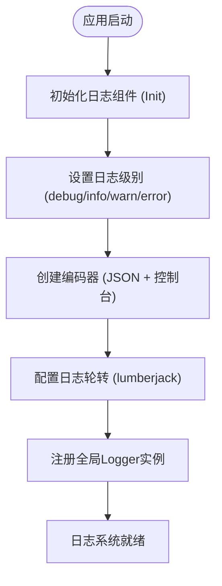

# 错误处理与日志规范

<cite>
**本文档引用文件**  
- [logger.go](file://backend/pkg/logger/logger.go)
- [types.go](file://backend/internal/api/types.go)
- [middleware.go](file://backend/internal/middleware/middleware.go)
- [app.go](file://backend/internal/app/app.go)
- [config_manager.go](file://backend/internal/app/config_manager.go)
</cite>

## 目录
1. [引言](#引言)
2. [日志记录规范](#日志记录规范)
3. [API错误码体系](#api错误码体系)
4. [服务层错误包装与传递](#服务层错误包装与传递)
5. [API层统一错误拦截与日志记录](#api层统一错误拦截与日志记录)
6. [panic恢复与中间件机制](#panic恢复与中间件机制)
7. [日志采样与性能优化建议](#日志采样与性能优化建议)
8. [总结](#总结)

## 引言
本规范旨在为项目建立统一的错误处理与日志记录标准，确保系统在运行过程中具备良好的可观测性、可维护性和稳定性。通过结构化日志输出、统一的API响应格式、上下文丰富的错误传递机制以及安全的异常恢复策略，提升系统的健壮性与开发效率。

## 日志记录规范

本项目使用 `zap.Logger` 实现高性能的结构化日志输出。日志初始化由 `backend/pkg/logger/logger.go` 文件中的 `Init` 函数完成，支持 JSON 和控制台双输出格式，并集成日志轮转功能。

日志级别定义如下：
- **Info**：记录关键业务操作，如用户登录、部署任务启动、配置加载等。
- **Error**：记录系统错误、数据库异常、认证失败等需立即关注的事件。
- **Debug**：用于开发调试，记录函数入参、中间状态等详细信息。

日志输出包含时间戳、日志级别、调用者位置、消息内容及错误堆栈（Error级别自动包含堆栈）。



**图示来源**  
- [logger.go](file://backend/pkg/logger/logger.go#L15-L87)

**本节来源**  
- [logger.go](file://backend/pkg/logger/logger.go#L1-L87)
- [app.go](file://backend/internal/app/app.go#L45-L50)

## API错误码体系

所有API响应均采用统一的响应结构，定义于 `backend/internal/api/types.go` 中的 `Response` 结构体：

```go
type Response struct {
    Code    int         `json:"code"`
    Message string      `json:"message"`
    Data    interface{} `json:"data,omitempty"`
}
```

### 错误码分类标准

| 错误码前缀 | 含义 | 示例 |
|-----------|------|------|
| 400xx | 客户端请求错误 | 40001: 参数校验失败 |
| 401xx | 认证相关错误 | 40101: Token缺失或无效 |
| 403xx | 权限不足 | 40301: 当前角色无权操作 |
| 404xx | 资源未找到 | 40401: 用户不存在 |
| 500xx | 服务端内部错误 | 50001: 数据库连接失败 |
| 503xx | 服务不可用 | 50301: 缓存服务异常 |

### 关键错误码定义

```go
// 示例：在 types.go 中扩展错误码常量（建议）
const (
    ErrCodeInvalidParams     = 40001
    ErrCodeAuthFailed        = 40101
    ErrCodeTokenExpired      = 40102
    ErrCodeInsufficientPerm  = 40301
    ErrCodeUserNotFound      = 40401
    ErrCodeInternalServer    = 50001
    ErrCodeServiceUnavailable = 50301
)
```

**本节来源**  
- [types.go](file://backend/internal/api/types.go#L3-L10)

## 服务层错误包装与传递

在 `service` 层处理业务逻辑时，应避免直接返回原始错误，而应使用 `errors.Wrap` 或类似机制添加上下文信息，便于定位问题根源。

例如，在用户服务中：
```go
// 错误方式：裸露返回
return errors.New("user not found")

// 正确方式：包装上下文
return errors.Wrap(err, "failed to get user by ID: "+userID)
```

通过上下文包装，日志中可清晰展示错误传播路径，如：
```
error: failed to get user by ID: 123
  └── caused by: record not found in database
```

**本节来源**  
- [user.go](file://backend/internal/service/user.go)
- [server.go](file://backend/internal/service/server.go)

## API层统一错误拦截与日志记录

API层通过中间件统一拦截错误并记录日志，避免重复代码。关键中间件位于 `backend/internal/middleware/middleware.go`。

### JWT认证中间件日志记录示例

当认证失败时，中间件会记录错误日志并返回标准化响应：

```go
if err != nil {
    logger.GetLogger().Error("JWT认证失败",
        zap.String("token", token),
        zap.Error(err),
        zap.String("remote_addr", c.ClientIP()))
    c.JSON(http.StatusUnauthorized, gin.H{
        "code":    40101,
        "message": "认证失败: " + err.Error(),
    })
    c.Abort()
    return
}
```

### 自定义错误处理中间件建议

建议新增统一错误处理中间件，捕获 `service` 层返回的错误，并根据错误类型记录日志并返回对应响应：

```go
func ErrorHandler() gin.HandlerFunc {
    return func(c *gin.Context) {
        c.Next()
        if len(c.Errors) > 0 {
            err := c.Errors[0]
            logger.GetLogger().Error("API请求处理失败",
                zap.String("path", c.Request.URL.Path),
                zap.String("method", c.Request.Method),
                zap.String("client_ip", c.ClientIP()),
                zap.Error(err))
            
            // 根据错误类型返回不同code
            c.JSON(http.StatusInternalServerError, api.Response{
                Code:    50001,
                Message: "系统内部错误",
            })
        }
    }
}
```

**本节来源**  
- [middleware.go](file://backend/internal/middleware/middleware.go#L45-L116)
- [auth.go](file://backend/internal/api/auth.go)

## panic恢复与中间件机制

禁止在代码中裸露使用 `panic`。所有HTTP请求应通过 `recover` 中间件捕获潜在的运行时恐慌，防止服务崩溃。

### 推荐的Recovery中间件

```go
func Recovery() gin.HandlerFunc {
    return func(c *gin.Context) {
        defer func() {
            if err := recover(); err != nil {
                logger.GetLogger().Error("系统发生panic",
                    zap.String("path", c.Request.URL.Path),
                    zap.String("method", c.Request.Method),
                    zap.Any("error", err),
                    zap.Stack("stack"))
                
                c.JSON(http.StatusInternalServerError, gin.H{
                    "code":    50001,
                    "message": "系统内部错误",
                })
                c.Abort()
            }
        }()
        c.Next()
    }
}
```

该中间件应在路由注册时作为全局中间件加载，确保所有请求路径均受保护。

**本节来源**  
- [middleware.go](file://backend/internal/middleware/middleware.go)
- [router.go](file://backend/internal/api/router.go)

## 日志采样与性能优化建议

高频操作（如健康检查、监控拉取）若每条都记录日志，可能影响系统性能。建议采用以下优化策略：

### 1. 日志采样（Sampling）
对非关键日志进行采样输出，例如每100条记录输出1条：

```go
var logCounter int64

func SampledInfo(msg string, fields ...zap.Field) {
    if atomic.LoadInt64(&logCounter)%100 == 0 {
        logger.GetLogger().Info(msg, fields...)
    }
    atomic.AddInt64(&logCounter, 1)
}
```

### 2. 异步日志写入
Zap默认支持异步写入，已在 `logger.go` 中通过 `AddSync` 配合 `lumberjack` 实现。

### 3. 生产环境关闭Debug日志
在 `config.yaml` 中配置日志级别为 `info`，避免Debug日志影响性能：

```yaml
log:
  level: info
  filename: logs/app.log
  max_size: 100
  max_backups: 7
  max_age: 30
  compress: true
```

### 4. 避免在循环中记录日志
将日志记录移出循环体，批量记录摘要信息：

```go
// 错误方式
for _, item := range items {
    logger.Info("处理项目", zap.String("name", item.Name))
}

// 正确方式
logger.Info("批量处理完成", 
    zap.Int("count", len(items)),
    zap.Int("success", successCount))
```

**本节来源**  
- [logger.go](file://backend/pkg/logger/logger.go#L15-L87)
- [config_manager.go](file://backend/internal/app/config_manager.go#L50-L55)
- [monitor.go](file://backend/internal/api/monitor.go)

## 总结

本规范建立了从日志记录、错误码定义、服务层错误包装、API层统一处理到panic恢复的完整错误处理体系。关键要点包括：
- 使用 `zap.Logger` 实现结构化日志输出
- 统一API响应格式与错误码体系
- 服务层使用 `errors.Wrap` 包装上下文
- API层通过中间件统一记录日志并返回响应
- 禁止裸露panic，使用中间件recover
- 对高频日志进行采样以优化性能

开发者应严格遵守本规范，确保系统具备良好的可观测性与稳定性。

**本节来源**  
- [logger.go](file://backend/pkg/logger/logger.go)
- [types.go](file://backend/internal/api/types.go)
- [middleware.go](file://backend/internal/middleware/middleware.go)
- [app.go](file://backend/internal/app/app.go)
- [config_manager.go](file://backend/internal/app/config_manager.go)