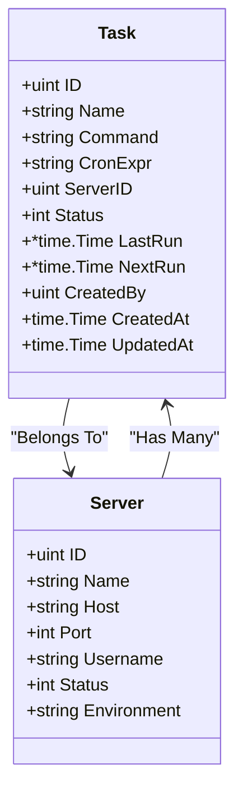
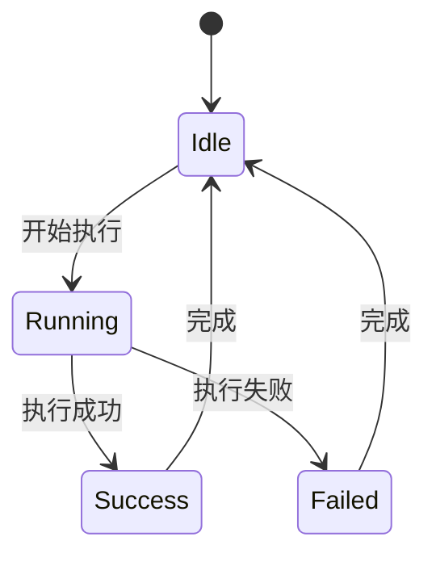

# 任务模型 (Task)

<cite>
**本文档引用文件**   
- [task.go](file://backend/internal/model/task.go)
- [server.go](file://backend/internal/model/server.go)
- [init.sql](file://scripts/init.sql)
- [keys.go](file://backend/pkg/cache/keys.go)
</cite>

## 目录
1. [简介](#简介)
2. [任务模型结构解析](#任务模型结构解析)
3. [与服务器模型的关联关系](#与服务器模型的关联关系)
4. [任务状态机设计](#任务状态机设计)
5. [输出日志存储策略](#输出日志存储策略)
6. [数据库索引与查询优化](#数据库索引与查询优化)
7. [GORM操作示例](#gorm操作示例)
8. [高并发写入性能瓶颈与优化](#高并发写入性能瓶颈与优化)
9. [缓存机制设计](#缓存机制设计)
10. [结论](#结论)

## 简介
本文档详细阐述了任务调度系统中的核心数据模型——`Task`及其执行记录`TaskExecution`的结构设计、数据库映射、状态流转机制以及在高并发场景下的性能优化策略。基于GORM ORM框架和MySQL数据库，全面解析任务模型在运维平台中的作用与实现方式。

## 任务模型结构解析

`Task`结构体定义了自动化任务的核心属性，包含任务元数据、执行配置及调度信息。其主要字段如下：

- **ID**: 主键，唯一标识任务
- **Name**: 任务名称（最大100字符，非空）
- **Command**: 执行命令（长文本，非空）
- **CronExpr**: Cron表达式（最大50字符），用于定时调度
- **ServerID**: 关联服务器ID（带索引，非空）
- **Server**: 服务器关联对象（Belongs To关系）
- **Status**: 任务状态（0:禁用，1:启用，默认启用）
- **LastRun**: 上次执行时间（可为空）
- **NextRun**: 下次预计执行时间（可为空）
- **CreatedBy**: 创建用户ID（带索引，非空）
- **User**: 创建用户关联对象
- **CreatedAt/UpdatedAt**: 创建与更新时间戳
- **DeletedAt**: 软删除时间戳（支持GORM软删除）
- **Executions**: 关联的任务执行记录列表（Has Many关系）

**Section sources**
- [task.go](file://backend/internal/model/task.go#L6-L38)

## 与服务器模型的关联关系

任务模型通过`ServerID`字段与服务器模型建立`Belongs To`外键关系，表示每个任务归属于一台具体的服务器。该关系在GORM中通过`gorm:"foreignKey:ServerID"`标签声明，确保数据一致性与级联操作的完整性。

同时，服务器模型中定义了`Tasks []Task`字段，形成双向关联，便于从服务器维度查询其上运行的所有任务。



**Diagram sources**
- [task.go](file://backend/internal/model/task.go#L6-L38)
- [server.go](file://backend/internal/model/server.go#L6-L32)

## 任务状态机设计

任务执行过程采用状态机模式管理生命周期，状态定义如下：

| 状态值 | 含义       | 说明                     |
|--------|------------|--------------------------|
| 0      | 运行中     | 任务正在执行             |
| 1      | 成功       | 任务执行完成且无错误     |
| 2      | 失败       | 任务执行失败             |

状态流转由任务执行器控制，在`TaskExecution`模型中体现。初始状态为“运行中”（0），根据执行结果更新为“成功”（1）或“失败”（2）。前端可通过轮询获取最新状态。



**Diagram sources**
- [task.go](file://backend/internal/model/task.go#L37-L52)

## 输出日志存储策略

任务执行输出（`Output`）和错误信息（`Error`）字段均使用`text`类型存储，适用于大文本内容。此设计支持：

- 存储完整的命令输出日志
- 记录详细的错误堆栈信息
- 支持分页查看长日志内容

为优化大文本字段性能，建议：
- 避免在查询中频繁`SELECT *`，按需选择字段
- 对`Output`和`Error`字段不建立索引
- 可考虑将超长日志异步归档至文件系统或对象存储

**Section sources**
- [task.go](file://backend/internal/model/task.go#L42-L43)

## 数据库索引与查询优化

根据`init.sql`脚本及GORM模型定义，数据库层面已建立多个关键索引以提升查询效率：

- `ServerID`字段索引：加速按服务器查询任务
- `CreatedBy`字段索引：支持按用户过滤任务
- `DeletedAt`索引：支持软删除查询优化
- `TaskID`在`task_executions`表中的索引：加速执行记录查询

此外，建议为`NextRun`字段添加索引以支持定时任务调度器的高效扫描：

```sql
CREATE INDEX idx_tasks_next_run ON tasks(next_run) WHERE status = 1 AND next_run IS NOT NULL;
```

该复合索引可显著提升调度器查找待执行任务的性能。

**Section sources**
- [init.sql](file://scripts/init.sql#L0-L15)
- [task.go](file://backend/internal/model/task.go#L14-L15)

## GORM操作示例

### 创建任务
```go
task := &model.Task{
    Name:      "备份数据库",
    Command:   "mysqldump -u root db > backup.sql",
    ServerID:  1,
    CreatedBy: 1,
}
db.Create(task)
```

### 更新任务状态
```go
db.Model(&task).Update("status", 0) // 禁用任务
```

### 检索任务执行结果
```go
var executions []model.TaskExecution
db.Where("task_id = ?", taskID).
  Order("created_at DESC").
  Limit(10).
  Find(&executions)
```

**Section sources**
- [task.go](file://backend/internal/model/task.go#L6-L52)

## 高并发任务写入性能瓶颈与优化

在高并发任务写入场景下，可能面临以下瓶颈：

1. **主键竞争**：`tasks`表主键自增可能导致热点
2. **索引维护开销**：频繁插入导致B+树调整
3. **锁争用**：InnoDB行锁/间隙锁影响并发

### 优化方案：

- **分表策略**：按时间或服务器ID进行水平分表
- **批量插入**：合并多个`TaskExecution`记录为单次批量写入
- **异步写入**：通过消息队列解耦执行与记录存储
- **连接池优化**：合理配置数据库连接池大小
- **使用`INSERT DELAYED`或`INSERT IGNORE`**：降低冲突处理开销

## 缓存机制设计

系统通过Redis缓存任务相关高频访问数据，`CacheKeys`中定义了相关键名策略：

- `TaskNextRun()`: 任务执行队列缓存键，用于调度器快速获取待执行任务
- `TaskExecution(taskID)`: 任务执行状态缓存键，支持实时状态查询

缓存机制有效减轻数据库压力，提升任务状态查询响应速度。

**Section sources**
- [keys.go](file://backend/pkg/cache/keys.go#L82-L86)

## 结论

任务模型作为运维自动化平台的核心组件，通过合理的结构设计、外键关联、状态机管理及索引优化，实现了任务的可靠调度与执行追踪。结合GORM的ORM能力与Redis缓存机制，系统在保证数据一致性的同时，具备良好的可扩展性与高性能表现。未来可进一步引入分布式任务队列（如Celery、Kafka）以支持更大规模的任务调度需求。