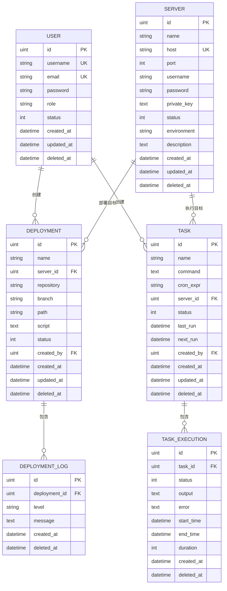

# 数据模型设计

<cite>
**本文档引用文件**  
- [user.go](file://backend/internal/model/user.go)
- [server.go](file://backend/internal/model/server.go)
- [deployment.go](file://backend/internal/model/deployment.go)
- [task.go](file://backend/internal/model/task.go)
- [init.sql](file://scripts/init.sql)
</cite>

## 目录
1. [引言](#引言)
2. [核心实体模型定义](#核心实体模型定义)
3. [数据库表结构与DDL设计](#数据库表结构与ddl设计)
4. [GORM标签规范说明](#gorm标签规范说明)
5. [实体关系与ER图建议](#实体关系与er图建议)
6. [高频查询场景与索引优化策略](#高频查询场景与索引优化策略)
7. [性能考量与最佳实践](#性能考量与最佳实践)

## 引言
本文档旨在为qoder系统提供权威的数据模型文档，基于GORM模型定义与数据库初始化脚本，全面阐述User、Server、Deployment、Task等核心实体的结构、约束、关联关系及性能优化策略。通过结合代码级定义与SQL DDL设计，确保开发、运维与架构团队对数据层有一致且深入的理解。

## 核心实体模型定义

### 用户（User）
表示系统中的用户账户，包含身份认证与权限信息。

- **ID**: 主键，无符号整数，自增
- **Username**: 用户名，唯一索引，长度限制50，非空
- **Email**: 邮箱，唯一索引，长度限制100，非空
- **Password**: 密码哈希值，长度100，非空，JSON输出忽略
- **Role**: 角色，长度20，默认值"user"
- **Status**: 状态，整数，默认值1（启用）
- **CreatedAt/UpdatedAt/DeletedAt**: 时间戳字段，支持软删除
- **关联关系**:
  - `Deployments`: 一对多，用户创建的部署记录
  - `Tasks`: 一对多，用户创建的任务

**Section sources**  
- [user.go](file://backend/internal/model/user.go#L1-L30)

### 服务器（Server）
表示可被管理的远程服务器资源。

- **ID**: 主键，无符号整数，自增
- **Name**: 服务器名称，长度100，非空
- **Host**: 主机地址，长度100，非空
- **Port**: 端口，整数，默认22
- **Username**: 登录用户名，长度50，非空
- **Password**: 登录密码（可选），长度100
- **PrivateKey**: SSH私钥（文本类型）
- **Status**: 状态，整数，默认1（启用）
- **Environment**: 环境标识（如test、prod），长度20
- **Description**: 描述信息（文本类型）
- **关联关系**:
  - `Deployments`: 一对多，部署到该服务器的记录
  - `Tasks`: 一对多，在该服务器上执行的任务

**Section sources**  
- [server.go](file://backend/internal/model/server.go#L1-L33)

### 部署（Deployment）
表示一次应用部署任务，关联服务器与用户。

- **ID**: 主键，无符号整数，自增
- **Name**: 部署名称，长度100，非空
- **ServerID**: 外键，关联服务器，索引，非空
- **Server**: 关联的服务器对象（GORM预加载）
- **Repository**: 代码仓库URL，长度200
- **Branch**: 分支名，长度50，默认"main"
- **Path**: 部署路径，长度200
- **Script**: 部署脚本（文本类型）
- **Status**: 状态（0:待部署, 1:部署中, 2:成功, 3:失败），默认0
- **CreatedBy**: 外键，创建用户ID，索引，非空
- **User**: 创建用户对象
- **Logs**: 一对多，关联的部署日志记录

**Section sources**  
- [deployment.go](file://backend/internal/model/deployment.go#L1-L50)

### 任务（Task）
表示周期性或手动执行的自动化任务。

- **ID**: 主键，无符号整数，自增
- **Name**: 任务名称，长度100，非空
- **Command**: 执行命令（文本类型），非空
- **CronExpr**: Cron表达式，长度50
- **ServerID**: 外键，执行服务器ID，索引，非空
- **Server**: 关联服务器对象
- **Status**: 状态（0:禁用, 1:启用），默认1
- **LastRun/NextRun**: 上次/下次执行时间（可为空）
- **CreatedBy**: 外键，创建用户ID，索引，非空
- **User**: 创建用户对象
- **Executions**: 一对多，任务执行记录

**Section sources**  
- [task.go](file://backend/internal/model/task.go#L1-L54)

## 数据库表结构与DDL设计

### 数据库初始化
`init.sql`脚本创建名为`devops_platform`的数据库，使用`utf8mb4`字符集以支持完整Unicode（如表情符号）。

```sql
CREATE DATABASE IF NOT EXISTS devops_platform CHARACTER SET utf8mb4 COLLATE utf8mb4_unicode_ci;
```

### 表结构与数据初始化
脚本初始化了`users`和`servers`表的默认数据：
- **管理员用户**: 用户名`admin`，邮箱`admin@example.com`，角色`admin`，密码哈希已预置
- **测试服务器**: 名称`测试服务器`，地址`127.0.0.1`，端口22，环境`test`

使用`ON DUPLICATE KEY UPDATE`确保幂等性，避免重复插入。

**Section sources**  
- [init.sql](file://scripts/init.sql#L1-L16)

## GORM标签规范说明

### JSON标签
控制字段在JSON序列化时的输出：
- `json:"username"`: 序列化为`username`
- `json:"-"`: 完全忽略该字段（如密码、私钥）
- `json:"server,omitempty"`: 序列化为`server`，若为空则省略

### GORM标签
定义数据库映射与约束：
- `primaryKey`: 指定主键
- `uniqueIndex`: 创建唯一索引
- `index`: 创建普通索引
- `not null`: 非空约束
- `size:100`: 字符串字段长度限制
- `type:text`: 使用TEXT类型存储长文本
- `default:1`: 设置默认值
- `foreignKey:ServerID`: 显式指定外键字段
- `gorm:"index"` on `DeletedAt`: 为软删除优化查询性能

**Section sources**  
- [user.go](file://backend/internal/model/user.go#L7-L25)
- [server.go](file://backend/internal/model/server.go#L7-L30)
- [deployment.go](file://backend/internal/model/deployment.go#L10-L20)
- [task.go](file://backend/internal/model/task.go#L10-L20)

## 实体关系与ER图建议



**Diagram sources**  
- [user.go](file://backend/internal/model/user.go#L7-L25)
- [server.go](file://backend/internal/model/server.go#L7-L30)
- [deployment.go](file://backend/internal/model/deployment.go#L10-L26)
- [task.go](file://backend/internal/model/task.go#L10-L26)

## 高频查询场景与索引优化策略

### 高频查询场景分析
1. **用户登录**: `SELECT * FROM users WHERE username = ?`
   - 已通过`uniqueIndex`在`username`上优化
2. **获取用户创建的部署**: `SELECT * FROM deployments WHERE created_by = ?`
   - `created_by`字段已建立索引
3. **获取服务器上的所有任务**: `SELECT * FROM tasks WHERE server_id = ?`
   - `server_id`字段已建立索引
4. **获取待执行任务**: `SELECT * FROM tasks WHERE status = 1 AND next_run <= NOW()`
   - 建议为`status`和`next_run`建立复合索引
5. **按状态查询部署**: `SELECT * FROM deployments WHERE status = ?`
   - `status`字段已有单列索引，若查询频繁可考虑复合索引

### 索引优化建议
| 表名 | 字段 | 当前索引 | 建议 |
|------|------|----------|------|
| users | username | 唯一索引 | 已优化 |
| users | email | 唯一索引 | 已优化 |
| deployments | server_id | 普通索引 | 已优化 |
| deployments | created_by | 普通索引 | 已优化 |
| tasks | server_id | 普通索引 | 已优化 |
| tasks | created_by | 普通索引 | 已优化 |
| tasks | status, next_run | 无 | **建议创建复合索引** |

**Section sources**  
- [deployment.go](file://backend/internal/model/deployment.go#L12-L19)
- [task.go](file://backend/internal/model/task.go#L14-L17)

## 性能考量与最佳实践
- **软删除**: 所有核心模型均使用`gorm.DeletedAt`实现软删除，避免数据丢失，但需定期归档清理。
- **字段长度**: 合理设置`size`避免过度占用空间，如`username`限制50字符。
- **长文本存储**: `script`、`output`等长内容使用`type:text`，避免行溢出。
- **外键约束**: GORM通过`foreignKey`定义关系，但数据库层面未强制外键约束，依赖应用层维护一致性。
- **查询优化**: 对`WHERE`、`JOIN`、`ORDER BY`涉及的字段建立索引，避免全表扫描。
- **JSON序列化**: 敏感字段（密码、私钥）使用`json:"-"`防止意外泄露。