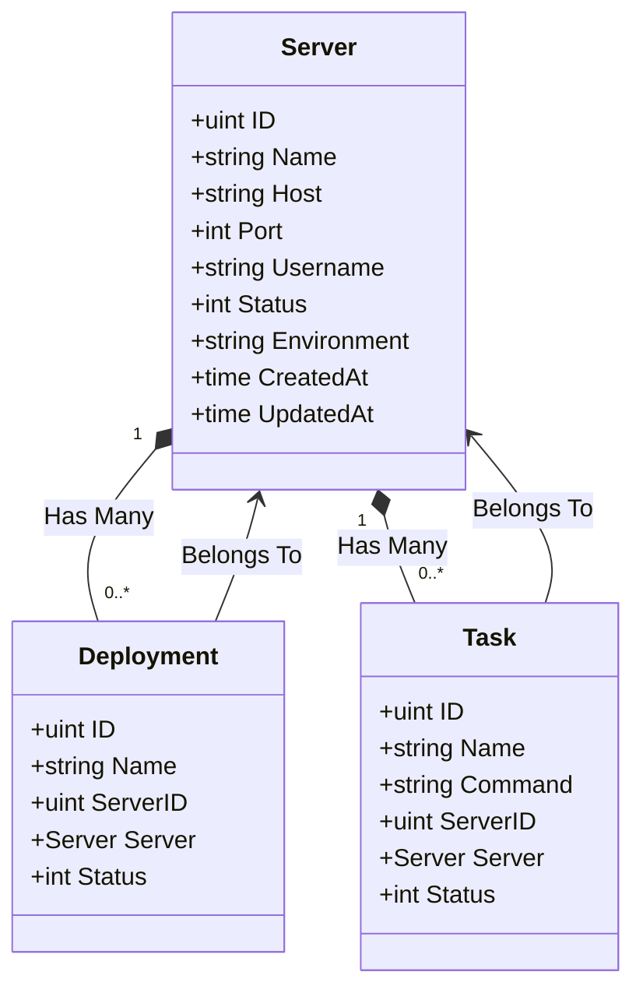
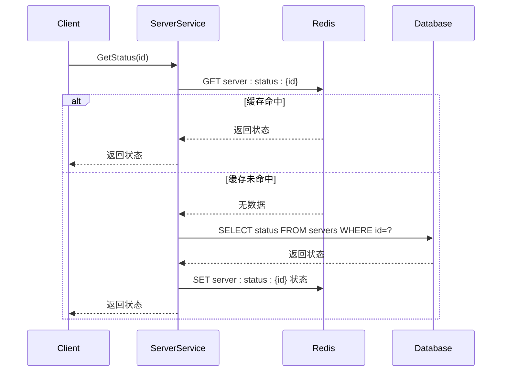

# 服务器模型 (Server)

<cite>
**本文档引用的文件**  
- [server.go](file://backend/internal/model/server.go)
- [deployment.go](file://backend/internal/model/deployment.go)
- [task.go](file://backend/internal/model/task.go)
- [init.sql](file://scripts/init.sql)
- [server.go](file://backend/internal/service/server.go)
</cite>

## 目录
1. [引言](#引言)
2. [服务器模型结构体定义](#服务器模型结构体定义)
3. [GORM标签与字段约束](#gorm标签与字段约束)
4. [模型关联关系](#模型关联关系)
5. [数据库表结构与索引设计](#数据库表结构与索引设计)
6. [高频查询与性能优化策略](#高频查询与性能优化策略)
7. [GORM查询示例](#gorm查询示例)
8. [缓存机制与状态管理](#缓存机制与状态管理)
9. [结论](#结论)

## 引言
本文档旨在深入解析 `Server` 模型的技术实现，涵盖其结构体字段定义、GORM标签应用、数据库表结构、索引设计、性能优化策略以及与部署（Deployment）、任务（Task）等模块的关联关系。通过结合代码与SQL脚本，全面阐述该模型在系统中的核心作用。

## 服务器模型结构体定义

`Server` 结构体定义了服务器的核心属性，包括连接信息、状态、环境等。每个字段均通过GORM标签映射到数据库列，并配置相应的约束和默认值。

```go
type Server struct {
	ID          uint           `gorm:"primaryKey" json:"id"`
	Name        string         `gorm:"size:100;not null" json:"name"`
	Host        string         `gorm:"size:100;not null" json:"host"`
	Port        int            `gorm:"default:22" json:"port"`
	Username    string         `gorm:"size:50;not null" json:"username"`
	Password    string         `gorm:"size:100" json:"-"`
	PrivateKey  string         `gorm:"type:text" json:"-"`
	Status      int            `gorm:"default:1" json:"status"`
	Environment string         `gorm:"size:20" json:"environment"`
	Description string         `gorm:"type:text" json:"description"`
	CreatedAt   time.Time      `json:"created_at"`
	UpdatedAt   time.Time      `json:"updated_at"`
	DeletedAt   gorm.DeletedAt `gorm:"index" json:"-"`
}
```

**字段说明：**
- `ID`: 主键，自增。
- `Name`: 服务器名称，最大长度100字符，非空。
- `Host`: 主机地址，最大长度100字符，非空。
- `Port`: SSH端口，默认值为22。
- `Username`: 登录用户名，最大长度50字符，非空。
- `Password`: 登录密码，最大长度100字符，不返回JSON。
- `PrivateKey`: SSH私钥，使用`text`类型存储长文本，不返回JSON。
- `Status`: 服务器状态，0表示离线，1表示在线，默认为1。
- `Environment`: 环境标识（如test、prod），最大长度20字符。
- `Description`: 描述信息，使用`text`类型存储。
- `CreatedAt`, `UpdatedAt`: 创建和更新时间戳。
- `DeletedAt`: 软删除时间戳，GORM自动处理。

**Section sources**
- [server.go](file://backend/internal/model/server.go#L10-L32)

## GORM标签与字段约束

GORM标签用于定义字段在数据库中的行为，包括列名、类型、约束、索引等。

| 字段 | GORM标签 | 说明 |
|------|---------|------|
| `ID` | `primaryKey` | 定义为主键 |
| `Name` | `size:100;not null` | 长度限制100，非空约束 |
| `Host` | `size:100;not null` | 长度限制100，非空约束 |
| `Port` | `default:22` | 默认值为22 |
| `Username` | `size:50;not null` | 长度限制50，非空约束 |
| `Password` | `size:100` | 长度限制100 |
| `PrivateKey` | `type:text` | 使用TEXT类型存储大文本 |
| `Status` | `default:1` | 默认状态为在线（1） |
| `Environment` | `size:20` | 长度限制20 |
| `Description` | `type:text` | 使用TEXT类型存储描述 |
| `DeletedAt` | `index` | 为软删除字段创建索引 |

此外，`TableName()` 方法显式指定表名为 `servers`，确保模型与数据库表正确映射。

**Section sources**
- [server.go](file://backend/internal/model/server.go#L10-L32)

## 模型关联关系

`Server` 模型通过GORM的关联功能与 `Deployment` 和 `Task` 模型建立关系，体现一对多的业务逻辑。

### 关联字段定义
```go
Deployments []Deployment `gorm:"foreignKey:ServerID" json:"-"`
Tasks       []Task       `gorm:"foreignKey:ServerID" json:"-"`
```

- `Deployments`: 一个服务器可有多个部署记录，外键为 `ServerID`。
- `Tasks`: 一个服务器可运行多个定时任务，外键为 `ServerID`。

### 反向关联
在 `Deployment` 和 `Task` 模型中，也定义了对 `Server` 的引用：

```go
// deployment.go
Server Server `gorm:"foreignKey:ServerID" json:"server,omitempty"`

// task.go
Server Server `gorm:"foreignKey:ServerID" json:"server,omitempty"`
```

这构成了双向关联，允许从部署或任务反向访问其所属服务器。

### 关系图示


**Diagram sources**
- [server.go](file://backend/internal/model/server.go#L28-L30)
- [deployment.go](file://backend/internal/model/deployment.go#L6-L7)
- [task.go](file://backend/internal/model/task.go#L6-L7)

## 数据库表结构与索引设计

`init.sql` 脚本中定义了 `servers` 表的初始数据，结合GORM模型可推断出完整的表结构。

### 表结构
```sql
CREATE TABLE servers (
    id BIGINT UNSIGNED AUTO_INCREMENT PRIMARY KEY,
    name VARCHAR(100) NOT NULL,
    host VARCHAR(100) NOT NULL,
    port INT DEFAULT 22,
    username VARCHAR(50) NOT NULL,
    password VARCHAR(100),
    private_key TEXT,
    status INT DEFAULT 1,
    environment VARCHAR(20),
    description TEXT,
    created_at DATETIME,
    updated_at DATETIME,
    deleted_at DATETIME,
    INDEX idx_deleted_at (deleted_at),
    INDEX idx_status (status)
);
```

### 索引设计
- **主键索引**：`id` 字段自动创建主键索引。
- **软删除索引**：`deleted_at` 字段上的索引，用于优化软删除查询。
- **状态索引**：`status` 字段上的索引，支持按状态（在线/离线）快速筛选。

**Section sources**
- [init.sql](file://scripts/init.sql#L15)
- [server.go](file://backend/internal/model/server.go#L10-L32)

## 高频查询与性能优化策略

系统中对服务器的查询主要集中在状态筛选和最近活跃时间排序，需针对性优化。

### 高频查询场景
1. **按状态筛选服务器**：如获取所有在线服务器。
2. **获取服务器列表并排序**：常按 `updated_at` 或 `created_at` 排序。
3. **根据ID获取单个服务器**：通过主键查询，性能最优。

### 性能优化建议
1. **添加状态索引**：已在 `status` 字段创建索引，确保 `WHERE status = 1` 查询高效。
2. **添加更新时间索引**：建议为 `updated_at` 字段创建索引，以加速排序操作。
   ```sql
   CREATE INDEX idx_updated_at ON servers(updated_at DESC);
   ```
3. **组合索引优化**：若常按“状态+更新时间”联合查询，可创建组合索引：
   ```sql
   CREATE INDEX idx_status_updated_at ON servers(status, updated_at DESC);
   ```
4. **避免N+1查询**：使用GORM的 `Preload` 加载关联数据，减少数据库往返次数。

## GORM查询示例

以下为常用GORM查询操作示例：

### 创建服务器
```go
server := &model.Server{
    Name:     "生产服务器",
    Host:     "192.168.1.100",
    Port:     22,
    Username: "root",
    Status:   1,
}
err := db.Create(server).Error
```

### 查询在线服务器
```go
var servers []model.Server
err := db.Where("status = ?", 1).Find(&servers).Error
```

### 预加载部署和任务
```go
var server model.Server
err := db.Preload("Deployments").Preload("Tasks").First(&server, id).Error
```

### 按更新时间排序
```go
var servers []model.Server
err := db.Order("updated_at DESC").Find(&servers).Error
```

### 软删除服务器
```go
err := db.Delete(&model.Server{}, id).Error // 自动设置 deleted_at
```

**Section sources**
- [server.go](file://backend/internal/model/server.go#L10-L32)
- [server.go](file://backend/internal/service/server.go#L54-L103)

## 缓存机制与状态管理

为提升性能，系统采用Redis缓存服务器信息、状态和监控数据。

### 缓存策略
- **服务器信息缓存**：`GetByID` 方法优先从Redis获取，缓存键为 `server:info:{id}`。
- **服务器状态缓存**：`GetStatus` 和 `UpdateStatus` 同时操作数据库和缓存，键为 `server:status:{id}`。
- **监控数据缓存**：`StoreMetrics` 和 `GetMetrics` 使用 `server:metrics:{id}` 键存储实时监控数据。

### 缓存失效
- **更新/删除服务器**：调用 `InvalidateServerCache` 清除该服务器的所有缓存。
- **列表缓存**：`InvalidateServerListCache` 清除所有服务器列表缓存。

### 状态获取流程


**Diagram sources**
- [server.go](file://backend/internal/service/server.go#L147-L193)

**Section sources**
- [server.go](file://backend/internal/service/server.go#L147-L193)

## 结论

`Server` 模型是系统的核心实体之一，通过合理的GORM标签配置、数据库索引设计和缓存策略，实现了高效的数据存取与状态管理。其与 `Deployment` 和 `Task` 的关联关系清晰表达了业务逻辑，支持复杂的查询和操作。未来可进一步优化索引策略，提升大规模数据下的查询性能。