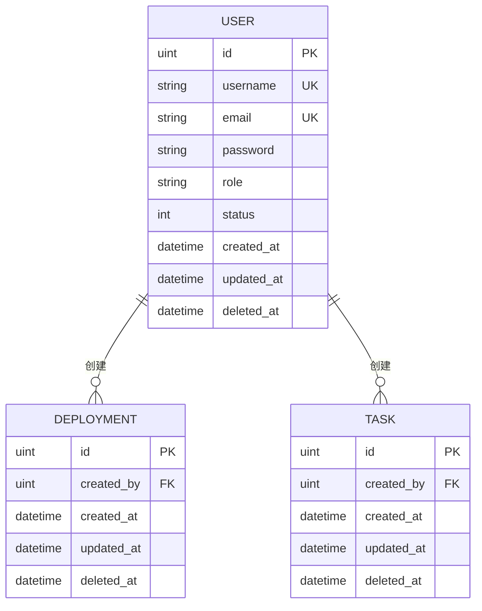

# 用户模型 (User)

<cite>
**本文档引用的文件**   
- [user.go](file://backend/internal/model/user.go)
- [deployment.go](file://backend/internal/model/deployment.go)
- [task.go](file://backend/internal/model/task.go)
- [init.sql](file://scripts/init.sql)
- [user.go](file://backend/internal/service/user.go)
</cite>

## 目录
1. [简介](#简介)
2. [用户模型结构](#用户模型结构)
3. [字段详细说明](#字段详细说明)
4. [数据库表结构与约束](#数据库表结构与约束)
5. [关联关系](#关联关系)
6. [GORM操作示例](#gorm操作示例)
7. [认证场景下的性能优化](#认证场景下的性能优化)

## 简介
`User` 模型是 qoder 系统的核心身份实体，用于管理平台用户的身份、权限和行为记录。该模型不仅定义了用户的基本信息，还通过 GORM 映射到数据库，并与 `Deployment`、`Task` 等关键业务模型建立关联。本文档全面解析 `User` 结构体的设计、数据库实现、关联逻辑及在认证流程中的性能优化策略。

**Section sources**
- [user.go](file://backend/internal/model/user.go#L1-L30)

## 用户模型结构
`User` 结构体定义在 `backend/internal/model/user.go` 中，采用 GORM 标签进行数据库映射和 JSON 序列化控制。其设计遵循 REST API 最佳实践，兼顾安全性（如密码字段不序列化）和可扩展性（软删除支持）。

```go
type User struct {
	ID        uint           `gorm:"primaryKey" json:"id"`
	Username  string         `gorm:"uniqueIndex;size:50;not null" json:"username"`
	Email     string         `gorm:"uniqueIndex;size:100;not null" json:"email"`
	Password  string         `gorm:"size:100;not null" json:"-"`
	Role      string         `gorm:"size:20;default:user" json:"role"`
	Status    int            `gorm:"default:1" json:"status"`
	CreatedAt time.Time      `json:"created_at"`
	UpdatedAt time.Time      `json:"updated_at"`
	DeletedAt gorm.DeletedAt `gorm:"index" json:"-"`
}
```

**Section sources**
- [user.go](file://backend/internal/model/user.go#L1-L30)

## 字段详细说明
以下为 `User` 模型各字段的完整说明，包括数据类型、GORM 标签含义和 JSON 序列化规则。

| 字段名 | 数据类型 | GORM 标签 | JSON 序列化 | 说明 |
|--------|--------|-----------|-------------|------|
| **ID** | `uint` | `primaryKey` | `json:"id"` | 主键，自增整数，唯一标识用户 |
| **Username** | `string` | `uniqueIndex;size:50;not null` | `json:"username"` | 用户名，最大50字符，唯一且非空 |
| **Email** | `string` | `uniqueIndex;size:100;not null` | `json:"email"` | 邮箱地址，最大100字符，唯一且非空 |
| **Password** | `string` | `size:100;not null` | `json:"-"` | 加密后的密码，存储长度100字符，JSON输出中隐藏 |
| **Role** | `string` | `size:20;default:user` | `json:"role"` | 角色，如 `admin` 或 `user`，默认为 `user` |
| **Status** | `int` | `default:1` | `json:"status"` | 状态，1表示启用，0表示禁用，默认启用 |
| **CreatedAt** | `time.Time` | - | `json:"created_at"` | 创建时间，由 GORM 自动填充 |
| **UpdatedAt** | `time.Time` | - | `json:"updated_at"` | 更新时间，由 GORM 自动维护 |
| **DeletedAt** | `gorm.DeletedAt` | `index` | `json:"-"` | 软删除时间戳，非空表示已删除，JSON中不输出 |

**Section sources**
- [user.go](file://backend/internal/model/user.go#L1-L30)

## 数据库表结构与约束
`users` 表由 GORM 自动迁移生成，其结构与 `User` 模型严格对应。`scripts/init.sql` 文件中包含初始化语句，用于创建默认管理员账户。

### 表结构定义
```sql
-- 实际表结构由 GORM AutoMigrate 生成，等价于：
CREATE TABLE users (
    id BIGINT UNSIGNED AUTO_INCREMENT PRIMARY KEY,
    username VARCHAR(50) NOT NULL UNIQUE,
    email VARCHAR(100) NOT NULL UNIQUE,
    password VARCHAR(100) NOT NULL,
    role VARCHAR(20) DEFAULT 'user',
    status INT DEFAULT 1,
    created_at DATETIME,
    updated_at DATETIME,
    deleted_at DATETIME,
    INDEX idx_users_deleted_at (deleted_at),
    INDEX idx_users_username_email (username, email) -- GORM 为 uniqueIndex 自动生成
);
```

### 约束与索引策略
- **主键约束**：`id` 为自增主键，确保唯一性。
- **唯一性约束**：`username` 和 `email` 均有唯一索引，防止重复注册。
- **非空约束**：`username`、`email`、`password` 不可为空。
- **默认值**：`role` 默认为 `user`，`status` 默认为 `1`（启用）。
- **软删除索引**：`deleted_at` 字段建立索引，提升软删除查询性能。
- **复合索引**：GORM 为 `uniqueIndex` 字段自动创建索引，优化登录时的用户名/邮箱查询。

**Section sources**
- [user.go](file://backend/internal/model/user.go#L1-L30)
- [init.sql](file://scripts/init.sql#L6-L10)

## 关联关系
`User` 模型通过外键与其他核心模型建立关联，体现用户在系统中的操作主体角色。

### 关联模型
- **Deployment**：一个用户可创建多个部署任务。
- **Task**：一个用户可创建多个定时任务。

### GORM 关联定义
```go
// 在 User 结构体中
Deployments []Deployment `gorm:"foreignKey:CreatedBy" json:"-"`
Tasks       []Task       `gorm:"foreignKey:CreatedBy" json:"-"`
```

### 反向关联
在 `Deployment` 和 `Task` 模型中，均包含指向 `User` 的外键：
```go
// Deployment 和 Task 模型中的字段
CreatedBy uint `gorm:"index;not null" json:"created_by"`
User      User `gorm:"foreignKey:CreatedBy" json:"user,omitempty"`
```

### 关联关系图


**Diagram sources**
- [user.go](file://backend/internal/model/user.go#L1-L30)
- [deployment.go](file://backend/internal/model/deployment.go#L1-L50)
- [task.go](file://backend/internal/model/task.go#L1-L54)

## GORM操作示例
以下为常见的 GORM 操作代码示例，展示如何对 `User` 模型进行增删改查。

### 创建用户
```go
user, err := userService.Create("john_doe", "john@example.com", "password123", "user")
```
**代码路径**: [user.go](file://backend/internal/service/user.go#L54-L77)

### 查询用户（通过ID）
```go
user, err := userService.GetByID(1)
```
该方法优先从 Redis 缓存读取，未命中则查询数据库并缓存结果。

**代码路径**: [user.go](file://backend/internal/service/user.go#L34-L52)

### 用户登录验证
```go
user, err := userService.Login("john_doe", "password123")
```
支持通过用户名或邮箱登录，验证密码并检查用户状态。

**代码路径**: [user.go](file://backend/internal/service/user.go#L14-L32)

### 更新用户信息
```go
updates := map[string]interface{}{"role": "admin"}
err := userService.Update(1, updates)
```
支持动态字段更新，密码更新时自动加密。

**代码路径**: [user.go](file://backend/internal/service/user.go#L79-L105)

### 删除用户（软删除）
```go
err := userService.Delete(1)
```
执行软删除，`deleted_at` 字段被填充，记录仍保留在数据库中。

**代码路径**: [user.go](file://backend/internal/service/user.go#L107-L123)

## 认证场景下的性能优化
在用户认证（登录）场景中，`UserService.Login` 方法的性能至关重要。以下是其优化策略分析。

### 查询优化
- **复合查询条件**：使用 `WHERE username = ? OR email = ?` 支持双方式登录。
- **索引利用**：`username` 和 `email` 的唯一索引确保查询高效。
- **缓存层**：虽然登录时不直接使用缓存，但 `GetByID` 在后续操作中可利用缓存减少数据库压力。

### 安全与性能平衡
- **密码验证**：使用 `bcrypt` 算法（通过 `auth.CheckPassword`）确保安全性，虽有一定计算开销，但可防止暴力破解。
- **状态检查**：在密码验证前检查 `status`，避免对禁用账户进行昂贵的密码解密操作。

### 建议的进一步优化
1. **登录缓存**：对频繁登录的用户（如管理员），可缓存其认证结果（JWT 或 session），减少数据库查询。
2. **限流机制**：结合 `middleware/ratelimit.go` 防止暴力破解攻击。
3. **异步日志**：记录登录日志时采用异步方式，避免阻塞主流程。

**Section sources**
- [user.go](file://backend/internal/service/user.go#L14-L32)
- [user.go](file://backend/internal/service/user.go#L34-L52)
- [middleware/ratelimit.go](file://backend/internal/middleware/ratelimit.go)