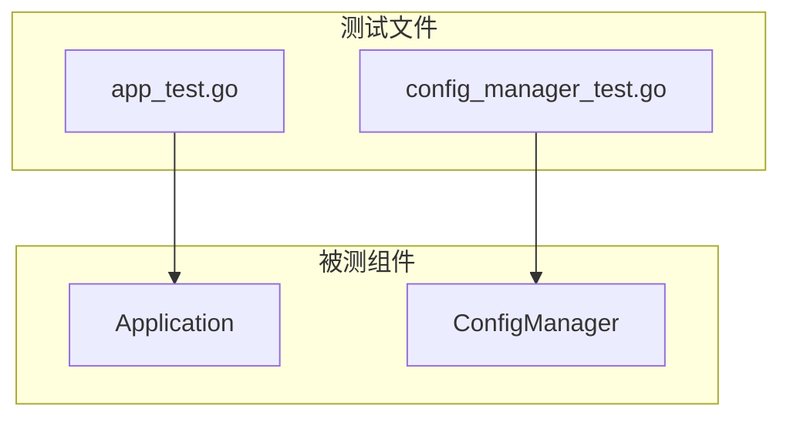
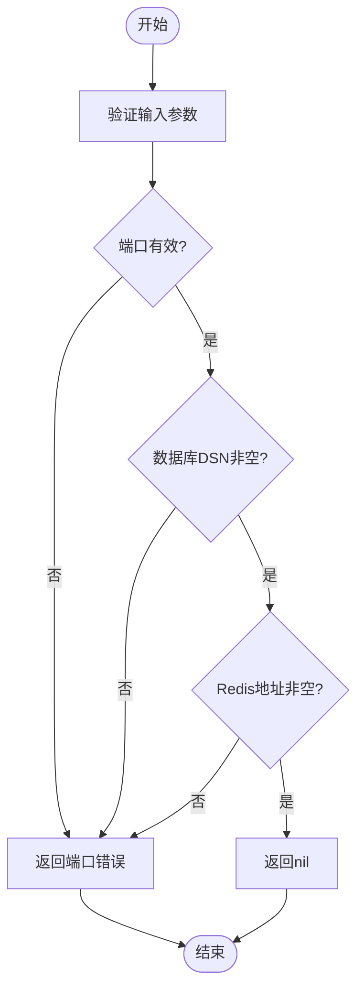
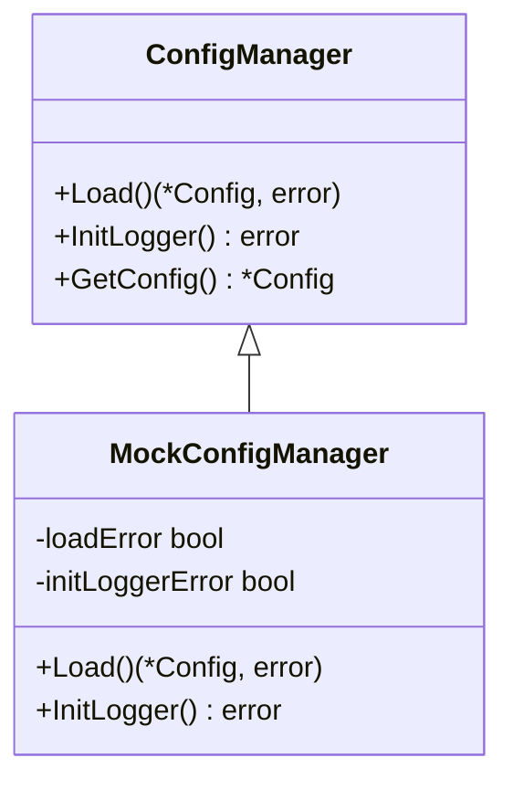

# 单元测试

<cite>
**本文档引用的文件**   
- [app_test.go](file://backend/internal/app/app_test.go)
- [config_manager_test.go](file://backend/internal/app/config_manager_test.go)
- [app.go](file://backend/internal/app/app.go)
- [config_manager.go](file://backend/internal/app/config_manager.go)
- [config.go](file://backend/internal/config/config.go)
</cite>

## 目录
1. [引言](#引言)
2. [项目结构与测试布局](#项目结构与测试布局)
3. [核心测试文件分析](#核心测试文件分析)
4. [测试策略与设计模式](#测试策略与设计模式)
5. [mock技术应用](#mock技术应用)
6. [测试覆盖率与执行](#测试覆盖率与执行)
7. [最佳实践建议](#最佳实践建议)
8. [结论](#结论)

## 引言
本文档旨在详细说明qoder项目中Go语言单元测试的实现策略。重点分析`app_test.go`和`config_manager_test.go`中的测试用例设计，涵盖测试环境初始化、依赖注入模拟、断言验证逻辑等内容。同时阐述各模块的测试覆盖率目标（建议≥80%），并展示如何使用Go内置工具执行测试和生成覆盖率报告。通过代码实例说明mock技术在配置管理、数据库连接等场景的应用方式，确保被测单元的独立性，并提供编写高效单元测试的最佳实践。

## 项目结构与测试布局
qoder项目的测试文件遵循Go语言标准布局，位于对应包的`internal/app`目录下，以`_test.go`后缀命名。主要测试文件包括：
- `app_test.go`：测试应用主结构体`Application`的初始化与核心方法
- `config_manager_test.go`：测试配置管理器`ConfigManager`的完整功能

测试覆盖了应用启动流程中的关键组件，包括配置加载、日志初始化、数据库连接、缓存管理等，确保系统核心逻辑的稳定性。



**图示来源**
- [app_test.go](file://backend/internal/app/app_test.go#L1-L102)
- [config_manager_test.go](file://backend/internal/app/config_manager_test.go#L1-L280)

## 核心测试文件分析

### app_test.go 测试分析
该文件主要验证`Application`结构体的创建及其各管理器组件的初始化状态。测试用例包括：
- `TestApplication_New`：验证新创建的应用实例是否正确初始化，特别是`shutdownCh`通道和各管理器是否为nil
- `TestApplication_GetConfig`、`GetDB`、`GetRedis`：验证在未初始化状态下获取组件返回nil
- `TestApplication_initConfig`：测试配置初始化流程，验证`configMgr`是否被正确创建

这些测试确保应用在启动初期的状态符合预期，为后续组件初始化奠定基础。

**章节来源**
- [app_test.go](file://backend/internal/app/app_test.go#L1-L102)

### config_manager_test.go 测试分析
该文件全面测试`ConfigManager`的功能，包含多个关键测试用例：
- `TestConfigManager_NewConfigManager`：验证配置管理器的创建
- `TestConfigManager_Validate`：使用表驱测试模式验证配置校验逻辑，覆盖端口、数据库DSN、Redis地址等边界条件
- `TestConfigManager_GetConfig`：测试配置获取功能
- `TestConfigManager_InitLogger_WithoutConfig`：验证在无配置时初始化日志应返回错误
- `TestConfigManager_IsProduction`、`IsDevelopment`：测试环境判断逻辑
- `TestConfigManager_String`：验证字符串表示方法

特别值得注意的是`TestConfigManager_Validate`使用了表驱测试（table-driven test），通过定义多个测试用例结构体来系统性地验证配置校验逻辑。



**图示来源**
- [config_manager.go](file://backend/internal/app/config_manager.go#L30-L50)
- [config_manager_test.go](file://backend/internal/app/config_manager_test.go#L15-L80)

**章节来源**
- [config_manager_test.go](file://backend/internal/app/config_manager_test.go#L1-L280)

## 测试策略与设计模式

### 初始化与断言策略
测试文件采用标准的Go测试模式，使用`testing.T`类型的指针作为参数。断言主要通过`if`条件判断配合`Error`或`Fatal`方法实现：
- 使用`t.Fatal`表示致命错误，立即终止测试
- 使用`t.Error`记录错误但继续执行后续断言
- 使用`t.Logf`输出调试信息

### 表驱测试模式
在`config_manager_test.go`中，`TestConfigManager_Validate`函数展示了典型的表驱测试模式：
```go
tests := []struct {
    name    string
    config  *config.Config
    wantErr bool
}{
    // 测试用例定义
}
for _, tt := range tests {
    t.Run(tt.name, func(t *testing.T) {
        // 执行测试
    })
}
```
这种模式使得测试用例组织清晰，易于扩展和维护。

**章节来源**
- [config_manager_test.go](file://backend/internal/app/config_manager_test.go#L15-L80)

## mock技术应用
虽然当前测试代码中未使用外部mock库，但`app_test.go`中定义了`MockConfigManager`结构体，展示了手动mock的实现方式：

```go
type MockConfigManager struct {
    loadError       bool
    initLoggerError bool
}

func (m *MockConfigManager) Load() error {
    if m.loadError {
        return &mockError{"mock load error"}
    }
    return nil
}
```

这种手动mock技术可用于：
- 模拟配置加载失败场景
- 模拟日志初始化异常
- 隔离外部依赖，确保测试的确定性和可重复性

mock对象通过接口注入的方式可以替换真实依赖，确保被测单元的独立性。



**图示来源**
- [app_test.go](file://backend/internal/app/app_test.go#L60-L80)
- [config_manager.go](file://backend/internal/app/config_manager.go#L10-L20)

**章节来源**
- [app_test.go](file://backend/internal/app/app_test.go#L60-L102)

## 测试覆盖率与执行
建议各模块的测试覆盖率目标不低于80%。可以使用Go内置工具评估测试覆盖率：

```bash
# 执行测试并生成覆盖率文件
go test -coverprofile=coverage.out ./backend/internal/app/

# 生成HTML格式的覆盖率报告
go tool cover -html=coverage.out -o coverage.html

# 查看覆盖率数值
go test -cover ./backend/internal/app/
```

这些命令可以：
- 生成详细的覆盖率报告
- 以HTML形式可视化覆盖情况
- 显示包级别的覆盖率百分比

通过定期检查覆盖率，可以识别测试不足的代码区域并加以改进。

**章节来源**
- [app_test.go](file://backend/internal/app/app_test.go#L1-L102)
- [config_manager_test.go](file://backend/internal/app/config_manager_test.go#L1-L280)

## 最佳实践建议

### 测试命名规范
遵循Go测试命名惯例：`Test<FunctionName>_<Scenario>`，如`TestConfigManager_Validate`，清晰表达测试目标。

### 表驱测试
对于有多个输入场景的函数，使用表驱测试模式，提高测试的可维护性和完整性。

### 资源清理
虽然当前测试未涉及复杂资源管理，但建议在需要时使用`TestMain`函数进行全局测试设置和清理：

```go
func TestMain(m *testing.M) {
    // 设置测试环境
    code := m.Run()
    // 清理测试环境
    os.Exit(code)
}
```

### 边界条件测试
确保测试覆盖各种边界条件，如：
- 空值或nil输入
- 数值边界（如端口0和65535）
- 环境变量缺失情况

### 错误路径测试
不仅要测试正常流程，还要专门测试错误处理路径，确保系统在异常情况下的行为符合预期。

**章节来源**
- [app_test.go](file://backend/internal/app/app_test.go#L1-L102)
- [config_manager_test.go](file://backend/internal/app/config_manager_test.go#L1-L280)
- [main_integration_test.go](file://backend/cmd/main_integration_test.go#L95-L124)

## 结论
qoder项目的单元测试框架为应用核心组件提供了良好的测试基础。通过分析`app_test.go`和`config_manager_test.go`，我们看到了标准的Go测试实践，包括初始化验证、表驱测试和基本的mock技术。建议进一步完善测试覆盖，特别是对数据库和缓存管理器的测试，并考虑引入更强大的mock库来简化复杂依赖的模拟。持续维护高测试覆盖率将有助于保障代码质量和系统稳定性。