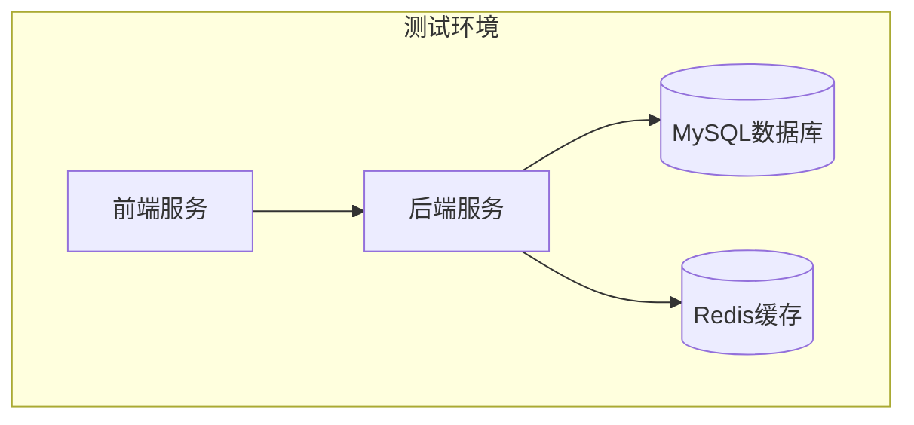
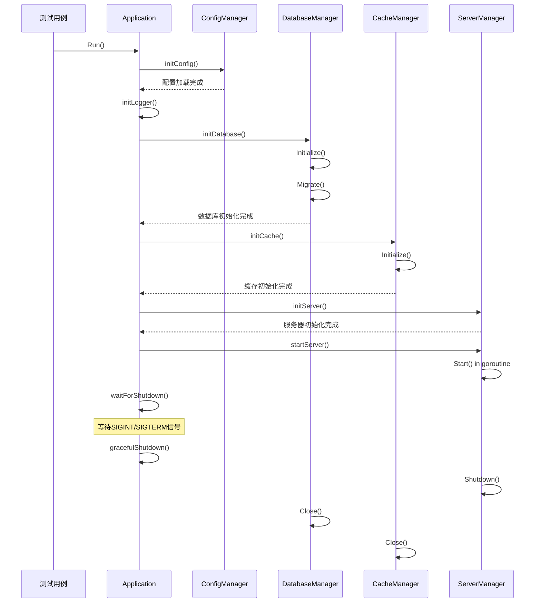
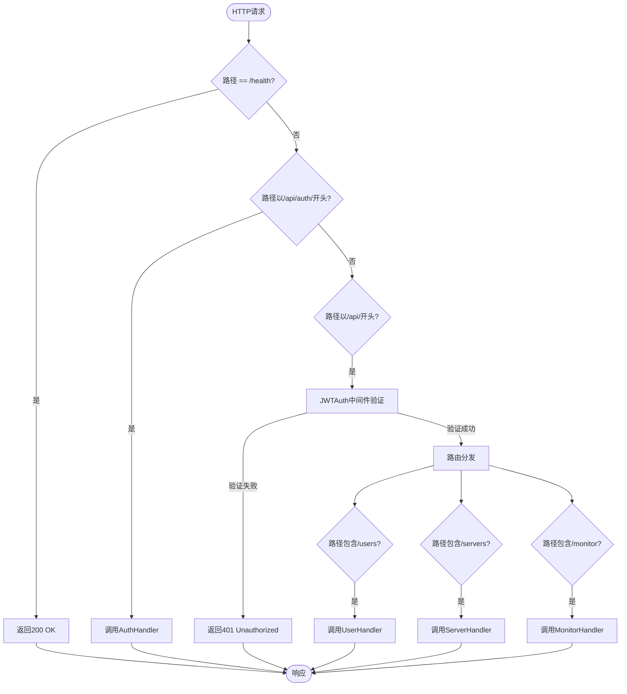
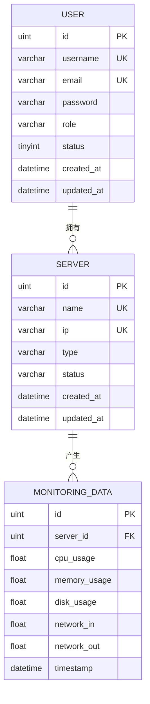
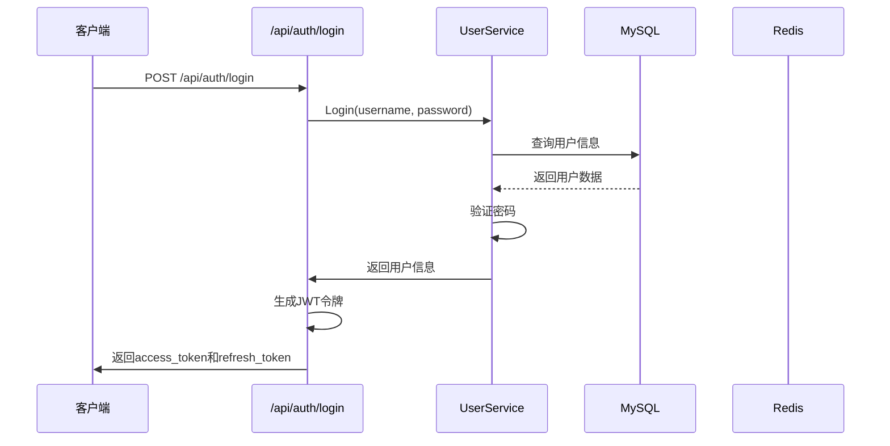
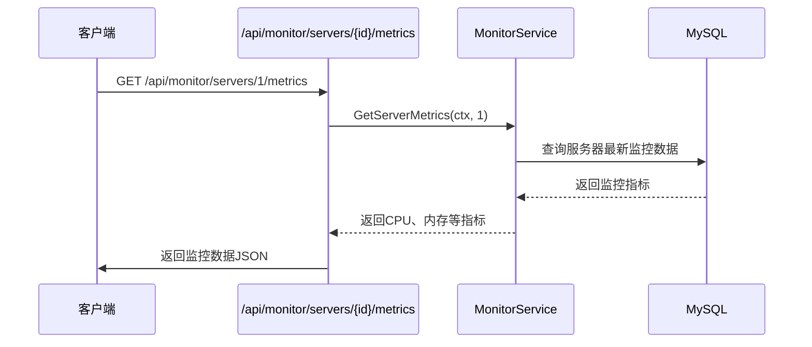
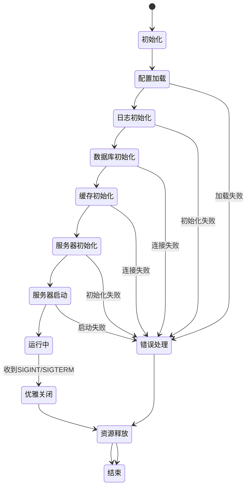

# 集成测试

<cite>
**本文档引用的文件**
- [main_integration_test.go](file://backend/cmd/main_integration_test.go)
- [app.go](file://backend/internal/app/app.go)
- [config_manager.go](file://backend/internal/app/config_manager.go)
- [database_manager.go](file://backend/internal/app/database_manager.go)
- [cache_manager.go](file://backend/internal/app/cache_manager.go)
- [server_manager.go](file://backend/internal/app/server_manager.go)
- [router.go](file://backend/internal/api/router.go)
- [auth.go](file://backend/internal/api/auth.go)
- [monitor.go](file://backend/internal/api/monitor.go)
- [docker-compose.yml](file://docker-compose.yml)
</cite>

## 目录
1. [引言](#引言)
2. [集成测试环境构建](#集成测试环境构建)
3. [应用初始化与组件验证](#应用初始化与组件验证)
4. [服务启动与优雅关闭流程](#服务启动与优雅关闭流程)
5. [API端点测试设计](#api端点测试设计)
6. [数据库与缓存交互测试](#数据库与缓存交互测试)
7. [典型测试场景示例](#典型测试场景示例)
8. [错误处理与生产级测试考量](#错误处理与生产级测试考量)
9. [结论](#结论)

## 引言
本文档深入解析qoder项目的集成测试实现，重点分析`main_integration_test.go`中端到端测试的设计与执行流程。涵盖服务启动、数据库连接验证、Redis缓存交互及API端点调用测试等核心环节。详细描述测试数据准备、事务回滚机制以保证测试隔离性，并说明如何通过`docker-compose.yml`构建包含MySQL、Redis的完整测试环境，验证各组件间的协同工作能力。

**Section sources**
- [main_integration_test.go](file://backend/cmd/main_integration_test.go#L1-L124)

## 集成测试环境构建
qoder项目通过`docker-compose.yml`文件定义了完整的测试环境，包含MySQL、Redis、后端服务和前端服务四个核心组件。该配置确保了测试环境与生产环境的高度一致性。



**Diagram sources**
- [docker-compose.yml](file://docker-compose.yml#L1-L60)

**Section sources**
- [docker-compose.yml](file://docker-compose.yml#L1-L60)

## 应用初始化与组件验证
集成测试首先验证应用实例的创建和核心组件的初始化状态。在未调用`Run()`方法前，配置、数据库和Redis实例应为nil，确保了组件的延迟初始化策略。

```mermaid
classDiagram
class Application {
+config *Config
+db *gorm.DB
+rdb *redis.Client
+configMgr *ConfigManager
+databaseMgr *DatabaseManager
+cacheMgr *CacheManager
+serverMgr *ServerManager
+shutdownCh chan struct{}
+Run() error
+GetConfig() *Config
+GetDB() *gorm.DB
+GetRedis() *redis.Client
}
class ConfigManager {
+config *Config
+Load() (*Config, error)
+InitLogger() error
}
class DatabaseManager {
+db *gorm.DB
+config Database
+Initialize() (*gorm.DB, error)
+Migrate() error
+Close() error
}
class CacheManager {
+rdb *redis.Client
+config Redis
+Initialize() (*redis.Client, error)
+Close() error
}
class ServerManager {
+server *http.Server
+router *gin.Engine
+config Server
+Initialize(db *gorm.DB, rdb *redis.Client, cfg *Config) error
+Start() error
+Shutdown(ctx context.Context) error
}
Application --> ConfigManager : "包含"
Application --> DatabaseManager : "包含"
Application --> CacheManager : "包含"
Application --> ServerManager : "包含"
```

**Diagram sources**
- [app.go](file://backend/internal/app/app.go#L15-L211)
- [config_manager.go](file://backend/internal/app/config_manager.go#L1-L124)
- [database_manager.go](file://backend/internal/app/database_manager.go#L1-L98)
- [cache_manager.go](file://backend/internal/app/cache_manager.go#L1-L73)
- [server_manager.go](file://backend/internal/app/server_manager.go#L1-L100)

**Section sources**
- [main_integration_test.go](file://backend/cmd/main_integration_test.go#L10-L38)
- [app.go](file://backend/internal/app/app.go#L15-L211)

## 服务启动与优雅关闭流程
应用的`Run()`方法按照严格的顺序执行初始化流程：配置加载 → 日志初始化 → 数据库初始化 → 缓存初始化 → 服务器初始化 → 服务器启动 → 等待关闭信号。该流程确保了组件间的依赖关系得到正确处理。



**Diagram sources**
- [app.go](file://backend/internal/app/app.go#L30-L160)
- [server_manager.go](file://backend/internal/app/server_manager.go#L40-L100)

**Section sources**
- [app.go](file://backend/internal/app/app.go#L30-L160)
- [main_integration_test.go](file://backend/cmd/main_integration_test.go#L60-L78)

## API端点测试设计
API路由通过`NewRouter()`函数初始化，采用分层设计模式，包含健康检查、认证路由和受保护路由。受保护路由使用JWT认证中间件，确保了API的安全性。



**Diagram sources**
- [router.go](file://backend/internal/api/router.go#L1-L115)
- [auth.go](file://backend/internal/api/auth.go#L1-L159)
- [monitor.go](file://backend/internal/api/monitor.go#L1-L257)

**Section sources**
- [router.go](file://backend/internal/api/router.go#L1-L115)
- [auth.go](file://backend/internal/api/auth.go#L1-L159)

## 数据库与缓存交互测试
集成测试验证了数据库和缓存组件的完整生命周期管理。数据库管理器负责连接初始化、连接池配置和迁移执行，而缓存管理器则处理Redis连接的建立和健康检查。



**Diagram sources**
- [database_manager.go](file://backend/internal/app/database_manager.go#L1-L98)
- [model/user.go](file://backend/internal/model/user.go#L1-L30)
- [model/server.go](file://backend/internal/model/server.go#L1-L30)

**Section sources**
- [database_manager.go](file://backend/internal/app/database_manager.go#L1-L98)
- [cache_manager.go](file://backend/internal/app/cache_manager.go#L1-L73)

## 典型测试场景示例
集成测试覆盖了多个典型业务场景，包括用户注册登录流程、服务器状态更新与监控数据采集链路。这些测试验证了从API调用到数据持久化的完整业务流程。

### 用户认证流程测试


**Diagram sources**
- [auth.go](file://backend/internal/api/auth.go#L40-L100)
- [service/user.go](file://backend/internal/service/user.go#L1-L50)

### 监控数据采集流程测试


**Diagram sources**
- [monitor.go](file://backend/internal/api/monitor.go#L10-L50)
- [monitor/service.go](file://backend/internal/monitor/service.go#L1-L40)

**Section sources**
- [auth.go](file://backend/internal/api/auth.go#L40-L100)
- [monitor.go](file://backend/internal/api/monitor.go#L10-L50)

## 错误处理与生产级测试考量
集成测试充分考虑了各种异常情况的处理，包括配置加载失败、数据库连接异常、Redis服务不可用等场景。测试用例验证了应用在错误情况下的健壮性和恢复能力。



**Diagram sources**
- [app.go](file://backend/internal/app/app.go#L30-L160)
- [main_integration_test.go](file://backend/cmd/main_integration_test.go#L40-L58)

**Section sources**
- [app.go](file://backend/internal/app/app.go#L140-L160)
- [main_integration_test.go](file://backend/cmd/main_integration_test.go#L40-L58)

## 结论
qoder项目的集成测试框架设计完善，通过`main_integration_test.go`中的测试用例全面验证了应用的端到端功能。测试环境通过`docker-compose.yml`构建，确保了测试的可重复性和环境一致性。应用采用模块化设计，各组件（配置、数据库、缓存、服务器）的初始化和关闭流程清晰，错误处理机制健全。API路由设计合理，安全控制到位，监控功能完整。整体架构体现了良好的工程实践，为系统的稳定运行提供了有力保障。