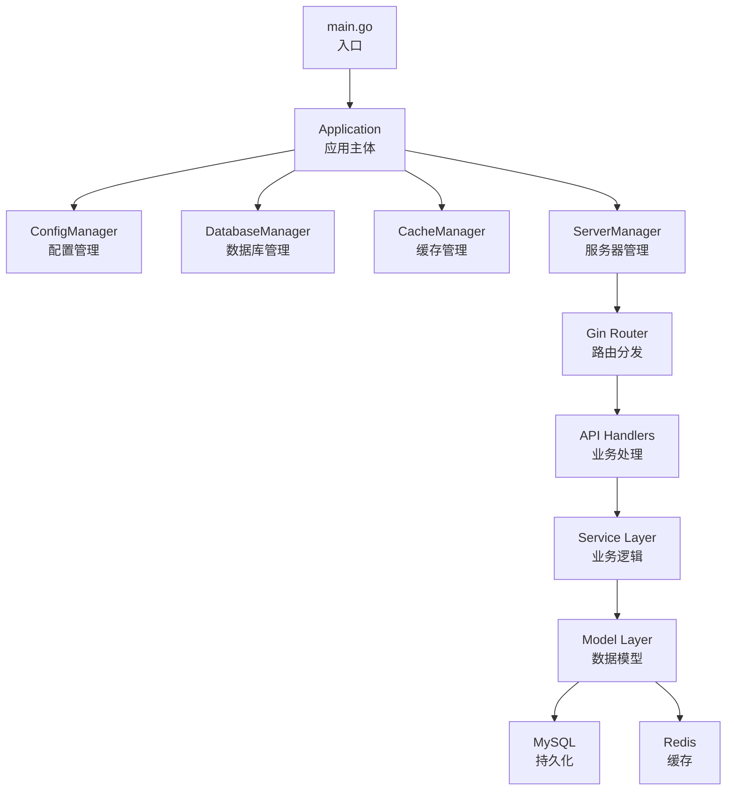
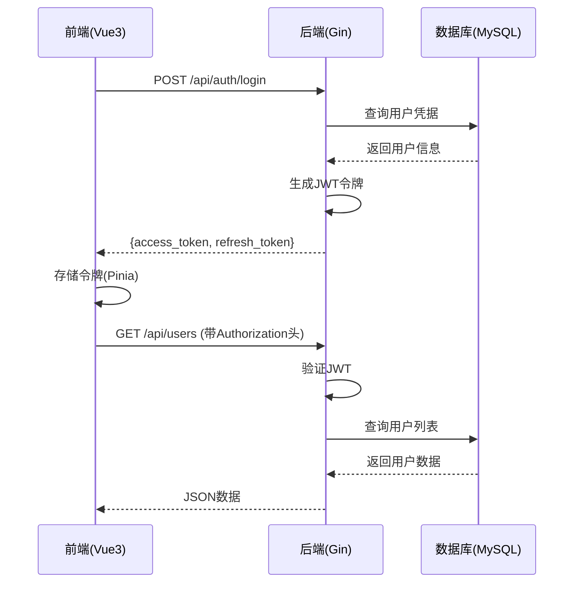

# 系统概述

<cite>
**本文档引用文件**  
- [main.go](file://backend/cmd/main.go)
- [app.go](file://backend/internal/app/app.go)
- [config_manager.go](file://backend/internal/app/config_manager.go)
- [config.go](file://backend/internal/config/config.go)
- [database_manager.go](file://backend/internal/app/database_manager.go)
- [server_manager.go](file://backend/internal/app/server_manager.go)
- [router.go](file://backend/internal/api/router.go)
- [model.go](file://backend/internal/model/model.go)
- [user.go](file://backend/internal/model/user.go)
- [README.md](file://README.md)
</cite>

## 目录

1. [项目简介](#项目简介)
2. [整体架构设计](#整体架构设计)
3. [前后端协作机制](#前后端协作机制)
4. [核心功能模块解析](#核心功能模块解析)
5. [项目目录结构说明](#项目目录结构说明)
6. [技术栈选型分析](#技术栈选型分析)
7. [一体化部署流程](#一体化部署流程)

## 项目简介

qoder 是一个全栈自动化运维平台，旨在为开发者和运维团队提供一体化的服务器管理、应用部署、任务调度与系统监控解决方案。系统采用前后端分离架构，后端基于 Go 语言构建高性能 API 服务，前端使用 Vue3 提供现代化用户界面。平台支持用户权限控制、实时监控、部署调度等关键运维功能，适用于中小型团队的 DevOps 实践。

**Section sources**  
- [README.md](file://README.md#L1-L10)

## 整体架构设计

qoder 采用典型的分层架构设计，包含表现层（前端）、API 层（后端）、数据访问层与持久化层。系统通过 Gin 框架暴露 RESTful 接口，前端通过 Axios 调用接口获取数据，后端使用 GORM 操作 MySQL 数据库，并通过 Redis 实现缓存与会话管理。

系统启动流程如下：
1. `main.go` 入口调用 `app.New()` 创建应用实例
2. `Application.Run()` 依次初始化配置、日志、数据库、缓存、服务器
3. 通过 `ServerManager` 启动 HTTP 服务并监听指定端口
4. 接收外部请求，由 Gin 路由分发至对应处理器



**Diagram sources**  
- [main.go](file://backend/cmd/main.go#L1-L18)
- [app.go](file://backend/internal/app/app.go#L1-L198)
- [server_manager.go](file://backend/internal/app/server_manager.go#L1-L101)

**Section sources**  
- [main.go](file://backend/cmd/main.go#L1-L18)
- [app.go](file://backend/internal/app/app.go#L1-L198)

## 前后端协作机制

系统采用前后端完全分离的开发模式，前端运行于独立的 Vite 服务器，后端提供纯 API 接口服务。两者通过 HTTP 协议通信，使用 JSON 格式交换数据。

### 通信流程
1. 前端通过 Pinia 管理全局状态（如用户登录信息）
2. 用户操作触发 API 请求（如 `/api/auth/login`）
3. 后端验证 JWT 令牌，返回数据或错误
4. 前端更新状态并刷新 UI

### 认证机制
系统采用 JWT 进行身份验证：
- 登录成功后返回 `access_token` 和 `refresh_token`
- 后续请求在 `Authorization` 头部携带 `Bearer <token>`
- 使用 `middleware.JWTAuth` 中间件进行令牌验证
- 管理员权限通过 `middleware.RequireRole("admin")` 控制



**Diagram sources**  
- [router.go](file://backend/internal/api/router.go#L1-L116)
- [auth.go](file://backend/internal/api/auth.go)
- [user.ts](file://frontend/src/store/user.ts)

**Section sources**  
- [router.go](file://backend/internal/api/router.go#L1-L116)

## 核心功能模块解析

### 服务器管理
通过 `/api/servers/*` 接口实现服务器的增删改查与状态监控。支持将服务器加入监控系统，实时获取 CPU、内存、磁盘等指标。

### 部署调度
提供 `/api/deployments/*` 接口，支持应用的自动化部署流程，包括构建、推送、发布等阶段，并记录部署日志。

### 用户权限
基于角色的访问控制（RBAC）：
- 普通用户：查看自身信息、执行任务
- 管理员：管理用户、服务器、部署等所有资源
- 权限通过 `Role` 字段和中间件控制

### 系统监控
通过 `/api/monitor/*` 接口提供：
- 仪表盘数据
- 服务器指标采集
- 历史性能数据
- 在线状态检测

**Section sources**  
- [router.go](file://backend/internal/api/router.go#L1-L116)
- [user.go](file://backend/internal/model/user.go#L1-L30)

## 项目目录结构说明

项目采用标准的 Go 项目布局，结合前后端分离结构：

```
qoder/
├── backend/                 # 后端Go服务
│   ├── cmd/                # 主程序入口
│   ├── internal/           # 内部包（不可外部导入）
│   │   ├── api/           # HTTP接口处理器
│   │   ├── app/           # 应用生命周期管理
│   │   ├── auth/          # 认证逻辑
│   │   ├── config/        # 配置结构定义
│   │   ├── middleware/    # Gin中间件
│   │   ├── model/         # GORM数据模型
│   │   ├── monitor/       # 监控服务
│   │   └── service/       # 业务逻辑层
│   ├── pkg/               # 可复用公共包
│   └── configs/           # YAML配置文件
├── frontend/              # 前端Vue3应用
│   ├── src/              # 源码
│   │   ├── api/          # API请求封装
│   │   ├── store/        # Pinia状态管理
│   │   ├── views/        # 页面组件
│   │   └── router/       # 路由配置
├── docker/              # Nginx配置
├── scripts/             # 初始化脚本
└── docker-compose.yml   # 一体化部署配置
```

**Section sources**  
- [README.md](file://README.md#L20-L40)

## 技术栈选型分析

### 后端选型
- **Gin**: 高性能 Web 框架，适合构建 API 服务，路由性能优异
- **GORM**: 功能完整的 ORM，支持自动迁移、关联查询，降低数据库操作复杂度
- **Viper**: 支持多格式配置（YAML/环境变量），便于环境适配
- **Zap**: 高性能日志库，结构化日志输出，适合生产环境
- **JWT**: 无状态认证，适合分布式系统，易于前端集成

### 前端选型
- **Vue3**: Composition API 提供更好的逻辑复用，性能优于 Vue2
- **Pinia**: 官方推荐状态管理，TypeScript 支持完善，API 简洁
- **Element Plus**: 成熟的 UI 组件库，提供丰富的运维界面元素
- **ECharts**: 强大的数据可视化能力，适合监控图表展示

### 数据库选型
- **MySQL**: 关系型数据库，保证数据一致性，适合用户、服务器等结构化数据
- **Redis**: 高性能缓存，用于会话存储、速率限制、监控数据缓冲

**Section sources**  
- [README.md](file://README.md#L12-L19)

## 一体化部署流程

系统通过 `docker-compose.yml` 实现一键部署，包含以下服务：
- `backend`: Go 应用容器，暴露 8080 端口
- `frontend`: Nginx 容器，托管前端静态文件
- `mysql`: MySQL 数据库
- `redis`: Redis 缓存服务

部署步骤：
1. 执行 `docker-compose up -d`
2. 系统自动拉取镜像并启动容器
3. 后端服务初始化数据库（自动迁移）
4. 前端通过 Nginx 反向代理请求到后端
5. 访问 `http://localhost` 进入运维平台

开发模式下也可分别启动：
```bash
# 后端
cd backend && go run cmd/main.go

# 前端
cd frontend && npm run dev
```

**Section sources**  
- [docker-compose.yml](file://docker-compose.yml)
- [scripts/start-dev.sh](file://scripts/start-dev.sh)
- [README.md](file://README.md#L43-L50)