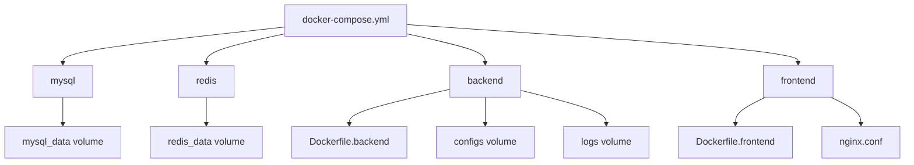
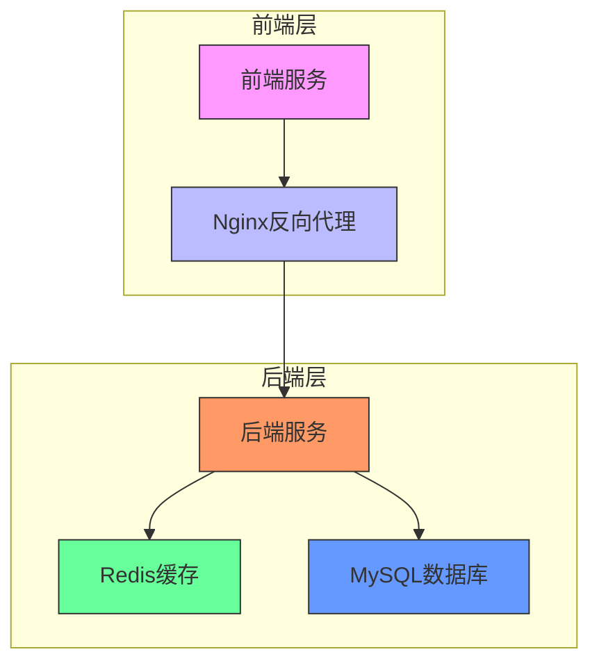
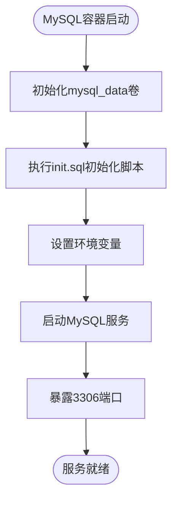
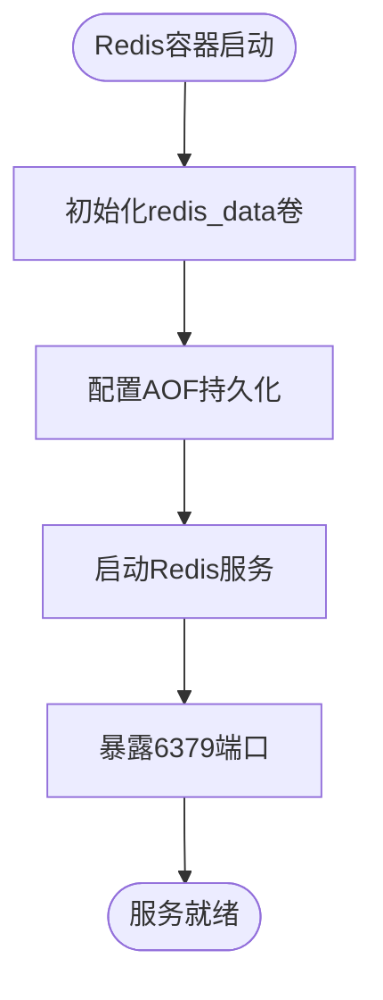
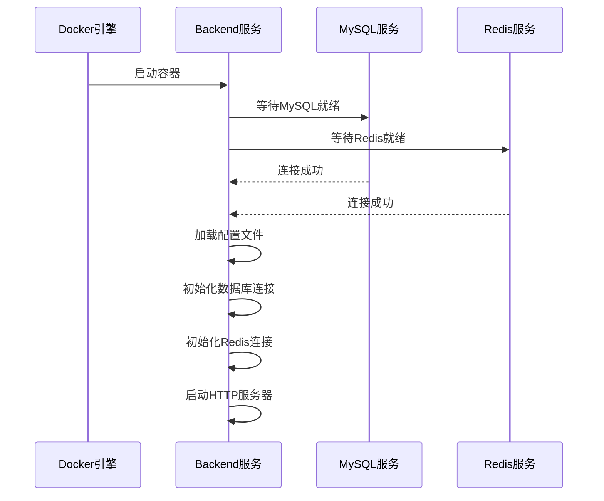
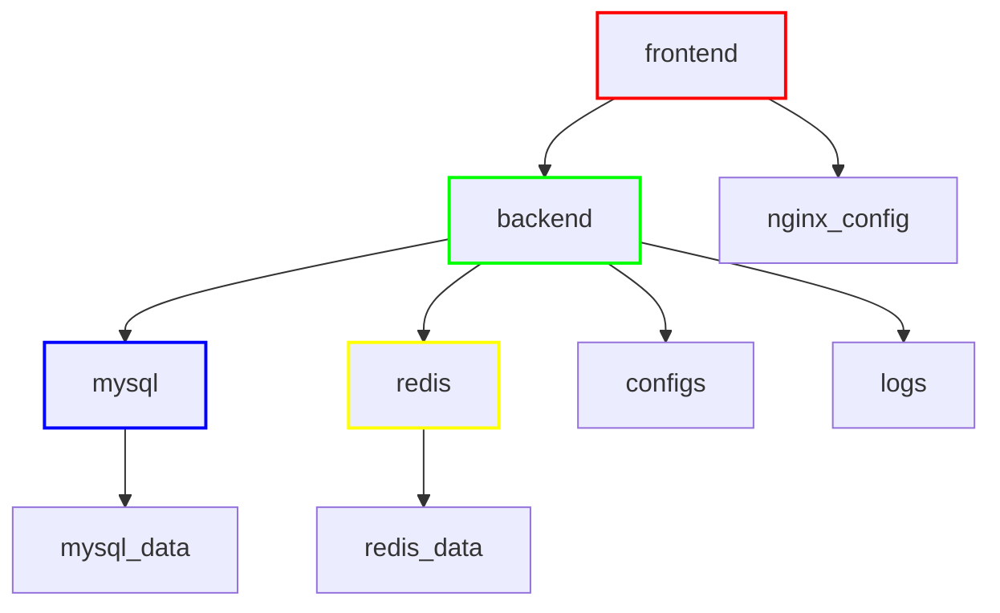

# Docker容器编排

<cite>
**本文档中引用的文件**   
- [docker-compose.yml](file://docker-compose.yml)
- [Dockerfile.backend](file://docker/Dockerfile.backend)
- [Dockerfile.frontend](file://docker/Dockerfile.frontend)
- [nginx.conf](file://docker/nginx.conf)
- [init.sql](file://scripts/init.sql)
- [config.yaml](file://backend/configs/config.yaml)
- [config.go](file://backend/internal/config/config.go)
- [database.go](file://backend/pkg/database/database.go)
- [redis.go](file://backend/pkg/redis/redis.go)
- [Makefile](file://Makefile)
</cite>

## 目录
1. [简介](#简介)
2. [项目结构](#项目结构)
3. [核心组件](#核心组件)
4. [架构概述](#架构概述)
5. [详细组件分析](#详细组件分析)
6. [依赖分析](#依赖分析)
7. [性能考虑](#性能考虑)
8. [故障排除指南](#故障排除指南)
9. [结论](#结论)

## 简介
本文档详细解析qoder项目的`docker-compose.yml`文件结构，说明如何通过Docker Compose编排MySQL、Redis、Backend、Frontend和Nginx五个服务。文档涵盖各服务的构建上下文、端口映射、依赖关系（depends_on）、环境变量注入机制，以及如何通过`docker-compose up -d`启动生产级容器集群并管理服务生命周期。同时包含自定义网络配置、数据卷挂载、日志收集等高级配置的最佳实践。

## 项目结构



**Diagram sources**
- [docker-compose.yml](file://docker-compose.yml#L1-L60)
- [Dockerfile.backend](file://docker/Dockerfile.backend#L1-L17)
- [Dockerfile.frontend](file://docker/Dockerfile.frontend#L1-L15)
- [nginx.conf](file://docker/nginx.conf#L1-L58)

**Section sources**
- [docker-compose.yml](file://docker-compose.yml#L1-L60)
- [Dockerfile.backend](file://docker/Dockerfile.backend#L1-L17)
- [Dockerfile.frontend](file://docker/Dockerfile.frontend#L1-L15)

## 核心组件

本文档的核心是`docker-compose.yml`文件，它定义了五个主要服务：MySQL、Redis、Backend、Frontend和Nginx。这些服务通过Docker Compose进行编排，形成一个完整的应用栈。MySQL作为持久化存储，Redis作为缓存服务，Backend提供API接口，Frontend提供用户界面，Nginx作为反向代理服务器。

**Section sources**
- [docker-compose.yml](file://docker-compose.yml#L1-L60)

## 架构概述



**Diagram sources**
- [docker-compose.yml](file://docker-compose.yml#L1-L60)
- [nginx.conf](file://docker/nginx.conf#L1-L58)

## 详细组件分析

### MySQL服务分析

MySQL服务在`docker-compose.yml`中定义，使用官方MySQL 8.0镜像。服务配置了容器名称、重启策略、环境变量、端口映射、数据卷挂载和启动命令。环境变量设置了root密码、数据库名称、用户和密码。数据卷`mysql_data`用于持久化数据库数据，`init.sql`脚本在容器启动时自动执行，初始化数据库结构和默认数据。



**Diagram sources**
- [docker-compose.yml](file://docker-compose.yml#L5-L22)
- [init.sql](file://scripts/init.sql#L1-L15)

**Section sources**
- [docker-compose.yml](file://docker-compose.yml#L5-L22)
- [init.sql](file://scripts/init.sql#L1-L15)

### Redis服务分析

Redis服务使用`redis:7-alpine`镜像，配置了容器名称、重启策略、端口映射和数据卷。通过`command`指令启用AOF持久化，确保数据在重启后不会丢失。`redis_data`卷用于持久化Redis数据，保证缓存数据的持久性。



**Diagram sources**
- [docker-compose.yml](file://docker-compose.yml#L24-L32)
- [Dockerfile.backend](file://docker/Dockerfile.backend#L1-L17)

**Section sources**
- [docker-compose.yml](file://docker-compose.yml#L24-L32)

### Backend服务分析

Backend服务通过Dockerfile构建，构建上下文为项目根目录，使用`docker/Dockerfile.backend`作为构建文件。服务依赖于MySQL和Redis，确保在后端服务启动前数据库和缓存服务已经就绪。环境变量`DB_HOST`和`REDIS_HOST`注入了数据库和Redis的服务名称，后端应用通过这些主机名连接到相应服务。



**Diagram sources**
- [docker-compose.yml](file://docker-compose.yml#L34-L48)
- [Dockerfile.backend](file://docker/Dockerfile.backend#L1-L17)
- [config.go](file://backend/internal/config/config.go#L1-L97)
- [database.go](file://backend/pkg/database/database.go#L1-L49)
- [redis.go](file://backend/pkg/redis/redis.go#L1-L27)

**Section sources**
- [docker-compose.yml](file://docker-compose.yml#L34-L48)
- [Dockerfile.backend](file://docker/Dockerfile.backend#L1-L17)
- [config.go](file://backend/internal/config/config.go#L1-L97)

### Frontend服务分析

Frontend服务使用`docker/Dockerfile.frontend`构建，基于Node.js构建前端应用，然后使用Nginx作为运行时容器。Nginx配置文件`nginx.conf`被复制到容器中，配置了前端路由处理和后端API代理。前端服务依赖于Backend服务，确保在前端启动前后端API已经可用。

```mermaid
classDiagram
class NginxConfig {
+user nginx
+worker_processes auto
+error_log /var/log/nginx/error.log warn
+pid /var/run/nginx.pid
+http block
+server block
+location / {}
+location /api {}
+location ~* \.(js|css|png|jpg|jpeg|gif|ico|svg)$ {}
}
class FrontendBuild {
+FROM node : 18-alpine AS builder
+WORKDIR /app
+npm install
+npm run build
}
class NginxRuntime {
+FROM nginx : alpine
+COPY --from=builder /app/dist /usr/share/nginx/html
+COPY nginx.conf /etc/nginx/nginx.conf
+CMD ["nginx", "-g", "daemon off;"]
}
FrontendBuild --> NginxRuntime : "构建产物"
NginxRuntime --> NginxConfig : "使用配置"
```

**Diagram sources**
- [docker-compose.yml](file://docker-compose.yml#L50-L57)
- [Dockerfile.frontend](file://docker/Dockerfile.frontend#L1-L15)
- [nginx.conf](file://docker/nginx.conf#L1-L58)

**Section sources**
- [docker-compose.yml](file://docker-compose.yml#L50-L57)
- [Dockerfile.frontend](file://docker/Dockerfile.frontend#L1-L15)
- [nginx.conf](file://docker/nginx.conf#L1-L58)

## 依赖分析



**Diagram sources**
- [docker-compose.yml](file://docker-compose.yml#L1-L60)

**Section sources**
- [docker-compose.yml](file://docker-compose.yml#L1-L60)

## 性能考虑

在生产环境中，需要考虑多个性能优化点。首先，数据库连接池的配置在`config.yaml`中定义，`max_idle_conns`和`max_open_conns`参数需要根据实际负载进行调整。其次，Redis的AOF持久化虽然保证了数据安全，但可能影响性能，可以根据需求选择合适的持久化策略。Nginx配置了静态资源的长期缓存，通过`expires 1y`指令，可以显著减少重复请求。最后，Docker容器的资源限制（CPU、内存）应该在生产环境中明确设置，避免单个容器占用过多资源。

## 故障排除指南

当使用Docker Compose部署出现问题时，可以按照以下步骤进行排查：

1. 检查Docker服务是否正常运行
2. 使用`docker-compose ps`查看各服务状态
3. 使用`docker-compose logs <service>`查看特定服务的日志
4. 检查`depends_on`依赖关系是否正确配置
5. 验证环境变量是否正确注入
6. 确认数据卷挂载路径是否正确
7. 检查网络配置和端口映射

特别注意，`depends_on`只确保容器启动顺序，不保证服务就绪。后端服务需要实现重试机制，在数据库和Redis服务完全启动前进行连接重试。

**Section sources**
- [docker-compose.yml](file://docker-compose.yml#L1-L60)
- [config.yaml](file://backend/configs/config.yaml#L1-L39)
- [Makefile](file://Makefile#L1-L86)

## 结论

通过`docker-compose.yml`文件，qoder项目实现了MySQL、Redis、Backend、Frontend和Nginx五个服务的高效编排。该配置不仅定义了各服务的构建和运行参数，还通过依赖关系、环境变量注入、数据卷挂载等机制，构建了一个完整的生产级容器集群。使用`docker-compose up -d`命令可以一键启动整个应用栈，大大简化了部署流程。结合自定义网络、数据持久化和日志管理等最佳实践，该配置为应用的稳定运行提供了坚实基础。