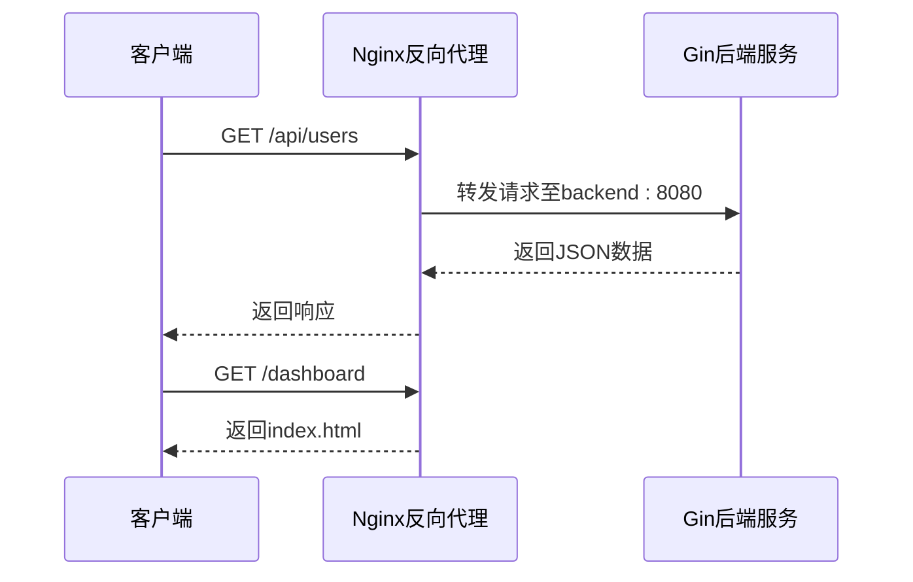
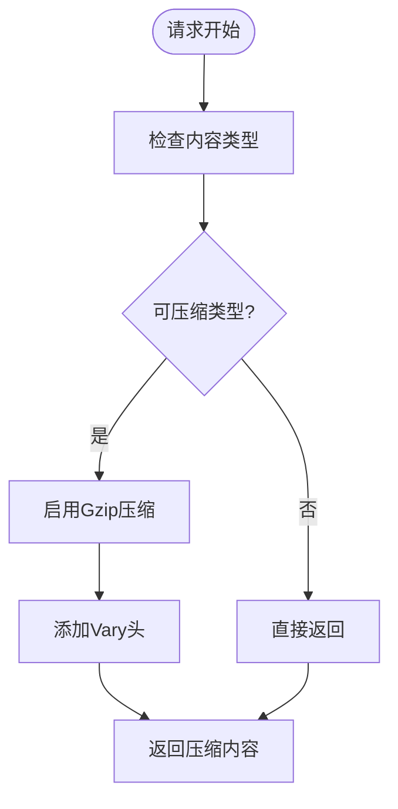

# Nginx反向代理配置

<cite>
**本文档引用的文件**
- [nginx.conf](file://docker/nginx.conf)
- [middleware.go](file://backend/internal/middleware/middleware.go)
- [docker-compose.yml](file://docker-compose.yml)
- [config.go](file://backend/internal/config/config.go)
</cite>

## 目录
1. [Nginx配置概述](#nginx配置概述)
2. [核心配置项详解](#核心配置项详解)
3. [反向代理机制](#反向代理机制)
4. [性能优化配置](#性能优化配置)
5. [日志与安全配置](#日志与安全配置)
6. [跨域处理方案](#跨域处理方案)
7. [配置建议与最佳实践](#配置建议与最佳实践)

## Nginx配置概述

本配置文件定义了Nginx作为反向代理服务器的核心功能，统一处理前端静态资源和后端API请求。通过Docker容器化部署，Nginx与后端Gin服务协同工作，实现前后端分离架构的高效运行。

**Section sources**
- [nginx.conf](file://docker/nginx.conf#L1-L58)

## 核心配置项详解

### 全局配置
Nginx以nginx用户身份运行，自动分配工作进程数，错误日志级别为warn，PID文件存储在标准位置。

### 事件处理
配置worker_connections为1024，支持高并发连接处理，适用于生产环境负载。

### HTTP服务器配置
- **MIME类型支持**：通过include指令加载标准MIME类型定义
- **sendfile优化**：启用零拷贝技术提升文件传输效率
- **TCP优化**：启用tcp_nopush和tcp_nodelay提升网络性能
- **长连接**：keepalive_timeout设置为65秒，支持持久连接

**Section sources**
- [nginx.conf](file://docker/nginx.conf#L10-L25)

## 反向代理机制

### Server块配置
```mermaid
graph TD
A[客户端请求] --> B{Nginx Server}
B --> C[/api/* 请求]
B --> D[静态资源请求]
C --> E[转发至backend:8080]
D --> F[返回静态文件]
```

**Diagram sources**
- [nginx.conf](file://docker/nginx.conf#L27-L58)

#### listen指令
监听80端口，作为HTTP服务的标准入口，接收所有到达容器的HTTP请求。

#### server_name指令
设置为localhost，匹配所有主机头请求，在Docker环境中通过服务发现机制路由。

**Section sources**
- [nginx.conf](file://docker/nginx.conf#L27-L31)

### 前端资源代理
location / 配置使用try_files指令实现前端路由：
- 优先匹配实际文件路径
- 若文件不存在，则返回index.html
- 支持Vue等前端框架的history模式路由

### 后端API代理
location /api 配置将请求转发至后端服务：
- proxy_pass指向backend:8080，与docker-compose中的服务名对应
- 设置Host头保持原始请求信息
- 传递客户端真实IP地址
- 支持HTTPS协议识别



**Diagram sources**
- [nginx.conf](file://docker/nginx.conf#L40-L48)
- [docker-compose.yml](file://docker-compose.yml#L30-L38)

**Section sources**
- [nginx.conf](file://docker/nginx.conf#L40-L48)

## 性能优化配置

### Gzip压缩


**Diagram sources**
- [nginx.conf](file://docker/nginx.conf#L26-L35)

配置要点：
- gzip on：启用压缩功能
- gzip_vary on：添加Vary头支持缓存协商
- gzip_min_length 1024：仅压缩大于1KB的响应
- 配置多种MIME类型压缩支持

**Section sources**
- [nginx.conf](file://docker/nginx.conf#L26-L35)

### 静态资源缓存
location ~* 正则匹配静态资源文件：
- 设置1年过期时间（expires 1y）
- 添加Cache-Control: public, immutable头
- 支持js、css、图片等多种格式

**Section sources**
- [nginx.conf](file://docker/nginx.conf#L50-L55)

## 日志与安全配置

### 日志格式配置
自定义main日志格式包含：
- 客户端IP地址
- 请求时间
- 请求行信息
- 状态码和响应大小
- Referer和User-Agent
- X-Forwarded-For代理头

访问日志存储在容器标准路径，便于日志收集系统采集。

**Section sources**
- [nginx.conf](file://docker/nginx.conf#L15-L20)

### 访问控制建议
1. **生产环境**：建议限制server_name为具体域名
2. **HTTPS支持**：应配置SSL证书启用HTTPS
3. **安全头**：可添加Content-Security-Policy等安全头
4. **速率限制**：可配置limit_req防止DDoS攻击

## 跨域处理方案

虽然Nginx配置中未直接处理CORS，但后端Gin框架通过中间件实现：

```go
func CORS() gin.HandlerFunc {
	return func(c *gin.Context) {
		c.Header("Access-Control-Allow-Origin", origin)
		c.Header("Access-Control-Allow-Headers", "Content-Type,AccessToken,X-CSRF-Token,Authorization,Token,X-Token,X-User-Id")
		c.Header("Access-Control-Allow-Methods", "POST,GET,OPTIONS,PUT,DELETE,UPDATE")
		c.Header("Access-Control-Allow-Credentials", "true")
	}
}
```

该中间件处理OPTIONS预检请求，设置必要的CORS响应头，确保前后端跨域通信正常。

**Section sources**
- [middleware.go](file://backend/internal/middleware/middleware.go#L5-L25)

## 配置建议与最佳实践

1. **环境区分**：建议为开发、测试、生产环境提供不同配置
2. **HTTPS配置**：生产环境应配置SSL证书启用HTTPS
3. **安全加固**：添加安全头如X-Frame-Options、X-Content-Type-Options
4. **监控集成**：配置访问日志与后端监控系统集成
5. **性能调优**：根据实际负载调整worker_processes和worker_connections
6. **错误页面**：自定义404、500等错误页面提升用户体验

通过合理配置Nginx反向代理，实现了前后端分离架构的高效运行，既保证了静态资源的快速访问，又确保了API请求的安全可靠转发。

**Section sources**
- [nginx.conf](file://docker/nginx.conf#L1-L58)
- [middleware.go](file://backend/internal/middleware/middleware.go#L5-L25)
- [docker-compose.yml](file://docker-compose.yml#L1-L60)