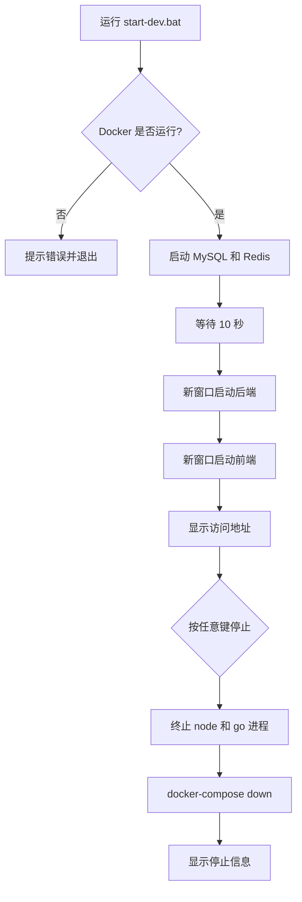
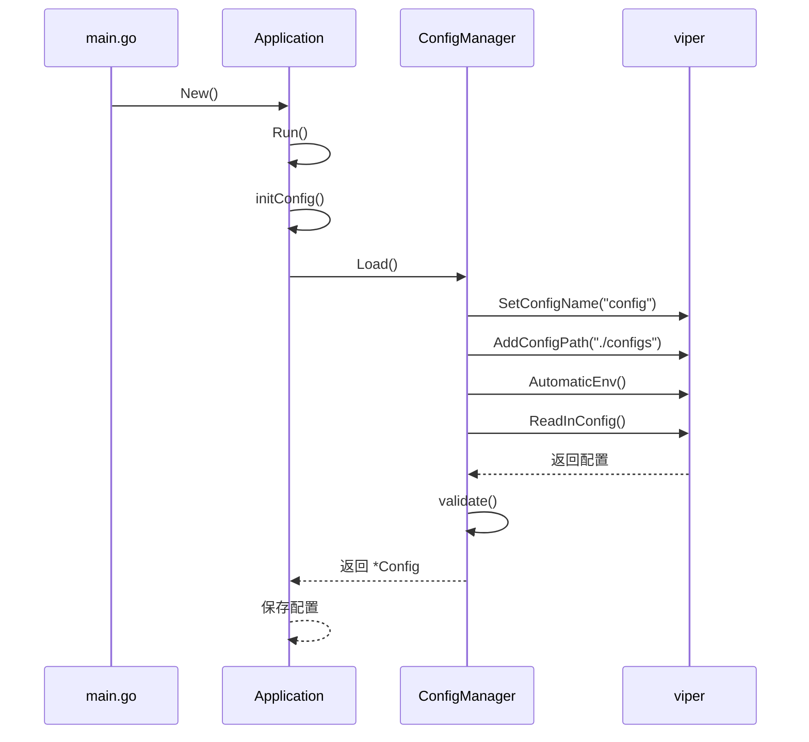

# 本地开发环境搭建

<cite>
**本文档引用文件**  
- [start-dev.sh](file://scripts/start-dev.sh)
- [start-dev.bat](file://scripts/start-dev.bat)
- [config.yaml](file://backend/configs/config.yaml)
- [main.go](file://backend/cmd/main.go)
- [app.go](file://backend/internal/app/app.go)
- [config_manager.go](file://backend/internal/app/config_manager.go)
- [config.go](file://backend/internal/config/config.go)
- [database_manager.go](file://backend/internal/app/database_manager.go)
- [cache_manager.go](file://backend/internal/app/cache_manager.go)
- [package.json](file://frontend/package.json)
</cite>

## 目录

1. [简介](#简介)
2. [基础依赖准备](#基础依赖准备)
3. [启动脚本详解](#启动脚本详解)
4. [一键启动开发环境](#一键启动开发环境)
5. [服务验证](#服务验证)
6. [常见问题排查](#常见问题排查)
7. [总结](#总结)

## 简介

本文档旨在为开发者提供 qoder 项目的本地开发环境搭建完整指南。通过本指南，开发者可快速配置 Go、Node.js、MySQL、Redis 等核心依赖，理解 `start-dev.sh`（Linux/Mac）与 `start-dev.bat`（Windows）两个启动脚本的执行流程与环境变量配置机制，并实现前后端服务的一键启动与验证。

**Section sources**  
- [start-dev.sh](file://scripts/start-dev.sh#L1-L43)
- [start-dev.bat](file://scripts/start-dev.bat#L1-L42)

## 基础依赖准备

### Go 环境
- 版本要求：Go 1.19 或以上
- 安装方式：通过 [Go 官网](https://golang.org/dl/) 下载并安装
- 验证命令：`go version`

### Node.js 环境
- 版本要求：Node.js 16 或以上（推荐使用 LTS 版本）
- 包管理器：npm（随 Node.js 自动安装）
- 验证命令：`node --version` 和 `npm --version`

### Docker 环境
- 项目使用 `docker-compose` 启动 MySQL 与 Redis 服务，因此需安装 Docker Desktop 或 Docker Engine。
- 验证命令：`docker info` 和 `docker-compose --version`

### 数据库与缓存
- MySQL：由 `docker-compose.yml` 定义，版本 8.0
- Redis：由 `docker-compose.yml` 定义，版本 7.0
- 初始化脚本：`scripts/init.sql`

**Section sources**  
- [config.yaml](file://backend/configs/config.yaml#L1-L40)
- [package.json](file://frontend/package.json#L1-L30)

## 启动脚本详解

### Linux/Mac 启动脚本：start-dev.sh

该脚本自动化完成以下流程：

1. **检查 Docker 状态**：通过 `docker info` 命令验证 Docker 是否运行。
2. **启动数据库服务**：调用 `docker-compose up -d mysql redis` 启动 MySQL 与 Redis 容器。
3. **等待数据库就绪**：使用 `sleep 10` 等待数据库初始化完成。
4. **启动后端服务**：进入 `backend` 目录，使用 `go run cmd/main.go` 启动 Go 服务，并记录进程 ID。
5. **启动前端服务**：进入 `frontend` 目录，执行 `npm run dev` 启动 Vite 开发服务器。
6. **信号捕获与清理**：通过 `trap` 捕获 `Ctrl+C` 信号，优雅终止后端、前端进程并关闭 Docker 服务。

```mermaid
flowchart TD
A["启动 start-dev.sh"] --> B{Docker 是否运行?}
B --> |否| C[报错退出]
B --> |是| D[启动 MySQL 和 Redis]
D --> E[等待 10 秒]
E --> F[启动后端服务 (Go)]
F --> G[启动前端服务 (Vite)]
G --> H[输出访问地址]
H --> I{等待中断信号}
I --> J[捕获 Ctrl+C]
J --> K[终止所有进程]
K --> L[docker-compose down]
L --> M[退出脚本]
```

**Diagram sources**  
- [start-dev.sh](file://scripts/start-dev.sh#L1-L43)

**Section sources**  
- [start-dev.sh](file://scripts/start-dev.sh#L1-L43)

### Windows 启动脚本：start-dev.bat

该批处理脚本在 Windows 环境下实现相同功能：

1. **检查 Docker**：使用 `docker info` 并通过 `errorlevel` 判断是否成功。
2. **启动数据库**：执行 `docker-compose up -d mysql redis`。
3. **等待启动**：使用 `timeout /t 10 /nobreak` 等待 10 秒。
4. **启动后端**：使用 `start` 命令在新窗口中运行 `go run cmd/main.go`。
5. **启动前端**：同样使用 `start` 命令启动 `npm run dev`。
6. **停止服务**：通过 `pause` 等待用户按键，随后使用 `taskkill` 终止 `node.exe` 和 `go.exe` 进程，并执行 `docker-compose down`。



**Diagram sources**  
- [start-dev.bat](file://scripts/start-dev.bat#L1-L42)

**Section sources**  
- [start-dev.bat](file://scripts/start-dev.bat#L1-L42)

## 一键启动开发环境

### 执行步骤

1. 确保 Docker 已启动。
2. 打开终端（Linux/Mac）或命令提示符/PowerShell（Windows）。
3. 导航至项目根目录：
   ```bash
   cd 
   ```
4. 执行对应脚本：
   - Linux/Mac：
     ```bash
     ./scripts/start-dev.sh
     ```
   - Windows：
     ```cmd
     scripts\start-dev.bat
     ```

### 环境变量与配置加载

后端服务通过 `viper` 库加载 `backend/configs/config.yaml` 配置文件，并支持环境变量覆盖。关键配置如下：

- **服务器端口**：8080（前端通过代理访问）
- **数据库连接**：`localhost:3306`，数据库名 `devops_platform`
- **Redis 连接**：`localhost:6379`
- **JWT 密钥**：`your-secret-key-here`（开发环境）

配置加载流程：
1. `main.go` 调用 `app.New()` 创建应用。
2. `app.Run()` 调用 `initConfig()`。
3. `ConfigManager.Load()` 使用 `viper` 读取 `config.yaml` 并支持环境变量注入（前缀 `DEVOPS_`）。



**Diagram sources**  
- [main.go](file://backend/cmd/main.go#L1-L18)
- [app.go](file://backend/internal/app/app.go#L1-L212)
- [config_manager.go](file://backend/internal/app/config_manager.go#L1-L125)
- [config.go](file://backend/internal/config/config.go#L1-L99)

**Section sources**  
- [main.go](file://backend/cmd/main.go#L1-L18)
- [app.go](file://backend/internal/app/app.go#L1-L212)
- [config_manager.go](file://backend/internal/app/config_manager.go#L1-L125)
- [config.go](file://backend/internal/config/config.go#L1-L99)

## 服务验证

### 前端验证
- 访问地址：`http://localhost:3000`
- 正常现象：页面加载成功，显示登录界面或仪表盘。
- 控制台无 404 或 500 错误。

### 后端验证
- 访问地址：`http://localhost:8080/health`
- 预期响应：
  ```json
  {
    "status": "ok",
    "timestamp": "2024-01-01T00:00:00Z"
  }
  ```
- 或访问 Swagger 文档（如启用）：`http://localhost:8080/swagger/index.html`

### 数据库连接验证
- 使用 MySQL 客户端连接 `localhost:3306`，用户名 `root`，密码为空。
- 检查数据库 `devops_platform` 是否存在，表结构是否完整。

**Section sources**  
- [app.go](file://backend/internal/app/app.go#L1-L212)
- [database_manager.go](file://backend/internal/app/database_manager.go#L1-L99)

## 常见问题排查

### 端口冲突
- **现象**：`address already in use`
- **解决方案**：
  - 检查 8080（后端）、3000（前端）、3306（MySQL）、6379（Redis）端口占用。
  - 使用 `lsof -i :8080`（Mac/Linux）或 `netstat -ano | findstr :8080`（Windows）查找占用进程。
  - 终止占用进程或修改 `config.yaml` 中的端口。

### 依赖缺失
- **Docker 未运行**：
  - 确保 Docker Desktop 已启动。
  - Windows 用户需启用 WSL2 或 Hyper-V。
- **Go 或 Node.js 未安装**：
  - 运行 `go version` 和 `node --version` 验证。
  - 重新安装并配置环境变量。

### 数据库连接失败
- **现象**：`数据库初始化失败` 或 `ping failed`
- **可能原因**：
  - Docker 未启动或容器未运行。
  - `config.yaml` 中数据库配置错误。
  - MySQL 容器启动失败（查看日志：`docker logs <container_id>`）。
- **解决方案**：
  - 执行 `docker-compose ps` 检查容器状态。
  - 确认 `backend/configs/config.yaml` 中 `database.host` 为 `localhost`。
  - 手动执行 `docker-compose up mysql` 查看详细错误。

### Redis 连接失败
- **现象**：`Redis初始化失败` 或 `ping failed`
- **解决方案**：
  - 检查 Redis 容器是否运行：`docker-compose ps`
  - 确认 `config.yaml` 中 `redis.host` 和 `port` 正确。
  - 检查防火墙是否阻止 6379 端口。

### 前端无法访问后端
- **现象**：前端请求返回 404 或 CORS 错误
- **解决方案**：
  - 确认后端服务已启动且监听 8080 端口。
  - 检查 `frontend/vite.config.ts` 中代理配置是否指向 `http://localhost:8080`。
  - 直接访问 `http://localhost:8080/api/xxx` 测试后端接口。

**Section sources**  
- [start-dev.sh](file://scripts/start-dev.sh#L1-L43)
- [start-dev.bat](file://scripts/start-dev.bat#L1-L42)
- [config.yaml](file://backend/configs/config.yaml#L1-L40)
- [app.go](file://backend/internal/app/app.go#L1-L212)
- [database_manager.go](file://backend/internal/app/database_manager.go#L1-L99)
- [cache_manager.go](file://backend/internal/app/cache_manager.go#L1-L74)

## 总结

通过本指南，开发者可顺利完成 qoder 项目的本地开发环境搭建。核心流程包括依赖安装、脚本执行、服务验证与问题排查。`start-dev.sh` 与 `start-dev.bat` 脚本实现了开发环境的一键启动，极大提升了开发效率。建议开发者熟悉脚本逻辑与配置加载机制，以便快速定位和解决常见问题。