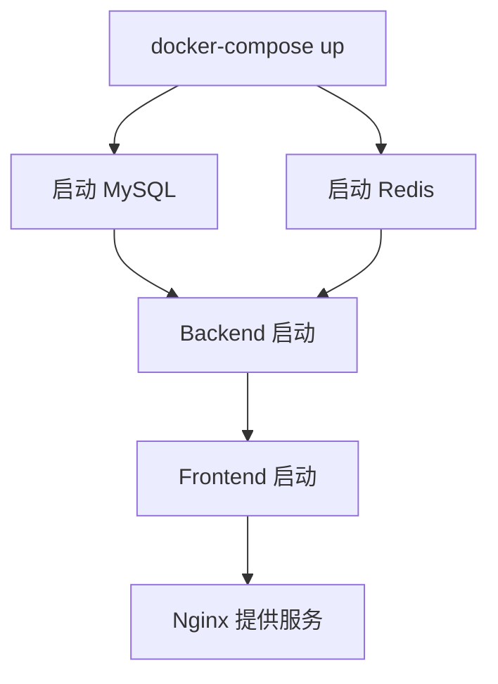
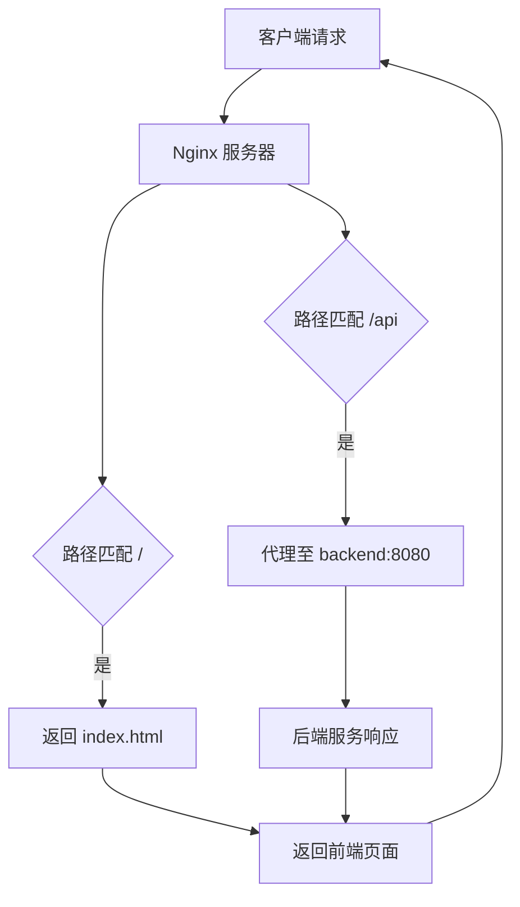
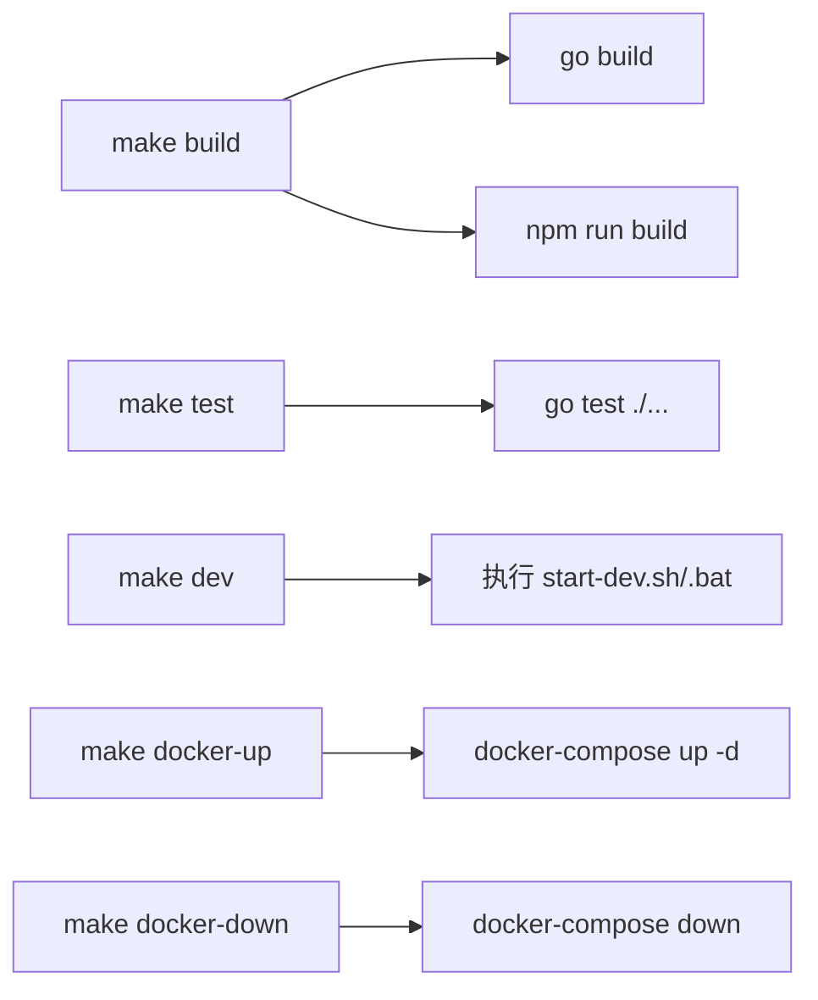
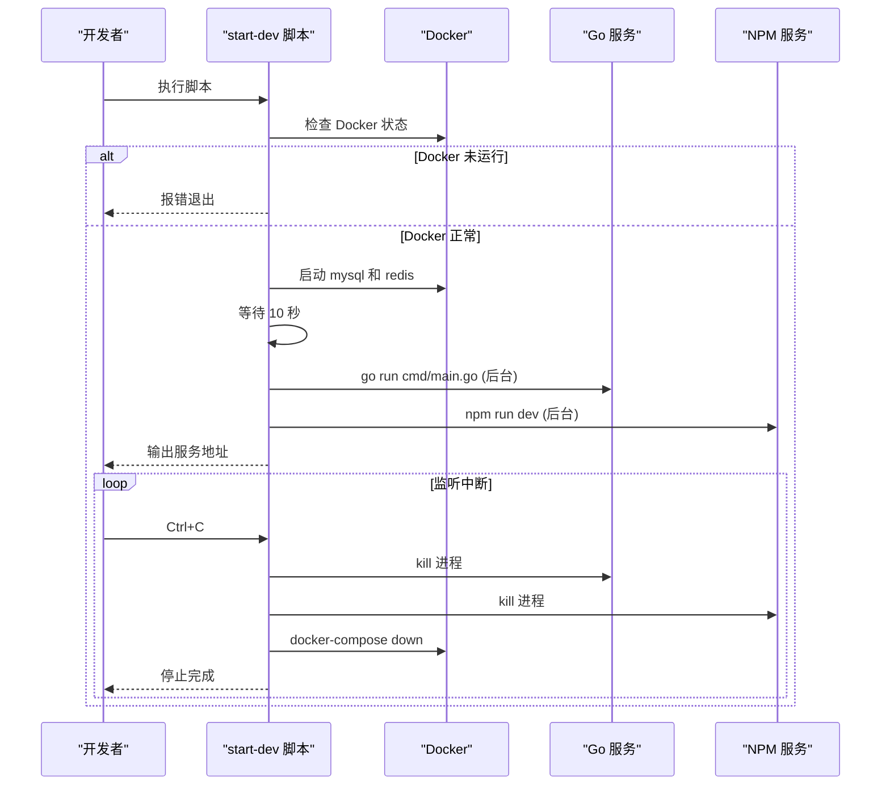

# 部署与运维

<cite>
**本文档引用文件**  
- [docker-compose.yml](file://docker-compose.yml)
- [nginx.conf](file://docker/nginx.conf)
- [Makefile](file://Makefile)
- [start-dev.sh](file://scripts/start-dev.sh)
- [start-dev.bat](file://scripts/start-dev.bat)
</cite>

## 目录
1. [多容器服务编排与启动流程](#多容器服务编排与启动流程)  
2. [Nginx反向代理配置解析](#nginx反向代理配置解析)  
3. [Makefile自动化命令详解](#makefile自动化命令详解)  
4. [本地开发环境启动脚本分析](#本地开发环境启动脚本分析)  
5. [生产环境部署检查清单](#生产环境部署检查清单)

## 多容器服务编排与启动流程

`docker-compose.yml` 文件定义了 MySQL、Redis、Backend、Frontend 四个核心服务的容器编排配置。通过 Docker Compose 可实现一键启动整个微服务架构。

- **MySQL 服务**：使用 `mysql:8.0` 镜像，初始化数据库 `devops_platform`，并挂载 `init.sql` 脚本用于表结构初始化。端口映射为 `3306:3306`，数据持久化至 `mysql_data` 卷。
- **Redis 服务**：使用轻量级 `redis:7-alpine` 镜像，开启 AOF 持久化，端口映射为 `6379:6379`，数据存储于 `redis_data` 卷。
- **Backend 服务**：基于自定义 `Dockerfile.backend` 构建，依赖 MySQL 和 Redis，通过环境变量注入主机地址，配置文件与日志目录挂载至宿主机。
- **Frontend 服务**：基于 `Dockerfile.frontend` 构建，依赖 Backend 服务，通过 Nginx 提供静态资源服务，端口映射为 `80:80`。

容器启动顺序由 `depends_on` 控制，确保后端服务在数据库和缓存启动后再运行。

**Diagram sources**  
- [docker-compose.yml](file://docker-compose.yml#L5-L60)

**Section sources**  
- [docker-compose.yml](file://docker-compose.yml#L1-L60)

## Nginx反向代理配置解析

`nginx.conf` 配置文件定义了前端静态资源与后端 API 的路由规则，确保单页应用（SPA）的正确访问和 API 请求的代理转发。

关键配置说明：
- **前端路由处理**：`location /` 使用 `try_files $uri $uri/ /index.html` 实现前端路由的 fallback，支持 Vue Router 的 history 模式。
- **API 反向代理**：`location /api` 将所有以 `/api` 开头的请求代理至后端服务 `http://backend:8080`，并设置必要的请求头（如 `X-Real-IP`、`X-Forwarded-For`）以保留客户端信息。
- **静态资源缓存**：对 `.js`、`.css`、图片等静态资源设置一年过期时间，并添加 `Cache-Control: public, immutable` 头，提升前端性能。

**Diagram sources**  
- [nginx.conf](file://docker/nginx.conf#L30-L58)

**Section sources**  
- [nginx.conf](file://docker/nginx.conf#L1-L58)

## Makefile自动化命令详解

`Makefile` 提供了一套完整的自动化运维命令，简化构建、测试、部署等操作。

| 命令 | 功能说明 |
|------|----------|
| `make build` | 构建后端 Go 程序和前端打包文件 |
| `make test` | 运行后端单元测试（前端测试暂未实现） |
| `make dev` | 启动本地开发环境（自动判断操作系统） |
| `make clean` | 清理构建产物（bin/、dist/） |
| `make docker-build` | 构建 Backend 和 Frontend 的 Docker 镜像 |
| `make docker-up` | 使用 `docker-compose up -d` 启动所有容器 |
| `make docker-down` | 停止并清理所有容器 |
| `make install-deps` | 安装 Go 和 NPM 依赖 |
| `make lint` | 执行代码静态检查（go vet、gofmt、npm lint） |
| `make migrate` | 执行数据库迁移脚本 |

**Diagram sources**  
- [Makefile](file://Makefile#L1-L86)

**Section sources**  
- [Makefile](file://Makefile#L1-L86)

## 本地开发环境启动脚本分析

`start-dev.sh`（Linux/macOS）和 `start-dev.bat`（Windows）脚本用于一键启动本地开发环境，包含依赖检查、服务启动与进程管理。

### 执行逻辑
1. **Docker 状态检查**：确保 Docker 守护进程正在运行。
2. **启动数据库服务**：通过 `docker-compose up -d mysql redis` 启动 MySQL 和 Redis。
3. **等待数据库就绪**：休眠 10 秒，确保数据库完成初始化。
4. **启动后端服务**：在 `backend` 目录下执行 `go run cmd/main.go`，以后台进程运行。
5. **启动前端服务**：在 `frontend` 目录下执行 `npm run dev`，启动 Vite 开发服务器。
6. **服务地址输出**：提示前端 `http://localhost:3000` 和后端 `http://localhost:8080`。
7. **信号捕获与清理**：脚本监听 `Ctrl+C` 信号，自动终止后端和前端进程，并关闭 Docker 容器。

### 跨平台兼容性
- **Linux/macOS**：使用 Bash 脚本，通过 `&` 启动后台进程，`trap` 捕获中断信号。
- **Windows**：使用批处理脚本，`start` 命令开启新窗口运行服务，`taskkill` 终止相关进程。

**Diagram sources**  
- [start-dev.sh](file://scripts/start-dev.sh#L1-L43)  
- [start-dev.bat](file://scripts/start-dev.bat#L1-L42)

**Section sources**  
- [start-dev.sh](file://scripts/start-dev.sh#L1-L43)  
- [start-dev.bat](file://scripts/start-dev.bat#L1-L42)

## 生产环境部署检查清单

为确保生产环境稳定运行，部署前需完成以下检查：

### 资源配置
- [ ] 确认服务器 CPU、内存满足最低要求（建议 4C8G）
- [ ] 数据卷挂载路径具备足够磁盘空间
- [ ] 设置容器资源限制（CPU、内存）防止资源耗尽

### 日志管理
- [ ] 配置日志轮转策略（logrotate），避免日志文件无限增长
- [ ] 后端日志输出至 `/app/logs` 目录，确保挂载宿主机路径
- [ ] Nginx 错误日志级别设置为 `warn` 或 `error`

### 健康检查
- [ ] 为每个容器配置 `healthcheck`，确保服务可用性
- [ ] 后端提供 `/health` 接口用于健康检查
- [ ] Nginx 配置 `location /health` 返回 200

### 安全配置
- [ ] 修改默认数据库密码，禁用 root 远程登录
- [ ] Redis 配置密码认证
- [ ] Nginx 配置 HTTPS 证书（生产环境禁用 HTTP）
- [ ] 后端环境变量通过 `.env` 文件或密钥管理工具注入

### 监控与告警
- [ ] 集成 Prometheus + Grafana 监控系统
- [ ] 配置关键指标告警（CPU、内存、请求延迟、错误率）
- [ ] 记录关键操作日志并集中收集（如 ELK）

**Section sources**  
- [docker-compose.yml](file://docker-compose.yml#L1-L60)  
- [nginx.conf](file://docker/nginx.conf#L1-L58)  
- [Makefile](file://Makefile#L1-L86)