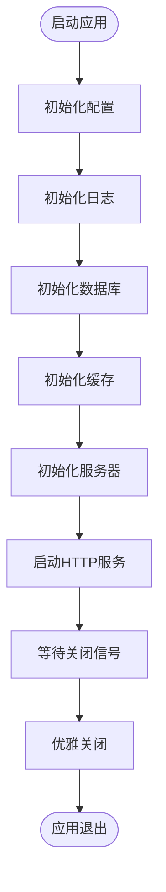
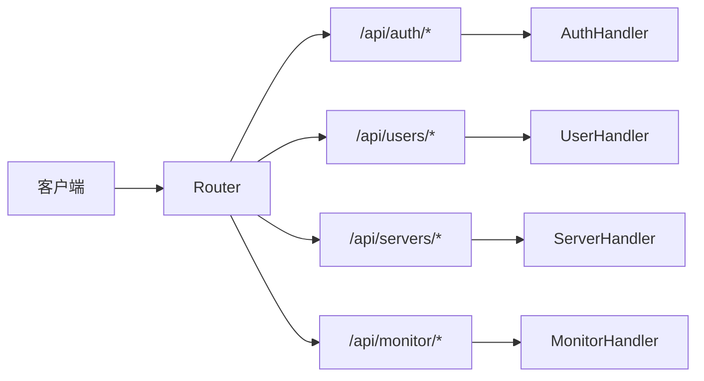
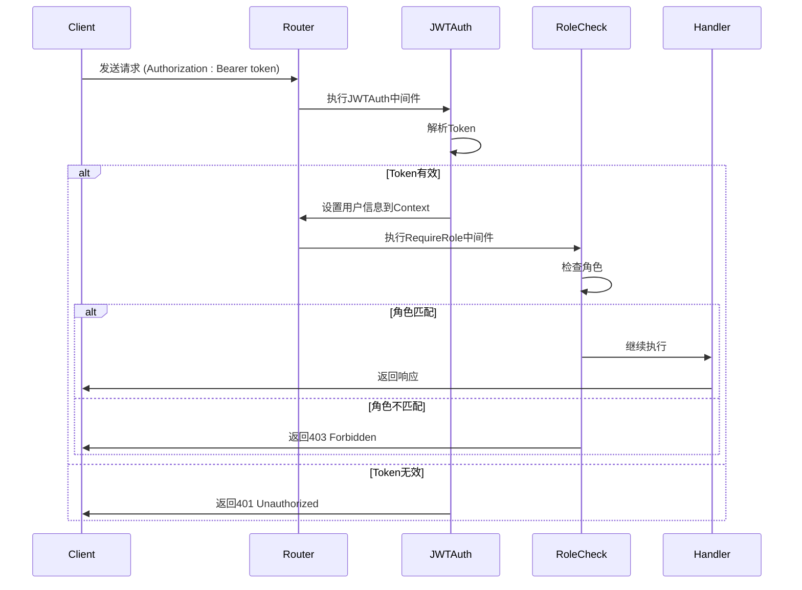
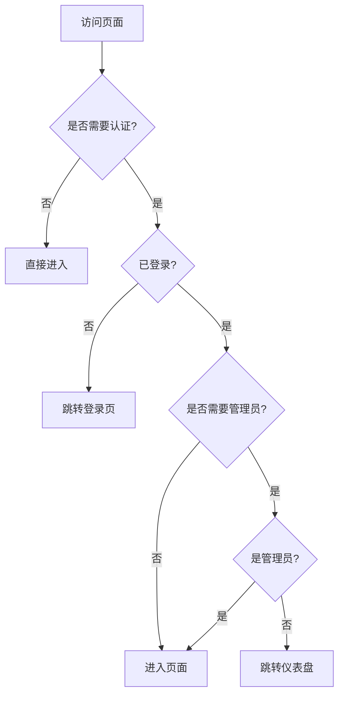
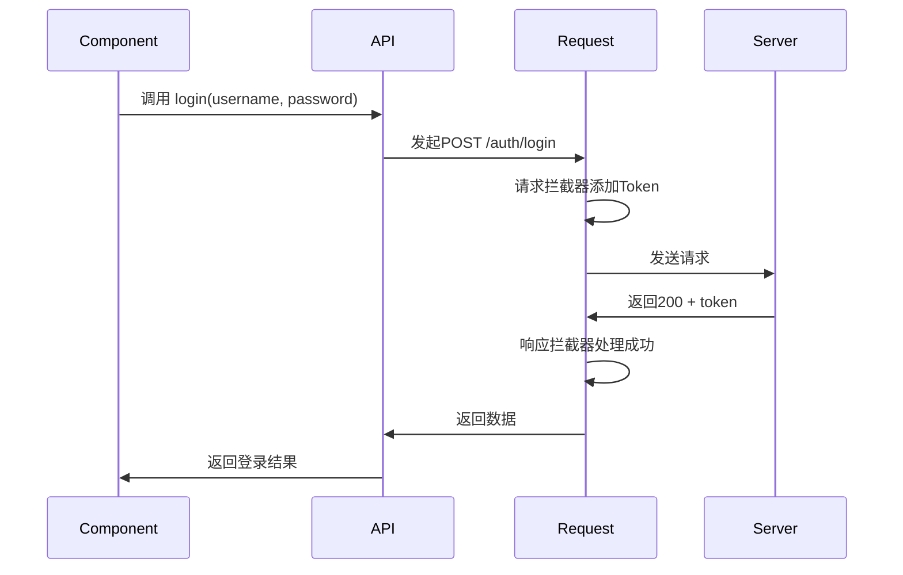

# 项目目录结构说明

<cite>
**本文档引用的文件**  
- [main.go](file://backend/cmd/main.go)
- [app.go](file://backend/internal/app/app.go)
- [router.go](file://backend/internal/api/router.go)
- [user.go](file://backend/internal/service/user.go)
- [user.go](file://backend/internal/model/user.go)
- [middleware.go](file://backend/internal/middleware/middleware.go)
- [index.ts](file://frontend/src/router/index.ts)
- [user.ts](file://frontend/src/store/user.ts)
- [request.ts](file://frontend/src/api/request.ts)
- [auth.ts](file://frontend/src/api/auth.ts)
</cite>

## 目录结构

本项目采用清晰的分层架构，前后端分离，便于维护和扩展。整体结构如下：

```
.
├── backend              # 后端服务代码
├── frontend             # 前端应用代码
├── docker               # Docker配置文件
├── scripts              # 系统脚本与初始化脚本
├── Makefile             # 构建与部署脚本
├── README.md            # 项目说明文档
└── docker-compose.yml   # 容器编排配置
```

### 后端（backend）

后端采用Go语言开发，基于Gin框架构建RESTful API，遵循标准Go项目布局。

- **cmd/**：主程序入口，包含`main.go`作为应用启动点。
- **configs/**：YAML格式的配置文件，如`config.yaml`。
- **internal/**：核心业务逻辑，不可被外部导入。
  - **api/**：HTTP接口层，处理请求与响应。
  - **app/**：应用管理层，负责初始化组件与生命周期管理。
  - **auth/**：认证逻辑，包括JWT与密码处理。
  - **config/**：配置结构定义。
  - **middleware/**：Gin中间件，如CORS、JWT认证、权限控制。
  - **model/**：GORM数据模型，映射数据库表。
  - **service/**：业务逻辑层，处理核心操作。
- **pkg/**：可复用的公共包，如数据库、缓存、日志等。
- **test_compile.go**：测试编译文件。

**Section sources**  
- [main.go](file://backend/cmd/main.go)
- [config.yaml](file://backend/configs/config.yaml)

### 前端（frontend）

前端基于Vue 3 + Vite构建，采用TypeScript，结构清晰，模块化程度高。

- **src/**：源码目录。
  - **views/**：页面组件，每个`.vue`文件对应一个路由视图。
  - **router/**：路由配置，定义页面跳转与权限控制。
  - **store/**：状态管理，使用Pinia管理用户、配置等全局状态。
  - **api/**：API服务封装，统一管理后端接口调用。
  - **App.vue**：根组件。
  - **main.ts**：应用入口。
- **public/**：静态资源。
- **package.json**：依赖管理。
- **vite.config.ts**：Vite构建配置。

**Section sources**  
- [App.vue](file://frontend/src/App.vue)
- [main.ts](file://frontend/src/main.ts)
- [package.json](file://frontend/package.json)

### Docker 目录

包含Nginx反向代理配置，用于前端静态资源服务与API路由转发。

**Section sources**  
- [nginx.conf](file://docker/nginx.conf)

### 脚本目录（scripts）

存放数据库初始化脚本与开发环境启动脚本。

- **init.sql**：数据库初始化SQL。
- **start-dev.bat**：Windows开发启动脚本。
- **start-dev.sh**：Linux/macOS开发启动脚本。

**Section sources**  
- [init.sql](file://scripts/init.sql)
- [start-dev.sh](file://scripts/start-dev.sh)
- [start-dev.bat](file://scripts/start-dev.bat)

## 后端分层架构解析

### 应用管理层（app）

`backend/internal/app` 是整个应用的“指挥中心”，负责协调各组件的初始化与生命周期管理。

- `app.go` 中的 `Application` 结构体聚合了配置、数据库、缓存、日志等核心资源。
- `Run()` 方法按顺序初始化配置、日志、数据库、缓存、服务器，并启动服务。
- 提供 `GetDB()`、`GetRedis()` 等方法供其他层获取依赖实例。
- 支持优雅关闭（graceful shutdown），确保资源正确释放。



**Diagram sources**  
- [app.go](file://backend/internal/app/app.go#L1-L197)

**Section sources**  
- [app.go](file://backend/internal/app/app.go)

### 接口层（api）

`backend/internal/api` 是HTTP请求的入口，负责路由分发与请求处理。

- `router.go` 中的 `NewRouter()` 函数创建Gin路由实例。
- 定义 `/api/auth`、`/api/users`、`/api/servers` 等路由组。
- 使用中间件实现CORS、JWT认证、角色权限控制。
- 路由与处理器（Handler）解耦，便于维护。



**Diagram sources**  
- [router.go](file://backend/internal/api/router.go#L1-L115)

**Section sources**  
- [router.go](file://backend/internal/api/router.go)

### 业务逻辑层（service）

`backend/internal/service` 封装核心业务逻辑，是连接接口与数据模型的桥梁。

- `user.go` 中的 `UserService` 提供用户登录、创建、更新、删除等方法。
- 服务层调用 `model` 进行数据库操作，调用 `auth` 进行密码验证。
- 集成缓存机制，如 `GetByID` 先查缓存再查数据库。
- 返回纯净数据对象，不涉及HTTP上下文。

```mermaid
classDiagram
class UserService {
+Login(username, password) User
+GetByID(id) User
+Create(username, email, password, role) User
+Update(id, updates) error
+Delete(id) error
+List(page, pageSize) []User, total
}
class Auth {
+HashPassword(password) string
+CheckPassword(password, hash) bool
}
class Model {
+User struct
+Deployment struct
+Task struct
}
class Cache {
+Get(key) interface{}
+Set(key, value, ttl) error
}
UserService --> Model : "操作"
UserService --> Auth : "调用"
UserService --> Cache : "读写"
```

**Diagram sources**  
- [user.go](file://backend/internal/service/user.go#L1-L167)
- [user.go](file://backend/internal/model/user.go#L1-L29)
- [jwt.go](file://backend/internal/auth/jwt.go)
- [cache.go](file://backend/pkg/cache/cache.go)

**Section sources**  
- [user.go](file://backend/internal/service/user.go)

### 数据模型层（model）

`backend/internal/model` 定义GORM映射的结构体，直接对应数据库表。

- `user.go` 中的 `User` 结构体映射 `users` 表。
- 使用GORM标签定义主键、索引、默认值等。
- 支持软删除（`DeletedAt` 字段）。
- 定义关联关系，如用户与部署、任务的关联。

**Section sources**  
- [user.go](file://backend/internal/model/user.go)

### 中间件层（middleware）

`backend/internal/middleware` 提供可插拔的请求处理逻辑。

- `CORS()`：处理跨域请求。
- `JWTAuth(secret)`：验证JWT令牌，提取用户信息。
- `RequireRole(roles...)`：检查用户角色权限，如管理员专属接口。



**Diagram sources**  
- [middleware.go](file://backend/internal/middleware/middleware.go#L1-L116)

**Section sources**  
- [middleware.go](file://backend/internal/middleware/middleware.go)

## 前端模块组织逻辑

### 视图层（views）

`frontend/src/views` 存放所有页面组件，每个`.vue`文件对应一个功能页面。

- `LoginView.vue`：登录页面。
- `DashboardView.vue`：仪表盘。
- `UserView.vue`：用户管理，仅管理员可见。

**Section sources**  
- [LoginView.vue](file://frontend/src/views/LoginView.vue)
- [DashboardView.vue](file://frontend/src/views/DashboardView.vue)

### 路由管理（router）

`frontend/src/router/index.ts` 定义路由规则与导航守卫。

- 使用 `meta` 字段标记路由是否需要认证或管理员权限。
- `beforeEach` 守卫检查登录状态与角色，实现自动跳转。



**Diagram sources**  
- [index.ts](file://frontend/src/router/index.ts#L1-L64)

**Section sources**  
- [index.ts](file://frontend/src/router/index.ts)

### 状态管理（store）

`frontend/src/store/user.ts` 使用Pinia管理用户状态。

- 存储 `accessToken`、`refreshToken`、`user` 信息。
- 提供 `loginUser`、`logout`、`fetchUserInfo` 等方法。
- 自动从 `localStorage` 恢复状态。

**Section sources**  
- [user.ts](file://frontend/src/store/user.ts)

### API服务（api）

`frontend/src/api` 封装所有后端接口调用。

- `request.ts`：Axios实例，配置拦截器。
  - 请求拦截器：自动添加 `Authorization` 头。
  - 响应拦截器：统一处理401（自动刷新token）、错误提示。
- `auth.ts`：认证相关API，如登录、刷新token。



**Diagram sources**  
- [request.ts](file://frontend/src/api/request.ts#L1-L68)
- [auth.ts](file://frontend/src/api/auth.ts#L1-L52)

**Section sources**  
- [request.ts](file://frontend/src/api/request.ts)
- [auth.ts](file://frontend/src/api/auth.ts)